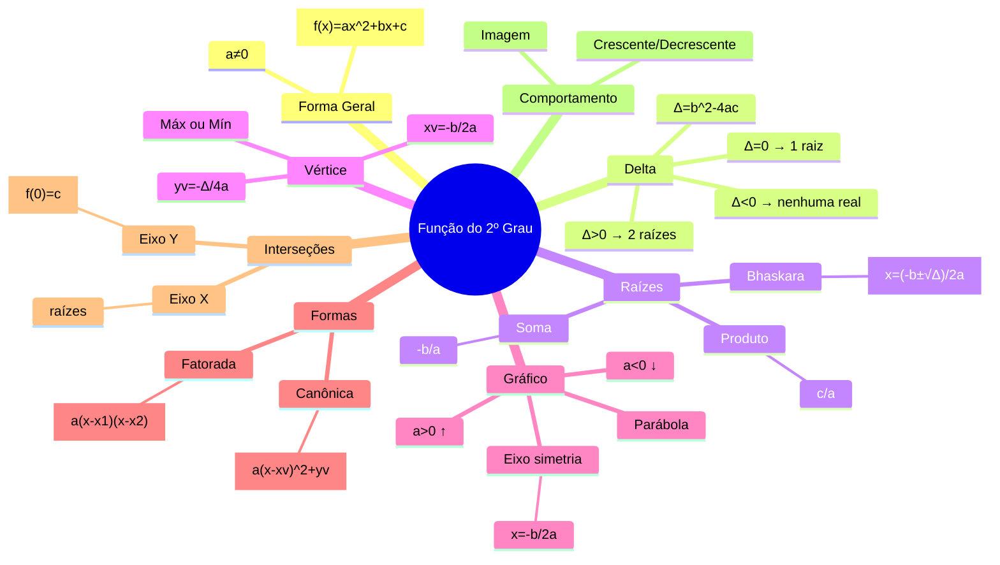

# Equações do 2º Grau (Quadrática)

Funções do 2º grau (ou quadráticas) são do tipo:

$$
f(x) = ax^2 + bx + c \quad (a \neq 0)
$$

onde A = (x’, 0) e B = (x’’, 0) e V=Vértice

- Caso de $a$:
  - $a > 0$, parábola com a concavidade voltada para cima.
  - $a < 0$, parábola com a concavidade voltada para baixo.
- Caso de $\Delta$:
  - $\Delta > 0$, a parábola intercepta o eixo das abscissas em dois pontos.
    
  - $\Delta = 0$, a parábola intercepta o eixo das abscissas somente em um ponto.
    
  - $\Delta < 0$, a parábola não intercepta o eixo das abscissas.
    

## Fómulas

### 1. Forma geral da função

$$
f(x) = ax^2 + bx + c
$$

- $a$: concavidade
- $b$: inclinação/interferência
- $c$: termo independente (onde corta o eixo y)

### 2. Discriminante (Delta)

$$
\Delta = b^2 - 4ac
$$

Interpretação:

- $\Delta > 0$: 2 raízes reais
  - Ex: $f(x)=x^2+x-2$ [Veja Gráfico](https://www.mathsisfun.com/data/function-grapher.html?fn0=x^2+x-2)
  - 
- $\Delta = 0$: 1 raiz real (raiz dupla)
  - Ex: $f(x)=x2−4x+4$ [Veja Gráfico](https://www.mathsisfun.com/data/function-grapher.html?fn0=x2−4x+4)
  - 
- $\Delta < 0$: 2 raízes imaginárias
  - Ex: $f(x)=-x^2+6x-10$ [Veja Gráfico](https://www.mathsisfun.com/data/function-grapher.html?fn0=-x^2+6x-10)
  - Não existem raízes reais
  - A equação **não zera no conjunto dos reais (ℝ)**
  - **não cruza o eixo X**
  - fica totalmente:
    - acima do eixo (se $a > 0$)
    - abaixo do eixo (se $a < 0$)
  - Se $a > 0$: $f(x) > 0 \quad \forall x$ 👉 Função **sempre positiva**
  - Se $a < 0$: $f(x) < 0 \quad \forall x$ 👉 Função **sempre negativa**

### 3. Fórmula de Bhaskara (raízes)

$$
x = \frac{-b \pm \sqrt{\Delta}}{2a}
$$

Ou separando:
$$
x_1 = \frac{-b + \sqrt{\Delta}}{2a}
$$
$$
x_2 = \frac{-b - \sqrt{\Delta}}{2a}
$$

Não existe solução real para Raízes imaginárias

- Não tem solução em ℝ
- Mas tem solução em ℂ (números complexos)

### 4. Soma e produto das raízes

(Sem precisar resolver Bhaskara)

$$
x_1 + x_2 = -\frac{b}{a}
$$

$$
x_1 \cdot x_2 = \frac{c}{a}
$$

### 5. Forma fatorada

- Raízes reais: $f(x) = a(x - x_1)(x - x_2)$
- Raízes imaginárias: $f(x) = a(x - z_1)(x - z_2)$
  - onde: $z_1$, $z_2$ são complexos conjugados

### 6. Vértice da parábola

- Coordenada X: $x_v = -\frac{b}{2a}$
- Coordenada Y: $y_v = -\frac{\Delta}{4a}$ ou $y_v = f(x_v)$

- Se Δ < 0:
  - Se $a > 0$ → $y_v > 0$ → mínimo acima do eixo
  - Se $a < 0$ → $y_v < 0$ → máximo abaixo do eixo
  - o vértice está sempre **do mesmo lado do eixo X que toda a parábola**

### 7. Forma canônica (forma do vértice)

$$
f(x) = a(x - x_v)^2 + y_v
$$

### 8. Eixo de simetria

$$
x = -\frac{b}{2a}
$$

### 9. Concavidade da parábola

- $a > 0$: abre para cima 🔼
- $a < 0$: abre para baixo 🔽

### 10. Valor máximo ou mínimo

- Se $a > 0$: valor **mínimo = $y_v$**
- Se $a < 0$: valor **máximo = $y_v$**

### 11. Interseções com os eixos

- Eixo Y: $f(0) = c$
- Eixo X: Resolver $ax^2 + bx + c = 0$

### 12. Imagem da função

Depende do vértice:

- Raízes reais:
  - Se $a > 0$: $\text{Imagem} = [y_v, +\infty)$
  - Se $a < 0$: $\text{Imagem} = (-\infty, y_v]$
- Raízes imaginárias:
  - Se $a > 0$: $\text{Imagem} = (y_v, +\infty)$
  - Se $a < 0$: $\text{Imagem} = (-\infty, y_v)$
    - Nunca inclui zero (isso é chave!)

### 13. Crescimento e decrescimento

- Cresce: $x > x_v$ (se $a > 0$)
- Decresce: $x < x_v$ (se $a > 0$)

(inverte se $a < 0$)

### 14. Forma geral ↔ forma canônica (completar quadrado)

$$
ax^2 + bx + c = a\left(x + \frac{b}{2a}\right)^2 - \frac{\Delta}{4a}
$$

### 15. Distância entre raízes

$$
|x_1 - x_2| = \frac{\sqrt{\Delta}}{|a|}
$$

### 16. Produto notável relacionado

$$
(x + p)^2 = x^2 + 2px + p^2
$$

### 17. Condição para raízes iguais

$$
\Delta = 0
$$

### 18. Condição para raízes opostas

$$
x_1 = -x_2 \Rightarrow b = 0
$$

### 19. Condição para raízes inversas

$$
x_1 = \frac{1}{x_2} \Rightarrow c = a
$$

### 20. Valor da função no vértice (forma alternativa)

$$
f\left(-\frac{b}{2a}\right) = -\frac{\Delta}{4a}
$$

### 21. Equação a partir das raízes

(se você conhece $x_1$ e $x_2$):

$$
f(x) = a(x - x_1)(x - x_2)
$$

ou expandindo:

$$
f(x) = a\left[x^2 - (x_1 + x_2)x + x_1 x_2\right]
$$

### 22. Raiz média

$$
\frac{x_1 + x_2}{2} = -\frac{b}{2a}
$$

(é o próprio $x_v$

### 23. Condição para função sempre positiva/negativa

- Sempre positiva:
  - $a > 0$ e $\Delta < 0$

- Sempre negativa:
  - $a < 0$ e $\Delta < 0$

### 24. Generalização com parâmetros

$$
f(x) = a(x - h)^2 + k
$$

- $h = x_v$
- $k = y_v$

## Raízes imaginárias

### Interpretação com números complexos

- Quando Δ < 0, usamos: $x = \frac{-b \pm \sqrt{\Delta}}{2a}$
- Mas: $\sqrt{\Delta} = \sqrt{\text{número negativo}} = i\sqrt{|\Delta|}$
- Então: $x = \frac{-b \pm i\sqrt{|\Delta|}}{2a}$
- Resultado:
  - **duas raízes complexas conjugadas**
  - Exemplo: $x = 2 \pm 3i$

### Par de raízes conjugadas

- Se uma raiz é: $a + bi$
- a outra é: $a - bi$

Isso sempre acontece em polinômios com coeficientes reais.

### Relação com inequações

- Se Δ < 0:
  - A parábola **não intersecta o eixo X**
  - O eixo X está “fora do alcance” da função
  - a função estivesse **sempre acima ou sempre abaixo de zero**
  - $b^2 < 4ac$
  - Para $a > 0$: $ax^2 + bx + c > 0 \quad \forall x$
  - Para $a < 0$: $ax^2 + bx + c < 0 \quad \forall x$
  - Ou seja:
    - a inequação vale para **todos os reais**
  - Em problemas físicos:
    - “não atinge o solo”
    - “não zera energia”
    - “não há solução física real”

### RESUMO ESSENCIAL (o que mais cai)

Se quiser resumir tudo pra prova:

- $\Delta = b^2 - 4ac$
- Bhaskara
- $x_v = -b/2a$
- $y_v = -Δ/4a$
- Soma = $-b/a$
- Produto = $c/a$

**Exemplo com Raízes**: $f(x) = x2 + 2x – 8$

- Delta: $\Delta = b^2 - 4ac = (2)^2 - 4*(1)*(-8) = 36$
- Vértice:
  - $x_v = \frac{–b}{2a} = \frac{–(2)}{2*(1)}=-1$
  - $y_v=\frac{-\Delta}{4a} = -\frac{-(36)}{4*(1)} = -9$
  - $V = (-1,-9)$
- Raízes: $\frac{-b \pm \sqrt{\Delta}}{2a} = \frac{-(2) \pm \sqrt{36}}{2*(1)} = \frac{-2 \pm 6}{2}$
  - $x`= \frac{-2 - 6}{2} = -4$
  - $x``= \frac{-2 + 6}{2} = 2$
- 

**Exemplo sem Raízes**: $f(x) = x^2 + 4$

- Delta: $\Delta = b^2 - 4ac = (0)^2 - 4*(1)*(4) = -16$
- Vértice:
  - $x_v = \frac{–b}{2a} = \frac{–(0)}{2*(1)}=0$
  - $y_v=\frac{-\Delta}{4a} = -\frac{-(-16)}{4*(1)} = 4$
  - $V = (0, 4)$
- Sem Raízes: (calcularemos os pontos “aleatórios”)
  - Para $x`$
    - tomamos $x_v + 1 = 0 + 1 = 1$
    - logo $f(1) = (1)^2 + 4 = 5$
    - portanto $A = (1,5)$
  - Para $x``$
    - tomamos $x_v - 1 = 0 - 1 = -1$
    - logo $f(-1) = (-1)^2 + 4 = 5$
    - portanto $B = (-1,5)$
- 

## Mapa mental visual

## Exercícios resolvidos

### Exercício 1

$$
f(x) = x² - 5x + 6
$$
$$
\Delta = 25 - 24 = 1
$$
$$
x = (5 ± 1)/2
$$

- **Raízes:** x₁ = 3, x₂ = 2
- **Vértice:**
  - xv = 5/2 = 2.5
  - yv = -1/4

### Exercício 2

$$
f(x) = 2x² + 4x + 2
$$
$$
\Delta = 16 - 16 = 0
$$

- **Raiz dupla:** x = -1
- **Vértice:** (-1, 0)

### Exercício 3

$$
f(x) = x² + 4x + 5
$$
$$
\Delta = 16 - 20 = -4
$$

- **Sem raízes reais**
- **Vértice:**
  - xv = -2
  - yv = 1

### Exercício 4

$$
f(x) = -x² + 6x - 8
$$
$$
\Delta = 36 - 32 = 4
$$

- **Raízes:** x = 2 e 4
- **Vértice:**
  - xv = 3
  - yv = 1
- **Concavidade:** para baixo

### Exercício 5

$$
Raízes: 1 e 3, com a = 1
$$

- Função:
  - $f(x) = (x - 1)(x - 3)$
  - $f(x) = x² - 4x + 3$
