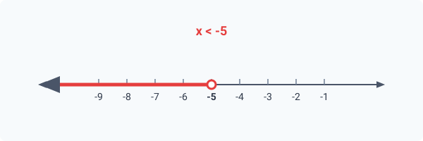
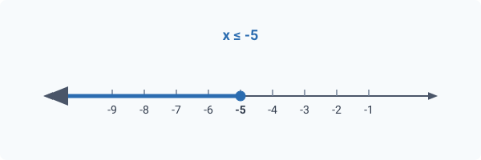

# Inequações de 1º Grau (Lineares)

As inequações lineares são aquelas em que a variável aparece apenas com expoente 1. Elas podem ser resolvidas utilizando técnicas de manipulação algébrica, como adição, subtração, multiplicação e divisão.

**Forma Geral**:

$$
ax + b < 0\\
ax + b \le 0\\
ax + b > 0\\
ax + b \ge 0
$$

com $a \neq 0$.

> **Regra Fundamental**
>
> Ao multiplicar ou dividir ambos os lados por um número negativo, o sentido da desigualdade deve ser invertido.
> $$
> -x \gt 5 \quad (\div -1) \Rightarrow \quad x \lt -5\\
> -2x \ge 10 \quad (\div -2) \Rightarrow \quad x \le -5
> $$
>
> 
>
> 

## Resolvendo Inequações de 1º Grau (método algébrico)

Para resolver uma inequação de 1º grau, seguimos os seguintes passos:

1. Isolar a variável em um dos lados da inequação.
2. Aplicar operações algébricas para simplificar a inequação.
3. Representar a solução em forma de intervalo, desigualdade ou conjunto.

**Exemplo**:

$$
3x - 6 \le 12\\

3x \le 18\\
x \le 6
$$

Soluções:

- $(-\infty,6]$
- $]-\infty,6]$
- $\{ x \in \mathbb{R} \mid x \le 6 \}$

Quando estivermos resolvendo inequações, é importante lembrar que o conjunto solução pode ser representado de diferentes formas, como intervalos, desigualdades ou conjuntos.

## Resolvendo Inequações de 1º Grau (para varal)

Para resolver inequações de 1º grau com varal, podemos utilizar o método gráfico. O varal é uma representação visual das soluções da inequação.

1. **Organização**:

   $$
   3x - 6 \le 12\\
   3x - 18 \le 0
   $$

2. **Resolução**:

   $$
   3x - 18 = 0\\
   x=6
   $$

4. **Sinais**:
   1. **Sinal de $a$**: $\nearrow (a>0)$

   2. **Sinal de $f(x)$**: Verifique se o sinal de $f(x)$
      1. **Marcador**: ● Fechado (tem igualdade)
      2. **Positiva ou Negativa**: Negativo $f(x) \le 0$
5. **Esboço**:
   ```text
      -  -  -  -  -  -  -  -  -     +   +   +   +   +   +   +
   ==============================●------------------------------
   -∞                            6                            +∞
   ```

6. **Solução**:
   - $(-\infty,6]$
   - $]-\infty,6]$
   - $\{ x \in \mathbb{R} \mid x \le 6 \}$
