# Inequações de 2º Grau (Quadráticas)

Uma inequação do 2º grau é qualquer expressão matemática que pode ser reduzida a uma das seguintes formas:

**Forma Geral**:

$$
ax^2 + bx + c < 0\\
ax^2 + bx + c \le 0\\
ax^2 + bx + c > 0\\
ax^2 + bx + c \ge 0
$$

Onde $a, b, c \in \mathbb{R}$ e $a \neq 0$.

Resolver essas inequações consiste em identificar para quais valores de $x$ a função quadrática $f(x) = ax^2 + bx + c$
assume valores positivos, negativos ou nulos.

## O Discriminante ($\Delta$), a Concavidade ($a$) e $f(x)$

O comportamento da parábola e a quantidade de interseções com o eixo $x$ dependem diretamente do sinal de $a$ e do valor do discriminante $\Delta = b^2 - 4ac$.

- **Sinal de $a$ (Concavidade):**

  | Sinal de $a$         | Concavidade | Boca                            | Representação                                           |
  | -------------------- | ----------- | ------------------------------- | ------------------------------------------------------- |
  | $a > 0$ ou $a \ge 0$ | p/ cima     | Feliz :slightly_smiling_face:   | 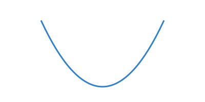 |
  | $a < 0$ ou $a \le 0$ | p/ baixo    | Triste :slightly_frowning_face: | 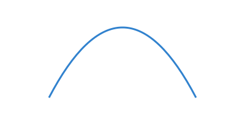 |
  
- **Valor de $\Delta$ (Interseção com o eixo $x$ idêntico a equação do 2º grau):**

  | Valor de $\Delta$ | Raízes Reais          | Comportamento da Curva                   |
  | ----------------- | --------------------- | ---------------------------------------- |
  | $\Delta > 0$      | 2 ($x_1 \neq x_2$)    | A curva cruza o eixo $x$ em dois pontos. |
  | $\Delta = 0$      | 1 ($x_1 = x_2$)       | A curva apenas tangencia o eixo $x$.     |
  | $\Delta < 0$      | 0 ($x = \varnothing$) | A curva não toca o eixo $x$.             |

- **Sinal de $f(x)$ (Inclui Zero ou não):**

  | Sinal de $f(x)$              | Marcador  | Raízes                   |
  | ---------------------------- | --------- | ------------------------ |
  | $f(x) > 0$ ou $f(x) < 0$     | ○ Aberto  | não pertencem à solução. |
  | $f(x) \ge 0$ ou $f(x) \le 0$ | ● Fechado | pertencem à solução.     |

- **Sinal de $f(x)$ (Positivo ou Negativo):**

  | Sinal de $f(x)$            | Solução                               |
  | -------------------------- | ------------------------------------- |
  | $f(x) > 0$ ou $f(x) \ge 0$ | Valores acima do eixo $x$ (Positivo)  |
  | $f(x) < 0$ ou $f(x) \le 0$ | Valores abaixo do eixo $x$ (Negativo) |

- **Resumo dos Cenários**:

  |              | $a>0, f(x) \neq 0$                                      | $a>0, f(x) \le\ge 0$                                    | $a<0, f(x) \neq 0$                                      | $a<0, f(x) \le\ge 0$                                    |
  | ------------ | ------------------------------------------------------- | ------------------------------------------------------- | ------------------------------------------------------- | ------------------------------------------------------- |
  | $\Delta > 0$ | 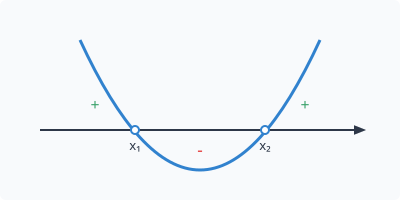 | 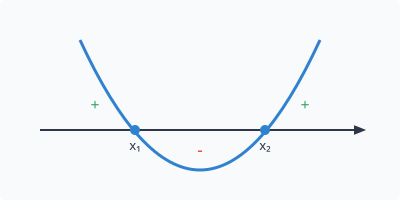 | 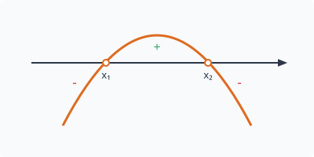 | 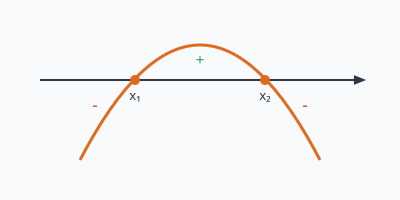 |
  | $\Delta = 0$ | 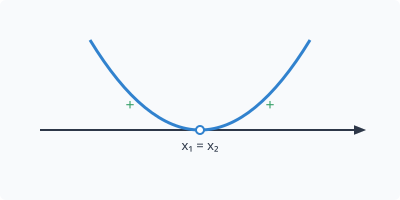 | 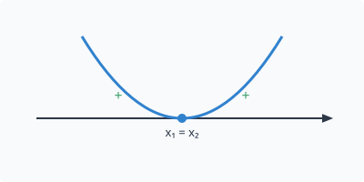 | 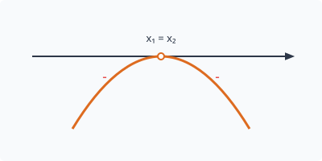 |  |
  | $\Delta < 0$ | 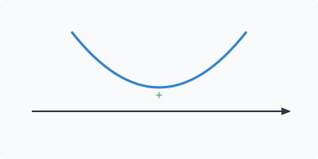 |  | 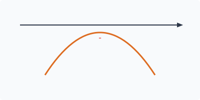 |  |

## Cenários

Gráficos Vetoriais, Estudo de Sinais com exemplos práticos para cada cenário de $a$ e $\Delta$.

### Caso A: $a > 0$ e $\Delta > 0$ e ($f(x) > 0$ ou $f(x) \ge 0$)

|      $f(x)>0$      |     $f(x) \ge 0$     |
| :----------------: | :------------------: |
| $x^2 - 4x + 3 > 0$ | $x^2 - 4x + 3 \ge 0$ |

1. **Organização**: OK
2. **Resolução**: Encontrar as Raízes ($\Delta > 0$: Duas Raízes Reais Distintas)
   - Transformando em equação: $x^2 - 4x + 3 = 0$
   - Fatorando: $(x - 1)(x - 3) = 0$
   - Raízes:
     - $x_1 = 1$
     - $x_2 = 3$
3. **Sinais**:
   1. **Sinal de $a$**: $\cup$ ($a > 0$ parábola voltada para cima)
   2. **Sinal de $f(x)$**:
      1. **Marcador**: ○ Aberto ($f(x)>0$) ou ● Fechado ($f(x) \ge 0$)
      2. **Positiva ou Negativa**: Positivo
4. **Esboço**:
   ```text
      +   +   +   +       -   -   -   -   -   +   +   +   +   +
   ====================○--------------------○==================== (x² > 0)
   -∞                  x1                   x2                  +∞

      +   +   +   +       -   -   -   -   -   +   +   +   +   +
   ====================●--------------------●==================== (x² ≥ 0)
   -∞                  x1                   x2                  +∞
   ```
6. Definir o Intervalo da Solução:
   - O sinal da inequação $f(x)$ é positivo (Valores acima do eixo $x$), logo:
     - Para $f(x) > 0$ (não inclui Zero, raízes não pertencem à solução):
       - $]-\infty, 1[ \cup ]3, +\infty[$
       - $\{x \in \mathbb{R} \mid x < 1 \text{ ou } x > 3\}$
       - 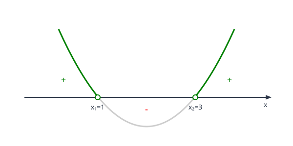
     - Para $f(x) \ge 0$ (inclui Zero, raízes pertencem à solução):
       - $]-\infty, 1] \cup [3, +\infty[$
       - $\{x \in \mathbb{R} \mid x \le 1 \text{ ou } x \ge 3\}$
       - 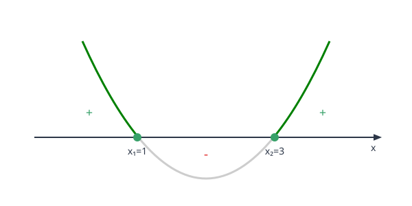

### Caso B: $a > 0$ e $\Delta > 0$ e ($f(x) < 0$ ou $f(x) \le 0$)

|      $f(x)<0$      |     $f(x) \le 0$     |
| :----------------: | :------------------: |
| $x^2 - 6x + 5 < 0$ | $x^2 - 6x + 5 \le 0$ |

1. **Organização**: OK
2. **Resolução**: Encontrar as Raízes ($\Delta > 0$: Duas Raízes Reais Distintas)
   - Transformando em equação: $x^2 - 6x + 5 = 0$
   - Fatorando: $(x - 1)(x - 5) = 0$ ou ...
     - $x_1 = 1$
     - $x_2 = 5$
   - Baskara:
     - $\Delta = (-6)^2 - 4 \cdot 1 \cdot 5 = 36 - 20 = 16$
     - $x_1 = \frac{6 - \sqrt{16}}{2} = \frac{6 - 4}{2} = 1$
     - $x_2 = \frac{6 + \sqrt{16}}{2} = \frac{6 + 4}{2} = 5$
3. **Sinais**:
   1. **Sinal de $a$**: $\cup$ ($a > 0$ parábola voltada para cima)
   2. **Sinal de $f(x)$**:
      1. **Marcador**: ○ Aberto ($f(x)<0$) ou ● Fechado ($f(x) \le 0$)
      2. **Positiva ou Negativa**: Negativo
4. **Esboço**:
   ```text
      +   +   +   +       -   -   -   -   -   +   +   +   +   +
   --------------------○====================○-------------------- (x² < 0)
   -∞                  x1                   x2                  +∞

      +   +   +   +       -   -   -   -   -   +   +   +   +   +
   --------------------●====================●-------------------- (x² ≤ 0)
   -∞                  x1                   x2                  +∞
   ```
5. Definir o Intervalo da Solução:
   - O sinal da inequação $f(x)$ é negativo (Valores abaixo do eixo $x$), logo:
     - Para $f(x) < 0$ (não inclui Zero, raízes não pertencem à solução):
       - $]1, 5[$
       - $\{x \in \mathbb{R} \mid 1 < x < 5\}$
       - 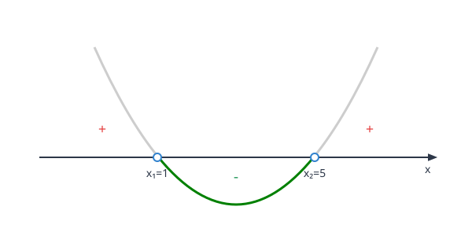
     - Para $f(x) \ge 0$ (inclui Zero, raízes pertencem à solução):
       - $]-\infty, 1] \cup [5, +\infty[$
       - $\{x \in \mathbb{R} \mid x \le 1 \text{ ou } x \ge 5\}$
       - 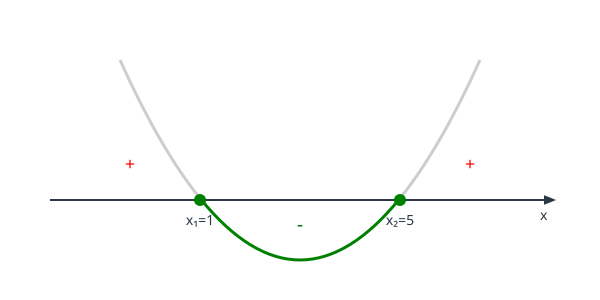

### Caso C: $a < 0$ e $\Delta > 0$ e ($f(x) > 0$ ou $f(x) \ge 0$)

|      $f(x)>0$       |     $f(x) \ge 0$      |
| :-----------------: | :-------------------: |
| $-x^2 + 4x - 3 > 0$ | $-x^2 + 4x - 3 \ge 0$ |

1. **Organização**: OK
2. **Resolução**: Encontrar as Raízes ($\Delta > 0$: Duas Raízes Reais Distintas)
   - Transformando em equação:
   - $-x^2 + 4x - 3 = 0 \Rightarrow x^2 - 4x + 3 = 0$
   - Fatorando: $(x - 1)(x - 3) = 0$
   - Raízes:
     - $x_1 = 1$
     - $x_2 = 3$
3. **Sinais**:
   1. **Sinal de $a$**: $\cap$ ($a < 0$ parábola voltada para baixo)
   2. **Sinal de $f(x)$**:
      1. **Marcador**: ○ Aberto ($f(x)>0$) ou ● Fechado ($f(x) \ge 0$)
      2. **Positiva ou Negativa**: Positivo
4. **Esboço**:
   ```text
      -   -   -   -      +   +   +   +   +     -   -   -   -   -
   ====================○--------------------○==================== (-x² > 0)
   -∞                  x1                   x2                  +∞

      -   -   -   -      +   +   +   +   +     -   -   -   -   -
   ====================●--------------------●==================== (-x² ≥ 0)
   -∞                  x1                   x2                  +∞
   ```
5. Definir o Intervalo da Solução:
   - O sinal da inequação $f(x)$ é positivo (Valores acima do eixo $x$), logo:
     - Para $f(x) > 0$ (não inclui Zero, raízes não pertencem à solução):
       - $\varnothing$
       - $\{x \in \mathbb{R} \mid \text{sem solução}\}$
     - Para $f(x) \ge 0$ (inclui Zero, raízes pertencem à solução):
       - $\{1, 3\}$
       - $\{x \in \mathbb{R} \mid x = 1 \text{ ou } x = 3\}$

### Caso D: $a < 0$ e $\Delta = 0$ e ($f(x) > 0$ ou $f(x) \ge 0$)

|      $f(x)>0$       |     $f(x) \ge 0$      |
| :-----------------: | :-------------------: |
| $-x^2 + 4x - 4 > 0$ | $-x^2 + 4x - 4 \ge 0$ |

1. **Organização**: OK
2. **Resolução**: Encontrar as Raízes ($\Delta = 0$: Uma Raiz Real Repetida)
   - Transformando em equação: $-x^2 + 4x - 4 = 0$
   - Fatorando: $-(x^2 - 4x + 4) = 0 \Rightarrow -(x - 2)^2 = 0$
   - Raízes:
     - $x_1 = x_2 = 2$
3. **Sinais**:
   1. **Sinal de $a$**: $\cap$ ($a < 0$ parábola voltada para baixo)
   2. **Sinal de $f(x)$**:
      1. **Marcador**: ○ Aberto ($f(x)>0$) ou ● Fechado ($f(x) \ge 0$)
      2. **Positiva ou Negativa**: Positivo
4. **Esboço**:
   ```text
      -   -   -   -   -   -   -   -   -   -   -   -   -   -   -
   -------------------------------○------------------------------ (-x² > 0)
   -∞                           x1=x2 ∆=0                       +∞

      -   -   -   -   -   -   -   -   -   -   -   -   -   -   -
   -------------------------------●------------------------------ (-x² ≥ 0)
   -∞                           x1=x2 ∆=0                       +∞
   ```
5. Definir o Intervalo da Solução:
   - O sinal da inequação $f(x)$ é positivo (Valores acima do eixo $x$), logo:
     - Para $f(x) > 0$ (não inclui Zero, raízes não pertencem à solução):
       - $\varnothing$
       - $\{x \in \mathbb{R} \mid \text{sem solução}\}$
       - 
     - Para $f(x) \ge 0$ (inclui Zero, raízes pertencem à solução):
       - $\{2\}$
       - $\{x \in \mathbb{R} \mid x = 2\}$
       - 

### Caso E: $a < 0$ e $\Delta < 0$ e ($f(x) > 0$ ou $f(x) \ge 0$)

|       $f(x)>0$       |      $f(x) \ge 0$      |
| :------------------: | :--------------------: |
| $-2x^2 + 5x - 6 > 0$ | $-2x^2 + 5x - 6 \ge 0$ |

1. **Organização**: OK
2. **Resolução**: Encontrar as Raízes ($\Delta < 0$: Nenhuma Raiz Real)
   - Transformando em equação: $-2x^2 + 5x - 6 = 0$
   - Fatorando: $-2x^2 + 5x - 6 = 0 \Rightarrow 2x^2 - 5x + 6 = 0$
   - Baskara:
     - $\Delta = (-5)^2 - 4 \cdot 2 \cdot 6 = 25 - 48 = -23 < 0$
     - Não há raízes reais.
3. **Sinais**:
   1. **Sinal de $a$**: $\cap$ ($a < 0$ parábola voltada para baixo)
   2. **Sinal de $f(x)$**:
      1. **Marcador**: ○ Aberto ($f(x)>0$) ou ● Fechado ($f(x) \ge 0$)
      2. **Positiva ou Negativa**: Positivo
4. **Esboço**:
   ```text
      -   -   -   -   -   -   -   -   -   -   -   -   -   -   -
   -------------------------------------------------------------- (-x² > 0, -x² ≥ 0)
   -∞                        x1=x2=i ∆=-                       +∞
   ```
5. Definir o Intervalo da Solução:
   - Por se tratar de uma inequação sem raízes reais
     - a parábola não cruza o eixo $x$ não incorporando pontos de interseção
   - Com $a<0$, a boca para baixo
     - a curva permanece inteiramente abaixo do eixo $x$ (sinal negativo)
   - O sinal da inequação $f(x)$ é positivo (Valores acima do eixo $x$)
     - Não há valores acima do eixo $x$ para $f(x)$, logo:
       - $S=\varnothing$
       - $\{x \in \mathbb{R} \mid \text{sem solução}\}$
       -  $\not\subset$ 
