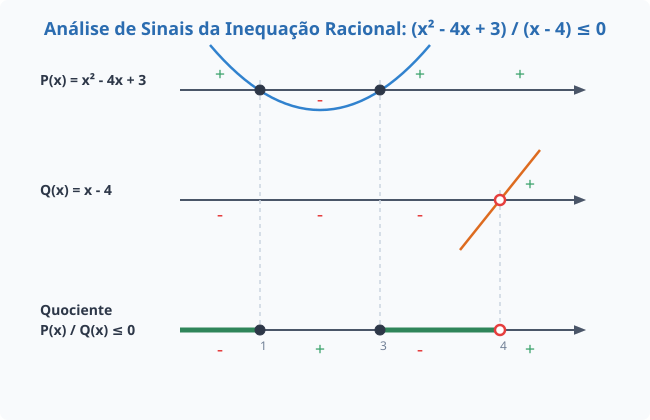

# Inequações Racionais e Varal de Sinais

Uma **inequação racional** é qualquer desigualdade que envolve o quociente de expressões algébricas (frequentemente funções polinomiais). Elas podem ser reduzidas a uma das seguintes formas básicas:

$$\frac{P(x)}{Q(x)} > 0, \quad \frac{P(x)}{Q(x)} \ge 0, \quad \frac{P(x)}{Q(x)} < 0, \quad \frac{P(x)}{Q(x)} \le 0$$

Onde $P(x)$ e $Q(x)$ são polinômios, e obrigatoriamente **$Q(x) \neq 0$** (condição de existência).

---

## 1. Condição Crítica e Regra de Sinais

Ao contrário das equações, **nunca devemos multiplicar cruzado** ou "sumir" com o denominador em inequações racionais. O denominador $Q(x)$ possui uma variável e seu sinal muda dependendo do valor de $x$, o que poderia inverter o sentido da desigualdade incorretamente.

### A Condição de Existência (CE)

> **Regra de Ouro:** O denominador nunca pode ser zero. Portanto, as raízes de $Q(x)=0$ serão **sempre representadas com bolinha vazia (intervalo aberto)** no conjunto solução, mesmo que a inequação principal use os símbolos de inclusão $\le$ ou $\ge$.

### Equivalência de Sinais

A regra de sinais para a divisão é idêntica à da multiplicação:

- $\frac{(+)}{(+)} = +$
- $\frac{(-)}{(-)} = +$
- $\frac{(+)}{(-)} = -$

Portanto, analisar o sinal do quociente $\frac{P(x)}{Q(x)}$ é equivalente a analisar o sinal do produto $P(x) \cdot Q(x)$.

## 2. Estudo de Caso Prático

Para ilustrar de forma robusta, utilizaremos uma inequação racional onde o numerador é uma função quadrática (gerando uma parábola) e o denominador é uma função afim (gerando uma reta):

$$\frac{x^2 - 4x + 3}{x - 4} \le 0$$

### Passo 1: Análise do Numerador $P(x) = x^2 - 4x + 3$

- Raízes através de Bhaskara: $x_1 = 1$ e $x_2 = 3$.
- Como $a = 1 > 0$, a concavidade é voltada para cima.
- **Sinal de $P(x)$:** Positivo para $x < 1$ ou $x > 3$; Negativo entre $1$ e $3$.

### Passo 2: Análise do Denominador $Q(x) = x - 4$

- Raiz: $x = 4$.
- Como o coeficiente angular é positivo ($1$), é uma reta crescente.
- **Sinal de $Q(x)$:** Negativo para $x < 4$; Positivo para $x > 4$.
- **CE:** $x \neq 4$ (bolinha obrigatoriamente aberta em 4).

## 3. O Quadro de Sinais (Varal) em SVG

O método mais seguro para resolver inequações racionais é o quadro de distribuição de sinais. Abaixo, geramos a visualização gráfica contendo o comportamento individual de $P(x)$ (parábola), $Q(x)$ (reta) e o varal resultante do quociente.

## 4. Determinação do Conjunto Solução

Como o objetivo inicial da inequação é determinar onde o quociente resulta em valores menores ou iguais a zero ($\le 0$), nós isolamos os intervalos que receberam o sinal de menos ($-$) na última linha do quadro analítico:

- **Primeiro Segmento:** Do $-\infty$ até o valor $1$ (inclusive).
- **Segundo Segmento:** Do valor $3$ (inclusive) até o valor $4$ (exclusive devido à Condição de Existência).

Desta forma, a notação formal do **Conjunto Solução ($S$)** é dada por:

$$S = \{x \in \mathbb{R} \mid x \le 1 \text{ ou } 3 \le x < 4\}$$

Em notação de intervalos bi-abertos/fechados:

$$S = ]-\infty, 1] \cup [3, 4[$$
