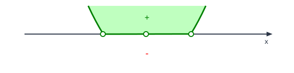
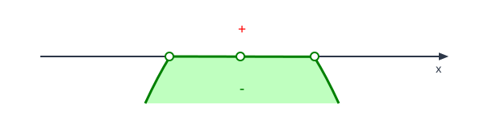

# Inequações

Uma **inequação** é uma expressão matemática que compara valores utilizando:

| Símbolo | Significado      |
| ------- | ---------------- |
| `<`     | Menor que        |
| `≤`     | Menor ou igual a |
| `>`     | Maior que        |
| `≥`     | Maior ou igual a |

Exemplos:

$$
x + 3 > 5 \\
\quad \text{(Inequação linear)} \\
\,\\
x^2 - 5x + 6 ≤ 0\\
\quad \text{(Inequação quadrática)}
$$

O objetivo é determinar os valores de `x` que tornam a inequação verdadeira.

## Resumo das Notações de Intervalos

### Notação Matemática Padrão

| Internacional       | Somente Colchetes   | Definição por Propriedade                   | Inequação              |
| ------------------- | ------------------- | ------------------------------------------- | ---------------------- |
| $(a,b)$             | $]a,b[$             | $\{ x \in \mathbb{R} \mid a < x < b \}$     | $a < x < b$            |
| $[a,b]$             | $[a,b]$             | $\{ x \in \mathbb{R} \mid a \le x \le b \}$ | $a \le x \le b$        |
| $(a,b]$             | $]a,b]$             | $\{ x \in \mathbb{R} \mid a < x \le b \}$   | $a < x \le b$          |
| $[a,b)$             | $[a,b[$             | $\{ x \in \mathbb{R} \mid a \le x < b \}$   | $a \le x < b$          |
| $(-\infty,a)$       | $]-\infty,a[$       | $\{ x \in \mathbb{R} \mid x < a \}$         | $x < a$                |
| $(-\infty,a]$       | $]-\infty,a]$       | $\{ x \in \mathbb{R} \mid x \le a \}$       | $x \le a$              |
| $(a,+\infty)$       | $]a,+\infty[$       | $\{ x \in \mathbb{R} \mid x > a \}$         | $x > a$                |
| $[a,+\infty)$       | $[a,+\infty[$       | $\{ x \in \mathbb{R} \mid x \ge a \}$       | $x \ge a$              |
| $(-\infty,+\infty)$ | $]-\infty,+\infty[$ | $\{ x \in \mathbb{R} \}$                    | Todos os números reais |
| $\emptyset$         | $\emptyset$         | $\emptyset$                                 | sem solução            |

**Convenção:**

- `(` ou `)` → extremo **não pertence** ao intervalo.
- `[` ou `]` → extremo **pertence** ao intervalo.
- `]` ou `[` → O mesmo que `(` ou `)`.
- `±∞` nunca pertencem ao conjunto, portanto sempre aparecem com parênteses.

### Uniões de Intervalos

| Inequação               | Padrão                        | Somente Colchetes  |
| ----------------------- | ----------------------------- | ------------------ |
| $x < -2$ ou $x > 3$     | $(-\infty,-2)\cup(3,+\infty)$ | $]-∞,-2[ ∪ ]3,+∞[$ |
| $x \le -2$ ou $x > 3$   | $(-\infty,-2]\cup(3,+\infty)$ | $]-∞,-2] ∪ ]3,+∞[$ |
| $x < -2$ ou $x \ge 3$   | $(-\infty,-2)\cup[3,+\infty)$ | $]-∞,-2[ ∪ [3,+∞[$ |
| $x \le -2$ ou $x \ge 3$ | $(-\infty,-2]\cup[3,+\infty)$ | $]-∞,-2] ∪ [3,+∞[$ |

**Regra prática:**

```text
Incluído  -> [ ou ]
Excluído  -> ( ou )   (notação padrão)
Excluído  -> ] ou [   (notação somente colchetes)

+∞ e -∞ nunca pertencem ao conjunto.
```

## Inequações de 1º Grau (Lineares)

As inequações lineares são aquelas em que a variável aparece apenas com expoente 1. Elas podem ser resolvidas utilizando técnicas de manipulação algébrica, como adição, subtração, multiplicação e divisão.

**Forma Geral**:

$$
ax + b < 0\\
ax + b \le 0\\
ax + b > 0\\
ax + b \ge 0
$$

com $a \neq 0$.

> **Regra Fundamental**
>
> Ao multiplicar ou dividir ambos os lados por um número negativo, o sentido da desigualdade deve ser invertido.
> $$
> -x \gt 5 \quad (\div -1) \Rightarrow \quad x \lt -5\\
> -2x \ge 10 \quad (\div -2) \Rightarrow \quad x \le -5
> $$
>
> 
>
> 

**Exemplo**:

$$
3x - 6 \le 12\\

3x \le 18\\
x \le 6
$$

Soluções:

- $(-\infty,6]$
- $]-\infty,6]$
- $\{ x \in \mathbb{R} \mid x \le 6 \}$

## Inequações de 2º Grau (Quadráticas))

Uma inequação do 2º grau é qualquer expressão matemática que pode ser reduzida a uma das seguintes formas:

**Forma Geral**:

$$
ax^2 + bx + c < 0\\
ax^2 + bx + c \le 0\\
ax^2 + bx + c > 0\\
ax^2 + bx + c \ge 0
$$

Onde $a, b, c \in \mathbb{R}$ e $a \neq 0$.

Resolver essas inequações consiste em identificar para quais valores de $x$ a função quadrática $f(x) = ax^2 + bx + c$ 
assume valores positivos, negativos ou nulos.

### O Discriminante ($\Delta$), a Concavidade ($a$) e $f(x)$

O comportamento da parábola e a quantidade de interseções com o eixo $x$ dependem diretamente do sinal de $a$ e do valor do discriminante $\Delta = b^2 - 4ac$.

- **Sinal de $a$ (Concavidade):**

  | Sinal de $a$         | Concavidade | Boca                            | Representação                                            |
  | -------------------- | ----------- | ------------------------------- | -------------------------------------------------------- |
  | $a > 0$ ou $a \ge 0$ | p/ cima     | Feliz :slightly_smiling_face:   |  |
  | $a < 0$ ou $a \le 0$ | p/ baixo    | Triste :slightly_frowning_face: |  |
  
- **Valor de $\Delta$ (Interseção com o eixo $x$ idêntico a equação do 2º grau):**

  | Valor de $\Delta$ | Raízes Reais          | Comportamento da Curva                   |
  | ----------------- | --------------------- | ---------------------------------------- |
  | $\Delta > 0$      | 2 ($x_1 \neq x_2$)    | A curva cruza o eixo $x$ em dois pontos. |
  | $\Delta = 0$      | 1 ($x_1 = x_2$)       | A curva apenas tangencia o eixo $x$.     |
  | $\Delta < 0$      | 0 ($x = \varnothing$) | A curva não toca o eixo $x$.             |

- **Sinal de $f(x)$ (Inclui Zero ou não):**

  | Sinal de $f(x)$              | Marcador  | Raízes                   |
  | ---------------------------- | --------- | ------------------------ |
  | $f(x) > 0$ ou $f(x) < 0$     | ○ Aberto  | não pertencem à solução. |
  | $f(x) \ge 0$ ou $f(x) \le 0$ | ● Fechado | pertencem à solução.     |

- **Sinal de $f(x)$ (Positivo ou Negativo):**

  | Sinal de $f(x)$            | Solução                               | $f(x) \subset 0$                                          | $f(x) \not\subset 0$                                      |
  | -------------------------- | ------------------------------------- | --------------------------------------------------------- | --------------------------------------------------------- |
  | $f(x) > 0$ ou $f(x) \ge 0$ | Valores acima do eixo $x$ (Positivo)  |  |  |
  | $f(x) < 0$ ou $f(x) \le 0$ | Valores abaixo do eixo $x$ (Negativo) |  |  |

- **Resumo dos Cenários**:

  |              | $a>0, f(x) \neq 0$                                      | $a>0, f(x) \le\ge 0$                                    | $a<0, f(x) \neq 0$                                      | $a<0, f(x) \le\ge 0$                                    |
  | ------------ | ------------------------------------------------------- | ------------------------------------------------------- | ------------------------------------------------------- | ------------------------------------------------------- |
  | $\Delta > 0$ |  |  |  |  |
  | $\Delta = 0$ |  |  |  |  |
  | $\Delta < 0$ |  |  |  |  |

### Passo a Passo para Resolução

Para mapear e resolver qualquer inequação do segundo grau, siga este fluxo analítico estruturado:

1. **Organização**: Garanta que todos os termos estejam de um lado da desigualdade, deixando o outro lado igual a zero (ex: $ax^2 + bx + c \ge 0$).
   $$
   ax^2 + bx \ge -c\\
   \text{Reorganizando} \\
   ax^2 + bx + c \ge 0
   $$
2. **Encontrar as Raízes**: Transforme temporariamente a inequação em uma equação de 2º grau ($ax^2 + bx + c = 0$) e calcule as raízes utilizando a fórmula de Bhaskara ou relações de Soma e Produto.
   $$
   ax^2 + bx + c = 0\\
   \Delta = b^2 - 4ac\\
   x = \frac{-b \pm \sqrt{\Delta}}{2a}
   $$
3. **Identificar a Concavidade**: Verifique o sinal do coeficiente $a$.
   - $a>0$ 
   - $a<0$ 
4. **Desenhar o Esboço do Varal**: Trace uma linha reta representando o eixo $x$, posicione as raízes encontradas e desenhe o comportamento da parábola.
   - Veja em cenários
5. **Definir o Intervalo da Solução**: Baseado no sinal pedido pela inequação original ($>$, $\ge$, $<$ ou $\le$), selecione o conjunto de intervalos corretos que respondem ao problema.
   - Veja em cenários

> **Atenção aos Sinais de Inclusão ($\le$ ou $\ge$):** > Lembre-se de utilizar **bolas cheias** (intervalo fechado) nos pontos críticos se a inequação incluir a igualdade, e **bolas vazias** (intervalo aberto) caso use desigualdades estritas ($<$ ou $>$).

### Cenários

Gráficos Vetoriais, Estudo de Sinais com exemplos práticos para cada cenário de $a$ e $\Delta$.

#### Caso A: $a > 0$ e $\Delta > 0$ e ($f(x) > 0$ ou $f(x) \ge 0$)

|      $f(x)>0$      |     $f(x) \ge 0$     |
| :----------------: | :------------------: |
| $x^2 - 4x + 3 > 0$ | $x^2 - 4x + 3 \ge 0$ |

1. Organização: OK
2. Encontrar as Raízes ($\Delta > 0$: Duas Raízes Reais Distintas)
   - Transformando em equação: $x^2 - 4x + 3 = 0$
   - Fatorando: $(x - 1)(x - 3) = 0$
   - Raízes:
     - $x_1 = 1$
     - $x_2 = 3$
3. Identificar a Concavidade: $a > 0$ (parábola voltada para cima)
   
5. Desenhar o Esboço do Varal: A parábola cruza o eixo $x$ em $x_1 = 1$ e $x_2 = 3$.
   - $f(x) > 0$: Sinal Positivo (Valores Acima do Eixo $x$)
     
   - $f(x) \ge 0$: Sinal Positivo ou Zero (Valores Acima do Eixo $x$ ou no Eixo $x$)
     
6. Definir o Intervalo da Solução:
   - O sinal da inequação $f(x)$ é positivo (Valores acima do eixo $x$), logo:
     - Para $f(x) > 0$ (não inclui Zero, raízes não pertencem à solução):
       - $]-\infty, 1[ \cup ]3, +\infty[$
       - $\{x \in \mathbb{R} \mid x < 1 \text{ ou } x > 3\}$
       - 
     - Para $f(x) \ge 0$ (inclui Zero, raízes pertencem à solução):
       - $]-\infty, 1] \cup [3, +\infty[$
       - $\{x \in \mathbb{R} \mid x \le 1 \text{ ou } x \ge 3\}$
       - 

#### Caso B: $a > 0$ e $\Delta > 0$ e ($f(x) < 0$ ou $f(x) \le 0$)

|      $f(x)<0$      |     $f(x) \le 0$     |
| :----------------: | :------------------: |
| $x^2 - 6x + 5 < 0$ | $x^2 - 6x + 5 \le 0$ |

1. Organização: OK
2. Encontrar as Raízes ($\Delta > 0$: Duas Raízes Reais Distintas)
   - Transformando em equação: $x^2 - 6x + 5 = 0$
   - Fatorando: $(x - 1)(x - 5) = 0$ ou ...
     - $x_1 = 1$
     - $x_2 = 5$
   - Baskara:
     - $\Delta = (-6)^2 - 4 \cdot 1 \cdot 5 = 36 - 20 = 16$
     - $x_1 = \frac{6 - \sqrt{16}}{2} = \frac{6 - 4}{2} = 1$
     - $x_2 = \frac{6 + \sqrt{16}}{2} = \frac{6 + 4}{2} = 5$
3. Identificar a Concavidade: $a > 0$ (parábola voltada para cima)
   
4. Desenhar o Esboço do Varal: A parábola cruza o eixo $x$ em $x_1 = 1$ e $x_2 = 5$.
   - $f(x) < 0$: Sinal Negativo (Valores Abaixo do Eixo $x$)
     
   - $f(x) \le 0$: Sinal Negativo ou Zero (Valores Abaixo do Eixo $x$ ou no Eixo $x$)
     
5. Definir o Intervalo da Solução:
   - O sinal da inequação $f(x)$ é negativo (Valores abaixo do eixo $x$), logo:
     - Para $f(x) < 0$ (não inclui Zero, raízes não pertencem à solução):
       - $]1, 5[$
       - $\{x \in \mathbb{R} \mid 1 < x < 5\}$
       - 
     - Para $f(x) \ge 0$ (inclui Zero, raízes pertencem à solução):
       - $]-\infty, 1] \cup [5, +\infty[$
       - $\{x \in \mathbb{R} \mid x \le 1 \text{ ou } x \ge 5\}$
       - 

#### Caso C: Raiz Única ($\Delta = 0$) com $a > 0$

Quando $\Delta = 0$, a parábola toca o eixo em apenas um ponto ($x_1 = x_2$).

- A função nunca será negativa neste cenário. É estritamente positiva para qualquer valor diferente da raiz.

<svg xmlns="http://www.w3.org/2000/svg" viewBox="0 0 600 250" width="100%" height="100%">
  <defs>
    <style>
      .axis { stroke: #2D3748; stroke-width: 2; marker-end: url(#arrow); }
      .parabola { stroke: #DD6B20; stroke-width: 3; fill: none; }
      .text-main { font-family: 'Segoe UI', sans-serif; font-size: 14px; fill: #2D3748; }
      .text-bold { font-family: 'Segoe UI', sans-serif; font-size: 16px; font-weight: bold; }
      .sign-pos { fill: #38A169; font-weight: bold; font-size: 18px; }
      .root-point { fill: #FFF; stroke: #DD6B20; stroke-width: 2; }
    </style>
    <marker id="arrow" viewBox="0 0 10 10" refX="5" refY="5" markerWidth="6" markerHeight="6" orient="auto-start-reverse">
      <path d="M 0 1 L 10 5 L 0 9 z" fill="#2D3748" />
    </marker>
  </defs>
  
  <rect width="100%" height="100%" fill="#F7FAFC" rx="8" />
  <text x="300" y="40" text-anchor="middle" class="text-bold">Cenário: a > 0 e Δ = 0 (Tangente)</text>
  
  <line x1="50" y1="180" x2="550" y2="180" class="axis" />
  <text x="540" y="200" class="text-main">x</text>
  
  <path d="M 140,60 Q 300,180 460,60" class="parabola" />
  
  <circle cx="300" cy="180" r="5" class="root-point" />
  <text x="300" y="205" text-anchor="middle" class="text-main">x₁ = x₂</text>
  
  <text x="200" y="150" text-anchor="middle" class="sign-pos">+</text>
  <text x="400" y="150" text-anchor="middle" class="sign-pos">+</text>
</svg>

$\{ x \in \mathbb{R} \mid x \neq 0 \}$

## Inequações Racionais

As inequações racionais envolvem expressões que contêm frações. Para resolvê-las, é necessário encontrar o domínio da função racional e analisar os sinais das expressões envolvidas.
