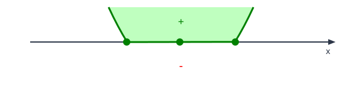
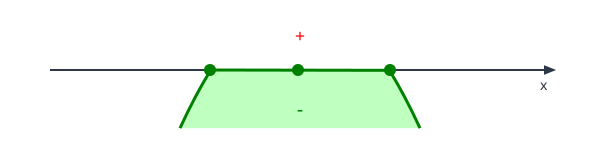

# Inequações

Uma **inequação** é uma expressão matemática que compara valores utilizando:

| Símbolo | Significado      |
| ------- | ---------------- |
| `<`     | Menor que        |
| `≤`     | Menor ou igual a |
| `>`     | Maior que        |
| `≥`     | Maior ou igual a |

Exemplos:

$$
x + 3 > 5 \\
\quad \text{(Inequação linear)} \\
\,\\
x^2 - 5x + 6 ≤ 0\\
\quad \text{(Inequação quadrática)}
$$

O objetivo é determinar os valores de `x` que tornam a inequação verdadeira.

## Notações de Intervalos

| Internacional       | Somente Colchetes   | Definição por Propriedade                   | Inequação              |
| ------------------- | ------------------- | ------------------------------------------- | ---------------------- |
| $(a,b)$             | $]a,b[$             | $\{ x \in \mathbb{R} \mid a < x < b \}$     | $a < x < b$            |
| $[a,b]$             | $[a,b]$             | $\{ x \in \mathbb{R} \mid a \le x \le b \}$ | $a \le x \le b$        |
| $(a,b]$             | $]a,b]$             | $\{ x \in \mathbb{R} \mid a < x \le b \}$   | $a < x \le b$          |
| $[a,b)$             | $[a,b[$             | $\{ x \in \mathbb{R} \mid a \le x < b \}$   | $a \le x < b$          |
| $(-\infty,a)$       | $]-\infty,a[$       | $\{ x \in \mathbb{R} \mid x < a \}$         | $x < a$                |
| $(-\infty,a]$       | $]-\infty,a]$       | $\{ x \in \mathbb{R} \mid x \le a \}$       | $x \le a$              |
| $(a,+\infty)$       | $]a,+\infty[$       | $\{ x \in \mathbb{R} \mid x > a \}$         | $x > a$                |
| $[a,+\infty)$       | $[a,+\infty[$       | $\{ x \in \mathbb{R} \mid x \ge a \}$       | $x \ge a$              |
| $(-\infty,+\infty)$ | $]-\infty,+\infty[$ | $\{ x \in \mathbb{R} \}$                    | Todos os números reais |
| $\emptyset$         | $\emptyset$         | $\emptyset$                                 | sem solução            |

**Convenção:**

- `(` ou `)` → extremo **não pertence** ao intervalo.
- `[` ou `]` → extremo **pertence** ao intervalo.
- `]` ou `[` → O mesmo que `(` ou `)`.
- `±∞` nunca pertencem ao conjunto, portanto sempre aparecem com parênteses.

### Operações de Intervalos

| Inequação                 | Padrão                               | Somente Colchetes                   |
| ------------------------- | ------------------------------------ | ----------------------------------- |
| $x < -2$ ou $x > 3$       | $(-\infty,-2)\cup(3,+\infty)$        | $]-∞,-2[ ∪ ]3,+∞[$                  |
| $x \le -2$ ou $x > 3$     | $(-\infty,-2]\cup(3,+\infty)$        | $]-∞,-2] ∪ ]3,+∞[$                  |
| $x < -2$ ou $x \ge 3$     | $(-\infty,-2)\cup[3,+\infty)$        | $]-∞,-2[ ∪ [3,+∞[$                  |
| $x \le -2$ ou $x \ge 3$   | $(-\infty,-2]\cup[3,+\infty)$        | $]-∞,-2] ∪ [3,+∞[$                  |
| $x > -2$ e $x < 3=-2<x<3$ | $(-2,+\infty)\cap(-\infty,3)=(-2,3)$ | $]-2,+\infty[ ∩ ]-\infty,3[=]-2,3[$ |

**Regra prática:**

```text
Incluído  -> [ ou ]
Excluído  -> ( ou )   (notação padrão)
Excluído  -> ] ou [   (notação somente colchetes)

+∞ e -∞ nunca pertencem ao conjunto.
```

## Propriedades das Inequações

1. Propriedade Aditiva (ou Subtrativa): Você pode **somar ou subtrair o mesmo número em ambos os lados da inequação sem alterar o sinal**.
   $$
      \text{Se: } a > b \text{ e } c \in \mathbb{R} \\
      \text{Então: } a + c > b + c\\
      \text{Exemplo: } 3 > 1 \text{ e } 2 \in \mathbb{R} \\
      3 + 2 > 1 + 2 \Rightarrow 5 > 3
   $$
2. Propriedade Multiplicativa (por número positivo): Se multiplicar ou dividir a inequação por um número **positivo**, o sentido **permanece o mesmo**.
   $$
      \text{Se: } a > b \text{ e } c > 0 \\
      \text{Então: } a \cdot c > b \cdot c\\
      \text{Exemplo: } 2 > 1 \text{ e } 3 > 0 \\
      2 \cdot 3 > 1 \cdot 3 \Rightarrow 6 > 3
   $$
3. Multiplicação por número negativo (Inversão do sinal): Se multiplicar ou dividir por um número **negativo**, o sinal da desigualdade **deve ser invertido**.
   $$
      \text{Se: } -a > b\\
      *^{(-1)}\\
      \text{Então: } a < -b
   $$
4. Propriedade Transitiva: Permite comparar desigualdades em cadeia:
   $$
      \text{Se: } a > b \text{ e } b > c \\
      \text{Então: } a > c
   $$
5. Propriedade de Ordem: Se somarmos ou multiplicarmos termos iguais em ambos os lados, a ordem se mantém (desde que respeitada a regra do sinal):
   $$
      \text{Se: } a > b\\
      \text{Então: } a + k > b + k
   $$

## Passo a Passo para Resolução de Inequações de 1º e 2º Grau

Para mapear e resolver qualquer inequação do 1º ou 2º grau, siga este fluxo analítico estruturado:

1. **Organização**: Garanta que todos os termos estejam de um lado da desigualdade, deixando o outro lado igual a zero (ex: $ax^2 + bx + c \ge 0$).

   | 1º Grau                                            | 2º Grau                                                          |
   | -------------------------------------------------- | ---------------------------------------------------------------- |
   | $$ax \ge -b\\\text{Reorganizando} \\ax + b \ge 0$$ | $$ax^2 + bx \ge -c\\\text{Reorganizando} \\ax^2 + bx + c \ge 0$$ |

2. **Resolução**: Transforme temporariamente a inequação em uma equação de 2º grau ($ax^2 + bx + c = 0$) e calcule as raízes utilizando a fórmula de Bhaskara ou relações de Soma e Produto.

   | 1º Grau                    | 2º Grau                                                                        |
   | -------------------------- | ------------------------------------------------------------------------------ |
   | $$ax+b=0\\x=\frac{-b}{a}$$ | $$ax^2 + bx + c = 0\\\Delta = b^2 - 4ac\\x = \frac{-b \pm \sqrt{\Delta}}{2a}$$ |

3. **Sinais**:
   1. **Sinal de $a$**: Verifique o sinal do coeficiente $a$.

      | Sinal de $a$ | 1º Grau    | 2º Grau | Boca   |
      | ------------ | ---------- | ------- | ------ |
      | $a>0$        | $\nearrow$ | $\cup$  | Feliz  |
      | $a<0$        | $\searrow$ | $\cap$  | Triste |

   2. **Sinal de $f(x)$**: Verifique se o sinal de $f(x)$
      1. **Marcador**: tem igualdade ou não.

         | Sinal de $f(x)$          | Marcador  | Valor(es) $x$           | Conjunto             |
         | ------------------------ | --------- | ----------------------- | -------------------- |
         | $f(x)>0$ ou $f(x)<0$     | ○ Aberto  | não pertencem à solução | $f(x) \not\subset 0$ |
         | $f(x)\ge0$ ou $f(x)\le0$ | ● Fechado | pertencem à solução     | $f(x) \subset 0$     |

      2. **Positiva ou Negativa**: Verifique se a inequação é maior (Positivo) ou menor (Negativo) que zero, e determine os intervalos de solução.

         | Sinal de $f(x)$            | Valores  | Solução            | Imagem                                                    |
         | -------------------------- | -------- | ------------------ | --------------------------------------------------------- |
         | $f(x) > 0$ ou $f(x) \ge 0$ | Positivo | acima do eixo $x$  |  |
         | $f(x) < 0$ ou $f(x) \le 0$ | Negativo | abaixo do eixo $x$ |  |

4. **Esboço**: Para cada inequação, desenhar o esboço um debaixo do outro (Varal de Sinais) para visualizar os intervalos de solução.:
   - Trace uma linha reta representando o eixo $x$
   - Posicione as raízes encontradas com o marcador correspondente (Itens 2+3.2.1)
     - Resolução
     - Marcador: ○ Aberto ou ● Fechado
   - Enfatize os intervalos de solução onde o sinal de $f(x)$ corresponde (Itens 3.1+3.2.2)
     - Sinal de $a$: Boca feliz ou triste
     - Sinal de $f(x)$: Positivo (parte de cima) ou Negativo (parte de baixo)
     - Ex:
       ```text
         ====================○--------------------○==================== (x² > 0)
         -∞                  x1                   x2                  +∞

         --------------------●====================●-------------------- (-x² ≥ 0)
         -∞                  x1                   x2                  +∞

         -------------------------------○============================== (x > 0)
         -∞                             x                             +∞
       ```

5. **Solução**: Definir o Intervalo da Solução
   - Fazer as operações de Intersecção ($\cap$) ou União ($\cup$) dos intervalos obtidos, de acordo com a inequação original.
   - Representar a solução em **notação de intervalos** e/ou **conjunto**.

> **Atenção aos Sinais de Inclusão ($\le$ ou $\ge$):** > Lembre-se de utilizar **bolas cheias** (intervalo fechado) nos pontos críticos se a inequação incluir a igualdade, e **bolas vazias** (intervalo aberto) caso use desigualdades estritas ($<$ ou $>$).

## Links

- [Gráficos 1o e 2o Grau](<graph_svg.md>)
- [Inequações 1o Grau](<Inequações 1o Grau.md>)
- [Inequações 2o Grau](<Inequações 2o Grau.md>)
- [Inequações Racionais](<Inequações Racional.md>)
