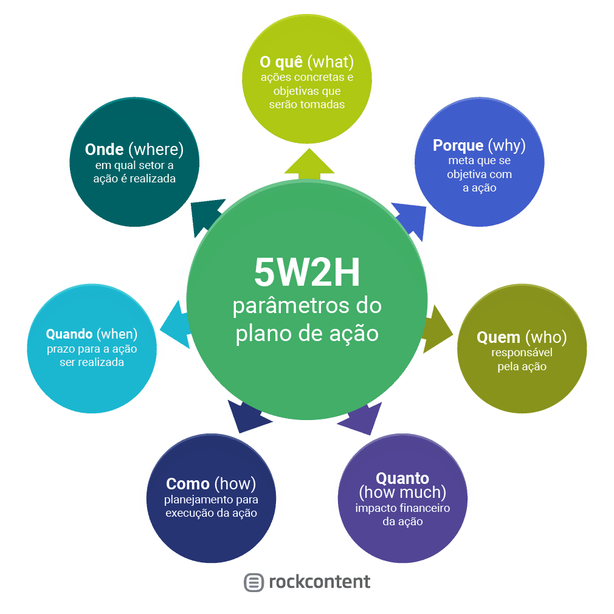

# 5W2H

[5W2H /WH Questions / Plano de Ação](https://pt.wikipedia.org/wiki/5WH)

Os cinco W, 5W2H, 5W - 2H - 1R, 5W2H e 5W1H são acrônimos em inglês que representam as principais perguntas que devem ser feitas e respondidas ao investigar e relatar um fato ou situação, sendo aplicável a várias atividades profissionais, como o jornalismo, a análise de sistemas, o setor de eventos, a administração, as vendas, o marketing, sistema pedagógico de organização, etc.

O plano de ação tem por objetivo definir os desdobramentos da estratégia em ações com monitoramento. Por meio dele, a empresa deve planejar tudo o que deve ser executado, criar uma metodologia, elaborar um cronograma e indicar os responsáveis para dar andamento a cada etapa.

A ferramenta 5W2H é um checklist administrativo de atividades, prazos e responsabilidades que devem ser desenvolvidas com clareza e eficiência por todos os envolvidos em um projeto. Tem como função definir o que será feito, porque, onde, quem irá fazer, quando será feito, como e quanto custará.

A sigla é formada pelas iniciais, em inglês, das sete diretrizes que, quando bem estabelecidas, eliminam quaisquer dúvidas que possam aparecer ao longo de um processo ou de uma atividade.

- Os **5W**:
  - **What? (O quê?)**
    - o que será feito
    - refere-se à definição clara do objetivo ou tarefa a ser realizada. Ele estabelece a base para todas as outras etapas do processo;
    - Qual é o objetivo ou tarefa específica?
    - Ação
    - Processo
    - Produto
    - Expectativa
    - Medidas a serem Tomadas
  - **Why? (Por quê?)**
    - por que será feito
    - explora as razões por trás da realização da tarefa, fornecendo um contexto e uma justificativa para o projeto;
    - Por que essa tarefa é importante e qual é o seu propósito?
    - Por quê é necessária
    - Justificativa
    - Por quê foi definida essas solução
  - **Where? (Onde?)**
    - onde será feito
    - especifica o local ou locais onde a atividade será realizada; seja físico ou virtual;
    - Onde essa tarefa será realizada? Isso inclui localização física ou contexto virtual?
    - Existe necessidade de transporte
    - Local é adequado
    - Existem opções alternativas
    - Existem riscos
      - Chuva
      - Desmoronamento
      - Doenças
      - Enchente
      - Iluminação
      - Incêndio
      - É de fácil localização
    - Onde a ação será conduzida
  - **When? (Quando?)**
    - quando será feito
    - determina o cronograma e os prazos para cada etapa do projeto;
    - Qual é o cronograma para esta tarefa? Quais são os prazos específicos?
    - Início
    - Fim
    - Prazo
      - Preparação
      - Aprovação
      - Produção
      - Entrega
      - Cobrança
      - Pós-venda
    - Quando será implementada
    - Tempo disponível para produção
  - **Who? (Quem?)**
    - por quem será feito
    - identifica as pessoas responsáveis por cada aspecto do projeto, atribuindo claramente papéis e responsabilidades;
    - Quem são as pessoas responsáveis por realizar a tarefa?
    - Responsável por essa ação
    - Empresa
    - Endereço e Telefones
    - Horários e Locais periódicos agendados
- Os **2H**:
  - **How Much? (Quanto?)**
    - quanto vai custar
    - estima os custos associados ao projeto – incluindo recursos financeiros, materiais e humanos – necessários para sua realização.
    - Qual é o custo associado a esta tarefa? Isso inclui recursos financeiros, materiais e humanos.
    - Por quanto? no sentido financeiro, ou ainda no sentido de quantidade inumerável
    - Tipo
      - Negociado
      - Cotado
      - Estimado
    - Quando será gasto
    - Qual o custo do investimento
  - **How? (Como?)**
    - como será feito
    - descreve os métodos e procedimentos que serão utilizados para alcançar os objetivos estabelecidos;
    - Como essa tarefa será realizada? Quais são os métodos e procedimentos necessários?
    - [6M](../Causa_Efeito/6M.md)
    - [Régua Temporal](../Acao/regua_temporal.md)

## Quiz

De acordo com o conteúdo da aula que você acaba de assistir e a compreensão que teve sobre a utilização da metodologia é possível afirmar que se trata de uma ferramenta de:

- [ ] a. Controle para mensurar quanto tempo cada colaborador leva para realizar suas atividades.
- [x] b. Execução que possibilita mapear o que será feito e esclarece todos os detalhes que envolvem a finalidade do projeto.
- [ ] c. Avaliação para mapear se o que será feito foi adequadamente planejado.

Ao utilizar a metodologia 5W2H, é possível que gestores, coordenadores ou supervisores melhorem a produtividade de sua equipe pelo fato de:

- [x] a. Conseguirem enxergar que muitas das tarefas que estão sob sua responsabilidade podem ser delegadas e distribuídas a outros membros da equipe.
- [ ] b. Conseguirem reunir os membros da equipe para um brainstorming direcionado que lhes dará a real dimensão do que precisa ser feito.
- [ ] c. Conseguirem preencher os tópicos da planilha e distribuir rapidamente aos envolvidos o que cada um deve fazer com prazos determinados para as entregas.

Qual é a pergunta-chave para a aplicação da metodologia 5W2H?

- [ ] a. O quê?
- [x] b. Por quê?
- [ ] c. Quem?

O objetivo principal de todo gestor ou colaborador deve ser sempre o de privilegiar a qualidade no planejamento e na execução das suas atividades. No entanto, independentemente da ferramenta que venha a ser utilizada, para alcançar bons resultados, é fundamental:

- [ ] a. Ter uma equipe comprometida.
- [x] b. Ter clareza do problema.
- [ ] c. Ter experiência para conduzir a questão.

A partir do que você aprendeu sobre a metodologia 5W2H, analise as alternativas e escolha a que melhor a define:

- [x] a. É um instrumento eficaz na organização e planejamento de ações que precisam ser realizadas, especificamente, no âmbito profissional e corporativo.
- [x] b. É uma ferramenta simples e fácil de utilizar. Mapeia todas as ações que devem ser realizadas, porém pode comprometer o desempenho dos envolvidos em projetos mais complexos.
- [x] c. É um instrumento simples, fácil e competitivo que potencializa as condições favoráveis à execução das atividades e fornece um ambiente propício para o sucesso desejado. A ausência das dúvidas proporcionada por essa metodologia acelera e otimiza as atividades a serem desenvolvidas.
