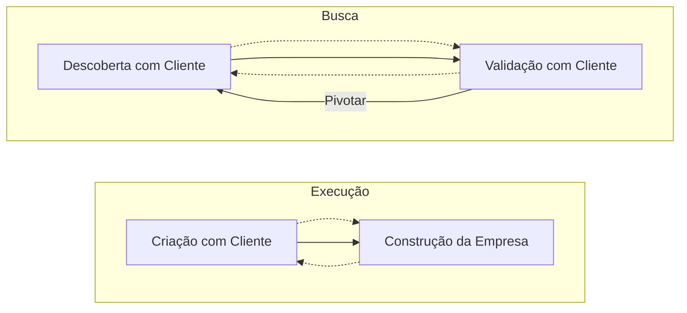
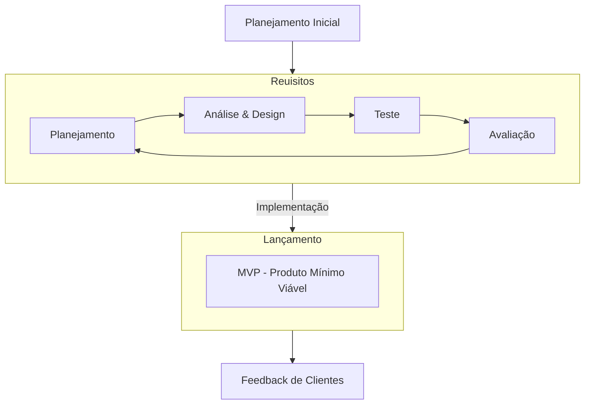

# Lean

Cada vez mais fica evidente que os **tradicionais modelos** de **estratégia empresarial** não funcionam como antes. Muitas empresas **perderam tempo** com processos demorados e burocráticos ou **dinheiro com investimentos** em produtos e serviços que os clientes, muitas vezes, nem desejaram.

**Mas como estão revertendo essa situação?**

Alguns profissionais **adotaram** uma **postura empática**, incluindo o **cliente no centro do processo** de criação. Em casos assim, a metodologia *Lean* tem ganhado destaque com a promessa de inovar, transformar e trazer chances para que os negócios cresçam e prosperem de forma eficiente e objetiva.

## O que é Lean?

*Lean*, que literalmente significa "enxuto", é um **método** que **estabelece** o **uso dos recursos necessários** para a realização de um trabalho, etapa ou processo, evitando desperdícios.

Esse conceito teve origem no *Lean Manufacturing*, uma abordagem de gestão que surgiu nos anos 1950 na indústria automobilística.

Mas foi em **1990**, com o professor James P. Womack, do Massachusetts Institute of Technology (MIT), que essa cultura ficou **conhecida mundialmente**. Isso se deu quando James Womack, juntamente com Daniel T. Jones e Daniel Roos, publicou um livro detalhando o estudo realizado na indústria automobilística.

## Pensamento *Lean*

Baseado em processos, cujos princípios visavam à **eliminação dos desperdícios**, surgiu o *Lean Thinking*, ou pensamento *Lean*, que é um **sistema de gestão** e uma estratégia de negócios voltado para **aumentar** a **satisfação** dos **clientes**.

Ele possui cinco princípios que devem ser considerados nesta ordem:

1. Valor: Definir o que é valor sob a ótica do cliente.
2. Fluxo de Valor: Identificar o fluxo de valor e redefinir os processos, deixando apenas o que gera valor ao cliente.
3. Fluxo Contínuo: Estabelecer um fluxo para os processos que restaram.
4. Produção Puxada: Fazer apenas quando o cliente solicitar.
5. Perfeição: Ou Kaizen, em japonês, que significa "mudança para melhor".

Melhoria contínua de tudo que está envolvido no fluxo de valor.

## Lean Startup

Inspirado no *Lean*, o americano Eric Ries criou o termo ***Lean Startup***, uma metodologia de negócios que pretende **eliminar** práticas de **desperdício** e **aumentar** ações de **produção** de valor nas fases de desenvolvimento de um produto ou serviço.

Esse método pode ser utilizado para **avaliar o desenvolvimento** de **qualquer produto** ou **serviço** em que não se sabe se ele será bem aceito pelo cliente. Assim, será possível ter **rápidas respostas** **provenientes dos processos** de experimentação de protótipos e de *feedbacks* dos clientes.

Apesar do nome, o *Lean Startup* pode ser utilizado em empresas de qualquer porte, de vários mercados. Companhias consolidadas utilizam o *Lean Startup* para inovar, transformar e criar **novas possibilidades** para que os **negócios cresçam** e prosperem.

O objetivo é chegar ao conceito de [Produto Mínimo Viável](https://player.sapiencia.com.br/content-v2/Cursos/SI235s-53444-20231213_103208/index.html?SCORM=true&SCO=M01L01&access_token=Usy5sS8NUcVSA0DEm5vAcBpl5JkGlg4v#pmv) e identificar quem são os clientes dispostos a pagar por ele.

## Benefícios da metodologia

Ouvir o *feedback* dos consumidores, antes de lançar um produto ou serviço, é essencial nesse cenário de incertezas.

Uma empresa se baseou em uma pesquisa de *marketing* e viu que produtos saudáveis estavam em alta.

Com essa informação, lançou um *donut* feito com produtos orgânicos e zero adição de açúcar.

O produto foi um fracasso.

Após pesquisas, a empresa descobriu que o consumidor assíduo de *donuts* disse que o sabor não era o mesmo e preferia o tradicional *donut*.

Se a empresa soubesse dessa opinião, antes de lançar o produto, teria evitado o fracasso inicial.

Na metodologia *Lean*, é possível colher o *feedback* do cliente antes de lançar o produto ou serviço no mercado utilizando o ciclo **Criar-Medir-Aprender**.

Após passar por esse ciclo, obtém-se o aprendizado sobre o protótipo e é possível saber quais são as mudanças ou aprimoramentos necessários a realizar no produto ou serviço.

Pode ser que, **após os *feedbacks*** dos clientes, seja necessário **alterar o curso do negócio**, como, por exemplo, fazer o que Eric Ries chamou de "pivô": uma correção de curso estruturado para testar uma nova hipótese fundamental sobre o produto, estratégia ou motor de crescimento.

É como se a empresa que citamos "pivotasse", ou seja, **ajustasse o produto** ou **lançasse um produto** ou serviço completamente **novo no mercado.**

Mas, em casos assim, quanto antes as hipóteses -- criadas pelo [*Business Model Canvas*](https://player.sapiencia.com.br/content-v2/Cursos/SI235s-53444-20231213_103208/index.html?SCORM=true&SCO=M01L01&access_token=Usy5sS8NUcVSA0DEm5vAcBpl5JkGlg4v#businessmodel) -- forem comprovadas ou refutadas, mais tempo e dinheiro o empreendedor terá para reagir.

## Quando usar a metodologia *Lean*

O *Lean* pode ser aplicado, quando:

O orçamento e o tempo são limitados para o desenvolvimento de novos negócios.

É necessário gerar novos negócios em ambientes de extrema incerteza.

Um projeto é gerenciado com foco no resultado do negócio e não no controle de implementação das suas funcionalidades.

Com o pensamento *Lean*, além de reduzir os custos e eliminar o desperdício, é possível:

1. Agregar valor ao cliente.
2. Proporcionar o gerenciamento de informações de forma mais simples e precisa.
3. Criar processos que necessitam de menos espaço, capital, tempo e esforço humano para produzir.
4. Reduzir os riscos de defeitos nos produtos ou serviços em comparação aos sistemas comerciais tradicionais.
5. Basear os resultados em métricas que importam, como custo de aquisição de clientes, valor vitalício de clientes, perda e viralidade.
6. Esperar o insucesso, mas, diante dele, solucionar promovendo iteração e "pivotando" quando a ideia não funciona.
7. Ser uma empresa veloz.

Modelo Tradicional x *Lean*

Veja as principais vantagens do *Lean* quando comparado ao modelo tradicional.

Tradicional

- **Estratégia**: possui um plano de negócio baseado em implementação.
- **Processo de criação de produto**: realiza a gestão de produto seguindo um plano linear.
- **Engenharia**: desenvolve o produto de forma iterativa ou cria o produto inteiro de antemão.
- **Organização**: é dividida em departamentos, por função e contrata pessoas experientes.
- **Resultados financeiros**: trabalha com contabilidade, demonstração de resultados, fluxo de caixa e balanço patrimonial.
- **Insucesso**: demite executivos.
- **Velocidade**: opera com dados completos.

## *Lean*

- **Estratégia**: possui um modelo de negócio baseado em hipóteses.
- **Processo de criação de produto**: desenvolve o produto junto com os clientes, testando hipóteses no mercado.
- **Engenharia**: desenvolve o produto de forma iterativa e incremental.
- **Organização**: possui equipes que desenvolvem de forma ágil e com o cliente. Contrata pessoas ágeis, velozes e com capacidade de aprender.
- **Resultados financeiros**: trabalha com métricas que importam, como o custo de aquisição de clientes, valor vitalício de clientes, perda e viralidade.
- **Insucesso**: promove iteração e "pivotar" quando a ideia não funciona.
- **Velocidade**: opera de forma rápida e com dados bons o bastante.

## Como colocar o *Lean* em prática

O pensamento *Lean* pode ser aplicado colocando em prática quatro ações:

### Enxugue com o Canvas

Na cultura *Lean*, você pode **utilizar a ferramenta Canvas** para montar o seu *Business Model*, em vez de consolidar um longo relatório de plano de negócio.

O Canvas auxilia você a **criar valor** para seu negócio e para os clientes. Cada componente do modelo de negócio apresentado no Canvas traz uma série de hipóteses a serem testadas. [Clique aqui](https://player.sapiencia.com.br/content-v2/Cursos/SI235s-53444-20231213_103208/anexos/canvas.pdf) para acessar esse modelo.

### Teste as possibilidades com o *Customer Development*

Após ter tudo estruturado com o Canvas, chegou a hora de testar suas hipóteses com a abordagem ***Customer Development***, ou seja, **ouvir o cliente**.

1 -- Descoberta com o cliente: Primeiro, você deve **converter ideias** em **hipóteses de negócios**, depois testar as premissas sobre as necessidades do cliente e criar um **produto mínimo viável** para testar com os clientes.
2 -- Validação com o cliente: Você continua a **testar todas as hipóteses** e **validar o interesse** dos clientes por meio de pedidos iniciais ou por meio do uso do produto. Caso não haja interesse do cliente, você pode "pivotar", mudando as hipóteses.
3 -- Criação com o cliente: Nesta etapa, você pode **refinar o produto** o suficiente para ser vendido. Após utilizar hipóteses comprovadas, acelere os gastos com o *marketing* e vendas para estimular a demanda.
4 -- Construção da empresa: Agora, você já pode agir com departamentos encarregados na execução do modelo.

### Adote o desenvolvimento ágil

A metodologia *Lean* orienta que o "desenvolvimento ágil" seja implementado no processo. Nesse desenvolvimento, você economizará tempo e recursos, pois o produto é desenvolvido de forma [iterativa e incremental](https://player.sapiencia.com.br/content-v2/Cursos/SI235s-53444-20231213_103208/index.html?SCORM=true&SCO=M01L01&access_token=Usy5sS8NUcVSA0DEm5vAcBpl5JkGlg4v#iterativa).

Em um desenvolvimento ágil, o produto é **concebido** em **ciclos que se repetem**. Se produz um produto mínimo viável e, após colher opiniões de clientes, esse produto é ajustado e se inicia um novo ciclo.

## Tenha a tecnologia como aliada sempre

Utilize a tecnologia como sua aliada em todo o processo de criação e desenvolvimento, para ganhar escalabilidade e garantir **baixo custo** e uma **agilidade sem precedentes**. Utilize a seu favor serviços, *frameworks*, redes sociais etc., eles ajudarão no desenvolvimento e crescimento do seu projeto.

Agora que você já viu como colocar em prática o pensamento *Lean*, que tal começar agora mesmo? Veja em quais áreas você pode **aplicar** e **economize** e **ganhe agilidade** no desenvolvimento de seu produto ou serviço.
