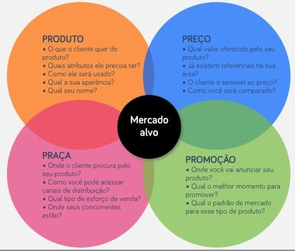

# 8P - Mix de Marketing Completo

- [4P](https://pt.wikipedia.org/wiki/Marketing_mix)
  **Notas:** <https://pt.wikipedia.org/wiki/Marketing_mix>

  <https://blog.pucconsultoriajr.com.br/4ps-do-marketing/?gclid=CjwKCAjwgISIBhBfEiwALE19Sd8G3G5BPvlsPKWVIG8ywA9l7IZEqjT02Me1zJdhgbtwF-QixjFC8BoCgVEQAvD_BwE>

  <https://neilpatel.com/br/blog/4-ps-do-marketing/>

  - Produto
    **Notas:** Produto (objeto)
    É tudo o que se refere aos "bens e serviços" que uma empresa disponibiliza ao mercado-alvo, para "atenção, aquisição, uso ou consumo" (p. 500), tendo em vista a satisfação de necessidades do cliente. Compreende um conjunto de benefícios, com elementos tangíveis e intangíveis, resultando na soma da satisfação física e psicológica do consumidor quando realiza uma compra. Inclui bens, serviços, ideias, pessoas, organizações, ou a combinação destes elementos.

    Três níveis de produto têm de ser pensados aquando do seu plane(j)amento:

    Produto central ou básico (Core product): corresponde aos benefícios procurados pelo consumidor quando compra um produto;
    Produto real (Actual product): resulta da transformação do benefício básico num produto real, através de características como qualidade, marca, características, estilo e embalagem;
    Produto ampliado ou aumentado (Augmented product): compreende serviços e benefícios adicionais, acrescentados ao produto básico e real, como serviços pós-venda, entrega ao domicílio, crédito, instalação e garantia.
    Uma possível classificação de produtos distingue entre produto de consumo e produto industrial. Produtos de consumo são aqueles adquiridos pelo consumidor final, para consumo pessoal. A classificação destes produtos pode incluir:

    Produtos de conveniência (Convenience products): são bens ou serviços comprados frequentemente, normalmente, com preços baixos e que envolvem, por parte do consumidor, pouco esforço financeiro e risco de que o produto não providencie os benefícios procurados;
    Produtos de aquisição ou de compra comparada (Shopping products): os compradores estarão dispostos a dispensar uma significativa quantidade de tempo e dinheiro na procura e avaliação destes produtos, comparando alternativas em termos de qualidade, preço, estilo e adequação (e.g., tamanho);
    Produtos de especialidade (Speciality products): são bens para os quais o consumidor está disposto a realizar um certo esforço financeiro para o adquirir, pelo facto deste apresentar "características únicas" (p. 503). Os consumidores não escolhem por entre as alternativas do mercado, mas procuram, especificamente, determinada marca. É o produto que envolve maior esforço e risco.
    Produtos industriais são adquiridos para futuro processamento, i.e., são utilizados na produção de outros bens ou serviços. Podem ser classificados como:

    Materiais e partes (Raw materials and parts): constituídos por matérias-primas, que se tornam parte do produto final, através do seu processamento ou como componentes (e.g., trigo, algodão, hortícolas), ou de produtos e partes manufacturados, nos quais se incluem "materiais componentes" (e.g., ferro, cimento, cabos), passíveis de futuro processamento, e "partes componentes" (e.g., pequenos motores, pneus), que, geralmente, irão compôr o produto final sem mais modificações;
    Itens de capital (Capital itens): distinguindo-se entre instalações - construções como fábricas e escritórios, e equipamento fixo como geradores, elevadores ou computadores - e equipamento acessório - ferramentas, equipamentos portáteis e equipamento de escritório. Estes produtos não integram o produto final, sendo a sua função a de colaborar na sua produção ou nas operações da empresa;
    Fornecimentos e serviços (Supplies and services): os fornecimentos compreendem fornecimentos operacionais (e.g., papel, lubrificantes, lápis) e material de reparação e manutenção (e.g., tintas, pregos), enquanto os serviços incluem serviços de manutenção e reparação (e.g., reparação de um computador) ou serviços de aconselhamento (e.g., serviços jurídicos, consultoria, publicidade).

    - O que é
    - Posicionamento
    - Detalhamento
  - Preço
    **Notas:** Preço
    É a quantia monetária cobrada na aquisição de um bem ou serviço, i.e., aquilo de que se abdica na aquisição de um produto, ou, em sentido mais lato, "a soma de todos os valores que os consumidores trocam pelos benefícios de ter ou usar um bem ou serviço" (p. 639) e serve como medida de avaliação entre diferentes alternativas de produtos, quer em termos do sacrifício que se faz na sua compra (e.g., o custo monetário ou temporal), quer como forma de inferir acerca da sua qualidade.
    O processo de definição de um preço para o produto, incluindo descontos e financiamentos, tem em vista o impacto não apenas econômico, mas também psicológico de uma precificação. O responsável por essa área deve cuidar da lista de preços e passar aos vendedores os descontos por quantidades adquiridas e, principalmente, se o preço será competitivo diante da concorrência.

    A definição do preço de um produto deve ter em conta o valor criado para o consumidor. No entanto, há empresas que produzem produtos com qualidade, mas com pouco valor para o cliente, lógica essa que está por trás da definição de preços baseados nos custos (Cost-based pricing). Duas formas comuns de definição de preços segundo este método são:

    Preço custo-mais (Cost-plus pricing): o preço é estabelecido acrescentando, aos custos de produção, uma margem de lucro fixa, ou uma percentagem desses mesmos custos;
    Preço mark-up (Mark-up pricing): consiste no cálculo do preço do produto através de uma percentagem sobre os custos ou sobre o preço de venda, que permita fazer face aos custos correntes (overhead costs) e atingir determinada taxa de retorno, pré-definida pela empresa.
    Quanto à definição de preço baseado no valor (value-based pricing), que reverte o processo de definição de preço através dos custos, centrando-a no cliente, i.e., tem em conta a sua percepção de valor, distingue-se entre:

    Preço pelo justo valor (Good-value pricing): consiste em oferecer a "combinação essencial" (p.641) de qualidade ao seu produto a um preço justo, o que envolve estabelecer preços "razoavelmente baixos" (p. 248) mas, ainda assim, com elevada qualidade, o que pode envolver a introdução de versões menos caras de produtos já estabelecidos no mercado ou redesenhar o produto no sentido de oferecer maior qualidade pelo mesmo preço ou a mesma qualidade a um preço inferior;
    Preço pelo valor acrescentado (Value-added pricing): a empresa acrescenta valor à sua oferta de mercado, diferenciando o seu produto, proporcionado um retorno do investimento "adequado" (p. 45), justificando a opção pelo produto, com o objectivo de evitar uma guerra de preços entre empresas concorrentes.
    Estabelecer o preço deverá ter em conta, também, o ciclo de vida do produto. Na fase do lançamento de um produto no mercado, particularmente no que diz respeito a ofertas inovadoras, a empresa pode escolher entre duas estratégias:

    Preço de desnatação do mercado (Market-skimming pricing): a empresa, quando lança um novo produto, estabelece, inicialmente, preços elevados no sentido de tirar partido de segmentos do mercado mais propensos a novos produtos ou cujo poder de compra faça destes menos sensíveis ao preço, de forma a recuperar os custos de desenvolvimento;
    Preço de penetração no mercado (Market-penetration pricing): consiste em estabelecer um preço baixo para um novo produto, abaixo do preço dos produtos concorrentes, de forma a atrair o maior número de clientes no menor espaço de tempo possível, tirando partido de economias de escala e da capacidade produtiva da empresa.
    No entanto, a opção por estabelecer o preço quando este integra um conjunto de produtos pode levar a empresa a optar por entre várias estratégias de definição de preço, visando a maximização dos lucros do seu mix, tais como:

    Preço da linha de produtos (Product line pricing): ao invés de definir o preço "produto-a-produto" (p. 332), a opção pode passar por estabelecer ou ajustar o preço do conjunto de ofertas que constituem a sua linha de produtos (product line), tendo em conta as suas diferenças ao nível de custos, a avaliação dos consumidores e preços concorrentes;
    Preço do produto cativo (Captive-product pricing): o preço do produto básico é baixo, enquanto que o preço de produtos necessários ao seu funcionamento ou para a melhoria da sua performance são elevados;
    Preço em duas partes (Two-part pricing): no caso dos serviços, o seu preço pode ser dividido numa parte fixa e noutra variável, consoante a frequência da sua utilização. O montante fixo deve ser baixo o suficiente para incentivar a compra, sendo que o lucro advém das taxas de utilização;
    Preço pelo conjunto (Product-bundle pricing): consiste em combinar vários produtos e colocar este conjunto no mercado a um preço reduzido, juntando dois ou mais produtos, habitualmente complementares, e estabelecer um preço único, frequentemente mais baixo do que o preço a ser cobrado caso esses produtos fossem adquiridos individualmente

    - Orçamentos
    - 6M
    - Forma de Pagamento
    - Venda Avulsa
    - Condições Especiais
    - Viabilidade de Compra
  - Ponto
    **Notas:** Praça (Distribuição)
    Preocupa-se com a disponibilização dos produtos aos seus mercados consumidores. Produzir um produto e disponibilizá-lo ao consumidor final exige a existência de uma rede de relações entre clientes, fornecedores e revendedores, integrados na cadeia logística da empresa. Assim, a distribuição refere-se aos canais através dos quais o produto chega aos clientes e inclui pontos de vendas, pronta-entrega, horários e dias de atendimento e diferentes vias de compra.
    A cadeia de distribuição inclui as "actividades necessárias à transformação de matérias primas em bens ou serviços e colocá-las nas mãos dos consumidores ou clientes empresariais" (p. 448). A gestão da cadeia de distribuição tem como objectivo sincronizar as exigências dos clientes com o fluxo de matérias primas dos fornecedores, que se traduz em relações duradouras entre os membros da cadeia logística, de forma a reduzir ineficiências, custos e maximizar lucros. O movimento do produto através da cadeia logística é facilitado através dos canais de distribuição ou canais de marketing, definidos como "o conjunto de organizações interdependentes envolvidas no processo de disponibilizar o produto para uso ou consumo" (p. 468). A maioria desses canais possui intermediários, (também denominados como membros do canal, revendedores ou agentes), que facilitam o processo de distribuição, entre o produtor e o consumidor. O número de intermediários define a extensão do canal de distribuição:

    Canal de marketing directo (ou venda directa; Direct distribution channel): consiste na venda do produto directamente ao consumidor, sem a existência de intermediários (e.g., venda por catálogo ou compras online, "lojas de fabrica" e os próprios prestadores de serviço que executam o serviço diretamente ao consumidor, como os cabeleireiros e dentistas);
    Canal de marketing indirecto (Indirect distribution channel): contém, pelo menos, um intermediário (e.g., grossista ou retalhista, supermercados, conveniências e até as próprias livrarias).
    Na tentativa de racionalizar custos, controlar os canais de distribuição, organizar o trabalho de cada canal, estabilizar os fornecimentos e aumentar a coordenação dos seus integrantes, são possíveis diversos tipos de acordos entre estes:

    Sistema convencional de marketing (Conventional marketing system): é um sistema multinível de organização de canais de distribuição, no qual os intervenientes agem de forma independente dos demais, sendo que a relação se baseia, simplesmente, na compra e venda uns aos outros. Nenhum dos membros tem muito controlo sobre os restantes, procurando apenas maximizar os seus próprios lucros;
    Sistema de integração vertical (Vertical marketing system): é um sistema no qual se verifica uma "cooperação formal" (p. 463) entre vários canais, como produtores, grossistas e/ou retalhistas, no sentido de maximizar a eficiência dos canais de distribuição, reduzindo custos, através de um conjunto de acordos orientados para "a produção e distribuição de um produto ou conjunto de produtos específicos" (p. 12). A sua gestão encontra-se centralizada e podem ser integrados, controlados e contratuais;
    Sistema de integração horizontal (Horizontal marketing system): ocorre quando duas ou mais empresas do mesmo nível do canal de distribuição acordam trabalhar em conjunto, de forma provisório e permanenteinvestindo recursos, no sentido de tirar partido de uma oportunidade de negócio.
    O número de membros do canal a ser utilizado em cada nível do mesmo define a sua amplitude, na qual três escolhas são possíveis:

    Distribuição intensiva (Intensive distribution): consiste em disponibilizar o produto no maior número de locais de venda possível, com o objectivo de maximizar a cobertura do mercado. É utilizada, sobretudo, para bens de conveniência;
    Distribuição exclusiva (Exclusive distribution): quando o produtor, intencionalmente, limita o número de intermediários que distribuem os seus produtos numa determinada área geográfica, sobretudo quando se trata de produtos comprados esporadicamente, com elevado preço e de elevada qualidade (e.g., carros de luxo);
    Distribuição selectiva (Selective distribution): o produtor utiliza apenas alguns intermediários na distribuição, sendo particularmente utilizado no caso de produtos de aquisição, cujo modelo de negócio obriga a uma distribuição mais intensa do que a distribuição exclusiva mas cujos custos de venda e distribuição ou questões relacionadas com a diferenciação do produto tornam a distribuição intensiva desadequada, permitindo quer uma boa cobertura do mercado quer um maior controlo da cadeia de distribuição.

    - Venda
    - Distribuição
    - Criação
    - Produção
    - Lançamento
    - Pesquisa
  - Promoção
    **Notas:** Promoção (Comunicação)
    A promoção ou comunicação é utilizada para “informar, persuadir e lembrar os potenciais compradores de um produto, com o propósito de influenciar a sua opinião ou fomentar uma resposta” (p. 225), resultando “a coordenação dos esforços de comunicação no sentido de influenciar atitudes e comportamentos” (p. 350). Concretiza-se através de um conjunto de ferramentas que mistura publicidade, promoção de vendas, relações públicas, venda pessoal, marketing directo e online marketing que a empresa utiliza, no sentido de comunicar a sua proposta de valor, desenvolver e manter relações favoráveis com o cliente, informando-o e persuadindo-o, de forma a melhor aceitar o produto da empresa, fomentando, assim, a procura.

    Uma vez que os clientes entram em contacto com a oferta de uma empresa através de vários pontos de contacto, pelos quais a empresa pretende fazer passar a sua mensagem, torna-se necessário transmitir uma mensagem clara, consistente e convincente acerca da empresa e das suas marcas, através da comunicação integrada de marketing, de forma a evitar que o consumidor absorva “mensagens conflituosas de diferentes fontes que podem resultar em imagens confusas sobre a empresa, posicionamentos da marca e relações com o consumidor” (p. 696) e maximizar o impacto no consumidor.

    De entre as principais ferramentas de promoção encontram-se:

    Propaganda (Advertising): é uma forma paga,não pessoal e unidireccional de promoção de ideias, bens, serviços ou pessoas. Os principais vaículos da propaganda são os mass média (e.g., televisão, rádio, imprensa escrita, outdoors). Tem como vantagens o facto de atingir um elevado número de pessoas de um só vez, tornando o custo por contacto reduzido, embora os custos totais de investimento tendam a ser elevados e a empresa tem controlo sobre a mensagem transmitida. No entanto, a mensuração dos seus resultados pode ser difícil e pode ser pouco eficiente como meio de atingir determinados mercados-alvo;
    Promoção de vendas (Sales promotion): consiste em incentivos de curto-prazo à compra ou venda de um produto ou serviço, (e.g., amostras grátis, cupões, concursos, prémios), com o objectivo de estimular a sua comercialização, encorajando, por exemplo, a aquisição de novos produtos ou chamando a atenção de clientes mais sensíveis ao preço;
    Relações públicas (Public relations): consiste em manter relações com os diversos públicos (e.g., consumidores, fornecedores, accionistas, agentes governamentais, empregados e a comunidade na qual a empresa opera) com os quais a empresa lida, de forma a criar e a manter uma boa imagem sobre a empresa, a fim de obter boa publicidade, definida como informação pública, não paga, sobre a empresa ou a sua proposta de valor sob a forma de notícia num veículo de mass média, mas também trabalhar o consumidor acerca dos objectivos da empresa, introduzir novos produtos e colaborar nas vendas. Para além disso, preocupa-se em apresentar notícias negativas sobre a empresa na perspectiva o mais optimista possível, procurando resolver situações de conflito e acordo entre as partes
    Venda pessoal (Personal selling): ocorre quando é a própria força de vendas da empresa a comunicar os seus produtos, numa relação diática entre o vendedor e comprador, que tentam fazer valer os seus objectivos (o vendedor procura maximizar receitas e lucros, enquanto o comprador pretende minimizar custos). Apesar de ser mais cara do que a propaganda, é, geralmente, mais eficaz no sentido de fomentar a compra;
    Marketing directo (Direct marketing): consiste na comunicação da empresa directamente a um indivíduo pertencente ao seu mercado-alvo, através de diversos média não pessoais (e.g., televisão, rádio, imprensa escrita, telefone `[telemarketing]`, correio, e-mail ou websites, catálogos);
    Online Marketing: é a comunicação realizada através da internet. A internet permite uma comunicação em tempo real com o consumidor, através dos websites criados pelas próprias empresas ou pelas redes sociais (e.g., e-commerce).
    O processo de comunicação pretende acompanhar o processo de compra desde a pré-venda até à pós-venda. Começa com uma fonte (ou emissor) que é uma pessoa (e.g., vendedor) ou empresa que pretende partilhar uma mensagem com o seu mercado ou audiência. Essa mensagem, que que expressa as ideas do emissor, é transformada em “sinais e símbolos” (p. 407), transformação essa denominada por processo de codificação, a fim de ser descodificado pela sua audiência, i.e., o receptor  (ou destinatário) da mensagem.

    A mensagem é partilhada com o receptor através de canais de comunicação (ou média), através do qual a mensagem se movimenta da fonte ao receptor. O processo de descodificação transforma os sinais e símbolos em “conceitos e ideias” (p. 408), atribuindo-lhes significado. Quando a mensagem codificada pela fonte difere daquela descodificada pelo receptor, significa que existe ruído, considerado como aquilo que reduz a clareza da comunicação. A resposta do receptor à mensagem corresponde ao feedback relativo à fonte, evidenciando a natureza diática do processo. Este, por sua vez, é codificado, enviado através de um canal de comunicação e descodificado pela fonte, a fonte original do processo.

    A empresa pode escolher entre duas estratégias de comunicação, as estratégias push ou pull:

    Estratégia push (Push strategy): que consiste em empurrar o produto, através de vários canais de marketing, pelos vendedores e distribuidores para os clientes, convencendo os canais a aliciar os seus clientes a comprarem o produto da empresa. Assim, o produtor promove a sua oferta ao canal de distribuição imediatamente abaixo na cabeia de distribuição (e.g., grossista) e assim, sucessivamente, até ao cliente final;
    Estratégia pull (Pull strategy): a empresa dirige as suas acções directamente ao consumidor final com o objectivo de fomentar a procura pelo produto, motivados, por exemplo, por uma forte pressão publicitária ou promocional. Assim, são os clientes que exigem o produto aos retalhistas que, por sua vez, o procuram nos grossistas e estes aos produtores.

    - Rádio
      - Spot
      - Jimgle
      - Comunicado
    - TV
      - VT 30"
      - VT 15"
    - Vídeo Institucional
    - Book
    - Folders
    - Mala Direta
    - Cartão de Visita
    - Papelaria Básica
    - Palestras
    - Telemarketing
      - Ativo
      - Passivo
    - Visitas
    - E-Mkt
    - Mail list
    - Merchandising
      - Papel de Parede
      - Proteção de Tela
      - Display
      - Ilha
      - Calendário
        - Mesa
        - Parede
      - Blocos de Rascunho
      - Brindes
        - Canetas
        - Imã
    - Página de Internet
      - Institucional
      - Promocional
      - e-comerce
      - etc
    - Cadastro nos Sites de Busca
    - Cadastro em serviços Web e Guias Regionais
    - Palestras
    - Eventos
