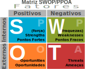

# SWOT / PPOA / FOFA

Análise SWOT ou Análise FOFA (Forças, Oportunidades, Fraquezas e Ameaças em português) é uma técnica de planejamento estratégico utilizada para auxiliar pessoas ou organizações a identificar forças, fraquezas, oportunidades, e ameaças relacionadas à competição em negócios ou planejamento de projetos. Destina-se a especificar os objetivos de riscos do negócio ou projeto, e identificar os fatores internos e externos que são favoráveis e desfavoráveis para alcançar esses objetivos. Usuários da análise SWOT frequentemente perguntam e respondem questões para gerar informações significativas para cada categoria, de maneira a tornar a ferramenta útil e identificar sua vantagem competitiva. SWOT tem sido descrita como uma ferramenta de tentativa-e-erro de planejamento estratégico , mas também tem sido criticada por suas limitações (ver Limitações).

A análise SWOT é uma ferramenta utilizada para realizar análise de cenários (ou ambientes), como base para gestão e planejamento estratégico de uma corporação ou empresa; devido a sua simplicidade, também pode ser utilizada para qualquer tipo de análise de cenário, desde a criação de um blog à gestão de uma multinacional. Ela veio da escola de Design e é simples e informal.

A Análise SWOT é um sistema simples para posicionar ou verificar a posição estratégica da empresa no ambiente em questão. A técnica é creditada a Albert Humphrey, que foi líder de pesquisa na Universidade de Stanford nas décadas de 1960 e 1970, usando dados da revista Fortune das 500 maiores corporações.

De acordo com Chiavenato o objetivo da matriz é cruzar oportunidades e ameaças dentro do ambiente externo das organizações e ter uma analise de pontos fortes e fracos. É utilizado como um indicador para demostrar a situação organizacional é assim desenvolver ações de melhorias

<https://pt.wikipedia.org/wiki/An%C3%A1lise_SWOT>

- **PPOA**
  - **Ambiente Interno**: Integração dos Processos, Padronização dos Processos, Eliminação de redundância, Foco na atividade principal.

    O ambiente interno pode ser controlado pelos dirigentes da empresa que não é muito difícil de ser entendido, uma vez que ele é resultado das estratégias de atuação definidas pelos próprios membros da organização. Desta forma, durante a análise, quando for percebido um ponto forte, ele deve ser ressaltado ao máximo; e quando for percebido um ponto fraco, a organização deve agir para controlá-lo ou, pelo menos, minimizar seu efeito.

    - **Pontos Fortes**: Facilidades que a empresa, o ramo de negócio ou o produto oferece de modo que o empresário não consiga interferir.
      - _Vantagens internas_ da empresa em relação às empresas concorrentes.
      - _Ação_: Tirar Partido
    - **Pontos Fracos**: Dificuldades que a empresa, o ramo de negócio ou o produto oferece de modo que o empresário não consiga interferir.
      - _Desvantagens internas_ da empresa em relação às empresas concorrentes.
      - _Ação_: Minimizar efeitos
  - **Ambiente Externo**: Confiabilidade e Confiança nos dados, Informação imediata de apoio à Gestão e Decisão estratégica, Redução de erros.

    O ambiente externo está totalmente fora do controle da organização. Mas, apesar de não poder controlá-lo, a empresa deve conhecê-lo e monitorá-lo com frequência de forma a aproveitar as oportunidades e evitar as ameaças. Evitar ameaças nem sempre é possível, no entanto, pode-se fazer um planejamento para enfrentá-las, minimizando seus efeitos.

    - **Oportunidades**: Objetivos, ideias de melhoria, fechamento de negócios etc. Todas as oportunidades que influenciam o negócio e que são iniciadas e gerenciadas pelos aministradores.
      - _Aspectos positivos_ da envolvente com potencial de fazer crescer a vantagem competitiva da empresa.
      - _Ação_: Aproveitar
    - **Ameaças/Problemas**: Problemas ou Ameaças sofridas pela empresa, produto ou negócio, mas que o empresário possa ter soluções exequíveis para questão e contorná-lo.
      - _Aspectos negativos_ da envolvente com potencial de comprometer a vantagem competitiva da empresa.
      - _Ação_: Mitigar
- **SWOT**
  - **Strengths** = Pontos Fortes
  - **Weaknesses** = Pontos Fracos
  - **Opportunities** = Oportunidades
  - **Threats** = Ameaças
- **FOFA**
  - **Forças** = Pontos Fortes
  - **Oportunidades** = Oportunidades
  - **Fraquezas** = Pontos Fracos
  - **Ameaças** = Ameaças
