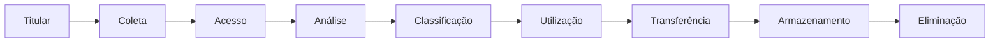

# LGPD

## Tipos de dados e como tratá-los

### Classificação de dados

- Dados pessoais: São informações relacionadas à pessoa física identificada ou identificável, como: nome, CPF, estado civil, gênero, telefone, endereço residencial, endereço de e-mail, IP, hábitos de consumo, dados de localização, matrícula funcional, histórico de navegação e score de crédito.
  Dados de pessoas jurídicas, como CNPJ ou razão social, não entram na categoria de dados pessoais.
  A proteção dos dados pessoais dos nossos clientes é fundamental!
- Dados pessoais sensíveis: São dados sobre a origem racial ou étnica, convicção religiosa, opinião política, filiação a sindicato ou organização de caráter religioso, filosófico ou político, dado referente à saúde ou à vida sexual, dado genético ou biométrico, quando vinculado a uma pessoa natural. Saiba que essa é a lista completa das categorias de dados que são consideradas como sensíveis para a LGPD.
  Se liga! A definição de dados pessoais sensíveis está prevista em lei, portanto, nem tudo que parece sensível recebe tal classificação na LGPD. Então, por exemplo, um dado financeiro possui um grau mais elevado de risco no seu tratamento, mas para a LGPD ele é considerado apenas como um dado pessoal geral.
  Há alguns dados que, apesar de não serem classificados como sensíveis, podem ser considerados de maior risco em seu tratamento, dependendo de fatores como volumetria, impacto sobre os direitos dos titulares, entre outros.​
  Os dados aos quais nos referimos são: dados de crianças, adolescentes ou idosos, dados financeiros, dados de autenticação em sistemas e dados protegidos por sigilo legal, judicial ou profissional.
- Dados anonimizados: São dados que não permitem identificar ou tornar identificável uma pessoa. Entenda a diferença entre os dados pessoais e os dados anonimizados nas tabelas.
  - Dados Pessoais:

    | Nome           | CPF            | Faixa eEária |
    | -------------- | -------------- | ------------ |
    | Ana Silva      | 123.456.789-11 | 30           |
    | Leonardo Souza | 987.654.321-99 | 38           |

  - Dados Anoniizados:

    | Nome | CPF | Faixa eEária       |
    | ---- | --- | ------------------ |
    | A.S. |     | Entre 25 e 35 anos |
    | L.S. |     | Entre 36 e 45 anos |

- Dados pseudonimizados: São dados que, que por si só, não permitem a associação direta ou indireta a uma pessoa, exceto pelo uso de informação adicional mantida separadamente. Por exemplo, o número do cartão de crédito.
  - Dado pessoal: 1234 1234 1234 1234
  - Dado pseudonimizado: XXXX 1234

### Tratamento de dados

O tratamento de dados é toda operação realizada com dados pessoais, como as que se referem à coleta, utilização, acesso, transmissão, processamento, arquivamento e armazenamento.

Veja seu ciclo da vida:

> Você não precisa necessariamente percorrer todo o ciclo de vida para considerar que está tratando um dado.
>
> Então, quando você acessa um sistema, durante a execução de uma atividade, que tenha dados de clientes, por exemplo, ainda que você apenas acesse informações do cliente, você estará tratando dados pessoais.

### Direito dos titulares

Com a LGPD, os titulares passam a ter mais controle sobre o tratamento de seus dados. Os titulares tem os seguintes direitos:

- Confiormação: O titular pode solicitar a confirmação da existência de tratamento dos dados pessoais.
- Acesso: O titular pode solicitar uma **cópia gratuita** de seus dados pessoais coletados.
- Eleliminação: O titular tem o direito de solicitar a **eliminação de seus dados pessoais** quando não forem mais necessários, quando forem excessivos ou estiverem sendo tratados em desconformidade com a lei. Contudo, a empresa poderá manter os dados pessoais, em situações expressamente previstas em lei.
- Portabilidade: Permite o titular transferir seus dados pessoais a **outro prestador de serviço**, como outro fornecedor de serviços de telecomunicações.
- Informação: O titular tem o direito de ter acesso a informações sobre o **uso compartilhado** de seus dados com terceiros.
- Correção e Atualização: Ao verificar situações de inexatidão, desatualização ou de existência de informações incompletas sobre si mesmo, o titular pode solicitar a correção de seus dados pessoais.
- Revogação de Consentimento: Quando um titular consente o tratamento de seus dados pessoais, ele deve sempre ter a opção facilitada de revogar o consentimento.

### Fundamentos da LGPD

Chegou a hora de conhecer os diversos princípios da LGPD, são eles: Finalidade, Adequação, Necessidade, Livre acesso, Qualidade de dados, Transparência, Segurança, Prevenção, não descriminação e Prestação de contas. Veja a seguir os que se destacam:

- Finalidade: O tratamento de dados deve ser realizado para propósitos legítimos, específicos, explícitos e informados ao titular
- Necessidade: O tratamento de dados deve ser limitado à mínima quantidade de informações necessárias para a realização de suas finalidades. Também é conhecido como princípio da minimização de dados
- Transparência: As informações sobre o tratamento dos dados e os agentes envolvidos devem ser claras, precisas e facilmente acessíveis
- Segurança: Os dados pessoais devem ser protegidas contra acessos não autorizados, vazamentos acidentais ou ilícitos, destruição, perda, alteração ou comunicação indevida
- Prevenção: Devem haver medidas para prevenir danos que possam ocorrer pelo tratamento de dados pessoais
- Não discriminação: Os dados devem ser protegidos para impossibilitar o tratamento para fins discriminatórios, ilícitos ou abusivos

### Sanções

No caso da ocorrência de infrações à legislação, como vazamentos ou violações aos dados pessoais, poderão ser aplicadas sanções como multas e penalidades à TIM, em virtude de uma ação ou omissão ou, ainda, por fato de terceiros que atuam em seu nome.

É importante entender que violações que envolvam dados causam risco à imagem, com impacto negativo à reputação e percepção de públicos estratégicos no mercado, uma vez que a empresa pode ser percebida como negligente em relação à proteção dos dados de titulares e ao cumprimento da legislação.

- Advertência
- Pubicização da infração
- Suspensão parcial ou total da atividade de tratamento de dados
- Multa dimples ou diária de até 2% do faturamento bruto da empresa, limitado a 50MM por infração
- Bloqueio ou eliminação dos dados a que se refere a infração
- Proibição parcial ou total do exercício das atividades ao tratamento de dados

## Papeis e responsabilidades

### Agentes de tratamento

Você sabe quem são os responsáveis pelo tratamento de dados em sua empresa? Entenda tudo sobre os agentes de tratamento e suas responsabilidades. Vamos lá!

- Controlador: É a pessoa natural ou jurídica, de direito público ou privado, a quem compete as decisões referentes ao tratamento de dados pessoais. Ele define, por exemplo:
  - Quais dados serão tratados;
  - Como serão coletados;
  - Qual a finalidade do tratamento;
  - Qual o período de tratamento.
- Operador: É a pessoa natural ou jurídica, de direito público ou privado, que realiza o tratamento de dados pessoais em nome do controlador, devendo seguir as suas orientações ao realizar o tratamento.
  O Operador não tem autonomia sobre os dados, não podendo utilizá-los para finalidades diversas das definidas pelo Controlador.

### Papeis

- Colaboradores
- DPO (Encarregado)
- Privacy Leader
- ANPD
- Empresa

### Papéis e responsabilidades: Emrpesa

A TIM é o agente de tratamento, que cuida da privacidade e da segurança dos dados
pessoais sob o seu controle. Veja suas responsabilidades a seguir.

- Decisão: Tomar decisões e realizar o tratamento de dados pessoais.
- Parceiros: Certificar-se de que seus fornecedores e parceiros também cumpram a LGPD.
- Registros: Manter registo das operações de tratamento de dados pessoais.
- Atendimento a titulares: Garantir o atendimento das solicitações relativas à privacidade e proteção de dados dos titulares.

- Governança: Definição das finalidades, formas e duração do tratamento de dados pessoais.
- Segurança: Aplicação das medidas de segurança e prevenção para proteger dados pessoais.

### Papéis e responsabilidades: Pessoas colaboradoras

Tormar cuidado no acesso e compartilhamento de dados

Papéis e responsabilidades: Encarregado (DPO)

O Data Protection Officer – DPO, ou Encarregado pelo tratamento de dados pessoais, tem a função exercida pela VP de Legal & Corporate Affairs. Veja a seguir suas responsabilidade.

1. Solicitações: Receber solicitações e comunicações dos titulares, prestar esclarecimentos e adotar providências, se necessário.
2. Comunicação: Ser o canal de comunicação entre o controlador e Autoridade Nacional de Proteção de Dados.
3. Orientação: Orientar os colaboradores, prestadores de serviços e parceiros da TIM sobre a proteção de dados.
4. Demais atividades: Executar as demais atividades que lhe possam ser atribuídas pela Autoridade Nacional de Proteção de Dados.

### Papéis e responsabilidades: Privacy Leader

Vamos descobrir que é a pessoa que tem a função de nível mais alto de reporte no organograma TIM. Atua suportando o Escritório de Privacidade no monitoramento e cumprimento dos requisitos do Programa de Privacidade e Proteção de Dados em sua estrutura organizacional, tendo ainda como principais atribuições e responsabilidades:

- Indicar em sua estrutura organizacional o(s) Privacy Champion(s) que serão pontos focais do Escritório de Privacidade para o tema privacidade.
- Suportar os Privacy Champions em processos que envolvam tratamento de dados pessoais, garantindo condições de adaptação das rotinas para atendimento às atividades de privacidade.
- Coordenar atividades para o cumprimento das políticas internas, legislação e aspectos regulatórios vigentes sobre o tema de proteção de dados, mediante orientação do Escritório de Privacidade.
- Orientar e garantir que as suas equipes reportem ao Escritório de Privacidade da TIM processos que possuam tratamento de dados pessoais.
- Analisar e aprovar políticas internas sobre o tema de proteção de dados, submetidas pelo Escritório de Privacidade.
- Adotar o privacy by design na definição de projetos e estratégias de sua diretoria.
- Colaborar com o Escritório de Privacidade na disseminação de cultura organizacional que valorize a proteção de dados e a privacidade.

> As funções que envolvem atividades relacionadas a novas iniciativas e parcerias de Data Monetization terão, obrigatoriamente, representantes formalmente nomeados.

### Papéis e responsabilidades:  Privacy Champions

O Privacy Champion é o representante do Privacy Leader em nível operacional. Ele deve ser colaborador próprio, com o cargo mínimo de Especialista, com visão geral de todos os tratamentos de dados realizados pela área, podendo ser indicado mais de um representante pelo Privacy Leader, a depender da complexidade da estrutura da área. Deve ser orientado e treinado para executar atividades operacionais atribuídas para o cumprimento do Programa de Privacidade e Proteção de Dados da TIM, no que tange a sua estrutura organizacional.

Terá como principais atribuições e responsabilidades:

1. Atuar como ponto focal operacional de sua função para tratativa de temas de Privacidade e Proteção de Dados, diretamente com o Escritório de Privacidade da TIM.
2. Suportar o Escritório de Privacidade na aprovação e implementação de políticas internas sobre o tema de privacidade.
3. Comunicar e prestar apoio, quando necessário, nos casos de incidentes de segurança envolvendo dados pessoais.
4. Auxiliar no fortalecimento da cultura de proteção de dados para os demais colaboradores da empresa, principalmente de sua função.
5. Identificar os riscos de privacidade dos processos com maior precisão e comunicar o Escritório de Privacidade.
6. Auxiliar na implementação do privacy by design.

### Papéis e responsabilidades: Privacy Office

Aqui na TIM, existe uma equipe dedicada exclusivamente à proteção dos dados pessoais: o Privacy Office, localizado no Departamento de Legal and Corporate Affairs. Essa equipe realiza atividades essenciais para garantir a conformidade com a LGPD e assegurar que a TIM atenda adequadamente às suas obrigações legais.

As principais funções desempenhadas por esse time, são:​

1. Governança e Políticas​
   - Implementar, emitir e atualizar políticas e procedimentos de privacidade.​
   - Designar papéis e responsabilidades para uma gestão eficiente dos processos internos.​
   - Aplicar as metodologias Privacy by Design e Privacy by Default.​

2. Conscientização e Cultura de Privacidade
Promover a conscientização sobre a cultura de privacidade entre colaboradores, fornecedores e parceiros comerciais.​

3. Atendimento e Relacionamento com Titulares​
   Acompanhar e monitorar solicitações dos titulares de dados, como clientes e colaboradores, através das linhas operacionais de atendimento.

4. Monitoramento de Tratamento de Dados​
   - Registrar e monitorar as operações de tratamento de dados realizadas na TIM.
   - Elaborar relatórios de impacto e executar testes de legítimo interesse para proteger dados pessoais.​
   - Monitorar continuamente contratos que tratem de dados.​

5. Segurança e Projetos​
   - Lidar com incidentes de segurança.​
   - Acompanhar projetos como backtests e pilotos e avaliar regulamentos em campanhas ou sorteios.​

6. Avaliação de Produtos e Fornecedores​
   - Realizar atividades de avaliação de produtos, como data monetization e a análise de I.A. privacidade.​
   - Realizar due diligence de privacidade em fornecedores.​
   - Monitorar continuamente os contratos que tratam dados pessoais.​

Esse time está à disposição para apoiar todas as pessoas colaboradoras. Caso surjam dúvidas sobre processos e atividades da sua área que envolvam o tratamento de dados como novos projetos, parcerias, aquisição de tecnologias, pesquisas com colaboradores ou qualquer outro tema relacionado, entre em contato com o Escritório de Privacidade.​

Envie um e-mail para privacy_office@tim.com.br ou utilize a ferramenta GPL.

### Inventário de contratos

Chegou a hora de conhecermos outros aspectos importantes para garantir a governança dos nosso contratos.

> O inventário de dados pessoais representa um mecanismo primordial para documentar o tratamento de dados pessoais realizados pela instituição em alinhamento ao previsto pelo art. 37 (LGPD).
>
> Se você possui algum contrato em sua área que ainda não foi atualizado com a cláusula de Proteção de Dados, providencie a atualização o mais breve possível. Em caso de um novo contrato ou renovação, lembre-se de realizar o inventário de contratos em: https://forms.office.com/r/imXeUNXsDp(opens in a new tab). Além disso, caso aconteça a transferência de dados pessoais para o exterior precisamos inventariar as operações de tratamento que envolvam envio de dados pessoais para fora do Brasil. Portanto, é fundamental contar com o compromisso de todos para que possamos assegurar que a TIM esteja em conformidade com a norma.
>
> **Para esclarecer o que pode representar transferência internacional, citamos alguns exemplos:**
>
> - A TIM contrata um fornecedor de nuvem que hospeda dados em um país estrangeiro;
>
> - A TIM contrata um perceiro para prestação de serviços, que recebe dados de clientes para execução das atividades, e precisa hospedar os dados em um país estrangeiro. Esse fornecedor não possui servidores próprios, e subcontrata terceiros para o tratamento dos dados.​
>
> Essa ação é fundamental para garantirmos a aderência da TIM à Lei Geral de Proteção de Dados.

### Papéis e responsabilidades: ANPD

Você sabia que a ANPD – Autoridade Nacional de Proteção de Dados é a guardiã, em nível nacional, do tema proteção de dados? Vamos entender um pouco mais sobre ela. A seguir, veremos suas responsabilidades.

- Diretrizes: Elaborar diretrizes e normas, definir padrões de segurança, acesso e transparência, fiscalizar os procedimentos de proteção de dados pessoais adotados pelas empresas, instaurar processos administrativos, realizar auditorias, apurar irregularidades e aplicar sanções em caso de infrações.
- Relatórios: Determinar ao controlador a elaboração de relatório de impacto à proteção de dados pessoais, nas operações de tratamento que possam representar alto risco.
- Conscientização: Conscientizar a população sobre as normas e as políticas públicas de proteção de dados pessoais e fornecer informações sobre medidas de segurança e direitos garantidos pela legislação.
- Fiscalização: Realizar auditorias ou determinar sua realização no âmbito da fiscalização, além de aplicar sanções em caso de tratamento de dados em desacordo com a legislação.​

## LGPD na Prática

1. Você está responsável pela área de benefícios da empresa. Ao revisar processos, você nota a existência de dados relacionados a origem racial, em um sistema acessado por todos os colaboradores da sua área. Como você classificaria esses dados?​
   - [x] a) Dados pessoais sensíve​is.
   - [ ] b) Dados pessoais.
2. Em uma atividade de rotina, a área de faturamento identifica a existência de dados financeiros em sua base de clientes, que precisa compartilhar com um fornecedor para providências de cobrança. Sobre os dados financeiros, a área classificou, no arquivo a ser compartilhado, como dados pessoais sensíveis. Essa classificação está correta?
   - [ ] a) Sim.
   - [x] b) Não.
3. Para a realização da sua atividade, você precisou salvar uma planilha contendo dados dos clientes da Região Norte no seu computador.  Você armazenou em um local seguro, com todas as autorizações necessárias e seguindo todas as políticas de segurança da informação. Considerando que você apenas armazenou para execução de atividade de rotina, isso vai ser considerado um tratamento de dados?​
   - [x] a) Sim​.
   - [ ] b) Não.
4. Você precisa imprimir um relatório que contém informações pessoais de clientes TIM. Quais cuidados devem ser tomados para evitar o vazamento de dados?
   - [ ] a) Descartar a impressão em um lixo comum, pois a LGPD diz respeito somente à dados armazenados no ambiente virtual.
   - [x] b) Adotar medidas de segurança para evitar acessos indevidos e garantir o descarte correto.
5. A pseudonimização é um processo pelo qual, a partir da utilização de meios técnicos razoáveis e disponíveis no momento do tratamento, um dado perde a possibilidade de associação, direta ou indireta, a um indivíduo. Essa afirmativa está correta?
   - [ ] a) Sim.
   - [x] b) Não.
6. Um cliente solicita as informações sobre o tratamento e compartilhamento de seus dados pessoais pela TIM. Qual ação deve ser tomada por nós, colaboradores?
   - [ ] a) Providenciar imediatamente o relatório com as informações que o cliente pediu, a fim de evitar sanções.
   - [x] b) Encaminhar a solicitação ao Privacy Office, da área de Legal & Corporate Affairs.
7. Você precisa de uma avaliação de Privacy Office em um projeto ou atividade em relação a Lei Geral de Proteção de Dados e Privacidade. O que você deve fazer?
   - [ ] a) Mandar um email para o seu gestor pedindo que ele encaminhe a solicitação para o time de Privacy Office.
   - [x] b) Abrir uma solicitação no GPL - Gestão de Privacidade do Legal, disponível na Home Page na nossa Intranet TIM UP.
8. Você possui um contrato de responsabilidade da sua diretoria que ainda não foi inventariado. O que você deve fazer?
   - [x] a) Acessar o link do formulário disponibilizado pela área de Privacy Office e realizar o inventário do contrato.
   - [ ] b) Mandar um e-mail para o seu gestor pedindo que ele encaminhe a solicitação de inventário para o time de Privacy Office.
