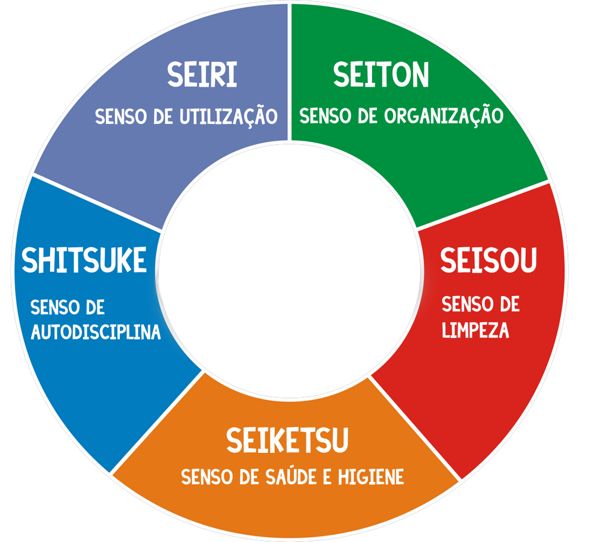

# 5S

Etapa inicial e base para implantação da qualidade total, a metodologia 5S é assim chamada devido à primeira letra de 5 palavras japonesas: Seiri (Classificação), Seiton (Ordem), Seiso (limpeza), Seiketsu (padronização), Shitsuke (Disciplina) .

<https://pt.wikipedia.org/wiki/5S>

- **Sensos**
  - **Seiri: Organização(Sorting)**: Ensina que devemos ter somente o necessário e na quantidade necessária e sem improvisações.
    - Classificar, mantendo somente o necessário na área de trabalho,  manter em um local distante itens com uso menos freqüente e descartar em definitivo itens desnecessários.
    - O Seiri luta contra o hábito de manter objetos ao seu lado somente porque serão úteis algum dia.
    - O Seiri ajuda a manter a área de trabalho arrumada,  melhora a busca e eficiência no retorno de informações e geralmente amplia espaço no local de trabalho.
  - **Seiton: Arrumação "orientação"(Systematyzing)**: Tem como principal objetivo ter locais definidos para cada coisa, e sempre que possível os recursos devem estar identificados, para que possa ter um acesso seguro e rápido.
    - Arranjo sistemático para o mais eficiente retorno.
    - Um bom exemplo do Seiton é um painel de ferramentas ( ver figura abaixo ).
    - Efetivar o Seiton significa, identificar locais, desenhar mapas de localização,  indexar arquivos físicos e virtuais de forma que todos os funcionários tenham e conheçam a forma de acesso, ou seja, é necessário que todos tenham as ferramentas as mãos.
  - **Seiso: Limpeza(Sweeping)**: Preza pela limpeza dos ambientes e instalações, e ambientes limpos facilitam a detecção de anormalidades.
    - Limpar.
    - Após o primeiro processo de limpeza quando implementado o **5S,** a permanência da limpeza diária é necessária para manter o desenvolvimento do programa.
    - A limpeza facilita a localização imediata de irregularidades no ambiente,  fator o qual passaria sem ser notado antes da implantação.
    - A limpeza regular é uma espécie de inspeção.
  - **Seiketsu: Padronização "Utilização"(Sanitizing)**: Também chamado de senso de higiene, saúde que tem uma ligação direta com a segurança;
    - Padronizar. Está é a ordem. Manter a saúde funcional.
      - Uma vez que os primeiros três S foram implantados, este é o momento da padronização, ou seja, manter as boas práticas de trabalho na área.
      - Sem isto, a situação cairá em um processo de abandono e os velhos hábitos retornarão. É importante um processo simples de padronização para desenvolver a estrutura e dar suporte a ela. É importante permitir que os funcionários juntem-se ao desenvolvimento dos processos de padronização.
    - É comum e providencial adotar neste momento atividades que aprimorem aspectos de saúde e qualidade de vida para o corpo de funcionários.
    - Os três primeiros S são executados em ordem.
    - O período de duração de cada um pode ser definido pela Equipe de coordenação do **5S**.
    - O Seiketsu ajuda a transformar o procedimento padrão  em uma coisa natural.
  - **Shitsuke: Disciplina(Self-disciplining)**: Autodisciplina. Este senso não se limita apenas aos 4 primeiros sensos, mas também que as normas de segurança e padrões da empresa devem ser criteriosamente cumpridos
  - Finalmente, manter vivos os 4 S.
  - Isto é necessário para manter o corpo funcional em educação constante visando a manter os processos padronizados.
  - Mostrar a melhora dos resultados através de gráficos, promover e agregar novas idéias assegurará que o processo mantenha-se vivo, expandindo-se para outros pontos da empresa.
  - O efeito da melhora contínua proporcionará menor desperdício, melhor qualidade e ganhos expressivos na administração do tempo.

- **Documentos**
  - [Programa 5 S.doc](docs/programa_5S.doc)
  - [5s.pdf](docs/5s.pdf)
  - [Ergonomia.pps](docs/ergonomia_slides.pps)
