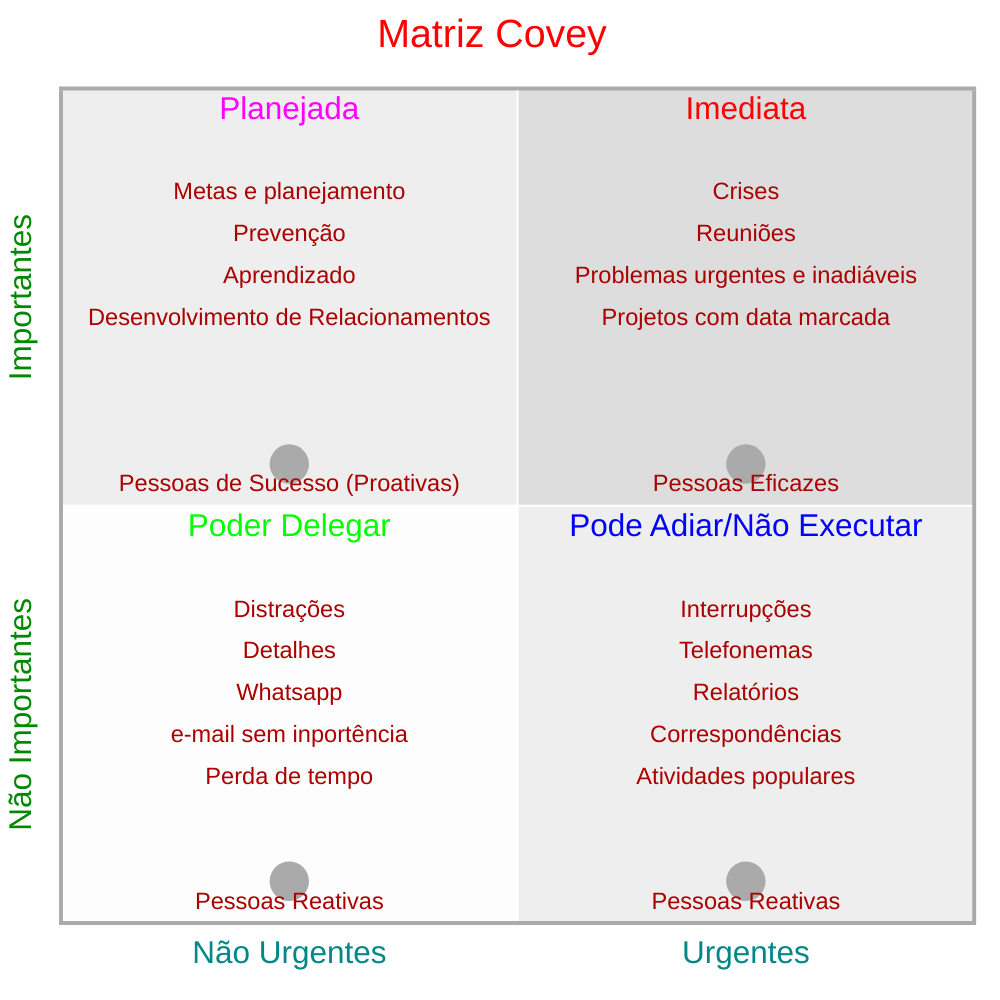

# Tempo

tempo = escolha
: Quem faz boas escolhas acaba sendo mais produtivo, pois consegue realizar muitas coisas, atingir seus objetivos e ter tempo para descanso, lazer, cuidar da saúde do corpo e da mente. Uma pessoa produtiva é aquela que consegue unir eficácia e eficiência.
: Ou seja, para sermos produtivos e gerenciarmos bem o nosso tempo, precisamos escolher fazer as coisas certas e do jeito certo!

gerenciar = administrar
: Gerenciar ou administrar o tempo é adquirir controle sobre a vida, fazendo o que é importante e prioritário, definindo providências para que suas prioridades sejam atendidas.

foco e prioridade
: O rumo de nossa vida é fruto de decisões e escolhas e somos consequências dessas escolhas e das ações que adotamos para realizá-las, seja na vida profissional ou pessoal.
: Ampliar a consciência sobre as escolhas nos ajuda a assumir a responsabilidade sobre nossos atos e definir o rumo que desejamos dar à nossa vida e carreira.

produtividade
: Defina seus objetivos

    - Primeiro, você precisa definir seus objetivos:
      - reflita sobre o seu trabalho atual, suas atividades e resultados alcançados (situação atual);
      - liste todos os objetivos profissionais e pessoais que quer alcançar, separando-os em grupos de curto, médio e longo prazo (situação desejada);
      - verifique se suas metas são realistas e avalie se possui as habilidades necessárias para atingi-las;
      - faça uma programação e determine prazos para o alcance de cada objetivo;
      - liste as atividades relativas a cada objetivo e as separe por importância.
: Importante ou urgente?

- Para definir as prioridades, é preciso separar o que é importante do que é urgente.
- Para auxiliar a gestão do nosso tempo, você pode utilizar a Matriz de Administração do Tempo, uma metodologia criada pelo autor americano Stephen Covey, onde as suas atividades são distribuídas em 4 quadrantes, de acordo com seu grau de importância e urgência.

> priorizar + organizar + desempenhar = gerenciamento de tempo

## O que é a Matriz Covey?

A Matriz Covey também é conhecida como [Matriz de Gerenciamento de Tempo](https://endeavor.org.br/desenvolvimento-pessoal/matriz-de-gestao-do-tempo-organize-e-execute-suas-atividades/), desenvolvida por Dwight D. Eisenhower e Stephen Covey que empresta seu sobrenome ao método. De acordo com eles, a priorização das atividades está relacionada a dois fatores: a importância e a urgência.

A metodologia ensina e doutrina que a gestão do tempo é feita para direcionar a atenção das atividades mais importantes e priorizar o que necessita de urgência.

As atividades ou tarefas são atribuídas em quadrantes a partir de uma matriz, seguindo os seguintes critérios:

1. **Urgência**: precisa de atenção imediata;
2. **Importância**: tem maior valor ou importância;

No entanto, as atividades urgentes não serão necessariamente priorizadas, pois é preciso entender qual é o real valor e a importância das outras atividades. A partir dessa divisão é possível ver com clareza quais são as atividades que devem ser entregues primeiro.

Pense no seguinte exemplo: temos uma casa pegando fogo, porém o fogo está apenas em um único cômodo e ainda está baixo e fraco.

A ação urgente seria buscar uma mangueira de água que chegue até o local para apagar o fogo de forma imediata. Mas a ação importante é abafá-lo com cobertores ou outro objeto disponível para evitar que ele aumente.

Dessa forma, é possível entender as atividades com maior valor, frente às atividades com maior urgência.

### Como usar os quadrantes da Matriz de Gerenciamento de Tempo?

Para que a matriz funcione para a gestão do tempo do seu trabalho, é necessário entender como são suas divisões, e como priorizar as atividades a partir da metodologia.

A Matriz Covey é dividida em 4 quadrantes (Q) que são o resultado de combinações entre os status de urgente/não urgente, importante/sem importância.

- Q1: urgente e importante;
- Q2: não é urgente, porém tem importância;
- Q3: urgente, mas sem importância;
- Q4: não é urgente, não tem importância.

No entanto, para que você possa utilizar os quadrantes corretamente, é necessário entender como escolher as atividades de acordo com a ordem da priorização.

#### Atividades críticas e necessárias (Q1)

O primeiro quadrante da matriz está agrupando as atividades consideradas críticas e importantes, aquelas que necessitam rapidamente da sua atenção.

Todas as atividades incluídas nessa categoria necessitam do seu foco totalmente direcionado para que as atividades sejam devidamente atendidas.

Atividades que podem ser incluídas no Q1:

- Reuniões agendadas previamente;
- Melhorias agendadas;
- Resolução de problemas.

Dessa forma, esse é o quadrante que você deve iniciar suas atividades.

#### Tarefas estratégicas (Q2)

As atividades e tarefas que estão listadas nesta categoria são consideradas importantes, mas não possuem urgência. Logo, elas normalmente não têm prazo definido para conclusão, permitindo que sejam postergadas caso seja necessário.

Normalmente tais atividades estão relacionadas com [estratégias empresariais](https://www.sebrae.com.br/sites/PortalSebrae/artigos/o-que-sao-estrategias-empresariais,e4df6d461ed47510VgnVCM1000004c00210aRCRD), ou do setor, que necessitam de um estudo aprofundado ou algum detalhe maior que requer atenção, mas sem urgência definida.

Mesmo que elas não tenham prazo definido ou não sejam urgentes, elas não devem ser esquecidas nesse quadrante, pois em algum momento elas podem se tornar urgentes!

Atividades que podem entrar no Q2:

- Planejamento de projetos;
- Planejamentos orçamentários;
- Alinhamentos gerais entre a equipe.

#### Atividades relevantes (Q3)

Neste quadrante temos as atividades consideradas como urgentes, mas elas não possuem grande relevância para evolução do setor ou da empresa.

Elas necessitam estar presentes na lista de atividades, mas podem ser feitas a qualquer momento, após as atividades nos demais quadrantes.

Normalmente, são atividades mais simples e rápidas de executar e tendem a ser feitas primeiro pela facilidade. Se houver muitas atividades que precisam ser reorganizadas na Matriz Covey, elas devem ser retiradas para dar espaço às atividades com maior relevância.

Contudo elas não devem ser excluídas, mas podem ser delegadas para agilizar todo o processo.

#### Tarefas residuais (Q4)

As atividades que estão listadas no último quadrante não possuem nenhum tipo de urgência ou importância, mas que devem ser executadas assim que houver um tempo disponível, ou seja, após a conclusão dos demais quadrantes.

O ideal é que essas atividades não levem muito tempo em sua execução. Além disso, elas devem ser rapidamente concluídas, para evitar a geração de backlog, que são atividades que se acumulam ao longo do tempo.

### Como determinar as atividades com urgência e importantes?

Para determinar as atividades que são importantes, é necessário pensar na contribuição delas para o projeto desenvolvido. Elas normalmente recebem essa atribuição por estarem relacionadas com atividades recorrentes. E sua conclusão é relevante para a evolução do setor e da empresa.

Por isso, são atividades que necessitam de priorização constante e foco para serem feitas. Mas sua prioridade depende dos prazos previamente estabelecidos. Além disso, é necessário dar atenção para evitar que elas se tornem atividades urgentes, que necessitam de atenção imediata.

E por falar em atividades urgentes, são aquelas que necessitam do seu foco e atenção imediata. Estão normalmente relacionadas à resolução de problemas urgentes ou atividades que não podem ser adiadas como reuniões e entregas, por exemplo.

Dessa forma, você pode definir corretamente quais são as atividades que são importantes e as urgentes para a criação da sua matriz de gerenciamento de tempo, aumentando sua produtividade e qualidade das entregas. A [gestão do seu tempo](https://ead.ucs.br/blog/gestao-tempo) e das suas entregas ficará muito mais simples e ágil.
