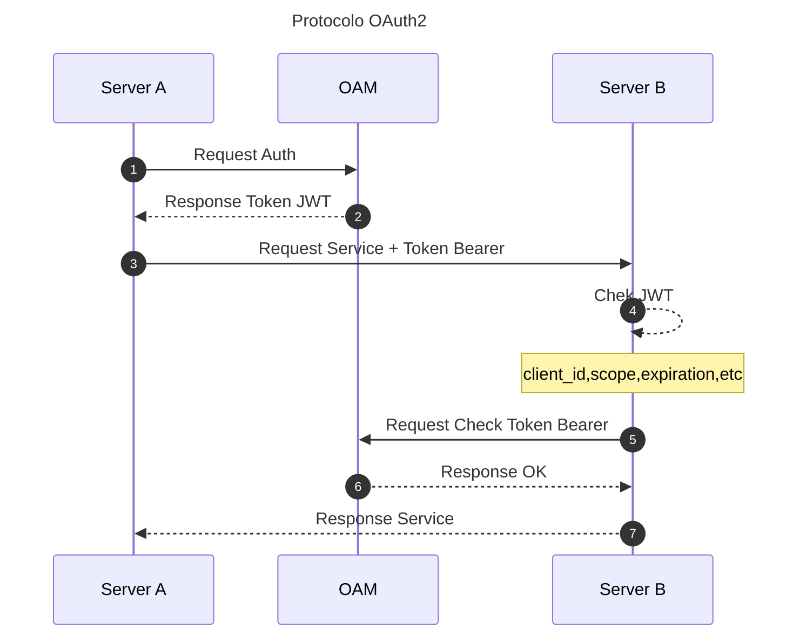

# OAM

```mermaid
---
title: Protocolo OAuth2
---

sequenceDiagram
  autonumber

  participant a as Server A
  participant o as OAM
  participant b as Server B

  a->>o: Request Auth
  o-->> a: Response Token JWT
  a->>b: Request Service + Token Bearer
  b-->>b: Chek JWT
  Note over b: client_id,scope,expiration,etc
%%   Note over o,a: One order, one transaction
  b->>o: Request Check Token Bearer
  o-->>b: Response OK
  b-->>a: Response Service 

```
