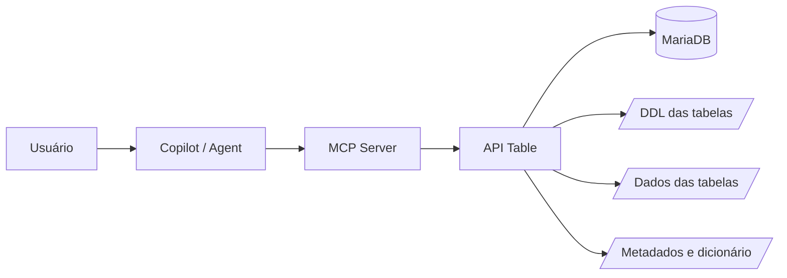
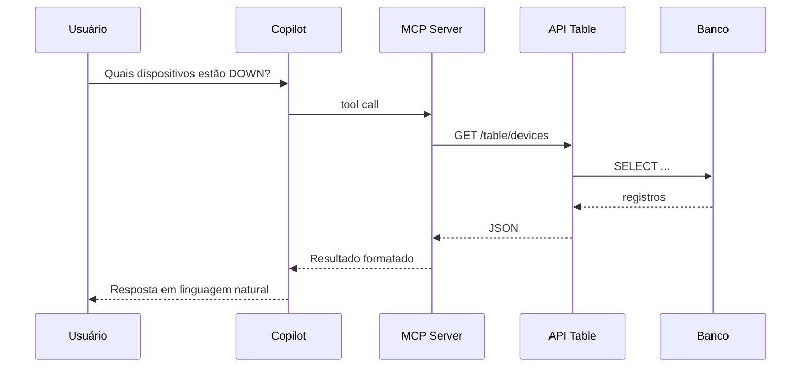

# OpenAPI 3.0

Um exemplo considerando uma API Table (inventário, DDL, consultas genéricas de tabelas/views do Portal Telco), o ideal é documentá-la em OpenAPI 3.0+ para que Copilot, MCP Servers, Agents, Power BI, Python, Excel e outras integrações consigam descobrir automaticamente os endpoints.

1. Diagrama de alto nível



2. Fluxo de consulta


3. Estrutura sugerida dos endpoints
Descoberta
GET /api

Retorna:

```json
{
  "name": "Portal Telco API Table",
  "version": "1.0",
  "endpoints": [
    "/tables",
    "/databases",
    "/table/{table}",
    "/ddl/{table}"
  ]
}
```

Listar bancos
GET /databases

Response:

```json
{
  "databases": [
    "acme",
    "Portal Telco",
    "inventory"
  ]
}
```
Listar tabelas
GET /tables

Response:

```json
{
  "tables": [
    "devices",
    "sites",
    "alarms"
  ]
}
```

Consultar dados
GET /table/devices

Parâmetros:

?limit=100
&offset=0
&filter=status=DOWN

Response:

```json
{
  "total": 523,
  "limit": 100,
  "offset": 0,
  "rows": [
    {
      "deviceid": 1001,
      "hostname": "RJ-RNC-01",
      "status": "DOWN"
    }
  ]
}
```

Consultar DDL
GET /ddl/devices

Response:

```json
{
  "table": "devices",
  "ddl": "CREATE TABLE devices (...)"
}
```

4. Exemplo OpenAPI (Swagger)
openapi: 3.0.3

info:
  title: Portal Telco API Table
  version: 1.0.0
  description: API para consulta de dados e metadados

servers:
- url: https://appsdbs/api

paths:

  /tables:
    get:
      summary: Lista tabelas

      responses:

        '200':
          description: OK

          content:
            application/json:
              schema:
                type: object

                properties:

                  tables:
                    type: array
                    items:
                      type: string

              example:
                tables:
                  - devices
                  - sites
                  - alarms

Exemplo para consulta de tabela:

  /table/{table}:

    get:

      summary: Consulta registros

      parameters:

      - name: table
        in: path
        required: true
        schema:
          type: string

      - name: limit
        in: query
        schema:
          type: integer
          default: 100

      - name: offset
        in: query
        schema:
          type: integer
          default: 0

      responses:

        '200':
          description: Resultado

          content:

            application/json:

              schema:
                $ref: '#/components/schemas/TableResponse'

Schemas:

components:

  schemas:

    TableResponse:

      type: object

      properties:

        total:
          type: integer

        rows:
          type: array

          items:
            type: object

5. Exemplos de mensagens HTTP
GET

Request

GET /table/devices?status=DOWN&limit=10
Host: appsdbs
Accept: application/json

Response

HTTP/1.1 200 OK

{
  "total": 3,
  "rows": [
    {
      "deviceid": 1001,
      "hostname": "RJ-RNC-01",
      "status": "DOWN"
    }
  ]
}

POST

Consulta mais complexa:

POST /query

Request

{
  "database": "Portal Telco",
  "table": "devices",
  "filter": {
    "status": "DOWN",
    "vendor": "Huawei"
  },
  "limit": 100
}

Response

{
  "executionTime": 12,
  "rows": [
    {
      "deviceid": 1001,
      "hostname": "RJ-RNC-01"
    }
  ]
}

6. Mensagens úteis para MCP

Como você pretende integrar com MCP, recomendo expor mensagens de descoberta:

Metadados da tabela
GET /metadata/devices

Resposta:

{
  "table": "devices",
  "description": "Inventário de dispositivos",
  "primaryKey": "deviceid",
  "columns": [
    {
      "name": "deviceid",
      "type": "INT UNSIGNED",
      "nullable": false
    },
    {
      "name": "hostname",
      "type": "VARCHAR(255)"
    }
  ]
}

Pesquisa textual
GET /search?q=huawei

{
  "matches": [
    {
      "table": "devices",
      "column": "vendor",
      "value": "Huawei"
    }
  ]
}

7. Diagrama ideal para o seu cenário Portal Telco + Copilot
flowchart LR

User --> Copilot

Copilot --> Agent

Agent --> MCP

MCP --> API["API Table OpenAPI"]

API --> INVENT["Inventário"]
API --> CHANGE["Changes"]
API --> DDL["DDL / Metadata"]
API --> VIEW["Views"]

INVENT --> MariaDB
CHANGE --> MariaDB
DDL --> MariaDB
VIEW --> MariaDB

Para o seu projeto, eu faria questão de documentar no OpenAPI pelo menos estes grupos:

/databases
/tables
/views
/table/{table}
/ddl/{table}
/metadata/{table}
/search
/query
/health
/version

Assim um Agent/MCP consegue descobrir sozinho a estrutura do banco sem conhecer antecipadamente as tabelas.
