# OCI - Oracle Cloud Infrastructure

até 30/10 certificação orcle professional free

## Cloud

- https://mylearn.oracle.com
- https://mylearn.oracle.com/ou/learning-path/become-an-oci-foundations-associate-2025/148056/?source=:pm:qr:::::RC_CORP250813P00041:OracleCertificationsWorkshopTIM_QRCodeOCIFoundations
- https://tinyurl.com/494mms25
- https://cloud.oracle.com

- Platform
  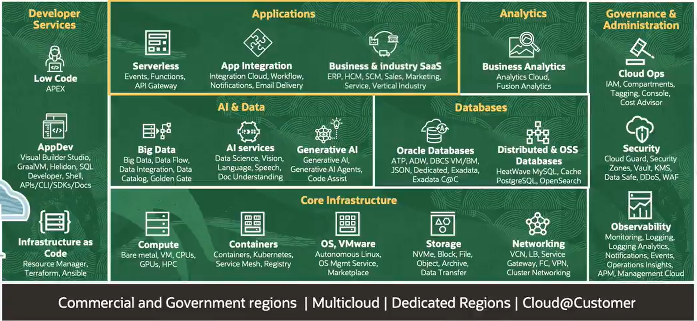
  - Cloud regions, MultiCloud, Dedicated Regions, Cloud@Customer
    - Developer Services
      - Low Code: APEX
      - AppDec: Visual Builder Studio, GraaIVM, Helidon, SQL Developer, Shell, APIs/CLI/SDKs/Docs
      - Infrastructure as Code: Resouce Manager, Terraform, Ansible
    - Governance & Administration
      - Cloud Ops: IAM, Compartments, Tagging Console, Cost Advisor
      - Security: Cloud Guard, Security Zones, Vault, KMS, Data Safe, DDoS, WAF
      - Observability: Minitoring, Logging, Logging Analytics,Notifications, Events, Operations Insights, APM, Management Cloud
    - Infrastructure
      - Compute: Bare metal, VM, CPUs, GPUs, HPC
      - Containers: Docker, Kubernets, Service Mesh, Registry
      - OS, VMware: Autonomous Linux, OS Mgmt Service, Marketplace
      - Storage: NVMe, Block File, Object, Archive, Data Transfer
      - Networking: VCN, LB, Service Gateway, FC, VPN, Cluster Networking
    - Databases
      - Oracle: ATP, ADW, DBCS VM/BM, JSON, Dedicated Exadata, Exadata C@C
      - Distributed & OSS Databases: HeatWave, MySQL, Cache, PostgreSQL, OpenSearch
    - Data & AI
      - Big Data, Data Flow, Data Integration, Data Catalog, Golden Gate
      - AI services: Data Science, Vision Language, Speech, Doc Understanding
      - Generative AI: Generative AI, Generative AI Agents, Code Assist
    - Analitics
      - Business Analytics: Analytics Cloud, Fusion Analytics
    - Appications
      - Serverless: Events, Functions, API Gateway
      - App Integration: Integration Cloud, Workflow, Notifications, Email Delivery
      - Business & Industry SaaS: ERP, HCM, SCM, Sales, MArketing, Service, Vertical Industry
- Architecture
  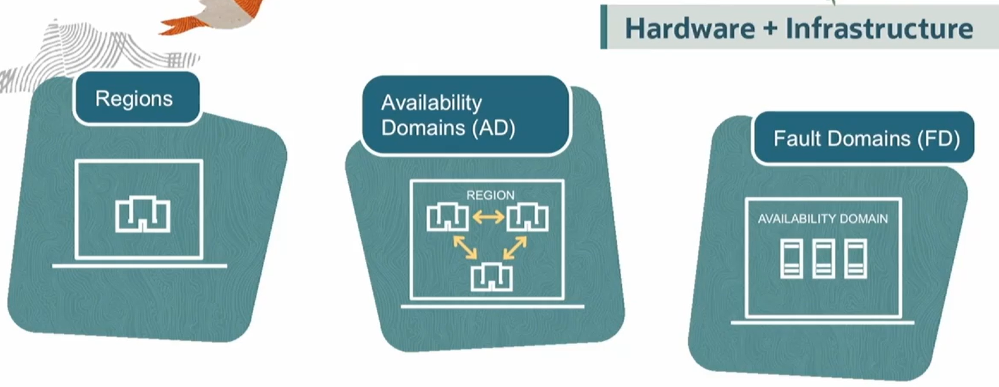
  - Topology
    - Regions: Localized Geographic Area (Region Pair para desaster recovery)
      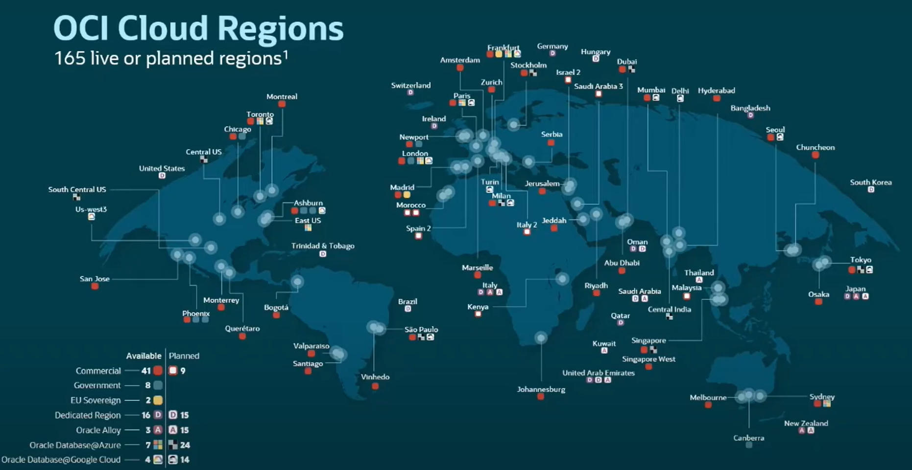
      - Availability Domains (AD) [>=1<=3]: Fault tolerant, Within a region, Low latency, High bandwidth (proteção de falhas inteiras)
        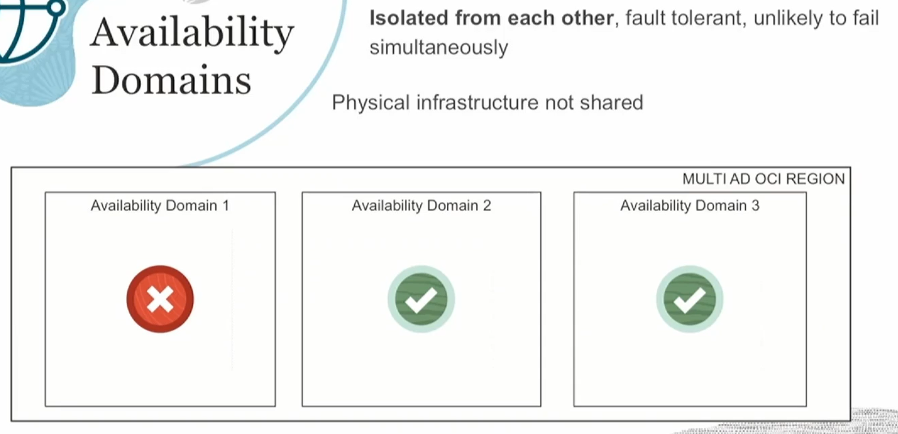
        - Fault Domains (FD) [3]: Hardware + infrastructure, Logical datacenters (proteção de um domínio)
          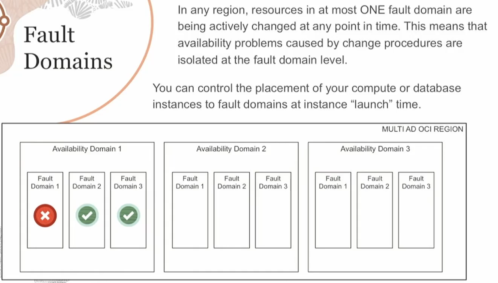
  - Choosing a Region
    - Location: Choose a region closest to your users for lowwst latency and highest perfonce
    - Data Residency & Compliance: Many countries have strict data residency requiments
    - Service Availability: New cloud service are made available based on regional demand, regulatory compliance, resource availability and other factors
- IAM - Identity and Access Management Service

   ```mermaid
   flowchart LR
      subgraph Identity Domain
         Users --> Groups
      end
      Groups --> Polices --> Compartments --> Resouces
   ```
   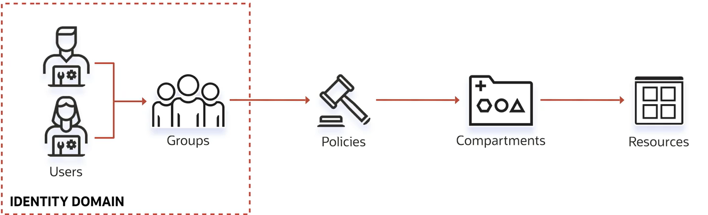
  - Fine-grained Access Control
  - AuthN - Who are you?
  - AuthZ - What permitions do you have?
  - OCI Identity Concepts
    OCID=`ocid1`.`<RESOUCE TYPE>`.`<REALM>`.`[REGION][.FUTURE USE]`.`<UNIQUE ID>`

    - Identity Domains
      - Users
      - Groups
      - Dynamic Groups
    - Principals
      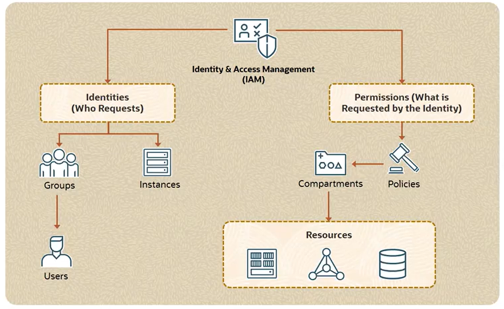
      - IAM Users
        - AuthN=Autenticação
          - User+Pass
          - API Signing Key
          - Auth Tokens
        - AuthZ=Autorização/Permissão
          - Polices
      - Resource Principals
      - Group
    - Polices
      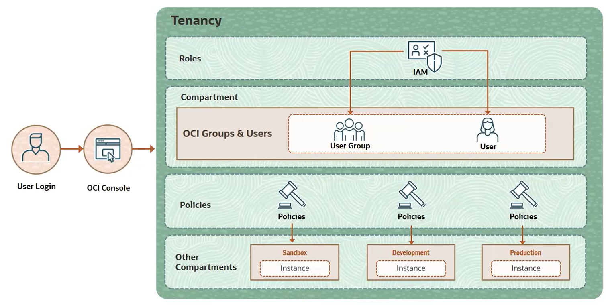
      - Rules
        - Allow group `<domain_name>`/`<group_name>` to `<verb>` `<resouce-type>` in tenancy
        - Allow group `<domain_name>`/`<group_name>` to `<verb>` `<resouce-type>` in compartment [where `<conditions>`]
        - Allow group `<domain_name>`/`<group_name>` to `<verb>` `<resouce-type>` in `<location>` where `<conditions>`
      - Vebs

        | Verb        | Tipo de Acesso (Access Type)                                                                                                                                                                                | Usuário-Alvo Típico (Target User)                                                |
        | :---------- | :---------------------------------------------------------------------------------------------------------------------------------------------------------------------------------------------------------- | :------------------------------------------------------------------------------- |
        | **inspect** | Capacidade de **listar** recursos. Permite ver apenas metadados do recurso, mas exclui metadados confidenciais ou especificados pelo usuário.                                                               | Auditores de Terceiros                                                           |
        | **read**    | Inclui **inspect** mais a capacidade de **obter (get)** o recurso em si e metadados especificados pelo usuário.                                                                                             | Auditores Internos, Usuários que precisam apenas visualizar detalhes.            |
        | **use**     | Inclui **read** mais a capacidade de **trabalhar** com o recurso (as ações variam por tipo de recurso), geralmente permitindo **atualizar**. **Exclui** a capacidade de **criar** ou **deletar** o recurso. | Usuários Finais (Desenvolvedores, Engenheiros) configurando recursos existentes. |
        | **manage**  | Inclui **todos** os verbos anteriores e todas as permissões para o recurso, incluindo **criar** e **deletar**.                                                                                              | Administradores (Admins)                                                         |

      - Aggregate resouce-type

        | Aggregate resouce-type     | Descrição                                                                 | Exemplos de Recursos Individuais Incluídos                                      |
        | :------------------------- | :------------------------------------------------------------------------ | :------------------------------------------------------------------------------ |
        | **all-resources**          | Cobre *todos* os recursos em um **Compartment** ou **Tenancy**.           | Qualquer recurso: `instance`, `vcn`, `volume`, `bucket`, etc.                   |
        | **instance-family**        | Cobre todos os recursos relacionados à instância de computação (Compute). | `instances`, `instance-images`, `volume-attachments`, `console-histories`, etc. |
        | **volume-family**          | Cobre todos os recursos de Block Volume.                                  | `volumes`, `volume-attachments`, `volume-backups`, `boot-volume-backups`, etc.  |
        | **virtual-network-family** | Cobre todos os recursos de rede em uma Virtual Cloud Network (VCN).       | `vcns`, `subnets`, `route-tables`, `security-lists`, `internet-gateways`, etc.  |
        | **object-family**          | Cobre todos os recursos de Object Storage.                                | `buckets`, `objects`, `multipart-uploads`, etc.                                 |
        | **database-family**        | Cobre recursos do serviço Database.                                       | `databases`, `db-systems`, `backups`, etc.                                      |
        | **load-balancers**         | Tipos de recurso para o serviço Load Balancer.                            | `load-balancers`, `backend-sets`, `listeners`, etc.                             |
        | **cluster-family**         | Cobre recursos relacionados ao Container Engine for Kubernetes (OKE).     | `clusters`, `cluster-node-pools`, etc.                                          |

      - Aggregate resouce-type

        | Service              | Resource Type             | Descrição                                             |
        | :------------------- | :------------------------ | :---------------------------------------------------- |
        | **Compute**          | `instances`               | Instâncias de Máquina Virtual (VM) ou Bare Metal.     |
        | ^^                   | `instance-images`         | Imagens personalizadas usadas para lançar instâncias. |
        | ^^                   | `volume-attachments`      | Conexões de Block Volumes a instâncias.               |
        | **Networking**       | `vcns`                    | Virtual Cloud Networks (Redes Virtuais).              |
        | ^^                   | `subnets`                 | Sub-redes dentro de uma VCN.                          |
        | ^^                   | `security-lists`          | Listas de regras de segurança de rede.                |
        | ^^                   | `route-tables`            | Tabelas de roteamento para direcionar o tráfego.      |
        | ^^                   | `load-balancers`          | Load Balancers.                                       |
        | ^^                   | `network-security-groups` | Grupos de Segurança de Rede (NSGs).                   |
        | **Storage (Block)**  | `volumes`                 | Block Volumes.                                        |
        | ^^                   | `volume-backups`          | Backups de Block Volumes.                             |
        | **Storage (Object)** | `buckets`                 | Buckets de Object Storage.                            |
        | ^^                   | `objects`                 | Objetos (arquivos) armazenados em Buckets.            |
        | **Database**         | `db-systems`              | Sistemas de Banco de Dados.                           |
        | ^^                   | `autonomous-databases`    | Bancos de Dados Autônomos.                            |
        | ^^                   | `db-backups`              | Backups de Banco de Dados.                            |
        | **IAM**              | `users`                   | Usuários do serviço IAM.                              |
        | ^^                   | `groups`                  | Grupos de usuários do IAM.                            |
        | ^^                   | `policies`                | Políticas de acesso do IAM.                           |
        | ^^                   | `compartments`            | Compartimentos.                                       |
        | **Functions**        | `fn-functions`            | Funções sem servidor (Serverless Functions).          |
        | ^^                   | `fn-applications`         | Aplicações de Functions.                              |
        | **Monitoring**       | `alarms`                  | Alarmes de monitoramento.                             |
        | ^^                   | `metrics`                 | Métricas de telemetria.                               |
        | **Container Engine** | `clusters`                | Clusters do Kubernetes (OKE).                         |
        | ^^                   | `cluster-node-pools`      | Pools de Nós (Node Pools) do cluster.                 |

    - Compartments
      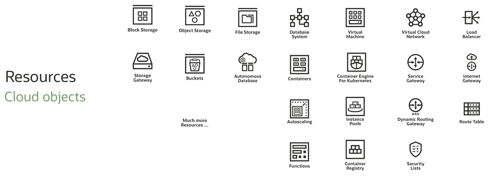
    - Federation
    - Resource
    - Network Sources
- Networking
  - VCN - Virtual Cloud Network
    - Private Network
      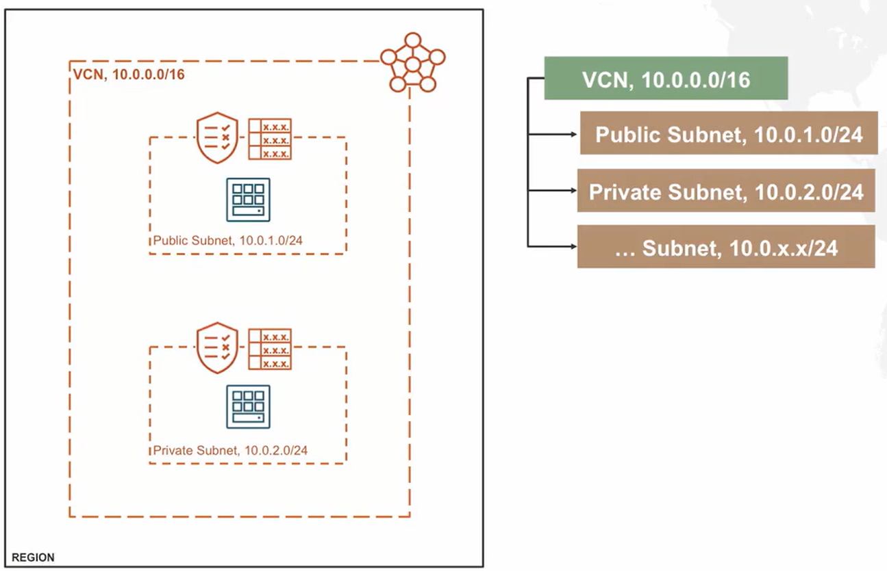
      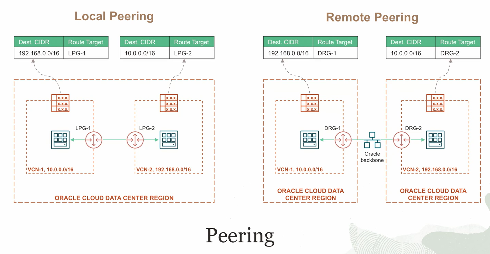
      - Public Subnet (CIDR)
        - Route Tables
      - Privite Subnet (CIDR)
        - Route Tables
    - Secure Communication
      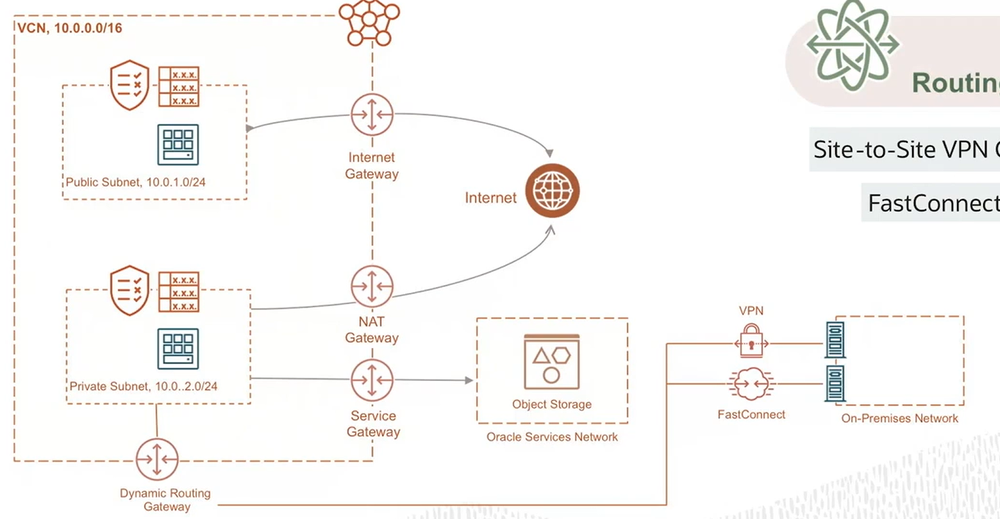
    - Lives in Region
    - Highly Available
    - Scalable
    - Secure
  - Peerings
    - LPG - Local Peering Gateway
      - VCN A (Region X) - VCN B (Region X) [1-1]
    - DRG - Dynamic Routing Gateway v1
      - VCN A (Region X) - VCN B (Region Y) [1-1]
    - DRG - Dynamic Routing Gateway v2
      - VCN A - VCN B [3-300]
  - SL - Security Lists
    - Firewall Rules
  - Network Security Groups (NSG)
    - Group of CIDR
  - LB - Load Balancer Services
    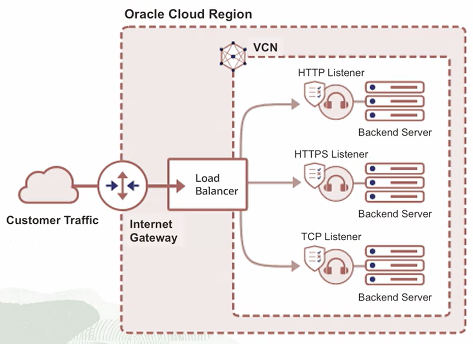
    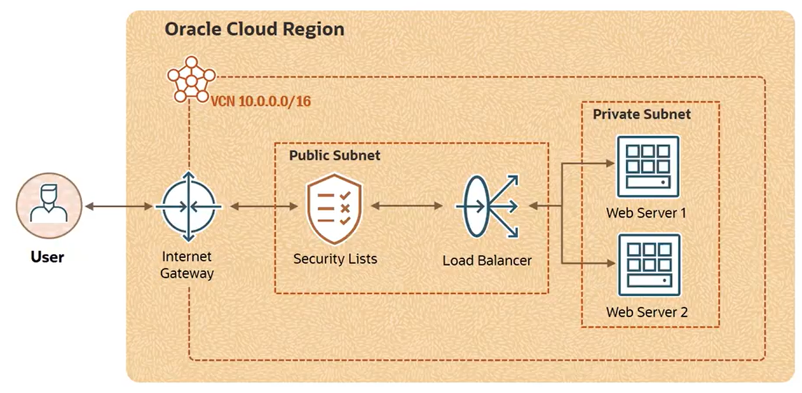
    - Layer 7 HTTP, HTTPS, TCP socket
    - coust
    - Config
      - Visibility: Public/Private
      - Assign IP: Ephemeral/Reserved
      - Shapes: bandwidth min/max
      - IPv6?
      - VCN, Subnet
      - backends: weighted round robin, IP hash, Laest connections
      - heath check: HTTP/80, HTTPS/443 + interval + timeout + retries + HTTP Status Code + URL [+ response regex]
      - listener
        - HTTPS|HTTP|HTTP/2|TCP
        - Port
        - SSL Certificate
  - Network Load Balancer
    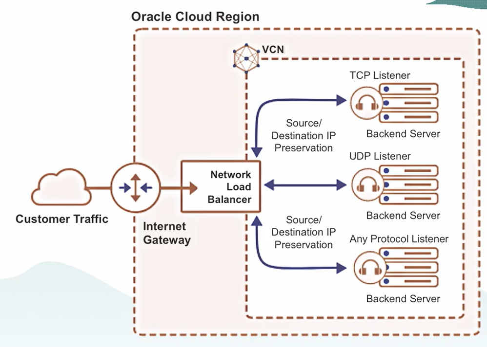
    - Layer 3/4 TCP & UDP
    - free
    - mais rápido
- Conputing
  - Características
    - Flexible Shapes
      - CPUs
      - Memory
    - Sizing
      - Small
      - Medium
      - Large
    - Types
      - VM - Virtual Machine
      - Bare Metal
      - Deticated Host
    - Processores `(RPS/R$)`
      - Ampere `(1116.644)`
      - AMD `(843.535)`
      - Intel `(659.041)`
  - Objects
    - Instance
      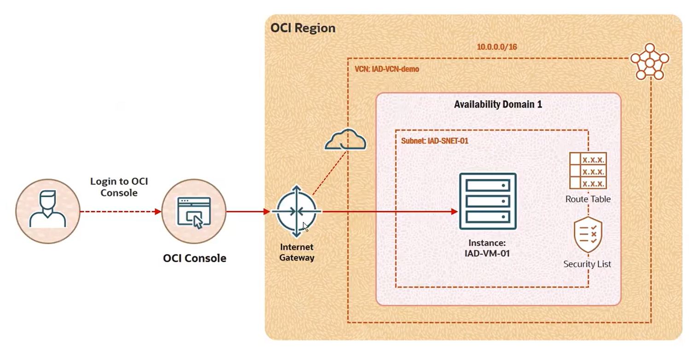
      - Instance Basic VCN (network)/AD(Subnet)/VNIC+Private IP
      - Remote Storage: boot + data
      - OS
      - Live Migrate between hosts
    - Scaling
      - Up/Down (+/-): Instance Shapes, stop before resizing
      - Autoscaling (horizontal scaling) out/in (+/-): VMs
        1. Running Instance + Config (OS, metadata, shapes, vNICs, Storage, subnets)
        2. Instance pool (put in different availability domanis, manage all together, stop, start, terminate)
        3. Scaling Rules (before / after): init/min/max size
  - Kubernets - Container Engine for Kubernets (OKE)
    - Container orchestration
      - Deploy
      - Manage
      - Connect
      - Scale up/down
    - características
      - FAst boot time
      - Lightweight
      - Portable
      - any-scale without downtime
      - auto-scale
      - self-heal
      - simplifies deployment
      - Docker / CRI-O / OKE
    - elements
      - Containers
      - Pods
      - Nodes
        - worker
        - control plane
          - kube-controler manager
          - cloud-controler manager
          - kube-APIsever
          - kube-scheduler
          - etcd (database key-value)
      - NodePool
  - Functions as-a-Service
    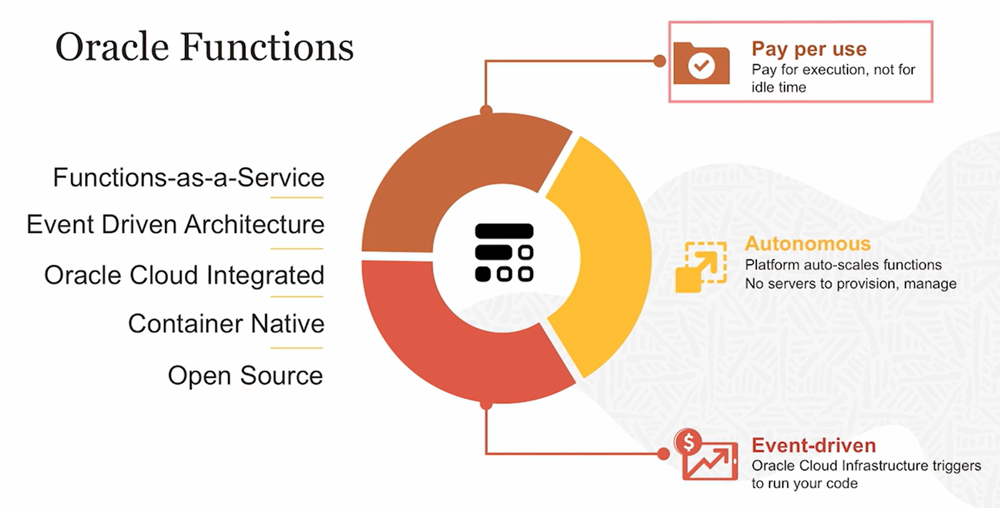
    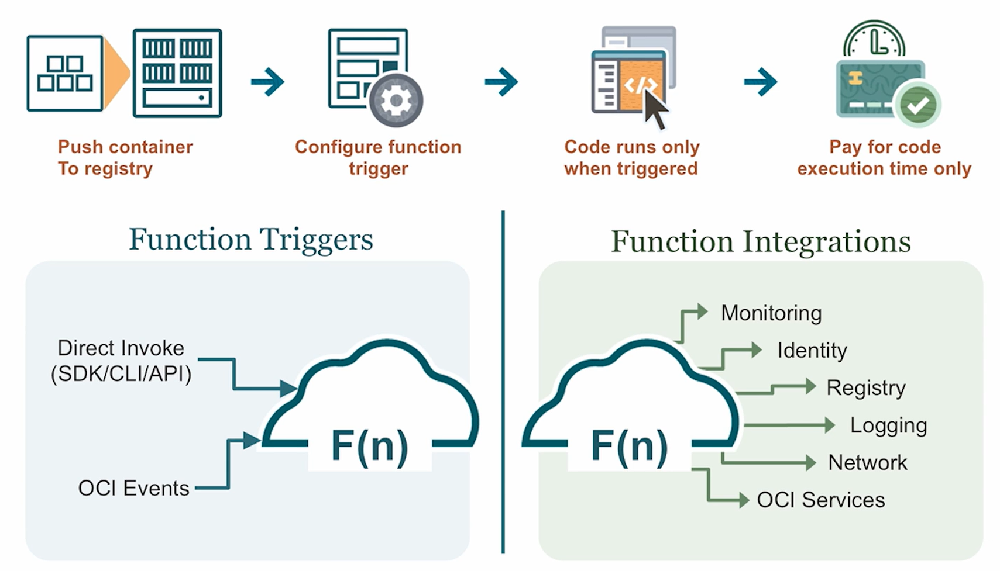
- Storage

  | Característica                | Local NVMe SSDs                              | Block Volume                                                     | File Storage                             | Object Storage                                                                       |
  | :---------------------------- | :------------------------------------------- | :--------------------------------------------------------------- | :--------------------------------------- | :----------------------------------------------------------------------------------- |
  | **Descrição**                 | Storage de Instância                         | Armazenamento em Bloco                                           | Armazenamento de Arquivos                | Key-Value DB                                                                         |
  | **Persistência**              | **Não Persistente**                          | **Persistente**                                                  | **Persistente**                          | **Super Persistente**                                                                |
  | **Vicnulados à instância**    | **Sim**                                      | **Não**                                                          | **Não**                                  | **Não**                                                                              |
  | **Tipo de Dados Recomendado** | **FS, App, DB, Caches, OLTP, OLAP**          | **FS boot/data, App, DB**                                        | **shared, /home, repos, Lift-and-Shift** | **Media, Big Data, Spark, Hadoop, Bin, archive/bkp, Logs, archives, Data Analitics** |
  | **Performance (IOPS)**        | **Extremamente Alto** (Milhões)              | **Lower Cost, Balanced, Higher, Ultra High** (2,60,75,90-225/GB) | **Alto** (escalável < Block)             | **Variável/Alto**                                                                    |
  | **Latência**                  | **Extremamente Baixa**                       | **Baixa**                                                        | **Média**                                | **Alta**                                                                             |
  | **Capacidade**                | **Média** (+-TBs)                            | **Alto** (<=32 TB/volume)                                        | **Alto** (PBs)                           | **Ilimitada** (petabytes++)                                                          |
  | **Limitação**                 | **HW** da instância                          | **pode vários volumes/instância**                                | **Escalável**                            | **Não**                                                                              |
  | **Durabilidade (Cópias)**     | **Baixa** (só da instância)                  | **Média** (3, 1 por FD)                                          | **Média** (3, 1 por FD)                  | **Alta** (Múltiplas em 3 AD-Região)                                                  |
  | **Conectividade**             | **Local Storage**                            | **Network Storage**                                              | **Network Storage**                      | **Network Storage**                                                                  |
  | **Acesso**                    | **Disco interno tradicional** ex. `/dev/sdb` | **Disco via iSCSI ou Paravirtualized** ex. `/dev/sdb`            | **Diretório de rede** ex. `/mnt/fs`      | **Acessado por URL** via SDKs ou APIs REST                                           |
  | **Protocolo**                 | **Block** (Acesso em nível de bloco pelo SO) | **Block** (Conecta o volume como um disco em bloco)              | **File** (Protocolo **NFS v3**)          | **HTTP/HTTPS** (Baseado em objeto)                                                   |

  - Local NVMe SSDs
  - Block Volume
    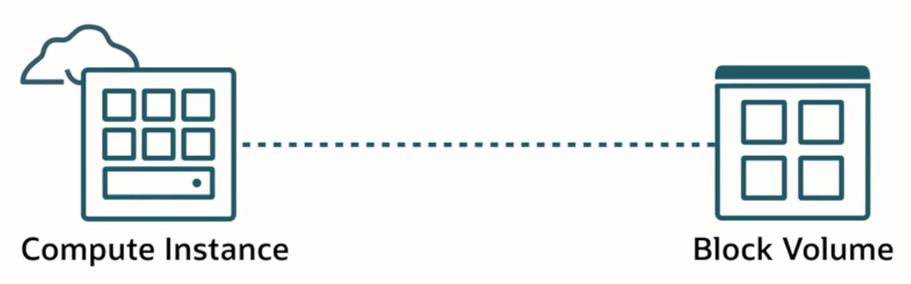
    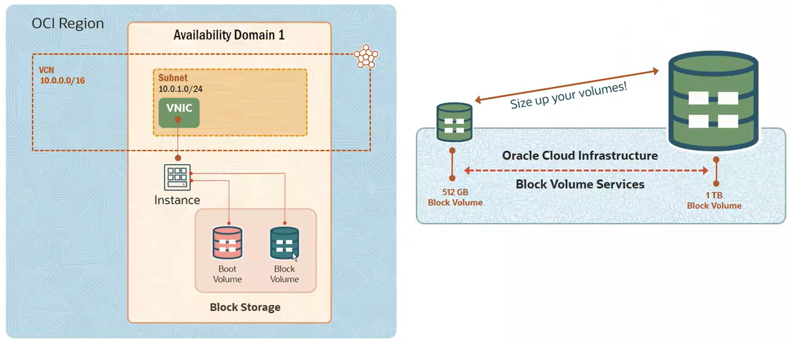
    - Create and attach disks
    - Detach and Delete Disks
    - Keep Data even after you Delete the Instance
    - Data Encryption
      - by Default
      - Storage and Transmition
      - can use own key or oracle key
    - Read/Write Shareable
    - Online Resizing
    - Replicate across regions
      - Disater Recovery
      - Migration
      - Business Expansion
      - Asynchronous
    - Groups
      - Easy management
      - time consistent backups
      - backup multiple volumes
      - across multiple instances
  - File Storage
    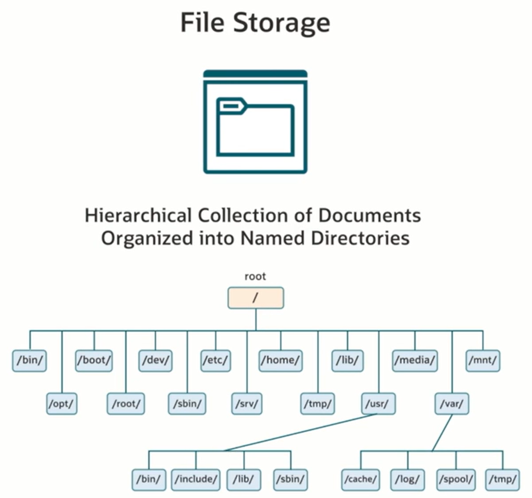
    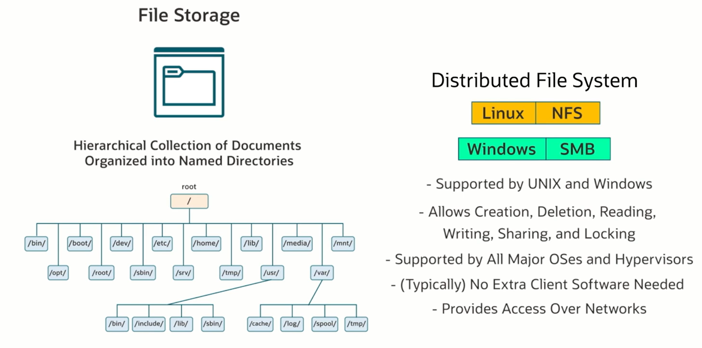
    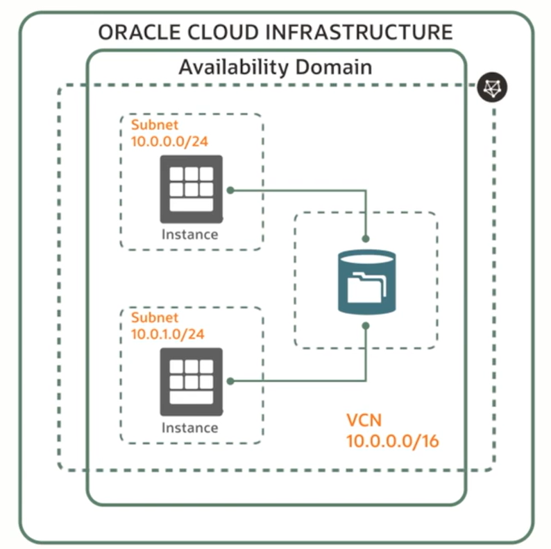
    - Hierarchical Collection of Document Organized into Named Directories
    - Use Cases
      - EBS: Oracle Applications Lif and Shift
      - General Purpose File Systems
      - Micro Services and Containers
      - Scale Out Apps
      - Analitics
    - Snapshots
    - Data Encryption
      - by Default
      - Storage and Transmition
      - can use own key or oracle key
  - Object Storage
    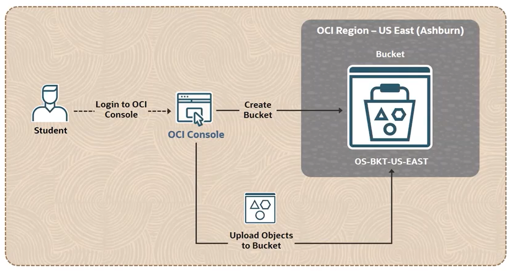
    - URLs
      - `https://<resource_type>.<region>.oraclecloud.com[/p/<pre_autenticated_key]/n/<namespace>/b/<bucket>/o/<object>`
      - `https://objectstorage.us-sanjose-1.oraclecloud.com/n/xpto/b/development/o/log.zip`
      - `https://objectstorage.us-sanjose-1.oraclecloud.com/p/alsef0_879yq34tal-Gsidufh/n/xpto/b/development/o/log.zip`
    - Object Storage Tiers (Nível de Armazenamento de Objetos)
      - Esses níveis são criados para que você possa armazenar seus dados da maneira mais econômica possível, alinhando o custo ao padrão de acesso dos dados (com que frequência os dados são acessados).
      - Níveis de Armazenamento de Objetos da OCI
        1. Standard Tier (Hot)
           - **Uso Ideal:** Dados acessados ativamente e frequentemente (objetos "quentes").
           - **Melhor para:** Conteúdo de sites, mídias frequentemente acessadas, dados de Big Data em tempo real e qualquer dado que exija desempenho e baixa latência constantes.
           - **Acesso:** Acesso imediato (milissegundos).
           - **Custo:** O mais alto. O custo por gigabyte (GB) é o mais alto dos três, mas não há taxas para acessar ou excluir os dados após serem armazenados.
           - **Custos de Recuperação (Egress/Retirada):** Não há.
        2. IA-Infrequent Access (Cool)
           - **Uso Ideal:** Dados que são acessados ocasionalmente, mas precisam de acesso imediato quando necessários (objetos "frios").
           - **Melhor para:** Backups de curto prazo, dados de log que precisam ser retidos por meses, mas raramente são analisados.
           - **Acesso:** Acesso imediato (milissegundos).
           - **Custo:** Mais baixo que o Standard. O preço de armazenamento por GB é mais baixo que o Standard, mas você paga uma pequena taxa de retirada (recuperação) sempre que acessa os dados e deve manter os objetos armazenados por um mínimo de 31 dias.
           - **Custos de Recuperação (Egress/Retirada):** Há taxas de retirada e um período de retenção mínima de **31 dias**.
        3. Archive (Deep Cool)
           - **Uso Ideal:** Dados de longo prazo que são raramente ou nunca acessados (arquivamento profundo).
           - **Melhor para:** Conformidade regulatória de longo prazo, dados de arquivo históricos ou backups de desastres que são mantidos por anos e têm acesso mínimo ou zero.
           - **Acesso:** Não é imediato.
             - Objetos precisam de ser restaurados (restore) antes do download
             - Tempo do processo de Restore: **1 hora**
             - Após restaurado temporariamente para o nível Standard tem **24 horas** como padrão para consumir os dados
             - Não atualizável
           - **Custo:** O mais baixo. O custo de armazenamento por GB é o mais baixo de todos. No entanto, ele tem a maior taxa de retirada e um período de retenção mínima de 90 dias.
           - **Custos de Recuperação (Egress/Retirada):** Há taxas de retirada e um período de retenção mínima de **90 dias**.
      - Como a OCI Otimiza o Uso (Object Lifecycle Management)
        - A OCI permite que você use o recurso **Object Lifecycle Management** (Gerenciamento do Ciclo de Vida de Objetos) para automatizar a transição entre esses níveis.
        - Por exemplo, você pode configurar uma regra que diz: "Mover todos os objetos do nível **Standard** para o nível **Infrequent Access** 30 dias após sua criação, e depois movê-los para o **Archive** após 90 dias."
        - Isso garante que seus dados sejam armazenados no nível mais econômico automaticamente à medida que envelhecem e se tornam menos acessados.
    - Auto-Tiering
      - Pode ser habilitado/desabilitado
      - Simplifica o uso dos Níveis de Armazenamento de Objetos Standard/Infrequent Access.
      - Em vez de você ter que configurar regras manuais, o Auto-Tiering faz a escolha por você, **otimizando o custo automaticamente com base no padrão de acesso aos dados.**
      - O Auto-Tiering opera monitorando ativamente a frequência com que cada objeto é acessado e movendo-o para o nível mais apropriado.
      - Ele se baseia em um princípio de **movimento unidirecional** em direção ao custo mais baixo.
      - Fluxo de trabalho detalhado:
        - 1. Ingestão (Tudo Começa no Standard)
          - Quando você faz o upload de um objeto para um *bucket* onde o Auto-Tiering está ativado, o objeto é inicialmente classificado no nível **Standard**.
        - 2. Monitoramento de Acesso
          - A OCI monitora a atividade de acesso a cada objeto no *bucket*.
          - Se um objeto for acessado (lido) frequentemente, ele permanece no nível **Standard**, que oferece o melhor desempenho.
        - 3. Transição Automática para IA (Scale Down de Custo)
          - Se um objeto no nível **Standard** **não for acessado** por um período de tempo definido (geralmente alguns dias ou semanas), o sistema de Auto-Tiering o move automaticamente para o nível **Infrequent Access (IA)**.
          - Essa transição reduz o custo de armazenamento do objeto, pois o nível IA é mais barato por GB que o Standard.
        - 4. Reclassificação (Movimento de Volta)
          - O ponto crucial do Auto-Tiering é que, se um objeto for acessado novamente (lido) enquanto estiver no nível **IA**, ele é **movido de volta automaticamente** para o nível **Standard**.
          - Esse movimento garante que o objeto tenha o melhor desempenho e não incorra nas taxas de retirada do IA se for acessado frequentemente.
      - Vantagens do Auto-Tiering
        - **Otimização de Custo:** Garante que você pague o preço mais baixo possível para cada objeto, sem intervenção manual.
        - **Simplificação:** Elimina a necessidade de criar e gerenciar políticas complexas de Ciclo de Vida do Objeto (Object Lifecycle Management) para migração entre Standard e IA.
        - **Desempenho:** Sempre que um objeto "frio" se torna "quente" (é acessado), ele é promovido ao Standard para garantir que os próximos acessos tenham baixa latência.
      - O que o Auto-Tiering Não Faz
        - **Não Inclui o Nível Archive:** O Auto-Tiering só gerencia a transição entre **Standard** e **Infrequent Access (IA)**. Ele **nunca** move um objeto para o nível **Archive**, pois o Archive requer o processo de "restauração" e tem uma latência de acesso muito alta. Se você quiser usar o nível Archive, deve configurá-lo manualmente usando as regras de Ciclo de Vida do Objeto.
        - **Não Há Período de Retenção Mínima:** Ao usar o Auto-Tiering, as taxas de retenção mínima do nível IA (31 dias) **não se aplicam**. Você paga apenas pelo tempo real que o objeto fica no nível IA.
    - Transmition Data
      - Hot Tier
      - Cool Tier 60% cheaper
    - Data Encryption
      - by Default
      - Storage and Transmition
      - can use own key or oracle key
    - Versionamento
      - Pode ser habilitado/desabilitado
    - Visibilidade
      - Privada/Pública (create a pre-autenticated request)
- Security

  | Manages               | On-premises |  OCI   |
  | --------------------- | :---------: | :----: |
  | Data                  |     You     |  You   |
  | Devices               |     You     |  You   |
  | Accounts & Identities |     You     |  You   |
  | Applications          |     You     |  You   |
  | Network Controls      |     You     |  You   |
  | Operating System      |     You     |  You   |
  | Virtualization        |     You     | Oracle |
  | Physical Hosts        |     You     | Oracle |
  | Physical Network      |     You     | Oracle |
  | Physical Datacenter   |     You     | Oracle |

  - Security Services Layers
    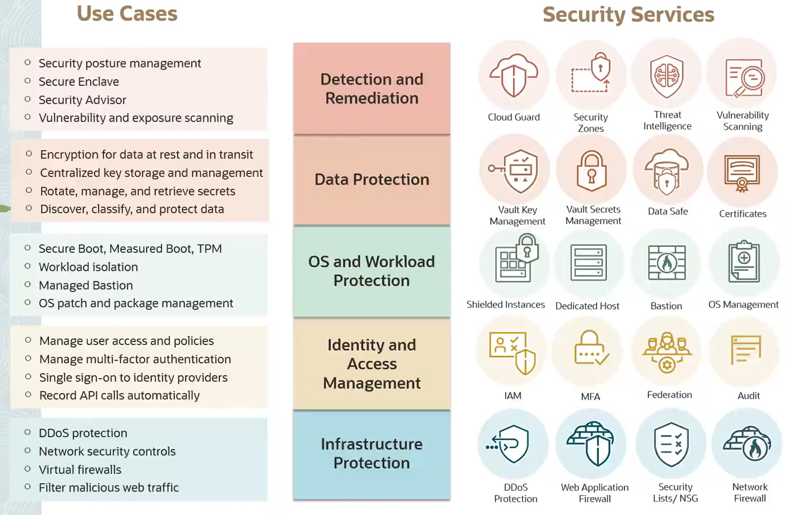
    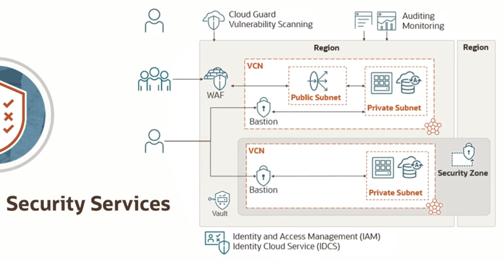
    1. Detection and Remediation
       - Use Cases
         - Security posture management
         - Secure Enclave
         - Security Advisor
         - Vulnerability and exposure scanning
       - Security Services
         - Cloud Guard
         - Security Zones
         - Threat Intelligence
         - Vulnerability Scanning
    2. Data Protection
       - Use Cases
         - Encryption for data at rest and in transit
         - Centralized key storage and management
         - Rotate, manage, and retrieve secrets
         - Discover, classify, and protect data
       - Security Services
         - Vault Key Management
         - Vault Secrets Management
         - Data Safe
         - Certificates
    3. OS and Workload Protection
       - Use Cases
         - Secure Boot, Measured Boot, TPM
         - Workload isolation
         - Managed Bastion
         - OS patch and package management
       - Security Services
         - Shielded Instances
         - Dedicated Host
         - Bastion
         - OS Management
    4. Identity and Access Management
       - Use Cases
         - Manage user access and policies
         - Manage multi-factor authentication
         - Single sign-on to identity providers
         - Record API calls automatically
       - Security Services
         - IAM
         - MFA
         - Federation
         - Audit
    5. Infrastructure Protection
       - Use Cases
         - DDoS protection
         - Network security controls
         - Virtual firewalls
         - Filter malicious web traffic
       - Security Services
         - DDoS Protection
         - Web Application Firewall
         - Security Lists/NSG
         - Network Firewall
  - Cloud Guard
    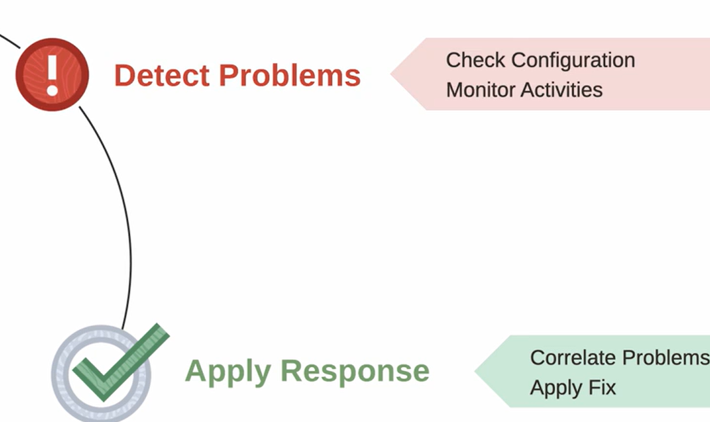
    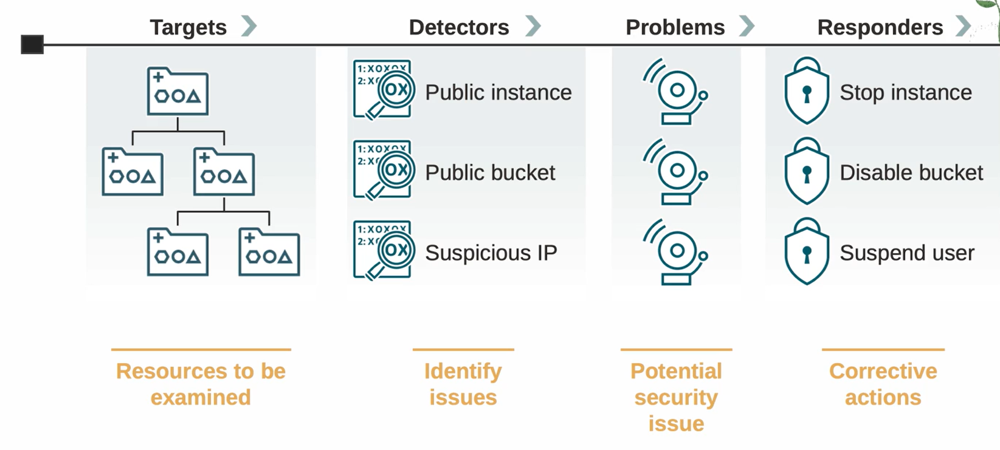
    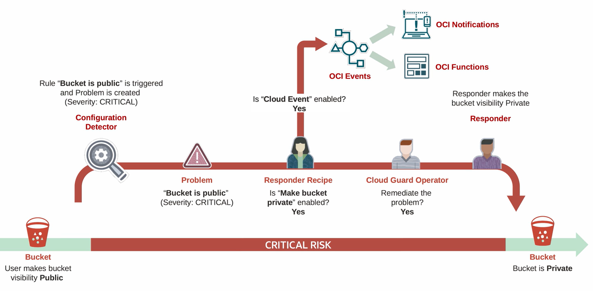
    - **O que faz:** Monitora continuamente sua *tenancy* (locação) da OCI e todos os seus Compartimentos em busca de atividades de risco e falhas de configuração.
    - **Como funciona:** Ele usa "Detectores" para identificar problemas (ex: um *bucket* de Object Storage tornado público) e "Respondedores" para tomar ações automáticas (ex: alertar um administrador ou até mesmo tornar o *bucket* privado novamente).
    - **Propósito:** Fornece visibilidade em tempo real do seu **nível de risco de segurança**.
    - Steps:
      1. Monitor and Identify
      2. Potential Security Issues
      3. Remediate Them
  - Security Zone
    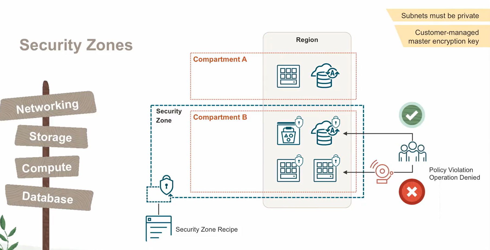
    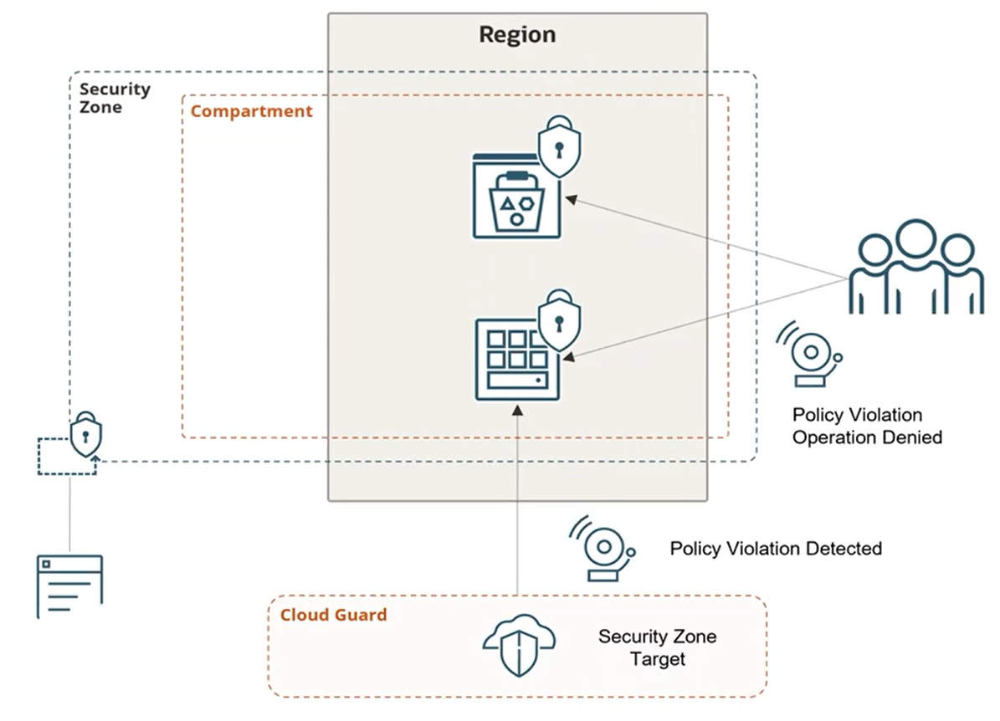
    - can not disable security
    - **O que faz:** Impõe políticas de segurança pré-configuradas e baseadas nas **melhores práticas da Oracle** (Cloud Guard).
    - **Como funciona:** Você designa um Compartimento para ser uma Security Zone. Qualquer recurso que você tente criar nesse Compartimento deve **cumprir rigorosamente** as políticas da Security Zone. Se um recurso violar uma política (ex: tentar criar um Block Volume sem criptografia), a OCI **bloqueia a criação** do recurso.
    - **Propósito:** **Previne proativamente** falhas de segurança *antes* que os recursos sejam implantados.
  - Security Advisor
    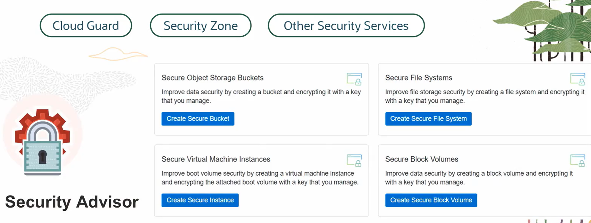
    - **O que faz:** Ajuda a analisar e lidar com as descobertas de segurança feitas pelo **Cloud Guard**.
    - **Como funciona:** Ele fornece uma visão unificada e acionável dos problemas detectados (ex: quais falhas de configuração persistem, quais violações de políticas foram resolvidas).
    - **Propósito:** Oferece um guia prático para **corrigir problemas de segurança** identificados e manter a conformidade.
    - Gerencia/Corrige:
      - Security Zone
      - Cloud Guard
      - Other security services
  - Encryption Basics
    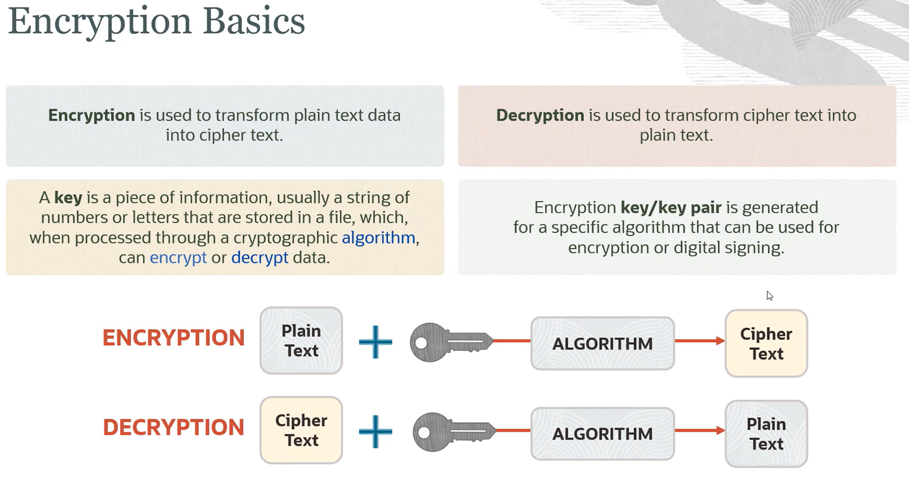
    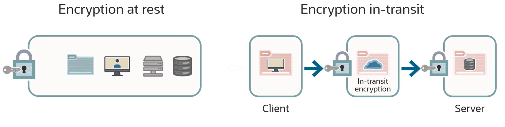
    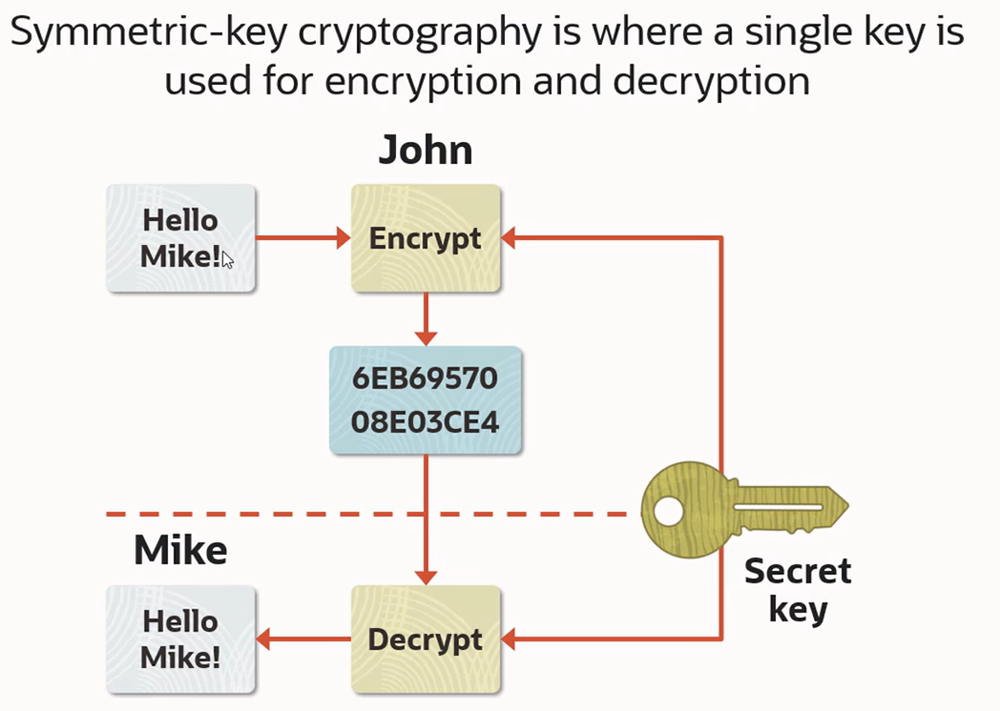
    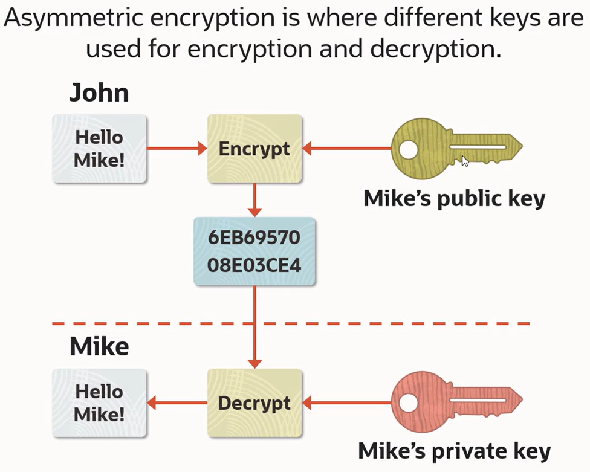
    - AES (Advanced Encryption Standard) symetric keys
      - **Descrição:** O **AES** é o algoritmo de criptografia **simétrica** mais amplamente utilizado no mundo, sendo o padrão adotado pelo governo dos EUA.
      - **O que faz:** Garante a **confidencialidade** (privacidade) dos dados.
      - **Como funciona:** É um algoritmo **simétrico**, o que significa que ele usa **uma única chave secreta** tanto para criptografar (embaralhar) quanto para descriptografar (desembaralhar) os dados.
      - **Uso Ideal:** Criptografia de grandes volumes de dados (dados em repouso, como Block Volumes, Object Storage, ou dados em trânsito, como o tráfego HTTPS), onde a **velocidade** é crucial.

      | Característica | Detalhe                                   |
      | :------------- | :---------------------------------------- |
      | **Tipo**       | Criptografia **Simétrica** (Chave Única). |
      | **Função**     | Confidencialidade e Privacidade.          |
      | **Vantagem**   | **Extremamente rápido** e eficiente.      |

      - The same key encrypts and decrypts data
      - It cannot be used for digital signing
    - RSA (Rivest–Shamir–Adleman) (asymetric keys)
      - **Descrição:** O **RSA** é o algoritmo de criptografia **assimétrica** mais tradicional e popular.
      - **O que faz:** Garante a **troca segura de chaves** e a **assinatura digital**.
      - **Como funciona:** É um algoritmo **assimétrico** (ou de chave pública), utilizando um par de chaves:
          1. **Chave Pública:** Compartilhada abertamente e usada para **criptografar** dados ou **verificar assinaturas**.
          2. **Chave Privada:** Mantida em segredo pelo proprietário e usada para **descriptografar** dados ou **criar assinaturas**.
      - **Uso Típico:** No HTTPS, o RSA é usado para criptografar o AES Key (a chave simétrica) antes de enviá-la ao cliente, estabelecendo o canal seguro. Também é amplamente usado para assinaturas digitais e chaves SSH.

      | Característica  | Detalhe                                               |
      | :-------------- | :---------------------------------------------------- |
      | **Tipo**        | Criptografia **Assimétrica** (Chave Pública/Privada). |
      | **Função**      | Troca de Chaves e Assinatura Digital.                 |
      | **Desvantagem** | **Lento** para grandes volumes de dados.              |

      - A public key encrypts and private key decrypts data
      - It can be used for digital signing
    - ECDSA (Elliptic Curve Digital Signature Algorithm) (digital signing keys)
      - **Descrição:** O **ECDSA** é o algoritmo de **assinatura digital** baseado em Criptografia de Curva Elíptica (ECC).
      - **O que faz:** Garante **autenticidade** (prova de origem) e **integridade** (prova de que não foi alterado).
      - **Como funciona:** Usa a matemática das curvas elípticas. Assim como o RSA, ele usa pares de chaves pública/privada, mas gera uma **assinatura digital** muito mais curta e eficiente para o mesmo nível de segurança.
      - **Uso Ideal:** É o substituto moderno do RSA em muitos casos, especialmente em certificados digitais (HTTPS/TLS) e criptomoedas, pois oferece segurança comparável com **tamanhos de chave muito menores** (e, portanto, é mais rápido e exige menos poder computacional).

      | Característica | Detalhe                                                                          |
      | :------------- | :------------------------------------------------------------------------------- |
      | **Tipo**       | Assinatura Digital **Assimétrica** (baseado em ECC).                             |
      | **Função**     | Autenticidade e Integridade.                                                     |
      | **Vantagem**   | **Alta segurança** com **chaves menores** e processamento mais rápido que o RSA. |

      - Can be used only for digital signing, not encryption and decryption of data
  - Hardware Security Module (HSM)
    - É um dispositivo de hardware físico projetado especificamente para proteger e gerenciar **chaves criptográficas digitais**.
    - Pense nele como um "cofre digital" à prova de adulteração (tamper-proof) e altamente seguro para os seus segredos mais importantes, especialmente as chaves de criptografia.
    - O Que é e Como Funciona
      - Propósito Principal: Proteção de Chaves: O HSM não é apenas um dispositivo de armazenamento; ele é projetado para:
        1. **Geração Segura de Chaves:** Criar chaves aleatórias e de alta qualidade dentro do hardware seguro.
        2. **Proteção de Chaves:** Armazenar chaves privadas e mestras em um ambiente isolado e à prova de adulteração.
        3. **Execução Criptográfica:** Executar operações criptográficas (como criptografar, descriptografar ou assinar) **dentro do próprio dispositivo**, de modo que a chave privada nunca precise deixar o ambiente seguro do HSM.
      - Segurança Física e Lógica: Os HSMs são construídos com recursos avançados de segurança:
        - **Anti-Tampering:** Eles são projetados para serem resistentes a ataques físicos. Se for detectada qualquer tentativa de violação (como perfuração ou alteração de temperatura), o HSM pode imediatamente **apagar todas as chaves** que armazena (mecanismo de *zeroization*).
        - **Isolamento:** Ele isola as chaves do sistema operacional do host e de vulnerabilidades de software.
    - Casos de Uso Comuns do HSM: Os HSMs são essenciais para qualquer cenário que exija o mais alto nível de confiança e conformidade regulatória:
      1. **Serviços de Certificados Digitais (PKI):** Proteção da chave privada da Autoridade de Certificação (CA), que é usada para assinar todos os certificados digitais (incluindo certificados SSL/TLS para HTTPS).
      2. **Serviços de Criptografia em Nuvem (OCI Vault):** Provedores de nuvem como a OCI usam HSMs para proteger as **chaves mestras** que, por sua vez, criptografam todas as outras chaves e dados dos clientes.
      3. **Serviços de Pagamento (Financeiro):** Usado para proteger as chaves usadas para processar transações com cartão de crédito e débito (PCI-DSS).
      4. **Assinatura de Código:** Usado para assinar software e garantir que o código não foi adulterado após a compilação.
    - HSM vs. Software Key Storage: A principal vantagem de um HSM é a garantia de que a chave privada de alto valor **nunca** é exposta ao ambiente de software.

      | Característica           | Hardware Security Module (HSM)                                          | Armazenamento de Chave em Software                                      |
      | :----------------------- | :---------------------------------------------------------------------- | :---------------------------------------------------------------------- |
      | **Proteção da Chave**    | Protegida por hardware físico, com **zeroization** em caso de violação. | Protegida por criptografia, mas reside no disco ou memória do servidor. |
      | **Ambiente de Operação** | Operações criptográficas ocorrem **dentro** do módulo seguro.           | Operações criptográficas ocorrem no **CPU do host** (exposto ao SO).    |
      | **Custo e Complexidade** | Alto custo e alta complexidade (alto nível de segurança).               | Baixo custo e menor complexidade.                                       |

  - Vault
    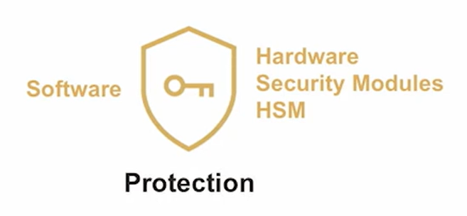
    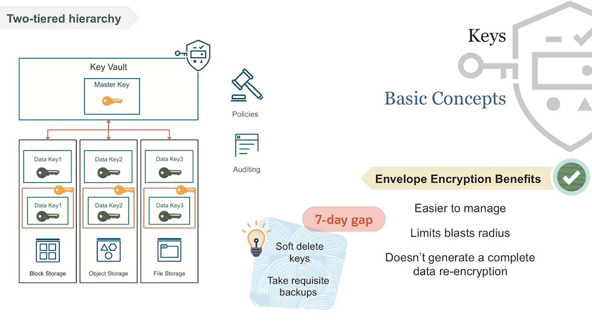
    - Secrets
      - Passwords
      - Certificates
      - SSH-keys
      - Auth Tokens
    - Master Security key protected by
      - HSM
        - Stored in HSM Device
        - Can not be exported from HSM
      - Software
        - Stored in Server
        - Can be exported from Server
        - Operations allowed on Clients
    - Algorithms
      - AES, RSA, ECDSA
    - Key integrated in OCI
    - Rotare your master keys
- Governance and Administration
  - Pricing
    - Modules
      - Pay as you go (PAYG)
        - Charged only for the resource consumed
        - No upfront commitement
        - No minumum service period
        - Usage metered
      - Annual Uiversal Credits
        - Commit to an annual pool of funds
        - Significant savings
        - Must use credits with in 12 months
        - Discounts based on size of deal and term of deal
      - Bring Your Own Licence (BYOL)
        - Apply your current on-premises Oracle licences to equivalent, highly automated Oracle IaaS & PaaS services in the cloud
        - Complete licence mobility with on-premises
    - Impact
      - Resource Size: Bigger cost more
      - Resource Type: VMs vs BMs, VMs vs Functions, BYOL vs managed DBs
      - Data Transfer: No ingress cost, careful with egress cost
        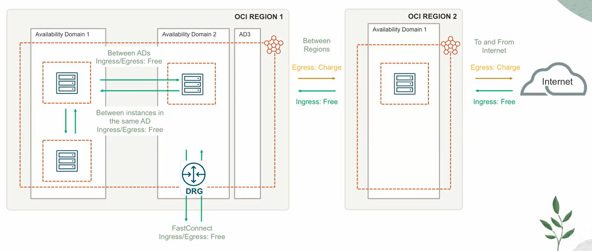
      - All OCI regions have the same pricing
  - Cost Management
    - Create budget and alerts
    - Analysis
    - Usage Reports
    - Limits, Quotas and Usage
  - Tagging
    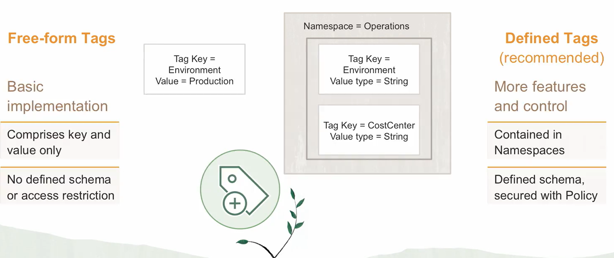
    - key-value pair to
      - resource organization
      - cost management
      - access control
    - Name convention
      - `<namespace>.<key>=<value>`
      - `Opertions.Enviroment="Prodution"`
      - Tag Namespace: is a container for a set of tag keys with tag key definitions
      - Tag Key definition specifies its key and what types of values are allowed
  - Support Rewards
    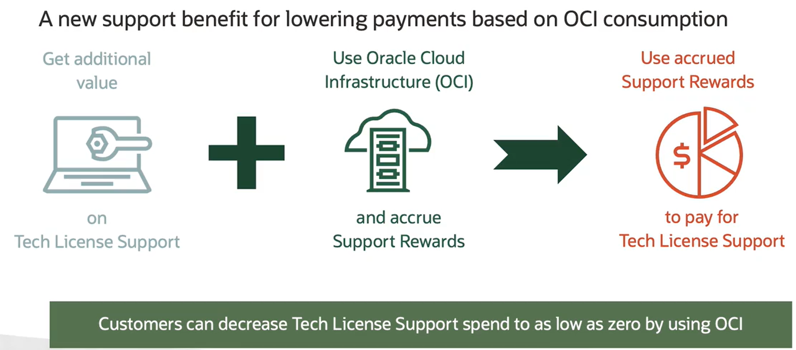

  - Cloud Advisor
    - Overview
    - Recomendations
- Obs
  - Redundância Local = Região / Availability Domain (>=1<=3) / Fault Domain (3)
  - Desaster Recovery precisa de 2 Regiões
  - Data guard replica DB entre AD entre FD é nativo
  - Polices são sempre dadas a grupos de users para compartments de resources
  - Polices são apenas de permissão pois tudo já está negado
  - Um recurso só pode estar em um compartment
  - Tenancy e Compartments são construções globais (multi regiões)
  - Tenancy pode estar associado a uma região mas opera em todas
  - Tenancy é seu Id na cloud
  - compartments permite <=6 nívels de hierarquias
    - quotas
    - orçamentos
