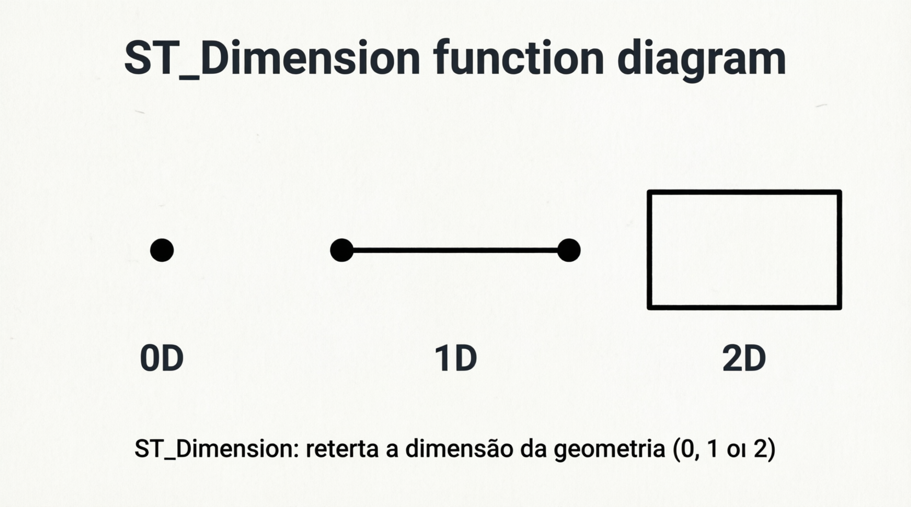
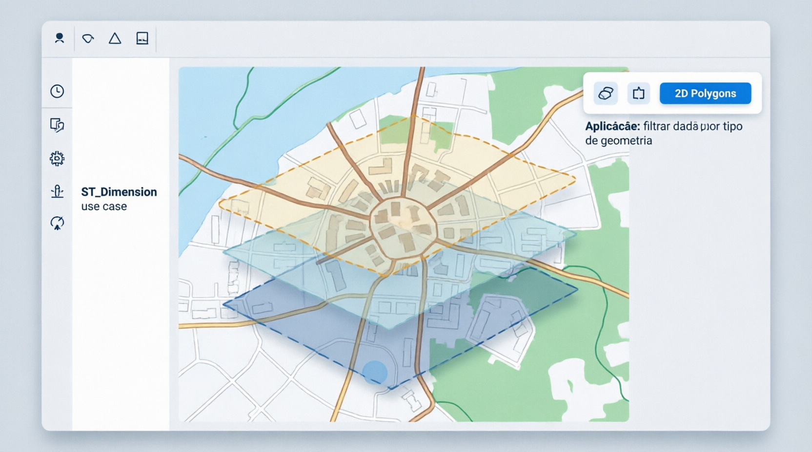

# Funções

[ST_GeomFromText]: [ST_GeomFromText](ST_GeomFromText.md)
[ST_Point]: [ST_Point](ST_Point.md)
[ST_LineStringFromText]: [ST_LineStringFromText](ST_LineStringFromText.md)
[ST_PolygonFromText]: [ST_PolygonFromText](ST_PolygonFromText.md)
[ST_AsText]: [ST_AsText](ST_AsText.md)
[ST_AsGeoJSON]: [ST_AsGeoJSON](ST_AsGeoJSON.md)
[ST_AsBinary]: [ST_AsBinary](ST_AsBinary.md)
[ST_GeomFromGeoJSON]: [ST_GeomFromGeoJSON](ST_GeomFromGeoJSON.md)
[ST_CROSSES]: [ST_CROSSES](ST_CROSSES.md)
[ST_EQUALS]: [ST_EQUALS](ST_EQUALS.md)
[ST_X]: [ST_X](ST_X.md)
[ST_Y]: [ST_Y](ST_Y.md)
[ST_StartPoint]: [ST_StartPoint](ST_StartPoint.md)
[ST_EndPoint]: [ST_EndPoint](ST_EndPoint.md)
[ST_PointN]: [ST_PointN](ST_PointN.md)
[ST_NumPoints]: [ST_NumPoints](ST_NumPoints.md)
[ST_IsValid]: [ST_IsValid](ST_IsValid.md)
[ST_IsSimple]: [ST_IsSimple](ST_IsSimple.md)
[ST_IsEmpty]: [ST_IsEmpty](ST_IsEmpty.md)
[ST_NumGeometries]: [ST_NumGeometries](ST_NumGeometries.md)
[ST_Dimension]: [ST_Dimension](ST_Dimension.md)
[ST_GeometryN]: [ST_GeometryN](ST_GeometryN.md)
[ST_GeometryType]: [ST_GeometryType](ST_GeometryType.md)
[ST_IsClosed]: [ST_IsClosed](ST_IsClosed.md)
[ST_IsRing]: [ST_IsRing](ST_IsRing.md)
[ST_SRID]: [ST_SRID](ST_SRID.md)

[ST_Area]: [ST_Area](ST_Area.md)
[ST_Length]: [ST_Length](ST_Length.md)
[ST_Distance]: [ST_Distance](ST_Distance.md)
[ST_Distance_Sphere]: [ST_Distance_Sphere](ST_Distance_Sphere.md)
[ST_Contains]: [ST_Contains](ST_Contains.md)
[ST_Within]: [ST_Within](ST_Within.md)
[ST_Intersects]: [ST_Intersects](ST_Intersects.md)
[ST_Touches]: [ST_Touches](ST_Touches.md)
[ST_Disjoint]: [ST_Disjoint](ST_Disjoint.md)
[ST_Buffer]: [ST_Buffer](ST_Buffer.md)
[ST_Centroid]: [ST_Centroid](ST_Centroid.md)
[ST_ConvexHull]: [ST_ConvexHull](ST_ConvexHull.md)
[ST_Intersection]: [ST_Intersection](ST_Intersection.md)
[ST_Union]: [ST_Union](ST_Union.md)
[ST_SymDifference]: [ST_SymDifference](ST_SymDifference.md)
[ST_Difference]: [ST_Difference](ST_Difference.md)
[ST_Boundary]: [ST_Boundary](ST_Boundary.md)
[ST_Envelope]: [ST_Envelope](ST_Envelope.md)
[ST_Relate]: [ST_Relate](ST_Relate.md)

## Ilustrações

| Funções                  | Ilustração 1                        | Ilustração 2                        |
| ------------------------ | ----------------------------------- | ----------------------------------- |
| **[ST_Area]**            |             |             |
| **[ST_Length]**          |           |           |
| **[ST_Distance]**        |         |         |
| **[ST_Distance_Sphere]** |  |  |
| **[ST_Contains]**        |         |         |
| **[ST_CROSSES]**         |          |          |
| **[ST_EQUALS]**          |           |           |
| **[ST_Within]**          |           |           |
| **[ST_Intersects]**      |       |       |
| **[ST_Touches]**         |          |          |
| **[ST_Disjoint]**        |         |         |
| **[ST_Buffer]**          |           |           |
| **[ST_Centroid]**        |         |         |
| **[ST_ConvexHull]**      |       |       |
| **[ST_Intersection]**    |     |     |
| **[ST_Union]**           |            |            |
| **[ST_SymDifference]**   |    |    |
| **[ST_Difference]**      |       |       |
| **[ST_Boundary]**        |         |         |
| **[ST_Envelope]**        |         |         |
| **[ST_Relate]**          |           |           |
| **[ST_StartPoint]**      |       |       |
| **[ST_EndPoint]**        |         |         |
| **[ST_PointN]**          |           |           |
| ST_X                     |                |                |
| ST_Y                     |                |                |
| ST_NUMPOINTS             |        |        |
| ST_ISVALID               |          |          |
| ST_ISSIMPLE              |         |         |
| ST_ISEMPTY               |          |          |
| ST_NUMGEOMETRIES         |    |    |
| ST_DIMENSION             |        |        |
| ST_GEOMETRYN             |        |        |
| ST_GEOMETRYTYPE          |     |     |
| ST_ISCLOSED              |         |         |
| ST_ISRING                |           |           |
| ST_SRID                  |             |             |

## Resumo

| Funções                     | Sinônimo      | Syntaxe                                    | Descrição                                                     | Aplicações práticas                                                                |
| --------------------------- | ------------- | ------------------------------------------ | ------------------------------------------------------------- | ---------------------------------------------------------------------------------- |
| **[ST_GeomFromText]**       |               | `ST_GeomFromText('POINT(x y)')`            | Cria geometria a partir de WKT                                | Inserção via backend (PHP/API)                                                     |
| **[ST_Point]**              |               | `ST_Point(x, y)`                           | Cria um ponto diretamente                                     | GPS, localização de usuário                                                        |
| **[ST_LineStringFromText]** |               | `ST_LineStringFromText('LINESTRING(...)')` | Cria uma linha a partir de WKT                                | Rotas, trajetos, ruas                                                              |
| **[ST_PolygonFromText]**    |               | `ST_PolygonFromText('POLYGON((...))')`     | Cria um polígono a partir de WKT                              | Terrenos, regiões, mapas                                                           |
| **[ST_AsText]**             |               | `ST_AsText(g)`                             | Converte para texto (WKT)                                     | Debug, logs                                                                        |
| **[ST_AsGeoJSON]**          |               | `ST_AsGeoJSON(g)`                          | Converte para GeoJSON                                         | Integração com Leaflet                                                             |
| **[ST_AsBinary]**           |               | `ST_AsBinary(g)`                           | Converte para formato binário (WKB)                           | Armazenamento eficiente, transferência rápida                                      |
| **[ST_GeomFromGeoJSON]**    |               | `ST_GeomFromGeoJSON(json)`                 | Converte GeoJSON em geometria                                 | Receber dados do frontend                                                          |
| **[ST_Area]**               | AREA          | `ST_Area(poly)`                            | Calcula área                                                  | Terrenos, regiões                                                                  |
| **[ST_Length]**             |               | `ST_Length(line)`                          | Comprimento de linha                                          | Rotas, trajetos                                                                    |
| **[ST_Distance]**           |               | `ST_Distance(g1, g2)`                      | Calcula distância entre geometrias                            | Proximidade entre pontos                                                           |
| **[ST_Distance_Sphere]**    |               | `ST_Distance_Sphere(p1, p2)`               | Distância considerando a Terra  +10.4                         | Distância real (metros)                                                            |
| **[ST_Contains]**           |               | `ST_Contains(g1, g2)`                      | Verifica se contém                                            | Geofence                                                                           |
| **[ST_CROSSES]**            |               | `ST_Crosses(g1, g2)`                       | Verifica se cruza                                             | Cruzamento de rotas                                                                |
| **[ST_EQUALS]**             |               | `ST_Equals(g1, g2)`                        | Verifica se são iguais                                        | Verificar duplicatas                                                               |
| **[ST_Within]**             |               | `ST_Within(g1, g2)`                        | Verifica se está dentro                                       | Usuário dentro de área                                                             |
| **[ST_Intersects]**         |               | `ST_Intersects(g1, g2)`                    | Verifica interseção                                           | Cruzamento de rotas                                                                |
| **[ST_Touches]**            |               | `ST_Touches(g1, g2)`                       | Toca na borda                                                 | Limites geográficos                                                                |
| **[ST_Disjoint]**           |               | `ST_Disjoint(g1, g2)`                      | Não há interseção                                             | Separação total                                                                    |
| **[ST_Buffer]**             | BUFFER        | `ST_Buffer(g, r)`                          | Cria um buffer (área de influência) ao redor de uma geometria | Raio de busca, Análise de proximidade, geofencing, expansão/contração de polígonos |
| **[ST_Centroid]**           |               | `ST_Centroid(g)`                           | Centro geométrico                                             | Centro de regiões                                                                  |
| **[ST_ConvexHull]**         |               | `ST_ConvexHull(g)`                         | Área convexa mínima                                           | Agrupamento de pontos                                                              |
| **[ST_Intersection]**       |               | `ST_Intersection(g1, g2)`                  | Parte comum entre dois                                        | Sobreposição                                                                       |
| **[ST_Union]**              |               | `ST_Union(g1, g2)`                         | Junta geometrias                                              | Unir regiões                                                                       |
| **[ST_SymDifference]**      |               | `ST_SymDifference(g1, g2)`                 | Diferença simétrica                                           | Áreas exclusivas de cada geometria                                                 |
| **[ST_Difference]**         |               | `ST_Difference(g1, g2)`                    | Subtrai geometria                                             | Remover área                                                                       |
| **[ST_Boundary]**           |               | `ST_Boundary(g)`                           | Retorna a borda de uma geometria                              | Limites geográficos                                                                |
| **[ST_Envelope]**           |               | `ST_Envelope(g)`                           | Retorna o envelope mínimo que contém a geometria              | Limites geográficos                                                                |
| **[ST_Relate]**             |               | `ST_Relate(g1, g2, pattern)`               | Verifica relação espacial entre geometrias                    | Análise de relações espaciais                                                      |
| **[ST_X]**                  |               | `ST_X(point)`                              | Retorna longitude                                             | Exibir coordenadas                                                                 |
| **[ST_Y]**                  |               | `ST_Y(point)`                              | Retorna latitude                                              | Exibir coordenadas                                                                 |
| **[ST_StartPoint]**         |               | `ST_StartPoint(line)`                      | Primeiro ponto da linha                                       | Início de rota                                                                     |
| **[ST_EndPoint]**           |               | `ST_EndPoint(line)`                        | Último ponto da linha                                         | Destino                                                                            |
| **[ST_PointN]**             |               | `ST_PointN(line, n)`                       | N-ésimo ponto                                                 | Navegação em rota                                                                  |
| **[ST_NumPoints]**          |               | `ST_NumPoints(line)`                       | Quantidade de pontos                                          | Estatísticas                                                                       |
| **[ST_IsValid]**            |               | `ST_IsValid(g)`                            | Verifica validade                                             | Evitar erros GIS                                                                   |
| **[ST_IsSimple]**           | IsSimple      | `ST_IsSimple(g)`                           | Sem auto-interseção                                           | Qualidade geométrica                                                               |
| **[ST_IsEmpty]**            | IsEmpty       | `ST_IsEmpty(g)`                            | Verifica vazio                                                | Validação de dados                                                                 |
| **[ST_NumGeometries]**      | NumGeometries | `ST_NumGeometries(g)`                      | Número de geometrias                                          | Estatísticas                                                                       |
| **[ST_Dimension]**          | Dimension     | `ST_Dimension(g)`                          | Dimensão da geometria                                         | Análise de geometria                                                               |
| **[ST_GeometryN]**          | GeometryN     | `ST_GeometryN(g, n)`                       | N-ésima geometria                                             | Acesso a geometria específica                                                      |
| **[ST_GeometryType]**       | GeometryType  | `ST_GeometryType(g)`                       | Tipo de geometria                                             | Identificação de tipo                                                              |
| **[ST_IsClosed]**           | IsClosed      | `ST_IsClosed(g)`                           | Verifica se está fechada                                      | Validação de linhas                                                                |
| **[ST_IsRing]**             | IsRing        | `ST_IsRing(g)`                             | Verifica se é um anel                                         | Validação de polígonos                                                             |
| **[ST_SRID]**               | SRID          | `ST_SRID(g)`                               | Retorna o SRID da geometria                                   | Identificação de sistema de referência espacial                                    |

## Categorizando

- 🧱 Criar geometrias:
  ST_GeomFromText,
  ST_Point,
  ST_LineStringFromText,
  ST_PolygonFromText
- 🔄 Converter formatos:
  ST_AsText,
  ST_AsGeoJSON,
  ST_AsBinary,
  ST_GeomFromGeoJSON
- 📐 Distância e tamanho:
  ST_Area,
  ST_Length,
  ST_Distance,
  ST_Distance_Sphere
- 🔍 Relações espaciais:
  [ST_CROSSES](https://mariadb.com/docs/server/reference/sql-statements/geometry-constructors/geometry-relations/st-crosses),
  [ST_EQUALS](https://mariadb.com/docs/server/reference/sql-statements/geometry-constructors/geometry-relations/st-equals),
  [ST_CONTAINS](https://mariadb.com/docs/server/reference/sql-statements/geometry-constructors/geometry-relations/st-contains),
  [ST_WITHIN](https://mariadb.com/docs/server/reference/sql-statements/geometry-constructors/geometry-relations/st-within),
  [ST_INTERSECTS](https://mariadb.com/docs/server/reference/sql-statements/geometry-constructors/geometry-relations/st-intersects),
  [ST_TOUCHES](https://mariadb.com/docs/server/reference/sql-statements/geometry-constructors/geometry-relations/st-touches),
  [ST_DISJOINT](https://mariadb.com/docs/server/reference/sql-statements/geometry-constructors/geometry-relations/st-disjoint),
- 🧠 Manipulação:
  [ST_BUFFER](https://mariadb.com/docs/server/reference/sql-statements/geometry-constructors/geometry-constructors/st_buffer),
  [ST_CENTROID](https://mariadb.com/docs/server/reference/sql-statements/geometry-constructors/geometry-constructors/st_centroid),
  [ST_CONVEXHULL](https://mariadb.com/docs/server/reference/sql-statements/geometry-constructors/geometry-constructors/st_convexhull),
  [ST_INTERSECTION](https://mariadb.com/docs/server/reference/sql-statements/geometry-constructors/geometry-constructors/st_intersection),
  [ST_UNION](https://mariadb.com/docs/server/reference/sql-statements/geometry-constructors/geometry-constructors/st_union),
  [ST_SYMDIFFERENCE](https://mariadb.com/docs/server/reference/sql-statements/geometry-constructors/geometry-constructors/st_symdifference),
  [ST_DIFFERENCE](https://mariadb.com/docs/server/reference/sql-statements/geometry-constructors/geometry-constructors/st_difference)
- 🔎 Extrair dados:
  [ST_X](https://mariadb.com/docs/server/reference/sql-statements/geometry-constructors/geometry-constructors/st_x),
  [ST_Y](https://mariadb.com/docs/server/reference/sql-statements/geometry-constructors/geometry-constructors/st_y),
  [ST_StartPoint](https://mariadb.com/docs/server/reference/sql-statements/geometry-constructors/geometry-constructors/st_startpoint),
  [ST_EndPoint](https://mariadb.com/docs/server/reference/sql-statements/geometry-constructors/geometry-constructors/st_endpoint),
  [ST_PointN](https://mariadb.com/docs/server/reference/sql-statements/geometry-constructors/geometry-constructors/st_pointn),
  [ST_NumPoints](https://mariadb.com/docs/server/reference/sql-statements/geometry-constructors/geometry-constructors/st_numpoints)
- 📐 6. Funções de validação:
  [ST_IsValid](https://mariadb.com/docs/server/reference/sql-statements/geometry-constructors/geometry-constructors/st_isvalid),
  [ST_IsSimple](https://mariadb.com/docs/server/reference/sql-statements/geometry-constructors/geometry-constructors/st_issimple),
  [ST_IsEmpty](https://mariadb.com/docs/server/reference/sql-statements/geometry-constructors/geometry-constructors/st_isempty)

[ST_CONTAINS](https://mariadb.com/docs/server/reference/sql-statements/geometry-constructors/geometry-relations/st-contains)
[ST_DISJOINT](https://mariadb.com/docs/server/reference/sql-statements/geometry-constructors/geometry-relations/st_disjoint)
[ST_TOUCHES](https://mariadb.com/docs/server/reference/sql-statements/geometry-constructors/geometry-relations/st-touches)

## As mais importantes

- ST_AsGeoJSON → mandar pro frontend Mapa (Leaflet)
- ST_GeomFromText → salvar no banco
- ST_Distance → proximidade
- ST_Contains → geofence
- ST_Buffer → raio de busca
