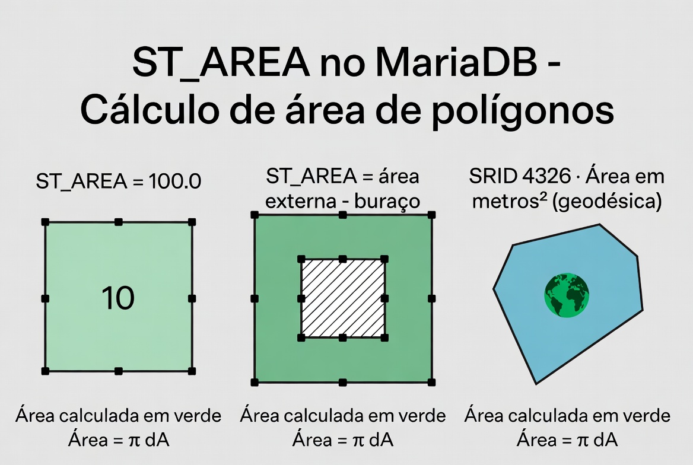
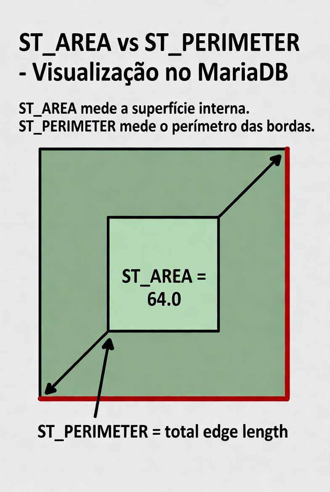

# ST_Area

A função `ST_AREA` (e seu sinônimo mais antigo `AREA`) é uma **função de propriedade** de geometrias poligonais. Ela calcula a **área** de um `POLYGON` ou `MULTIPOLYGON` e retorna um valor numérico do tipo `DOUBLE`.

É uma das funções espaciais mais usadas em análises geográficas, como:

- Calcular área de terrenos, cidades ou regiões.
- Medir áreas de influência após `ST_BUFFER`.
- Comparar tamanhos de polígonos.
- Cálculos de densidade (ex.: população por km²).

## Sintaxe oficial (MariaDB)

```sql
ST_AREA(g)
AREA(g)                    -- sinônimo antigo, ainda suportado
```

- **Parâmetro**:
  - `g`: Uma geometria do tipo `POLYGON` ou `MULTIPOLYGON` (ou que possa ser interpretada como tal). Pode vir de `ST_GEOMFROMTEXT`, coluna `GEOMETRY`, etc.

- **Retorno**:
  - Um número `DOUBLE` representando a área.
  - Unidade de medida: **a mesma unidade do sistema de coordenadas (SRID)** da geometria.
  - Retorna `0` para geometrias que não são polígonos (Point, LineString, etc.).
  - Retorna `NULL` se a geometria for `NULL` ou inválida de forma crítica.

## Como a área é calculada?

- **SRID = 0 (padrão cartesiano)**: Cálculo planar simples (fórmula de shoelace / surveyor's formula). A área é em unidades quadradas do que você armazenou (metros², graus², etc.).
- **SRID geográfico (ex.: 4326 - WGS84)**: O MariaDB/MySQL calcula a **área geodésica** (considerando a curvatura da Terra) e retorna o resultado em **metros quadrados** (m²). Isso é um comportamento mais moderno e preciso para coordenadas de latitude/longitude.
- **Polígonos com buracos** (interior rings): A área dos buracos é **subtraída** automaticamente da área externa.
- **MULTIPOLYGON**: Soma das áreas de todos os polígonos individuais.

**Atenção importante**:

- Se a geometria for **inválida** (self-intersecting, anéis não fechados corretamente, etc.), o resultado pode ser imprevisível (qualquer número) ou gerar erro.
- Para áreas muito grandes em coordenadas geográficas, o cálculo geodésico é mais preciso que simplesmente usar `ST_TRANSFORM` para UTM + `ST_AREA`.

## Exemplos práticos

```sql
-- 1. Área de um quadrado simples (SRID 0)
SET @quadrado = ST_GEOMFROMTEXT('POLYGON((0 0, 0 10, 10 10, 10 0, 0 0))');
SELECT ST_AREA(@quadrado);                    -- Retorna: 100.0

-- 2. Polígono com buraco (área externa menos buraco)
SET @com_buraco = ST_GEOMFROMTEXT('POLYGON((0 0, 0 10, 10 10, 10 0, 0 0), (2 2, 2 8, 8 8, 8 2, 2 2))');
SELECT ST_AREA(@com_buraco);                  -- Retorna: 100 - 36 = 64.0

-- 3. Exemplo com coordenadas geográficas (WGS84)
SET @brasil_aprox = ST_GEOMFROMTEXT('POLYGON(( -73 -33, -35 -33, -35 5, -73 5, -73 -33))', 4326);
SELECT ST_AREA(@brasil_aprox);                -- Retorna área aproximada em metros² (muito grande)

-- 4. Área zero para outros tipos
SET @ponto = ST_GEOMFROMTEXT('POINT(0 0)');
SELECT ST_AREA(@ponto);                       -- Retorna: 0.0
```

## Limitações e boas práticas no MariaDB

- Só funciona corretamente em `POLYGON` e `MULTIPOLYGON`. Outros tipos retornam 0.
- Geometrias inválidas podem dar resultados errados → sempre valide com `ST_ISVALID(g)` antes.
- Performance: Muito rápida, pois é um cálculo simples de propriedade. Pode ser usada em colunas indexadas espacialmente.
- Para precisão máxima em dados reais do Brasil (lat/long):
  - Prefira deixar no SRID 4326 e usar o cálculo geodésico automático do MariaDB.
  - Ou reprojete para um SRID projetado (ex.: UTM zona 23S ou 24S) e calcule em metros.
- Não confunda com `ST_PERIMETER` (que calcula o comprimento do contorno).

## Diferença entre ST_Area e funções relacionadas

| Função       | O que calcula            | Retorna para LineString | Unidade típica    |
| ------------ | ------------------------ | ----------------------- | ----------------- |
| ST_AREA      | Área interna do polígono | 0                       | unidades² do SRID |
| ST_PERIMETER | Comprimento do contorno  | 0                       | unidades do SRID  |
| ST_LENGTH    | Comprimento de linhas    | comprimento da linha    | unidades do SRID  |

## Representações visuais

Aqui estão diagramas educativos que mostram claramente como o `ST_AREA` funciona:




