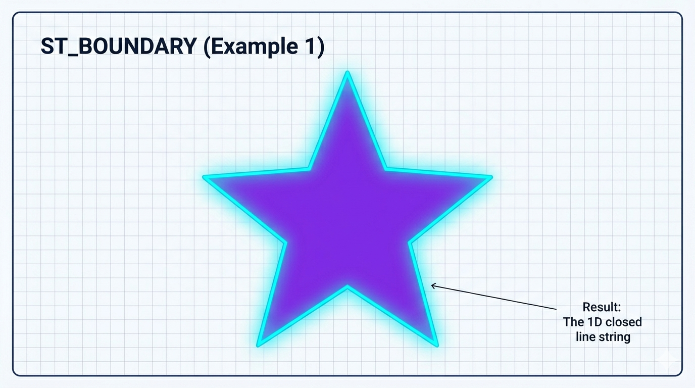
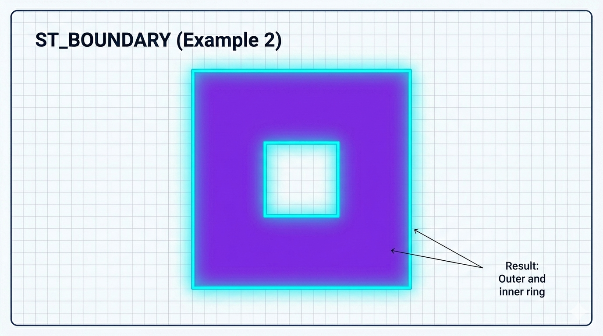

# ST_Boundary

A função `ST_BOUNDARY` retorna a **fronteira topológica** de uma geometria, ou seja, o contorno que separa o interior da geometria do seu exterior, seguindo o padrão OGC.

## Sintaxe

```sql
ST_BOUNDARY(geometria)
BOUNDARY(geometria)   -- sinônimo
```

**Retorno**: Uma geometria de dimensão inferior (geralmente `LINESTRING` ou `MULTILINESTRING`).

## Comportamento detalhado por tipo de geometria

| Tipo de Geometria        | O que ST_BOUNDARY retorna                            | Exemplo de resultado                    |
| ------------------------ | ---------------------------------------------------- | --------------------------------------- |
| **POINT**                | Geometria vazia                                      | EMPTY                                   |
| **MULTIPOINT**           | Geometria vazia                                      | EMPTY                                   |
| **LINESTRING**           | `MULTIPOINT` com os dois endpoints                   | MULTIPOINT(início, fim)                 |
| **POLYGON** (sem buraco) | `LINESTRING` com o anel exterior                     | LINESTRING(...)                         |
| **POLYGON** (com buraco) | `MULTILINESTRING` (anel exterior + todos os buracos) | MULTILINESTRING(anel_ext, buraco1, ...) |
| **MULTIPOLYGON**         | `MULTILINESTRING` com todas as bordas                | MULTILINESTRING(...)                    |
| **GEOMETRYCOLLECTION**   | Coleção das fronteiras de cada elemento              | GEOMETRYCOLLECTION(...)                 |

## Exemplos práticos

```sql
-- 1. Polígono simples (quadrado)
SET @quadrado = ST_GEOMFROMTEXT('POLYGON((0 0, 0 10, 10 10, 10 0, 0 0))');
SELECT ST_ASWKT(ST_BOUNDARY(@quadrado));
-- → LINESTRING(0 0, 0 10, 10 10, 10 0, 0 0)

-- 2. Polígono com um buraco (importante!)
SET @com_buraco = ST_GEOMFROMTEXT(
'POLYGON((0 0, 0 20, 20 20, 20 0, 0 0), 
         (5 5, 5 15, 15 15, 15 5, 5 5))');
SELECT ST_ASWKT(ST_BOUNDARY(@com_buraco));
-- → MULTILINESTRING(anel exterior, anel do buraco)

-- 3. Linha aberta
SET @linha = ST_GEOMFROMTEXT('LINESTRING(0 0, 10 10, 20 5)');
SELECT ST_ASWKT(ST_BOUNDARY(@linha));
-- → MULTIPOINT(0 0, 20 5)

-- 4. Ponto (não tem fronteira)
SET @ponto = ST_GEOMFROMTEXT('POINT(5 5)');
SELECT ST_IS_EMPTY(ST_BOUNDARY(@ponto));   -- Retorna 1 (verdadeiro)
```

## Comparação com funções semelhantes

- `ST_BOUNDARY(g)` → Fronteira completa (inclui buracos)
- `ST_ExteriorRing(g)` → Apenas o anel externo de um polígono simples
- `ST_PERIMETER(g)` → Comprimento numérico da fronteira
- `ST_LENGTH(ST_BOUNDARY(g))` → Forma equivalente de calcular perímetro total (incluindo buracos)

## Limitações importantes no MariaDB

- Retorna geometria vazia para pontos.
- Para polígonos com buracos, sempre retorna `MULTILINESTRING`.
- Não simplifica nem remove duplicatas automaticamente.
- Geometrias inválidas podem gerar resultados incorretos → use `ST_ISVALID()` antes.
- O cálculo é planar (depende do SRID).

## Representações visuais

Aqui estão diagramas claros e didáticos:




