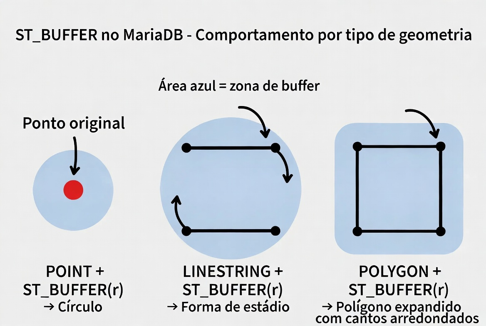
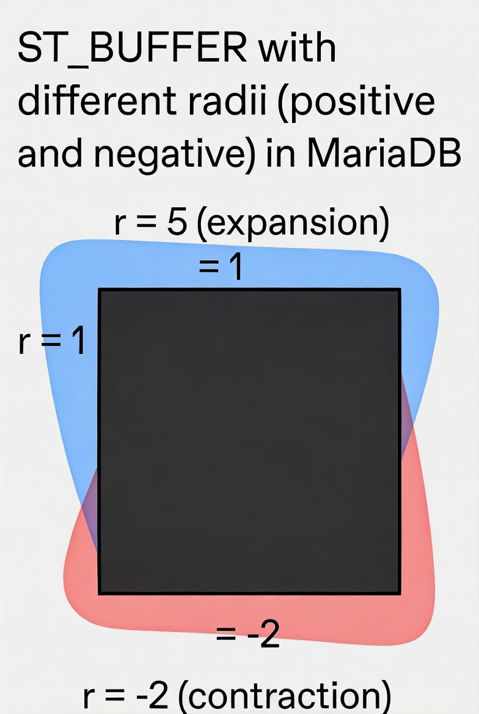

# ST_Buffer

A função `ST_BUFFER` (e seu sinônimo `BUFFER`) é uma das funções geométricas (espaciais) mais úteis do MariaDB.
Ela cria uma **zona de buffer** ao redor de qualquer geometria, ou seja, retorna uma nova geometria que representa **todos os pontos que estão a uma distância menor ou igual a um valor `r` da geometria original**.

Essa função é **padrão OGC** e faz parte do conjunto de funções espaciais do MariaDB (disponível desde as versões iniciais com suporte a dados espaciais).
É extremamente usada em aplicações de geoprocessamento, como:

- Criar áreas de influência (ex.: raio de 5 km ao redor de uma loja).
- Análise de proximidade (“quais pontos estão dentro de X metros de uma estrada?”).
- Geofencing.
- Expansão ou contração de polígonos.

## Sintaxe oficial

```sql
ST_BUFFER(g1, r)
BUFFER(g1, r)          -- sinônimo exato, não-padrão
```

- **Retorno**: sempre uma área fechada `POLYGON` ou `MULTIPOLYGON` (nunca o tipo original).

## Como a distância é calculada?

- A distância `r` é medida **no sistema de coordenadas da geometria** (SRID).
- O buffer é calculado usando algoritmos de geometria planar (baseados na biblioteca interna do MariaDB/MySQL).

## Comportamento por tipo de geometria

Aqui está o que acontece com cada tipo principal (é o coração da função):

1. **POINT** → Buffer circular (aproximado por polígono)
   - Resultado: um polígono com muitos lados que parece um círculo perfeito.
   - Útil para “círculo de raio X ao redor de um ponto”.

2. **LINESTRING** ou **MULTILINESTRING** → Forma de “salsicha” ou “estádio”
   - O buffer cria um retângulo ao longo da linha + semicírculos nas extremidades.
   - Em curvas, os cantos são arredondados.

3. **POLYGON** ou **MULTIPOLYGON** → Polígono expandido com cantos arredondados
   - O buffer “engrossa” o polígono para fora em `r` unidades.
   - Cantos externos ficam arredondados (raio = `r`).
   - Se `r` for negativo → contração (buffer interno). Se o buffer interno for maior que o polígono, pode retornar geometria vazia ou nula.

4. **GEOMETRYCOLLECTION** → Buffer de cada elemento + união
   - Aplica o buffer em cada geometria e faz a união do resultado.

**Observação importante**: O MariaDB sempre retorna um buffer **externo** suave (rounded corners). Não há parâmetro oficial de “estilo” (join style, cap style, etc.) como existe no PostGIS ou no MySQL 8+ com `ST_Buffer_Strategy`. A documentação oficial do MariaDB mostra apenas os dois parâmetros.

## Exemplos práticos

```sql
-- 1. Buffer ao redor de um ponto (círculo)
SET @ponto = ST_GEOMFROMTEXT('POINT(0 0)');
SELECT ST_ASWKT(ST_BUFFER(@ponto, 5));
-- Resultado aproximado: POLYGON com muitos pontos formando círculo de raio 5

-- 2. Buffer ao redor de uma linha
SET @linha = ST_GEOMFROMTEXT('LINESTRING(0 0, 10 0)');
SELECT ST_ASWKT(ST_BUFFER(@linha, 3));
-- Resultado: forma de salsicha com largura 6 (3 para cada lado)

-- 3. Buffer ao redor de um polígono (exemplo da documentação oficial)
SET @g1 = ST_GEOMFROMTEXT('POLYGON((10 10, 10 20, 20 20, 20 10, 10 10))');
SET @g2 = ST_GEOMFROMTEXT('POINT(8 8)');

SELECT ST_WITHIN(@g2, ST_BUFFER(@g1, 5));   -- 1 (dentro do buffer)
SELECT ST_WITHIN(@g2, ST_BUFFER(@g1, 1));   -- 0 (fora do buffer)
```

## Limitações e boas práticas no MariaDB

- **Performance**: Buffers complexos (polígonos com muitas vértices ou linhas longas) podem ser pesados. Use índices espaciais (`SPATIAL INDEX`) e teste com `EXPLAIN`.
- **Precisão**: O círculo é aproximado (não é um círculo matemático perfeito). Quanto maior o número de vértices internos, mais preciso fica (mas mais lento).
- **SRID 4326**: Evite buffers grandes diretamente em lat/long. Reprojete para UTM ou outro sistema métrico antes.
- **Buffer negativo**: Funciona em polígonos, mas pode gerar geometrias inválidas se o polígono for muito pequeno.
- **Versão**: A documentação atual do MariaDB (até as versões mais recentes) mostra apenas a forma simples. Não há suporte documentado ao terceiro parâmetro de “strategy” que aparece em alguns tutoriais MySQL.

## Representações visuais

Abaixo estão diagramas educativos gerados para ilustrar exatamente como o `ST_BUFFER` se comporta em cada tipo de geometria:




