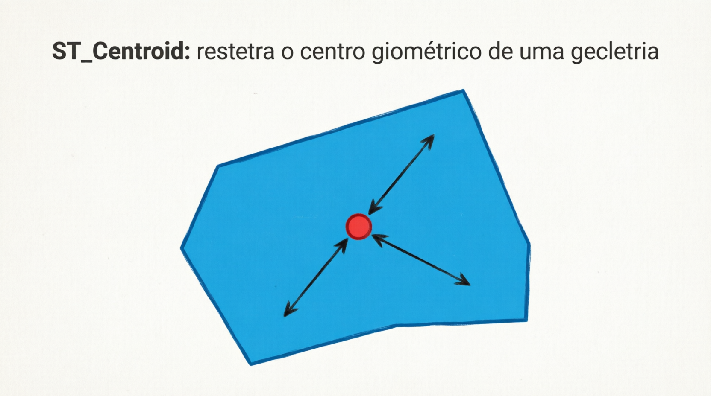
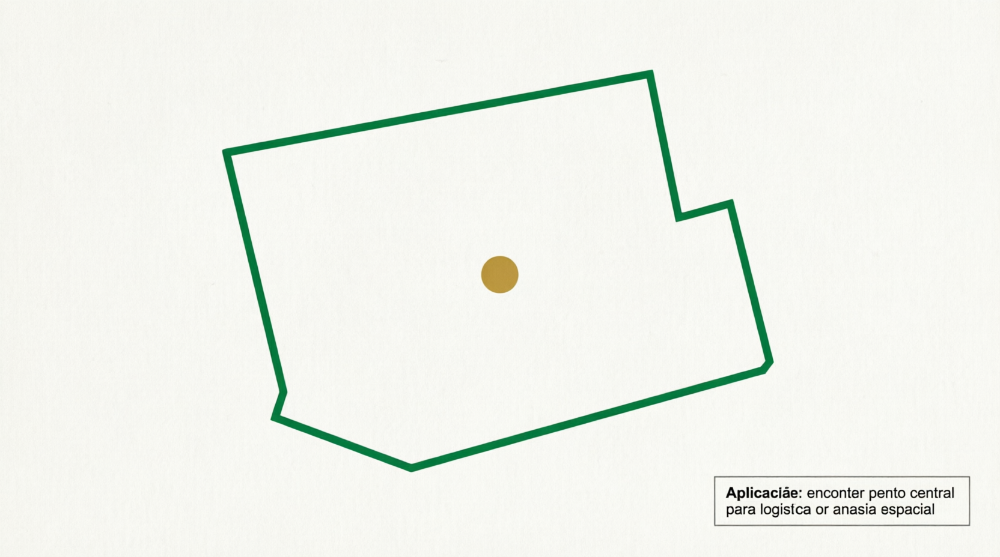

# ST_Centroid

A função `ST_CENTROID` (sinônimo: `CENTROID`) calcula o **centroide** (centro geométrico ou centro de massa) de uma geometria, retornando um ponto `POINT`.

Ela é amplamente usada para:

- Colocar rótulos (labels) no centro de regiões em mapas.
- Calcular o “centro” de áreas para análises de proximidade.
- Encontrar o centro aproximado de polígonos irregulares.
- Análises estatísticas espaciais.

## Sintaxe oficial (MariaDB)

```sql
ST_CENTROID(g)
CENTROID(g)                    -- sinônimo
```

- **Parâmetro**:
  - `g`: Uma geometria válida, principalmente `POLYGON` ou `MULTIPOLYGON`. Também funciona com `GEOMETRYCOLLECTION` (usa o componente de maior dimensão).

- **Retorno**:
  - Um `POINT` com o centroide.
  - Mantém o mesmo SRID da geometria de entrada.
  - Retorna `NULL` se a entrada for `NULL`.
  - Para geometrias vazias → ponto vazio.
  - **Importante**: O centroide **nem sempre** fica dentro do polígono (especialmente em formas côncavas ou em “U”, “C”, “L”).

## Como o centroide é calculado?

O centroide é o **centro de massa** ponderado:

- Para um polígono simples → média ponderada das coordenadas, considerando a área.
- Para `MULTIPOLYGON` → centroide ponderado de todos os polígonos.
- Para `GEOMETRYCOLLECTION` → considera apenas os componentes de maior dimensão (polígonos > linhas > pontos).

**Fórmula básica** (para polígonos simples): usa a fórmula do centroide de polígono (baseada em decomposição em triângulos ou fórmula de shoelace adaptada).

## Exemplos práticos

```sql
-- 1. Centroide de um quadrado simples
SET @quadrado = ST_GEOMFROMTEXT('POLYGON((0 0, 0 20, 20 20, 20 0, 0 0))');
SELECT ST_ASWKT(ST_CENTROID(@quadrado));
-- Resultado: POINT(10 10)  → centro exato

-- 2. Polígono irregular (centroide pode ficar fora)
SET @irregular = ST_GEOMFROMTEXT('POLYGON((0 0, 10 0, 10 1, 1 1, 1 10, 0 10, 0 0))');  -- forma de "L"
SELECT ST_ASWKT(ST_CENTROID(@irregular));
-- O ponto pode ficar fora do polígono!

-- 3. MULTIPOLYGON
SET @multi = ST_GEOMFROMTEXT('MULTIPOLYGON(((0 0,0 5,5 5,5 0,0 0)),((10 10,10 15,15 15,15 10,10 10)))');
SELECT ST_ASWKT(ST_CENTROID(@multi));

-- 4. Comparação com ponto garantido dentro do polígono
SELECT 
  ST_ASWKT(ST_CENTROID(@irregular)) AS centroid,
  ST_ASWKT(ST_POINTONSURFACE(@irregular)) AS ponto_garantido_dentro;
```

## Limitações importantes no MariaDB

- O centroide **pode ficar fora** do polígono em formas côncavas ou muito irregulares.  
  → Use `ST_POINTONSURFACE(g)` quando precisar de um ponto **garantido dentro** da superfície (é mais lento, mas sempre válido).
- Funciona melhor em `POLYGON` e `MULTIPOLYGON`. Para linhas ou pontos, o comportamento segue a maior dimensão na coleção.
- Cálculo é **planar** (depende do SRID). Em SRID 4326 (lat/long), não considera a curvatura da Terra.
- Geometrias inválidas podem gerar resultados errados → valide com `ST_ISVALID(g)` antes.
- Não é uma função agregada. Para centroide de múltiplas linhas/colunas, use `ST_UNION` primeiro.

## Comparação: ST_CENTROID vs ST_POINTONSURFACE

| Característica       | ST_CENTROID                        | ST_POINTONSURFACE                |
| -------------------- | ---------------------------------- | -------------------------------- |
| Velocidade           | Muito rápida                       | Mais lenta                       |
| Ponto sempre dentro? | Não (pode ficar fora)              | Sim (garantido na superfície)    |
| Uso recomendado      | Rótulos rápidos, centro aproximado | Quando o ponto deve estar dentro |
| Precisão visual      | Bom para formas convexas           | Melhor para formas irregulares   |

## Representações visuais

Aqui estão diagramas educativos que mostram o comportamento da função:




