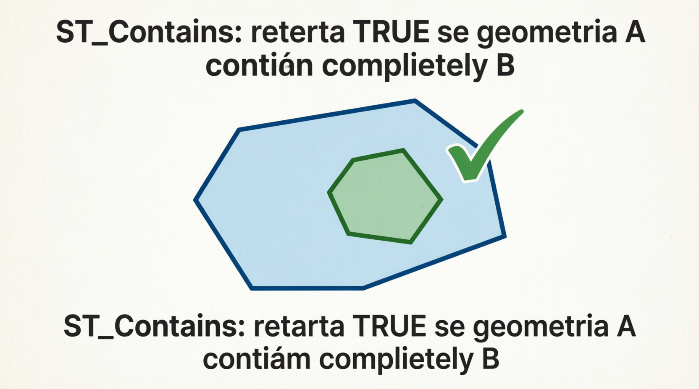
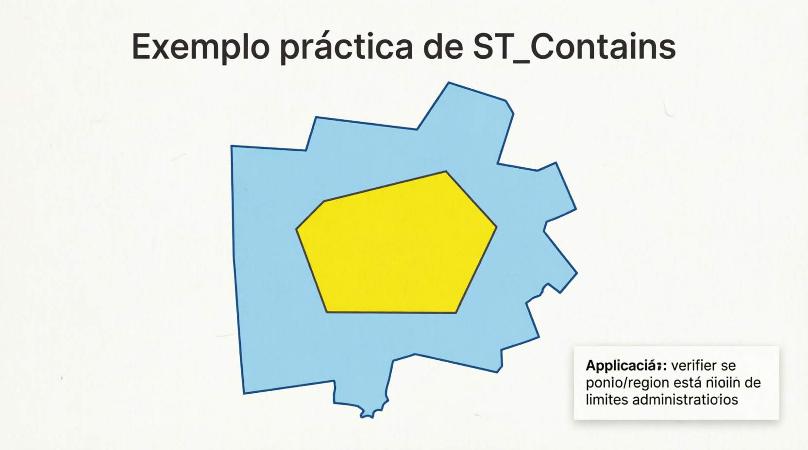

# ST_Contains

A função `ST_CONTAINS` é uma **função de relacionamento espacial** (spatial predicate) do padrão OGC. Ela verifica se a geometria `g1` **contém completamente** a geometria `g2`.

- Retorna **1 (TRUE)** se todos os pontos de `g2` estiverem dentro ou na borda de `g1` (incluindo o caso em que as geometrias são iguais).
- Retorna **0 (FALSE)** caso contrário.
- É o **inverso** da função `ST_WITHIN`: se `ST_CONTAINS(g1, g2) = 1`, então `ST_WITHIN(g2, g1) = 1`.

**Importante**: `ST_CONTAINS` usa a **forma real** das geometrias (shape), não apenas o bounding box (diferente da função antiga `CONTAINS`, sem o prefixo ST).

```sql
ST_CONTAINS(g1, g2)
```

- `g1`: Geometria que deve conter (geralmente um `POLYGON` ou `MULTIPOLYGON`).
- `g2`: Geometria que deve estar contida (pode ser `POINT`, `LINESTRING`, `POLYGON`, etc.).
- Retorno: `1`, `0` ou `NULL` (se alguma geometria for inválida ou `NULL`).

## Definição formal (DE-9IM)

`ST_CONTAINS(g1, g2)` é verdadeiro quando:

- O interior de `g2` está completamente dentro do interior ou borda de `g1`.
- Não há pontos de `g2` no exterior de `g1`.

## Exemplos práticos

```sql
-- 1. Ponto dentro de um polígono
SET @pol = ST_GEOMFROMTEXT('POLYGON((0 0, 0 10, 10 10, 10 0, 0 0))');
SET @ponto_dentro = ST_GEOMFROMTEXT('POINT(5 5)');
SET @ponto_fora   = ST_GEOMFROMTEXT('POINT(15 5)');

SELECT ST_CONTAINS(@pol, @ponto_dentro);   -- 1 (TRUE)
SELECT ST_CONTAINS(@pol, @ponto_fora);     -- 0 (FALSE)

-- 2. Polígono contendo outro polígono
SET @grande = ST_GEOMFROMTEXT('POLYGON((0 0, 0 20, 20 20, 20 0, 0 0))');
SET @pequeno = ST_GEOMFROMTEXT('POLYGON((5 5, 5 15, 15 15, 15 5, 5 5))');
SELECT ST_CONTAINS(@grande, @pequeno);     -- 1

-- 3. Uso comum em tabelas (ex.: qual cidade contém este ponto?)
SELECT nome_cidade 
FROM cidades 
WHERE ST_CONTAINS(geom_cidade, ST_GEOMFROMTEXT('POINT(-46.6333 -23.5505)', 4326));
```

## Diferenças importantes

| Função             | Verifica                                   | Ordem dos argumentos          | Uso típico                             |
| ------------------ | ------------------------------------------ | ----------------------------- | -------------------------------------- |
| ST_CONTAINS(g1,g2) | g1 contém completamente g2                 | g1 = continente, g2 = contido | "Qual polígono contém este ponto?"     |
| ST_WITHIN(g1,g2)   | g1 está completamente dentro de g2         | Inverso                       | "Este ponto está dentro de qual zona?" |
| ST_INTERSECTS      | Existe qualquer contato ou sobreposição    | Não importa                   | "Se tocam de alguma forma"             |
| ST_TOUCHES         | Tocam apenas na borda (sem interior comum) | Não importa                   | "Apenas tocam na borda"                |

**Dica**: As duas funções são simétricas no resultado, mas a ordem dos parâmetros muda o significado.

## Limitações e boas práticas no MariaDB

- **Performance**: Use **índice espacial** (`SPATIAL INDEX`) na coluna de geometria. O otimizador do MariaDB usa o índice com `ST_CONTAINS`.
- **Geometrias inválidas**: Podem retornar resultados incorretos → valide com `ST_ISVALID(g)` antes.
- **SRID 4326 (lat/long)**: O teste é planar. Para polígonos muito grandes ou que cruzam o antimeridiano, pode haver imprecisões.
- **Pontos na borda**: São considerados "dentro" (contidos).
- **Polígonos com buracos**: O ponto deve estar na área válida (não dentro de buracos).
- **Recomendação para buscas de proximidade**: Combine com `ST_DISTANCE_SPHERE` ou filtro de bounding box para melhor performance em tabelas grandes.

## Representações visuais

Aqui estão diagramas educativos que mostram exatamente quando `ST_CONTAINS` retorna 1 ou 0:




