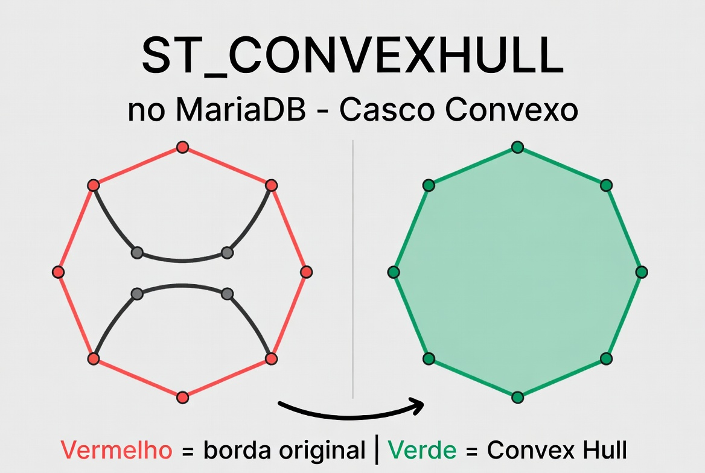
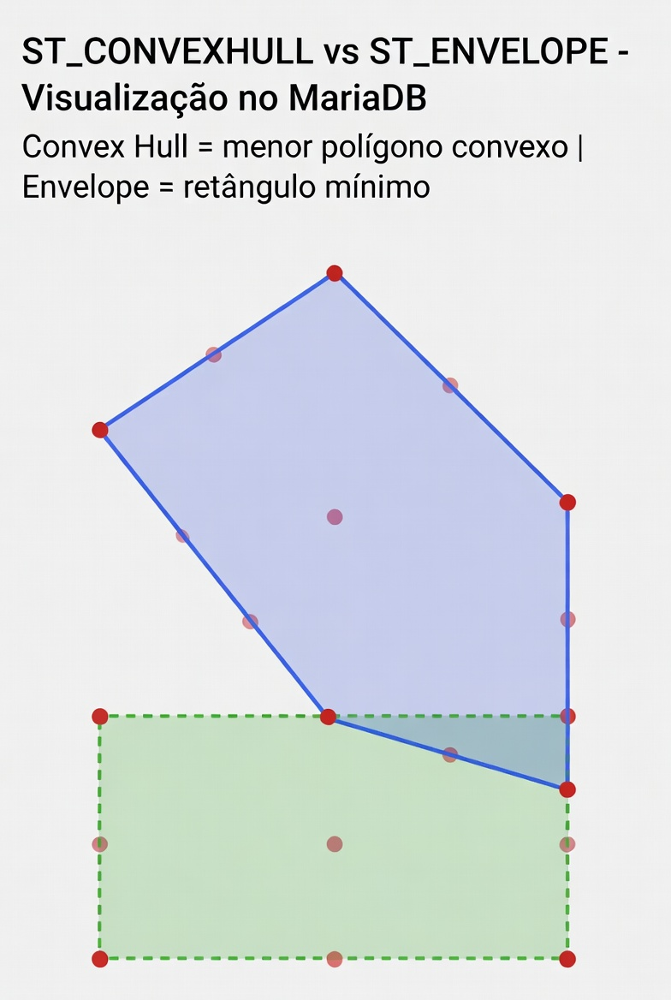

# ST_ConvexHull

A função `ST_CONVEXHULL` (sinônimo: `CONVEXHULL`) é uma **função construtora de geometria** que calcula o **casco convexo** (convex hull) de uma geometria fornecida.

O **casco convexo** é o menor polígono convexo que contém completamente todos os pontos da geometria original. Em termos simples: é como esticar uma borracha elástica ao redor de todos os pontos — o formato final que a borracha assume é o convex hull.

Essa função é muito usada em:

- Simplificação de formas complexas (reduz número de vértices mantendo o “envelope” externo).
- Análise de cluster de pontos.
- Cálculo de áreas mínimas que envolvem um conjunto de objetos.
- Preparação de geometrias para visualização ou otimização de consultas espaciais.

## Sintaxe oficial (MariaDB)

```sql
ST_CONVEXHULL(g)
CONVEXHULL(g)              -- sinônimo exato
```

- **Parâmetro**:
  - `g`: Qualquer geometria válida (POINT, LINESTRING, POLYGON, MULTIPOINT, MULTILINESTRING, MULTIPOLYGON, GEOMETRYCOLLECTION).

- **Retorno**:
  - Um `POLYGON` (ou `MULTIPOLYGON` em casos raros).
  - Se a entrada for um único ponto → retorna o mesmo ponto.
  - Se todos os pontos forem colineares → retorna uma `LINESTRING` (degenerada).
  - Se a geometria estiver vazia → retorna geometria vazia.
  - Retorna `NULL` se a entrada for `NULL`.

## Comportamento por tipo de geometria

- **POINT** → Retorna o próprio ponto.
- **LINESTRING** → Se os pontos não forem colineares → POLYGON que envolve a linha como um “envelope convexo”. Se colineares → retorna LINESTRING.
- **POLYGON** (mesmo côncavo) → Remove as concavidades, retorna o polígono convexo mínimo que contém o original.
- **MULTIPOINT** ou coleção de pontos → Polígono convexo envolvendo todos os pontos (como um “casco” ao redor de um conjunto de pontos).
- **GEOMETRYCOLLECTION** → Casco convexo de todos os elementos combinados.

**Características importantes**:

- O resultado é sempre **convexo** (todas as linhas internas entre pontos estão dentro do polígono).
- Reduz significativamente o número de vértices em geometrias côncavas ou complexas.
- O cálculo é planar (baseado no SRID). Para SRID geográfico (4326), o MariaDB trata como plano cartesiano (não considera curvatura da Terra). Para precisão em grandes áreas, considere reprojeção.

## Exemplos práticos

```sql
-- 1. Polígono côncavo → Convex Hull (remove a "entrada")
SET @côncavo = ST_GEOMFROMTEXT('POLYGON((0 0, 0 10, 5 5, 10 10, 10 0, 0 0))');
SELECT ST_ASWKT(ST_CONVEXHULL(@côncavo));
-- Resultado esperado: POLYGON((0 0, 0 10, 10 10, 10 0, 0 0))  → quadrado simples

-- 2. Conjunto de pontos
SET @pontos = ST_GEOMFROMTEXT('MULTIPOINT(0 0, 10 1, 5 8, 2 3)');
SELECT ST_ASWKT(ST_CONVEXHULL(@pontos));
-- Retorna o polígono convexo que envolve todos os 4 pontos

-- 3. Linha colinear
SET @linha = ST_GEOMFROMTEXT('LINESTRING(0 0, 5 5, 10 10)');
SELECT ST_ASWKT(ST_CONVEXHULL(@linha));   -- Retorna LINESTRING (não POLYGON)
```

## Limitações e boas práticas no MariaDB

- Geometrias inválidas podem produzir resultados imprevisíveis → valide com `ST_ISVALID(g)` antes.
- Não é uma função agregada. Para calcular o casco convexo de múltiplas linhas/colunas, use primeiro `ST_UNION` ou `ST_COLLECT` e depois `ST_CONVEXHULL`.
- Performance: Muito eficiente para geometrias com poucos milhares de vértices. Para milhões de pontos, pode ser custoso (algoritmo geralmente O(n log n)).
- SRID: O resultado mantém o mesmo SRID da geometria de entrada.
- Não há parâmetros extras (como precisão ou estilo) — é uma implementação padrão simples.

## Diferença com funções semelhantes

| Função        | O que faz                                      | Resultado típico    |
| ------------- | ---------------------------------------------- | ------------------- |
| ST_CONVEXHULL | Menor polígono convexo que envolve tudo        | POLYGON convexo     |
| ST_ENVELOPE   | Retângulo alinhado com os eixos (Bounding Box) | POLYGON retangular  |
| ST_BUFFER     | Área ao redor com distância fixa               | POLYGON arredondado |
| ST_UNION      | União das geometrias                           | Pode ser côncavo    |

`ST_CONVEXHULL` é mais “apertado” que o envelope retangular quando os pontos formam um formato diagonal.

## Representações visuais

Aqui estão diagramas que ilustram perfeitamente o conceito:





## Resumindo

**Conceito básico (intuição)**:

- Imagine vários pontos espalhados no mapa
- O **Convex Hull** conecta apenas os pontos mais externos
- O resultado é um **polígono sem “reentrâncias” (sempre convexo)**

**Exemplos**:

1. Pontos simples
   - Explicação:
     - Pontos internos são ignorados
     - Apenas os pontos “da borda” formam o polígono
     - Resultado: um polígono envolvendo tudo
   - Aplicação
     - Definir área de atuação
     - Agrupar pontos GPS
     - Delimitar regiões automaticamente

   |                                             |                                             |                                             |
   | ------------------------------------------- | ------------------------------------------- | ------------------------------------------- |
   |  |  |  |
   |  |  |  |

2. Forma com “reentrância”
   - Explicação:
     - A forma original tem “buracos” ou curvas para dentro
     - O Convex Hull ignora essas reentrâncias
     - Ele “estica” e cria uma forma convexa
   - Aplicação
     - Simplificar geometria complexa
     - Melhorar performance em cálculos espaciais
     - Criar bounding areas

   |                                             |                                             |                                             |
   | ------------------------------------------- | ------------------------------------------- | ------------------------------------------- |
   |  |  |  |
   |  |  |                                             |

3. Uso real (GPS / mapa)
   - Explicação:
     - Vários pontos de usuários ou dispositivos
     - Convex Hull cria uma área de cobertura automática
   - Aplicação
     - Área de entrega (delivery)
     - Cobertura de sinal
     - Região de atuação de equipe

   |                                             |                                             |                                             |
   | ------------------------------------------- | ------------------------------------------- | ------------------------------------------- |
   |  |  |  |
   |  |  |  |

## ⚠️ Limitação importante

O Convex Hull **não respeita buracos internos**
👉 Se você precisa de algo mais preciso (com reentrâncias), o ideal é usar:

- `Concave Hull` (não nativo no MariaDB)
- ou lógica customizada
