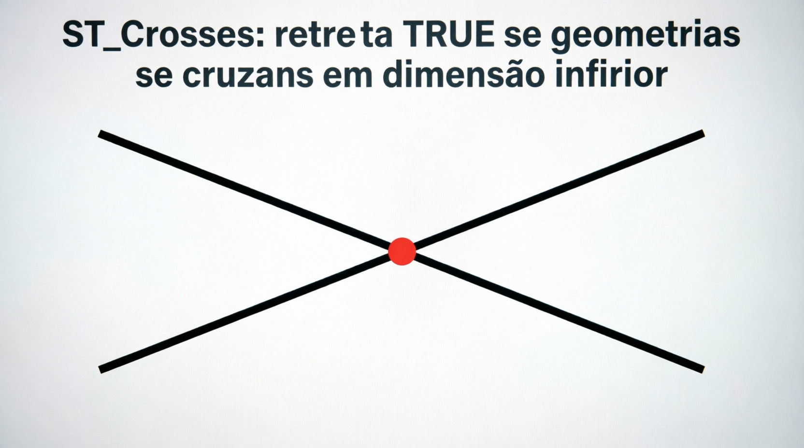
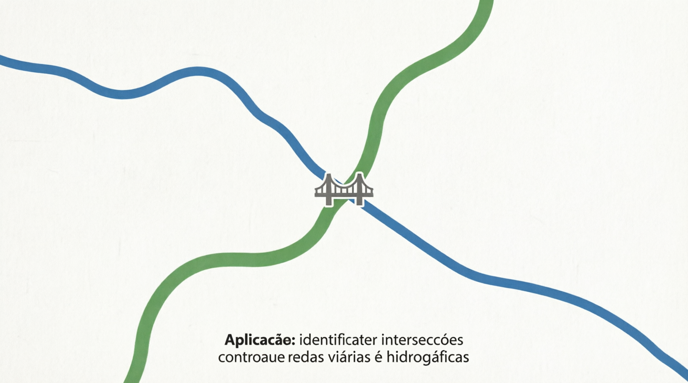

# ST_Crosses

A função `ST_CROSSES` é uma **função de relacionamento espacial** (spatial predicate) do padrão OGC. Ela verifica se duas geometrias **se cruzam** de forma específica: ou seja, elas se intersectam, mas **nenhuma contém completamente a outra**, e a interseção tem **dimensão inferior** à maior dimensão das duas geometrias.

Em termos práticos:

- Retorna **1 (TRUE)** quando as geometrias se "cruzam" propriamente (ex.: uma linha que atravessa o interior de um polígono, ou duas linhas que se cruzam no meio).
- Retorna **0 (FALSE)** se as geometrias apenas se tocam na borda, se uma contém a outra, se não se intersectam, ou se a interseção não atende ao critério dimensional.

`ST_CROSSES` usa a **forma real** das geometrias (shape), diferente da função antiga `CROSSES()` (sem prefixo ST), que usava apenas bounding boxes.

## Sintaxe oficial (MariaDB)

```sql
ST_CROSSES(g1, g2)
```

- `g1` e `g2`: Duas geometrias válidas.
- Retorno: `1` (TRUE), `0` (FALSE) ou `NULL` (se alguma geometria for inválida ou NULL).

## Quando ST_CROSSES retorna 1 (TRUE)?

O critério principal é:

- As geometrias têm **alguns pontos interiores em comum**.
- A **dimensão da interseção** é **menor** que a dimensão máxima das duas geometrias.
- Nenhuma geometria contém completamente a outra.

**Casos clássicos onde retorna 1:**

- Uma **LINESTRING** que atravessa o **interior** de um **POLYGON** (cruza de um lado para o outro).
- Duas **LINESTRING** que se cruzam em um ponto interior (não apenas na extremidade).
- Uma **LINESTRING** que cruza uma **MULTILINESTRING**.
- Um **MULTIPOINT** que tem pontos dentro e fora de um polígono de forma que "cruza".

**Casos onde retorna 0 (FALSE):**

- Duas linhas que apenas se tocam na extremidade (ST_TOUCHES).
- Uma linha completamente dentro de um polígono (ST_WITHIN).
- Uma linha que apenas toca a borda do polígono sem entrar no interior.
- Dois polígonos que se sobrepõem (use ST_OVERLAPS ou ST_INTERSECTS).
- Geometrias que não se intersectam (ST_DISJOINT).

## Exemplos práticos

```sql
-- 1. Linha cruzando um polígono (caso clássico)
SET @pol = ST_GEOMFROMTEXT('POLYGON((0 0, 0 10, 10 10, 10 0, 0 0))');
SET @linha_cruzando = ST_GEOMFROMTEXT('LINESTRING(-2 5, 12 5)');   -- atravessa de lado a lado
SET @linha_dentro    = ST_GEOMFROMTEXT('LINESTRING(2 2, 8 8)');    -- completamente dentro

SELECT ST_CROSSES(@pol, @linha_cruzando);   -- 1 (TRUE)
SELECT ST_CROSSES(@pol, @linha_dentro);     -- 0 (FALSE) → está dentro

-- 2. Duas linhas se cruzando no meio
SET @l1 = ST_GEOMFROMTEXT('LINESTRING(0 0, 10 10)');
SET @l2 = ST_GEOMFROMTEXT('LINESTRING(0 10, 10 0)');
SELECT ST_CROSSES(@l1, @l2);                -- 1 (TRUE)

-- 3. Linha tocando apenas a borda
SET @linha_toque = ST_GEOMFROMTEXT('LINESTRING(-2 0, 5 0)');
SELECT ST_CROSSES(@pol, @linha_toque);      -- 0 (FALSE) → apenas toca a borda
```

## Comparação com outras funções

| Função               | Retorna 1 quando...                                        | Uso típico                       |
| -------------------- | ---------------------------------------------------------- | -------------------------------- |
| ST_CROSSES           | Cruzam propriamente (interseção interior + dimensão menor) | Linhas cruzando polígonos/linhas |
| ST_INTERSECTS        | Qualquer tipo de contato ou sobreposição                   | "Se tocam de alguma forma"       |
| ST_TOUCHES           | Tocam apenas na borda (sem interior comum)                 | "Apenas encostam"                |
| ST_OVERLAPS          | Sobreposição parcial com mesma dimensão                    | Polígonos que se sobrepõem       |
| ST_WITHIN / CONTAINS | Uma está completamente dentro da outra                     | "Está dentro"                    |

**Regra prática**: Use `ST_CROSSES` quando quiser detectar **cruzamentos reais** (ex.: estradas que cortam áreas, linhas que atravessam regiões).

## Limitações e boas práticas no MariaDB

- Funciona melhor com combinações **LINESTRING/POLYGON**, **LINESTRING/LINESTRING** e **MULTIPOINT/POLYGON**.
- Não é recomendado para dois polígonos (use `ST_OVERLAPS` ou `ST_INTERSECTS`).
- Performance: Use índice espacial (`SPATIAL INDEX`). Combine com `ST_INTERSECTS` primeiro para filtrar.
- Geometrias inválidas podem dar resultados inconsistentes → valide com `ST_ISVALID()`.
- SRID 4326: O teste é planar. Para grandes áreas, reprojete se necessário.
- Existe a versão antiga `CROSSES()` (baseada em bounding box) — prefira sempre `ST_CROSSES()` para precisão.

## Representações visuais

Aqui estão diagramas que mostram claramente quando `ST_CROSSES` retorna **1** ou **0**:




