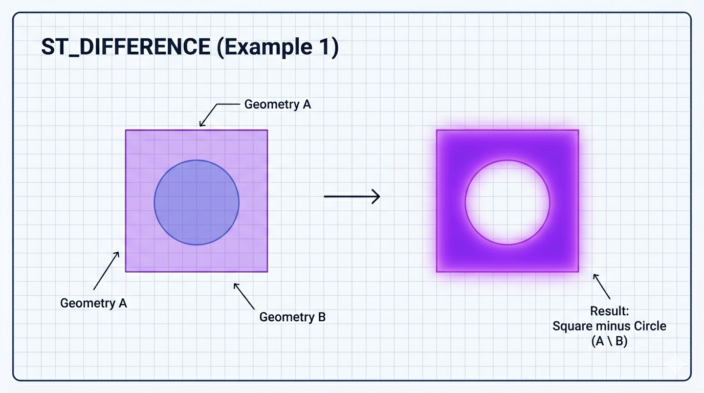
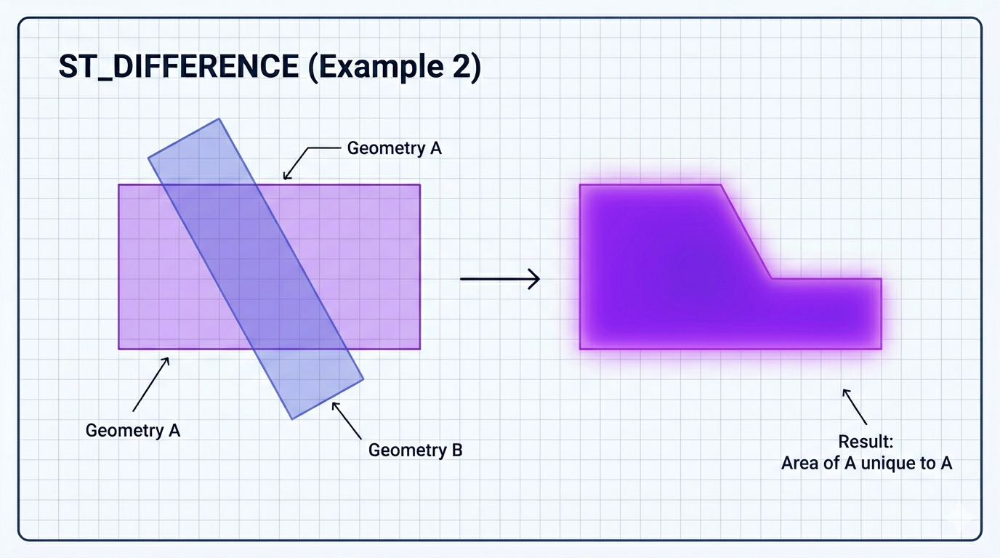

# ST_Difference

A função `ST_DIFFERENCE` é uma **função construtora de geometria** do padrão OGC. Ela retorna a **diferença** entre duas geometrias: **a parte de `g1` que não está em `g2`**.

Em palavras simples:  
`g1` menos `g2` → remove da primeira geometria tudo que se sobrepõe ou está contido na segunda.

É o equivalente geométrico da operação de **subtração** (set difference).  
Diferente de `ST_SYMDIFFERENCE` (que é XOR e simétrica), `ST_DIFFERENCE` é **direcionada**: a ordem dos parâmetros importa.

```sql
ST_DIFFERENCE(g1, g2)
```

- **Parâmetros**:
  - `g1`: Geometria da qual será subtraída (a “base”).
  - `g2`: Geometria que será removida de `g1`.

- **Retorno**:
  - Uma geometria (geralmente `POLYGON`, `MULTIPOLYGON`, `LINESTRING`, `MULTILINESTRING`, `GEOMETRYCOLLECTION` ou geometria vazia).
  - Mantém o mesmo SRID de `g1`.
  - Retorna `NULL` se alguma entrada for `NULL`.
  - Se `g2` cobrir completamente `g1`, retorna **geometria vazia**.

## Comportamento por tipo de geometria

- **POLYGON - POLYGON**: Remove a sobreposição ou a parte interna → geralmente `POLYGON` ou `MULTIPOLYGON`.
- **POLYGON - LINESTRING**: Corta o polígono ao longo da linha (se a linha cruzar).
- **LINESTRING - POLYGON**: Remove o trecho da linha que está dentro do polígono.
- **Ponto dentro de polígono**: Remove o ponto → geometria vazia.
- **Polígono com buraco criado**: Se `g2` estiver completamente dentro de `g1`, o resultado terá um buraco interno.

## Exemplos práticos

```sql
-- 1. Polígono menos outro polígono sobreposto
SET @p1 = ST_GEOMFROMTEXT('POLYGON((0 0, 0 10, 10 10, 10 0, 0 0))');   -- quadrado grande
SET @p2 = ST_GEOMFROMTEXT('POLYGON((5 5, 5 15, 15 15, 15 5, 5 5))');   -- quadrado que sobrepõe

SELECT ST_ASWKT(ST_DIFFERENCE(@p1, @p2));
-- Resultado: O quadrado grande com um "pedaço" removido no canto superior direito

-- 2. Polígono grande menos polígono pequeno dentro dele (cria buraco)
SET @grande = ST_GEOMFROMTEXT('POLYGON((0 0, 0 20, 20 20, 20 0, 0 0))');
SET @pequeno = ST_GEOMFROMTEXT('POLYGON((5 5, 5 15, 15 15, 15 5, 5 5))');
SELECT ST_ASWKT(ST_DIFFERENCE(@grande, @pequeno));
-- Resultado: Polígono com um buraco interno (interior ring)

-- 3. Linha cortada por um polígono
SET @linha = ST_GEOMFROMTEXT('LINESTRING(0 5, 20 5)');
SET @pol = ST_GEOMFROMTEXT('POLYGON((8 0, 8 10, 12 10, 12 0, 8 0))');
SELECT ST_ASWKT(ST_DIFFERENCE(@linha, @pol));
-- Resultado: MULTILINESTRING com dois segmentos (antes e depois do polígono)

-- 4. Caso de diferença total
SELECT ST_IS_EMPTY(ST_DIFFERENCE(@pequeno, @grande));   -- 1 (TRUE) → vazio
```

## Comparação completa das funções de conjunto

| Função           | Operação              | Ordem importa?  | O que retorna                  | Resultado comum                  |
| ---------------- | --------------------- | --------------- | ------------------------------ | -------------------------------- |
| ST_UNION         | g1 ∪ g2 (OR)          | Não             | Tudo que está em g1 ou g2      | União sem duplicatas             |
| ST_INTERSECTION  | g1 ∩ g2 (AND)         | Não             | Apenas a parte comum           | Sobreposição                     |
| ST_SYMDIFFERENCE | (g1 ∪ g2) - (g1 ∩ g2) | Não (simétrica) | Partes exclusivas (XOR)        | "Luas" ou partes não sobrepostas |
| ST_DIFFERENCE    | g1 - g2               | **Sim**         | Parte de g1 que não está em g2 | Subtração direcionada            |

## Limitações e boas práticas no MariaDB

- **Direção importa**: `ST_DIFFERENCE(g1, g2) ≠ ST_DIFFERENCE(g2, g1)`.
- **Geometrias inválidas**: Podem gerar resultados inválidos ou vazios. Sempre valide com `ST_ISVALID(g1)` e `ST_ISVALID(g2)`.
- **Performance**: Computacionalmente mais pesada. Recomenda-se filtrar antes com `ST_INTERSECTS(g1, g2)` quando possível.
- **SRID 4326**: Cálculo planar (não geodésico). Para grandes áreas no Brasil, reprojete para UTM antes.
- **Resultado com buracos**: Quando `g2` está completamente dentro de `g1`, o buraco é criado automaticamente como interior ring.
- **Dica útil**: Após `ST_DIFFERENCE`, muitas vezes vale aplicar `ST_SIMPLIFY` para limpar vértices desnecessários.

## Representações visuais

Aqui estão diagramas educativos que mostram exatamente o comportamento da função:




