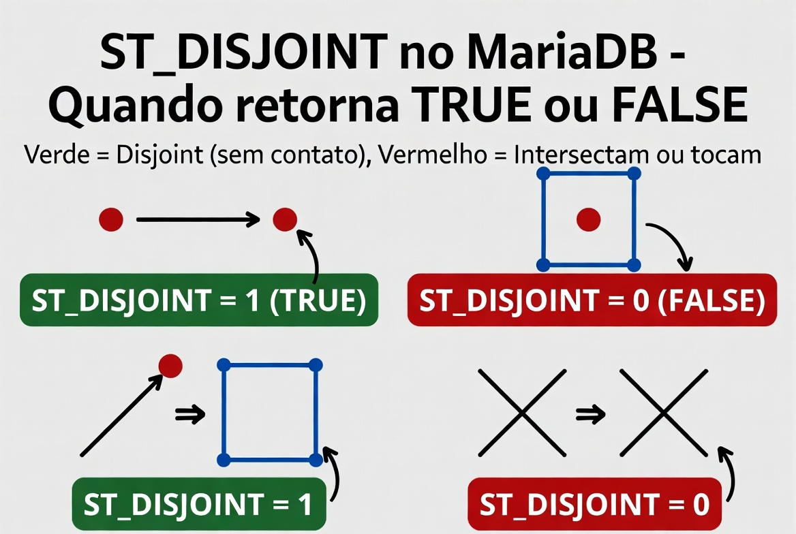
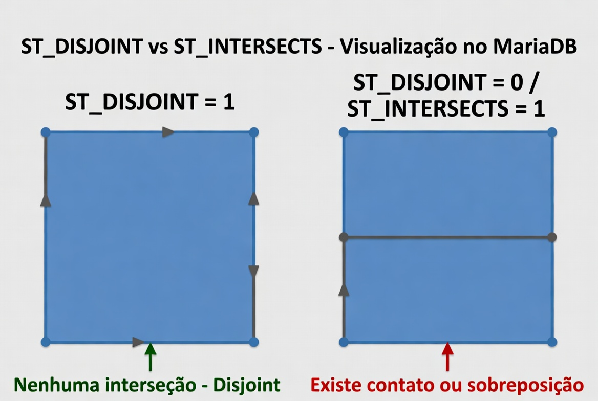

# ST_Disjoint

A função `ST_DISJOINT` é uma **função de relacionamento espacial** (spatial predicate) do padrão OGC.
Ela verifica se duas geometrias **não possuem nenhum ponto em comum**.

- Retorna **1 (TRUE)** se as geometrias são completamente separadas (disjoint).
- Retorna **0 (FALSE)** se as geometrias se tocam, se sobrepõem, se uma está dentro da outra, ou se compartilham qualquer ponto (inclusive bordas).

É o **oposto lógico** da função `ST_INTERSECTS`.

## Sintaxe oficial

```sql
ST_DISJOINT(g1, g2)
```

- `g1` e `g2`: Duas geometrias válidas (POINT, LINESTRING, POLYGON, MULTI*, GEOMETRYCOLLECTION, etc.).
- Retorno: `1` (verdadeiro) ou `0` (falso). Retorna `NULL` se alguma geometria for inválida ou NULL.

**Importante**:

- `ST_DISJOINT` considera apenas a **geometria**, não o SRID diretamente para o teste (mas ambas devem estar no mesmo sistema de coordenadas para fazer sentido).
- É uma função **indexável** com índices espaciais (SPATIAL INDEX). Usar `ST_DISJOINT` com índice pode ser muito mais rápido que o oposto manual.

## Definição formal (padrão OGC / DE-9IM)

Duas geometrias são **disjoint** quando:

- Não existe interseção entre seus **interiores**.
- Não existe interseção entre suas **bordas**.
- Não existe interseção entre interior de uma e borda da outra.

Em palavras simples: **não se tocam nem se sobrepõem de nenhuma forma**.

## Casos comuns onde ST_DISJOINT retorna 1 (verdadeiro)

- Dois pontos em posições diferentes.
- Uma linha que não cruza nem toca um polígono.
- Dois polígonos separados por uma distância > 0.
- Um ponto fora de um polígono (e não na borda).

## Casos onde retorna 0 (falso)

- Geometrias que se tocam apenas na borda (ex.: dois polígonos que compartilham um lado).
- Uma linha que cruza um polígono.
- Um ponto dentro ou na borda de um polígono.
- Duas linhas que se cruzam em um ponto.
- Geometrias que se sobrepõem parcialmente.

## Exemplos práticos

```sql
-- 1. Dois pontos separados
SET @p1 = ST_GEOMFROMTEXT('POINT(0 0)');
SET @p2 = ST_GEOMFROMTEXT('POINT(10 10)');
SELECT ST_DISJOINT(@p1, @p2);        -- 1 (TRUE)

-- 2. Ponto dentro de polígono
SET @pol = ST_GEOMFROMTEXT('POLYGON((0 0, 0 10, 10 10, 10 0, 0 0))');
SELECT ST_DISJOINT(@p1, @pol);       -- 0 (FALSE) porque o ponto está dentro

-- 3. Linha que não toca o polígono
SET @linha = ST_GEOMFROMTEXT('LINESTRING(15 15, 20 20)');
SELECT ST_DISJOINT(@linha, @pol);    -- 1 (TRUE)

-- 4. Dois polígonos que se tocam na borda
SET @pol2 = ST_GEOMFROMTEXT('POLYGON((10 0, 10 5, 15 5, 15 0, 10 0))');
SELECT ST_DISJOINT(@pol, @pol2);     -- 0 (FALSE) — tocam na borda
```

## Diferenças importantes com outras funções

| Função        | Retorna 1 quando...                           | Uso típico              |
| ------------- | --------------------------------------------- | ----------------------- |
| ST_DISJOINT   | Não compartilham **nenhum** ponto             | "Nada em comum"         |
| ST_INTERSECTS | Compartilham **pelo menos um** ponto          | "Se tocam ou sobrepõem" |
| ST_TOUCHES    | Tocam apenas na borda (sem sobrepor interior) | "Apenas tocam"          |
| ST_WITHIN     | Uma geometria está completamente dentro       | "Está dentro"           |
| ST_EQUALS     | São geometricamente iguais                    | "São a mesma forma"     |

**Dica de performance**: Em consultas grandes, prefira `NOT ST_INTERSECTS(g1, g2)` em vez de `ST_DISJOINT(g1, g2)` quando possível, pois o otimizador do MariaDB às vezes lida melhor com `ST_INTERSECTS` + índice espacial.

## Representações visuais

Aqui estão diagramas claros que mostram exatamente quando `ST_DISJOINT` retorna **1** ou **0**:




