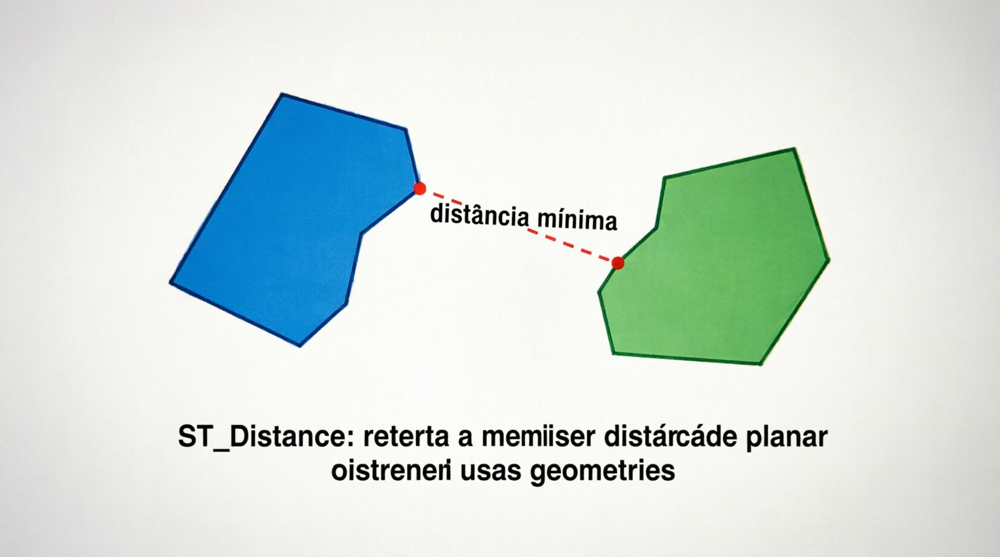
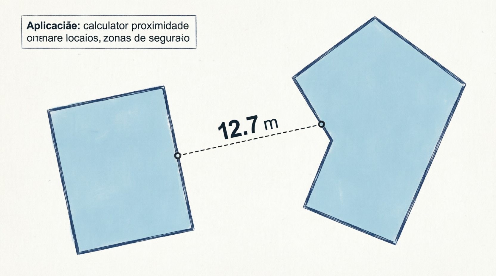

# ST_Distance

A função `ST_DISTANCE` calcula a **menor distância** entre duas geometrias quaisquer. Ela retorna a distância euclidiana mínima entre qualquer ponto de `g1` e qualquer ponto de `g2`.

É uma das funções espaciais mais usadas para:

- Encontrar objetos próximos (“quais lojas estão a menos de 5 km?”).
- Ordenar resultados por proximidade.
- Cálculos de proximidade em rotas, entregas, geofencing etc.

## Sintaxe oficial (MariaDB)

```sql
ST_DISTANCE(g1, g2)
```

- **Parâmetros**:
  - `g1` e `g2`: Duas geometrias válidas (POINT, LINESTRING, POLYGON, MULTI*, GEOMETRYCOLLECTION etc.).

- **Retorno**:
  - Um valor `DOUBLE` com a distância mínima.
  - Retorna `NULL` se alguma geometria for inválida ou `NULL`.

## Como a distância é calculada?

- **SRID = 0** (padrão cartesiano): Distância euclidiana plana (√((x2-x1)² + (y2-y1)²) generalizada para qualquer tipo de geometria).
- **SRID = 4326** (WGS84 / lat-long): O MariaDB **trata como plano cartesiano** (não faz cálculo geodésico automaticamente). A distância sai em **graus**, o que não é útil para o mundo real.
- Para distâncias reais na Terra (em metros), o MariaDB oferece a função complementar `ST_DISTANCE_SPHERE(g1, g2 [, raio])`, que usa modelo esférico e retorna sempre em **metros**.

**Atenção importante**:  
`ST_DISTANCE` **não** é geodésica em SRID 4326. Para aplicações reais (Brasil, GPS etc.), prefira:

- Reprojetar para um SRID métrico (ex.: UTM zona apropriada) + usar `ST_DISTANCE`, **ou**
- Usar `ST_DISTANCE_SPHERE` (só funciona bem com POINT / MULTIPOINT).

## Exemplos práticos

```sql
-- 1. Distância entre dois pontos (cartesiana)
SET @p1 = ST_GEOMFROMTEXT('POINT(0 0)');
SET @p2 = ST_GEOMFROMTEXT('POINT(3 4)');
SELECT ST_DISTANCE(@p1, @p2);                    -- Retorna: 5.0

-- 2. Distância de um ponto a uma linha
SET @linha = ST_GEOMFROMTEXT('LINESTRING(0 0, 10 0)');
SELECT ST_DISTANCE(@p1, @linha);                 -- Distância perpendicular

-- 3. Distância entre dois polígonos (menor distância entre bordas)
SET @pol1 = ST_GEOMFROMTEXT('POLYGON((0 0,0 5,5 5,5 0,0 0))');
SET @pol2 = ST_GEOMFROMTEXT('POLYGON((6 0,6 5,10 5,10 0,6 0))');
SELECT ST_DISTANCE(@pol1, @pol2);                -- Menor distância entre eles

-- 4. Exemplo com coordenadas geográficas (SRID 4326) - CUIDADO!
SET @sp = ST_GEOMFROMTEXT('POINT(-46.6333 -23.5505)', 4326);  -- São Paulo
SET @rj = ST_GEOMFROMTEXT('POINT(-43.1729 -22.9068)', 4326);  -- Rio de Janeiro
SELECT ST_DISTANCE(@sp, @rj);                    -- Retorna em GRAUS (não útil!)

-- 5. Versão recomendada para distâncias reais: ST_DISTANCE_SPHERE
SELECT ST_DISTANCE_SPHERE(@sp, @rj);             -- Retorna em METROS (aprox. 430 km)
```

## ST_DISTANCE vs ST_DISTANCE_SPHERE

| Função             | Tipo de cálculo     | Unidade em SRID 4326 | Suporte a geometrias      | Recomendado para               |
| ------------------ | ------------------- | -------------------- | ------------------------- | ------------------------------ |
| ST_DISTANCE        | Euclidiana / planar | Graus                | Qualquer geometria        | SRID projetado (UTM)           |
| ST_DISTANCE_SPHERE | Esférica (esfera)   | Metros               | Apenas POINT / MULTIPOINT | Distâncias rápidas em lat/long |

## Limitações e boas práticas no MariaDB

- **Performance**: `ST_DISTANCE` é razoavelmente rápida, mas em tabelas grandes use filtro prévio com `ST_DWITHIN` (se disponível) ou `MBRContains` / `ST_ENVELOPE` para reduzir o conjunto.
- Geometrias inválidas podem retornar resultados errados.
- Para buscas “dentro de raio X”:
  ```sql
  WHERE ST_DISTANCE(ponto_usuario, geom_coluna) <= raio
  ```
  → Melhor ainda: usar índice espacial + bounding box primeiro.
- Em SRID 4326, evite `ST_DISTANCE` para distâncias reais. Prefira reprojeção ou `ST_DISTANCE_SPHERE`.
- Não há parâmetro de unidade na versão atual do MariaDB (diferente de algumas versões recentes do MySQL).

## Representações visuais

Aqui estão diagramas educativos que mostram claramente o que a função calcula:




