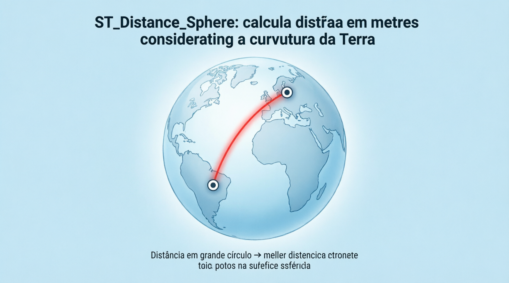
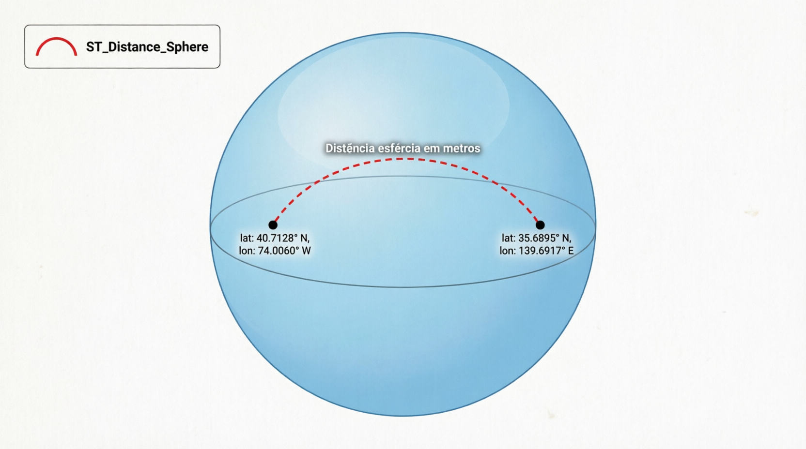

# ST_Distance_Sphere

A função `ST_DISTANCE_SPHERE` calcula a **distância esférica** (spherical distance) mínima entre duas geometrias usando um modelo de Terra como **esfera perfeita** (não elipsoide). Ela retorna o resultado sempre em **metros**, sendo a opção mais prática e rápida para cálculos de distância geográfica em coordenadas de latitude/longitude (SRID 4326).

Diferente de `ST_DISTANCE` (que é planar/euclidiana e trata lat/long como plano cartesiano), `ST_DISTANCE_SPHERE` usa a fórmula de Haversine internamente para considerar a curvatura da Terra.

```sql
ST_DISTANCE_SPHERE(g1, g2 [, r])
```

- **Parâmetros**:
  - `g1`, `g2`: Geometrias do tipo **POINT** ou **MULTIPOINT** (principais suportadas). Em algumas versões mais recentes também aceita outras, mas o uso recomendado é com pontos.
  - `r` (opcional): Raio da esfera em metros. Deve ser positivo.  
    **Valor padrão**: 6.370.986 metros (raio médio da Terra).

- **Retorno**:
  - Valor `DOUBLE` em **metros**.
  - Retorna `NULL` se alguma geometria for inválida, não for POINT/MULTIPOINT, ou se o raio for inválido.

## Quando usar ST_DISTANCE_SPHERE?

- Cálculos rápidos de distância entre cidades, endereços, pontos GPS.
- Buscas “dentro de um raio X km” (combinada com filtro de bounding box para performance).
- Aplicações de geolocalização, entregas, geofencing.

**Atenção**: É uma aproximação esférica (rápida), mas não considera o elipsoide real da Terra (como faz o PostGIS com ST_DistanceSpheroid). Para precisão máxima, reprojete para UTM + use `ST_DISTANCE`.

## Exemplos práticos

```sql
-- 1. Distância entre dois pontos (São Paulo x Rio de Janeiro)
SET @sp = ST_GEOMFROMTEXT('POINT(-46.6333 -23.5505)');  -- lon, lat
SET @rj = ST_GEOMFROMTEXT('POINT(-43.1729 -22.9068)');

SELECT ST_DISTANCE_SPHERE(@sp, @rj) / 1000 AS distancia_km;
-- Resultado aproximado: ~430 km

-- 2. Usando raio personalizado (ex.: planeta Marte)
SELECT ST_DISTANCE_SPHERE(@sp, @rj, 3390000) AS distancia_em_marte;

-- 3. Distância de um ponto a vários (ex.: lojas próximas)
SELECT 
  nome_loja,
  ST_DISTANCE_SPHERE(@minha_posicao, geom_loja) AS distancia_metros
FROM lojas
ORDER BY distancia_metros
LIMIT 10;

-- 4. Busca dentro de raio (exemplo completo com filtro)
SELECT * FROM pontos
WHERE ST_DISTANCE_SPHERE(@usuario, geom) <= 5000;  -- 5 km
```

## Comparação: ST_DISTANCE vs ST_DISTANCE_SPHERE

| Aspecto               | ST_DISTANCE                          | ST_DISTANCE_SPHERE                 |
| --------------------- | ------------------------------------ | ---------------------------------- |
| Cálculo               | Euclidiano / planar                  | Esférico (Haversine)               |
| Unidade em SRID 4326  | Graus (quase inútil)                 | Metros (sempre)                    |
| Geometrias suportadas | Qualquer (ponto, linha, polígono...) | Principalmente POINT / MULTIPOINT  |
| Precisão na Terra     | Baixa em lat/long                    | Boa (aproximação esférica)         |
| Velocidade            | Rápida                               | Muito rápida                       |
| Uso recomendado       | SRID projetado (UTM etc.)            | Coordenadas geográficas (lat/long) |

## Limitações e boas práticas no MariaDB

- **Suporte**: Disponível em versões recentes do MariaDB (adicionado por volta de 2021/2022 em diante). Em versões muito antigas pode não existir — nesse caso, crie uma função personalizada com a fórmula Haversine.
- **Apenas POINT/MULTIPOINT**: Não funciona diretamente com LINESTRING ou POLYGON (use o centroide ou um ponto representativo).
- **Performance**: Excelente, mas em tabelas grandes sempre combine com um filtro de bounding box primeiro (usando `ST_ENVELOPE` ou `MBRContains`) para evitar cálculo em todos os registros.
- **Raio padrão**: 6.370.986 m é uma boa média. Você pode usar 6.371.000 para simplificar.
- **Índices**: Use `SPATIAL INDEX` na coluna de geometria para acelerar buscas de proximidade.
- **Precisão**: Para distâncias muito longas (>1000 km) ou alta precisão, considere reprojeção para UTM + `ST_DISTANCE`.

## Representações visuais

Aqui estão diagramas educativos que mostram a diferença entre os cálculos:




