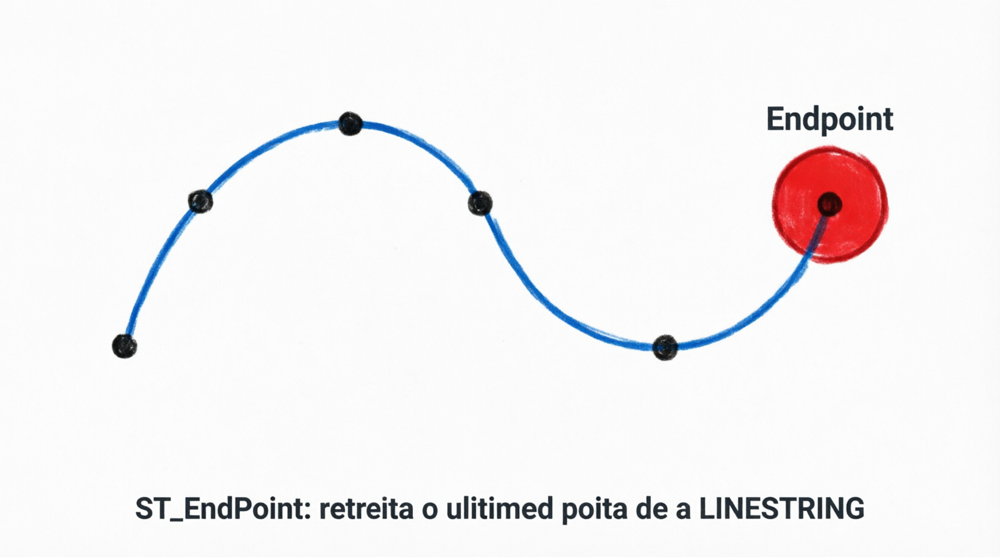

# ST_EndPoint

A função `ST_ENDPOINT` (sinônimo: `ENDPOINT`) retorna o **último ponto** (ponto final) de uma `LINESTRING`.

É uma função simples, mas muito prática quando você trabalha com rotas, trajetos, polilinhas, estradas ou qualquer geometria linear.

## Sintaxe oficial (MariaDB)

```sql
ST_ENDPOINT(ls)
ENDPOINT(ls)                   -- sinônimo
```

- **Parâmetro**:
  - `ls`: Uma geometria do tipo `LINESTRING`.

- **Retorno**:
  - Um `POINT` com as coordenadas do último vértice da linha.
  - Retorna `NULL` se:
    - A geometria não for uma `LINESTRING` válida.
    - A linha estiver vazia.
    - A entrada for `NULL`.

## Exemplos práticos

```sql
-- 1. Exemplo básico
SET @linha = ST_GEOMFROMTEXT('LINESTRING(0 0, 10 5, 25 10, 40 0)');
SELECT ST_ASWKT(ST_ENDPOINT(@linha));
-- Resultado: POINT(40 0)

-- 2. Exemplo com coordenadas geográficas (lat/long)
SET @rota = ST_GEOMFROMTEXT('LINESTRING(-46.6333 -23.5505, -43.1729 -22.9068, -47.9292 -15.7801)', 4326);
SELECT ST_ASWKT(ST_ENDPOINT(@rota));
-- Resultado: POINT(-47.9292 -15.7801)  → Brasília (último ponto)

-- 3. Combinado com outras funções
SET @linha = ST_GEOMFROMTEXT('LINESTRING(0 0, 10 10, 20 5, 30 15)');

SELECT 
  ST_ASWKT(ST_STARTPOINT(@linha))   AS origem,
  ST_ASWKT(ST_ENDPOINT(@linha))     AS destino,
  ST_DISTANCE(ST_STARTPOINT(@linha), ST_ENDPOINT(@linha)) AS distancia_total;
```

## Comparação com funções relacionadas

| Função           | O que retorna              | Equivalente a                   | Quando usar                |
| ---------------- | -------------------------- | ------------------------------- | -------------------------- |
| ST_ENDPOINT      | Último ponto da linha      | ST_POINTN(ls, ST_NumPoints(ls)) | Fim da rota                |
| ST_STARTPOINT    | Primeiro ponto da linha    | ST_POINTN(ls, 1)                | Início da rota             |
| ST_POINTN(ls, N) | Qualquer ponto N (1-based) | -                               | Acesso genérico a vértices |
| ST_NumPoints(ls) | Quantidade total de pontos | -                               | Saber o tamanho da linha   |

## Diferença importante

- `ST_ENDPOINT` só funciona com **LINESTRING** (não com MULTILINESTRING).
- Se você tiver uma `MULTILINESTRING`, precisará extrair cada LineString individualmente ou usar `ST_GEOMETRYN` + `ST_ENDPOINT`.

Exemplo com MULTILINESTRING:
```sql
SET @multi = ST_GEOMFROMTEXT('MULTILINESTRING((0 0, 10 0), (15 5, 25 10))');
-- Para pegar o endpoint da primeira linha:
SELECT ST_ASWKT(ST_ENDPOINT(ST_GEOMETRYN(@multi, 1)));
```

## Limitações e boas práticas no MariaDB

- Funciona **apenas** com `LINESTRING`. Se passar um POLYGON, POINT ou outra coisa → retorna `NULL`.
- Linhas com apenas 1 ponto → o endpoint é o próprio ponto.
- Performance: Extremamente rápida (acesso direto ao último elemento).
- Geometrias inválidas ou vazias → retorna `NULL`.
- Recomendação: Sempre verifique o tipo da geometria antes (usando `ST_GeometryType()` ou `ST_NumPoints()`).

## Representações visuais

Aqui estão diagramas claros que mostram o comportamento da função:




