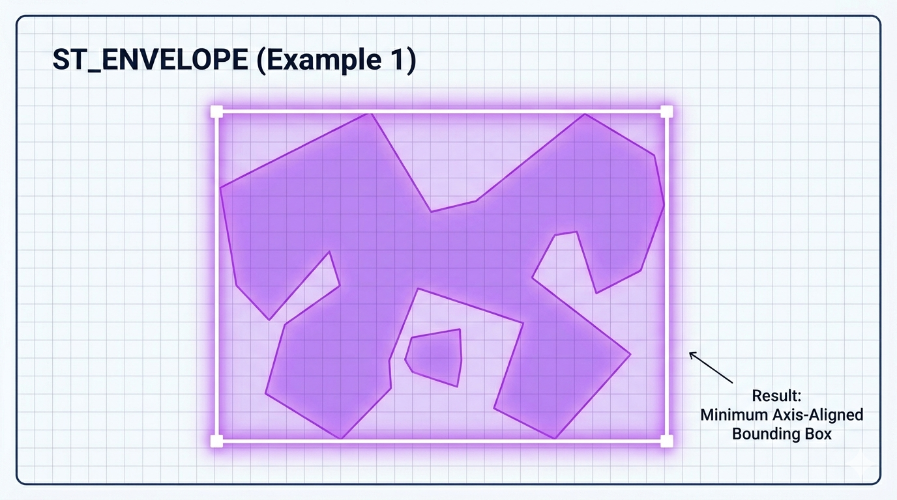
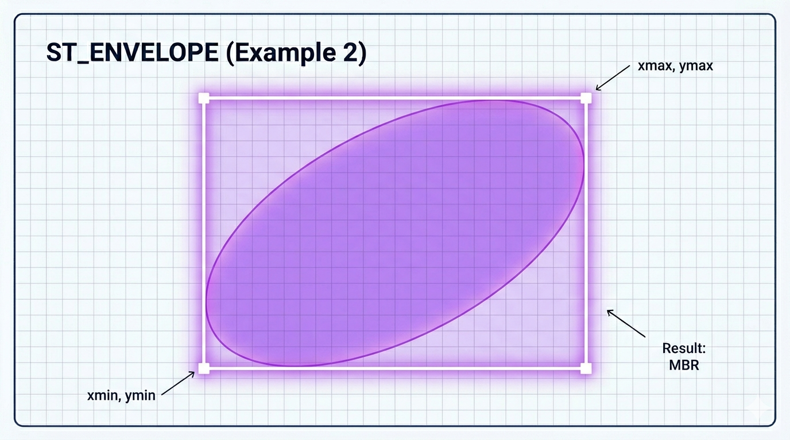

# ST_Envelope

A função `ST_ENVELOPE` (também conhecida como **Bounding Box** ou **Envelope**) é uma das funções espaciais mais simples e rápidas do MariaDB. Ela retorna o **menor retângulo alinhado aos eixos** (axis-aligned bounding rectangle) que contém completamente a geometria de entrada.

Em outras palavras: é o “caixa” retangular mínima que envolve todos os pontos da geometria.

```sql
ST_ENVELOPE(g)
ENVELOPE(g)                    -- sinônimo antigo, ainda suportado
```

- **Parâmetro**:
  - `g`: Qualquer geometria válida (POINT, LINESTRING, POLYGON, MULTI*, GEOMETRYCOLLECTION, etc.).

- **Retorno**:
  - Sempre um `POLYGON` retangular de 5 pontos (fechado).
  - Se a geometria for um único `POINT` → retorna um polígono degenerado (um ponto com área zero).
  - Se a geometria for vazia → retorna geometria vazia.
  - Retorna `NULL` se a entrada for `NULL`.

## Como funciona

O envelope é definido pelos valores mínimos e máximos de X e Y da geometria:

- Xmin, Ymin (canto inferior esquerdo)
- Xmax, Ymax (canto superior direito)

O resultado é sempre um retângulo com lados paralelos aos eixos X e Y (axis-aligned).  
Não é o casco convexo (ST_CONVEXHULL), que pode ser um polígono diagonal mais “apertado”.

## Exemplos práticos

```sql
-- 1. Envelope de um ponto
SET @ponto = ST_GEOMFROMTEXT('POINT(5 5)');
SELECT ST_ASWKT(ST_ENVELOPE(@ponto));
-- Resultado: POLYGON((5 5,5 5,5 5,5 5,5 5))  → degenerado

-- 2. Envelope de uma linha diagonal
SET @linha = ST_GEOMFROMTEXT('LINESTRING(0 0, 10 10)');
SELECT ST_ASWKT(ST_ENVELOPE(@linha));
-- Resultado: POLYGON((0 0, 0 10, 10 10, 10 0, 0 0))

-- 3. Envelope de um polígono côncavo
SET @côncavo = ST_GEOMFROMTEXT('POLYGON((0 0, 2 8, 5 3, 8 8, 10 0, 0 0))');
SELECT ST_ASWKT(ST_ENVELOPE(@côncavo));
-- Resultado: Sempre o mesmo retângulo que envolve todos os pontos

-- 4. Envelope de coleção
SET @colecao = ST_GEOMFROMTEXT('GEOMETRYCOLLECTION(POINT(0 0), POINT(20 15))');
SELECT ST_ASWKT(ST_ENVELOPE(@colecao));
-- Resultado: POLYGON((0 0, 0 15, 20 15, 20 0, 0 0))
```

## Comparação importante: ST_ENVELOPE vs ST_CONVEXHULL

| Característica                | ST_ENVELOPE                            | ST_CONVEXHULL                        |
| ----------------------------- | -------------------------------------- | ------------------------------------ |
| Formato                       | Sempre retângulo alinhado aos eixos    | Polígono convexo (pode ser diagonal) |
| Tamanho                       | Geralmente maior                       | Mais apertado (menor área)           |
| Velocidade de cálculo         | Extremamente rápida                    | Mais lenta (O(n log n))              |
| Uso comum                     | Filtro rápido, indexação, visualização | Análise de forma, simplificação      |
| Resultado para linha diagonal | Retângulo grande                       | Polígono mais fino                   |

**Regra prática**:

- Use `ST_ENVELOPE` quando precisar de velocidade e simplicidade.
- Use `ST_CONVEXHULL` quando precisar da menor área convexa possível.

## Limitações e boas práticas no MariaDB

- Muito rápida → ideal para filtros espaciais iniciais.
- O envelope mantém o mesmo SRID da geometria original.
- Em SRID 4326 (lat/long) o retângulo é calculado em coordenadas planas.
- Útil para criar índices espaciais ou otimizar consultas:
  ```sql
  WHERE MBRIntersects(ST_ENVELOPE(geom_coluna), @minha_area)
  ```
- Para obter os valores numéricos dos cantos, você pode usar:
  ```sql
  ST_XMIN(ST_ENVELOPE(g)), ST_YMIN(ST_ENVELOPE(g)), 
  ST_XMAX(ST_ENVELOPE(g)), ST_YMAX(ST_ENVELOPE(g))
  ```

## Representações visuais

Aqui estão diagramas claros que mostram a diferença prática:




