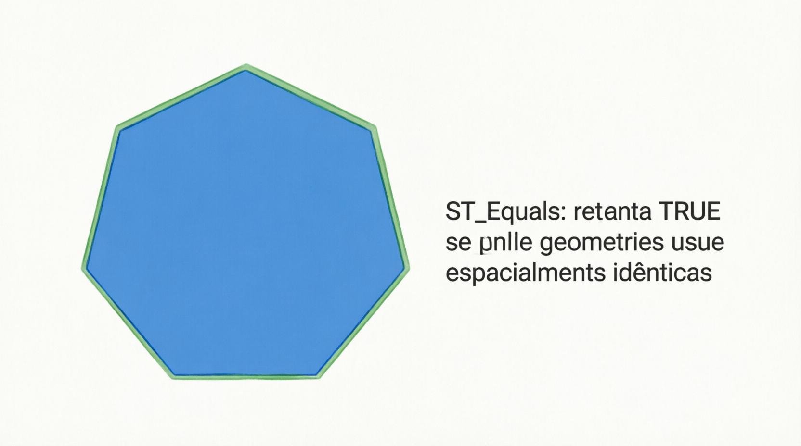
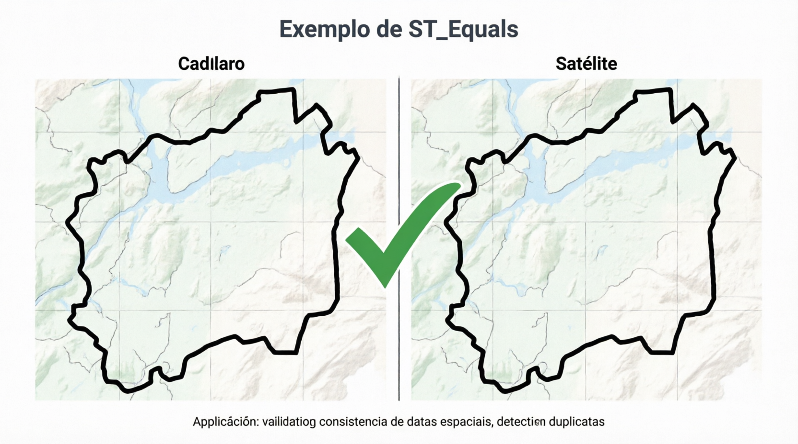

# ST_Equals

A função `ST_EQUALS` (e seu sinônimo `EQUALS`) é uma **função de relacionamento espacial** do padrão OGC. Ela verifica se duas geometrias são **espacialmente iguais**, ou seja, se representam **exatamente o mesmo conjunto de pontos** no espaço.

- Retorna **1 (TRUE)** se as duas geometrias são topologicamente idênticas (mesmo formato, mesma posição, mesmos vértices — mesmo que a ordem dos pontos ou a orientação seja diferente, desde que o conjunto de pontos seja o mesmo).
- Retorna **0 (FALSE)** caso contrário.

Diferente de comparar coordenadas brutas ou usar `ST_INTERSECTS` + `ST_WITHIN`, `ST_EQUALS` verifica **igualdade topológica** completa.

```sql
ST_EQUALS(g1, g2)
EQUALS(g1, g2)                 -- sinônimo
```

- `g1` e `g2`: Duas geometrias válidas (qualquer tipo).
- Retorno: `1`, `0` ou `NULL` (se alguma geometria for inválida ou `NULL`).

## Definição formal (DE-9IM)

`ST_EQUALS` corresponde ao padrão DE-9IM:  
**`T*F**FFF*`** (ou variações equivalentes).

Isso significa:

- Os interiores se intersectam (`T`).
- Nenhuma parte do interior ou borda de uma geometria intersecta o exterior da outra (`F` nos locais apropriados).

Em palavras simples:  
`(g1 ∩ g2 = g1) ∧ (g1 ∩ g2 = g2)`  
As duas geometrias cobrem exatamente a mesma área/linha/pontos.

## Exemplos práticos

```sql
-- 1. Dois polígonos idênticos (mesmos vértices)
SET @p1 = ST_GEOMFROMTEXT('POLYGON((0 0, 0 10, 10 10, 10 0, 0 0))');
SET @p2 = ST_GEOMFROMTEXT('POLYGON((0 0, 0 10, 10 10, 10 0, 0 0))');
SELECT ST_EQUALS(@p1, @p2);        -- 1 (TRUE)

-- 2. Polígonos com vértices na ordem diferente (ainda iguais)
SET @p3 = ST_GEOMFROMTEXT('POLYGON((0 0, 10 0, 10 10, 0 10, 0 0))');  -- ordem invertida
SELECT ST_EQUALS(@p1, @p3);        -- Geralmente 1 (TRUE), pois o conjunto de pontos é o mesmo

-- 3. Polígonos diferentes (mesmo bounding box, mas formas distintas)
SET @p4 = ST_GEOMFROMTEXT('POLYGON((0 0, 0 10, 5 5, 10 10, 10 0, 0 0))');  -- côncavo
SELECT ST_EQUALS(@p1, @p4);        -- 0 (FALSE)

-- 4. Duas linhas iguais
SET @l1 = ST_GEOMFROMTEXT('LINESTRING(0 0, 10 10)');
SET @l2 = ST_GEOMFROMTEXT('LINESTRING(0 0, 10 10)');
SELECT ST_EQUALS(@l1, @l2);        -- 1

-- 5. Ponto igual a si mesmo
SELECT ST_EQUALS(ST_GEOMFROMTEXT('POINT(5 5)'), ST_GEOMFROMTEXT('POINT(5 5)'));  -- 1
```

## Diferenças importantes com outras funções

| Função               | O que verifica                          | Retorna 1 quando...              | Uso típico                          |
| -------------------- | --------------------------------------- | -------------------------------- | ----------------------------------- |
| ST_EQUALS            | Igualdade topológica completa           | Mesma forma e posição exata      | "São exatamente a mesma geometria?" |
| ST_INTERSECTS        | Qualquer contato                        | Compartilham pelo menos um ponto | "Se tocam ou sobrepõem"             |
| ST_WITHIN / CONTAINS | Contenção completa                      | Uma está dentro da outra         | "Está dentro"                       |
| ST_OVERLAPS          | Sobreposição parcial com mesma dimensão | Sobreposição parcial (não total) | "Sobreposição parcial"              |

**Observação**: Duas geometrias podem ser `ST_EQUALS` mesmo se uma tiver vértices extras muito próximos ou ordem diferente, desde que representem o mesmo conjunto de pontos. No entanto, em casos com pequenas diferenças numéricas (precisão de ponto flutuante), o resultado pode variar.

## Limitações e boas práticas no MariaDB

- **Precisão**: Usa comparação baseada em pontos. Diferenças muito pequenas devido a arredondamento podem fazer `ST_EQUALS` retornar 0.
- **Performance**: Não é tão otimizada quanto `ST_INTERSECTS`. Em tabelas grandes, combine com outros filtros.
- **Geometrias inválidas**: Podem gerar resultados inconsistentes → valide com `ST_ISVALID(g)` antes.
- **SRID**: Ambas as geometrias devem ter o mesmo SRID para o teste fazer sentido (a função não compara SRID automaticamente).
- **Uso comum**: Deduplicação de geometrias, verificação de dados duplicados, ou comparação de shapes importados de fontes diferentes.
- **Alternativa mais rigorosa**: Em alguns casos, as pessoas usam `ST_EQUALS` + comparação de `ST_ASBINARY` ou `ST_ASWKT` para verificação exata de representação.

## Representações visuais

Aqui estão diagramas educativos que mostram quando `ST_EQUALS` retorna **1** ou **0**:




