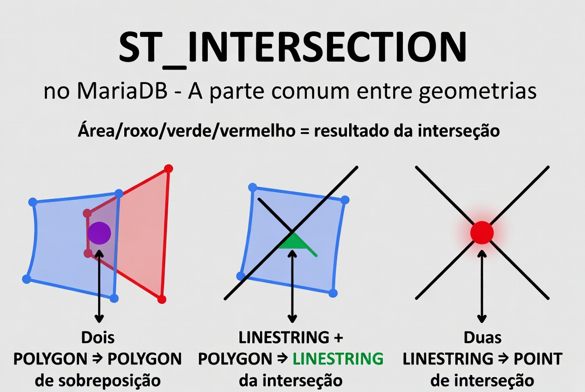
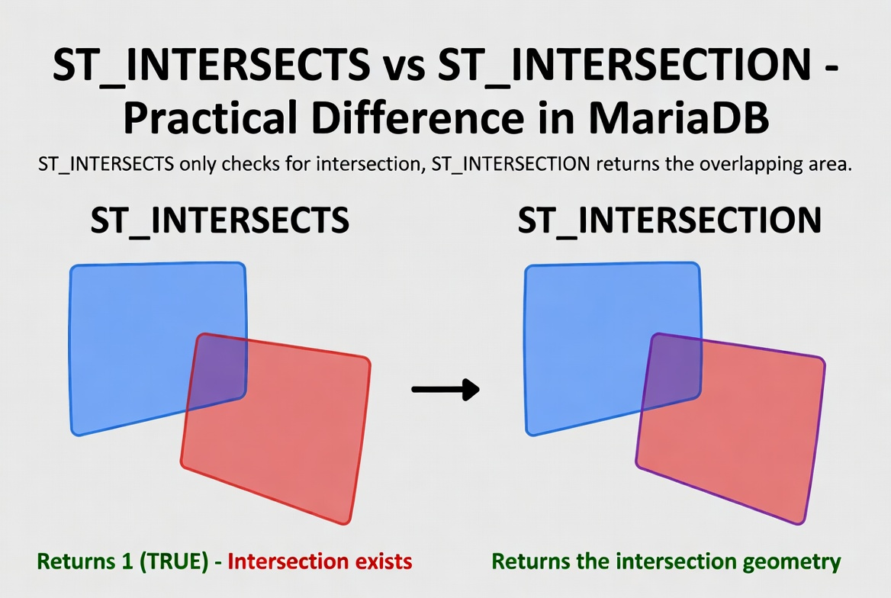

# ST_Intersection

A função `ST_INTERSECTION` é uma **função construtora de geometria** do padrão OGC. Ela retorna a **geometria que representa a interseção** (região compartilhada) entre duas geometrias de entrada.

Em outras palavras: devolve **apenas a parte comum** às duas geometrias. Se não houver nenhuma interseção, retorna uma **geometria vazia** (empty geometry).

É o complemento geométrico da função `ST_INTERSECTS` (que apenas verifica se existe interseção, retornando 1 ou 0).

## Sintaxe oficial (MariaDB)

```sql
ST_INTERSECTION(g1, g2)
```

- **Parâmetros**:
  - `g1` e `g2`: Duas geometrias válidas (POINT, LINESTRING, POLYGON, MULTI*, GEOMETRYCOLLECTION, etc.).
  
- **Retorno**:
  - Uma nova geometria do tipo apropriado (POINT, MULTIPOINT, LINESTRING, POLYGON, MULTIPOLYGON, GEOMETRYCOLLECTION ou geometria vazia).
  - Mantém o mesmo SRID das geometrias de entrada.
  - Retorna `NULL` se alguma entrada for `NULL` ou inválida de forma crítica.

## Como funciona (padrão OGC / DE-9IM)

A interseção é calculada considerando **interior**, **bordas** e **exterior** das geometrias. O resultado é o conjunto de pontos que pertencem a **ambas** as geometrias.

## Casos comuns e tipos de resultado

- **Dois polígonos que se sobrepõem** → POLYGON (ou MULTIPOLYGON) com a área de sobreposição.
- **Linha cruzando um polígono** → LINESTRING (o trecho dentro do polígono).
- **Duas linhas que se cruzam** → POINT (ponto de cruzamento).
- **Polígono e ponto dentro dele** → POINT.
- **Sem interseção** → Geometria vazia (`ST_IsEmpty(ST_INTERSECTION(g1,g2)) = 1`).
- **Polígonos com buracos** → A interseção respeita os buracos.

**Dica de performance importante**:
`ST_INTERSECTION` é computacionalmente mais cara que `ST_INTERSECTS`.  
Sempre use um filtro prévio:
```sql
WHERE ST_INTERSECTS(g1, g2)
AND ST_AREA(ST_INTERSECTION(g1, g2)) > 0
```

## Exemplos práticos

```sql
-- 1. Interseção de dois polígonos (sobreposição)
SET @p1 = ST_GEOMFROMTEXT('POLYGON((0 0, 0 10, 10 10, 10 0, 0 0))');
SET @p2 = ST_GEOMFROMTEXT('POLYGON((5 5, 5 15, 15 15, 15 5, 5 5))');
SELECT ST_ASWKT(ST_INTERSECTION(@p1, @p2));
-- Resultado: POLYGON com a região quadrada de sobreposição (5 5 a 10 10)

-- 2. Duas linhas que se cruzam
SET @l1 = ST_GEOMFROMTEXT('LINESTRING(0 0, 10 10)');
SET @l2 = ST_GEOMFROMTEXT('LINESTRING(0 10, 10 0)');
SELECT ST_ASWKT(ST_INTERSECTION(@l1, @l2));
-- Resultado: POINT(5 5)

-- 3. Verificar se há interseção antes
SELECT ST_ASWKT(ST_INTERSECTION(@p1, @p2))
WHERE ST_INTERSECTS(@p1, @p2);

-- 4. Interseção com ponto
SET @ponto = ST_GEOMFROMTEXT('POINT(3 3)');
SELECT ST_ASWKT(ST_INTERSECTION(@p1, @ponto));   -- POINT(3 3)
```

## Limitações e boas práticas no MariaDB

- Geometrias inválidas podem produzir resultados inesperados ou vazios → sempre valide com `ST_ISVALID(g)`.
- O cálculo é **planar** (baseado no SRID). Em SRID 4326 (lat/long), trata como plano cartesiano. Para grandes áreas, considere reprojeção para SRID projetado (ex.: UTM).
- Resultado pode ser `GEOMETRYCOLLECTION` se a interseção for complexa (ex.: múltiplos pedaços).
- Não há parâmetros extras de precisão ou tolerância (diferente de algumas bibliotecas GIS mais avançadas).
- Para calcular área de sobreposição: `ST_AREA(ST_INTERSECTION(g1, g2))`.
- Para proporção de overlap: `ST_AREA(ST_INTERSECTION(g1, g2)) / ST_AREA(g1)`.

## Diferença entre ST_INTERSECTION e ST_INTERSECTS

| Função          | Tipo de retorno           | Uso principal                    | Performance             |
| --------------- | ------------------------- | -------------------------------- | ----------------------- |
| ST_INTERSECTS   | 1 (TRUE) ou 0 (FALSE)     | Verificar se há qualquer contato | Rápida (boa com índice) |
| ST_INTERSECTION | Geometria (a parte comum) | Obter a geometria da interseção  | Mais lenta              |

## Representações visuais

Aqui estão diagramas educativos que mostram o comportamento da função:




