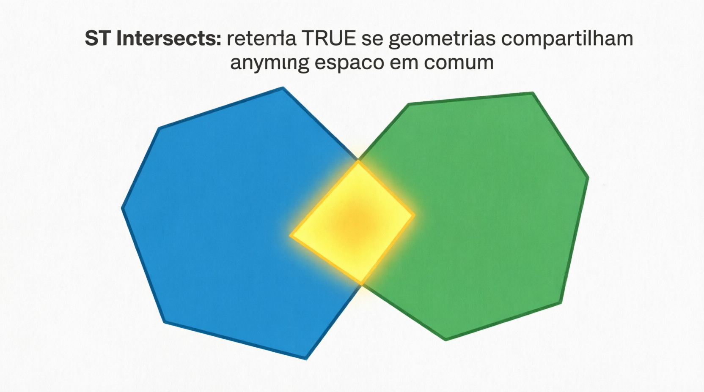
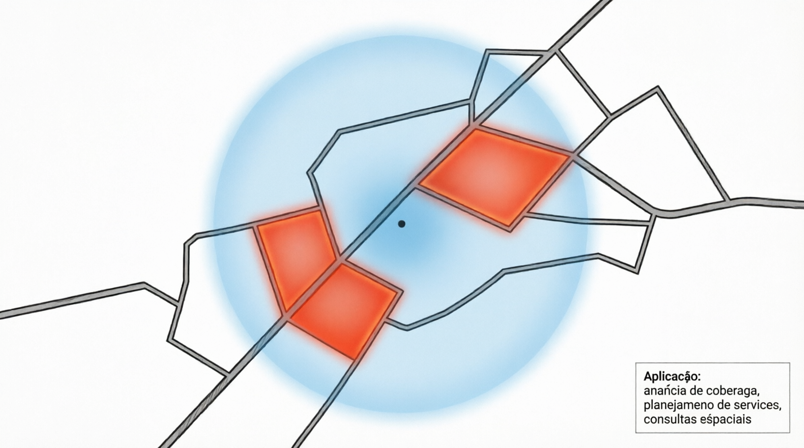

# ST_Intersects

A função `ST_INTERSECTS` é uma das **funções de relacionamento espacial** mais usadas e importantes do MariaDB. Ela verifica se duas geometrias **compartilham qualquer porção do espaço**, seja no interior ou na borda.

- Retorna **1 (TRUE)** se as geometrias se intersectam de qualquer forma (sobreposição, cruzamento, toque na borda, ponto em comum etc.).
- Retorna **0 (FALSE)** se não há nenhum ponto em comum (equivalente ao oposto de `ST_DISJOINT`).
- Retorna `NULL` se alguma geometria for inválida ou `NULL`.

É o “coringa” das consultas espaciais: “existe algum contato entre essas duas geometrias?”

## Sintaxe oficial (MariaDB)

```sql
ST_INTERSECTS(g1, g2)
```

- `g1` e `g2`: Duas geometrias válidas (qualquer tipo: POINT, LINESTRING, POLYGON, MULTI*, GEOMETRYCOLLECTION).
- **Importante**: `ST_INTERSECTS` usa a **forma real** das geometrias (shape).  
  Existe também a versão antiga `INTERSECTS(g1, g2)` (sem o prefixo ST), que usa apenas os **bounding boxes** (retângulos de envelope) — menos precisa, mas mais rápida em alguns casos.

## Casos onde ST_INTERSECTS retorna 1 (TRUE)

- Um ponto dentro ou na borda de um polígono.
- Duas linhas que se cruzam ou se tocam.
- Dois polígonos que se sobrepõem (parcial ou totalmente).
- Uma linha que toca a borda de um polígono.
- Qualquer geometria que compartilhe pelo menos um ponto com a outra.

## Exemplos práticos

```sql
-- 1. Ponto dentro de polígono
SET @pol = ST_GEOMFROMTEXT('POLYGON((0 0, 0 10, 10 10, 10 0, 0 0))');
SET @ponto_dentro = ST_GEOMFROMTEXT('POINT(5 5)');
SET @ponto_fora   = ST_GEOMFROMTEXT('POINT(15 5)');

SELECT ST_INTERSECTS(@pol, @ponto_dentro);   -- 1 (TRUE)
SELECT ST_INTERSECTS(@pol, @ponto_fora);     -- 0 (FALSE)

-- 2. Linha cruzando polígono
SET @linha = ST_GEOMFROMTEXT('LINESTRING(-5 5, 15 5)');
SELECT ST_INTERSECTS(@pol, @linha);          -- 1 (TRUE)

-- 3. Dois polígonos adjacentes (tocam na borda)
SET @pol2 = ST_GEOMFROMTEXT('POLYGON((10 0, 10 5, 15 5, 15 0, 10 0))');
SELECT ST_INTERSECTS(@pol, @pol2);           -- 1 (TRUE) → tocam na borda

-- 4. Uso comum em consulta (quais cidades intersectam esta área?)
SELECT nome 
FROM cidades 
WHERE ST_INTERSECTS(geom_cidade, @minha_area);
```

## Comparação com outras funções (tabela completa)

| Função        | Retorna 1 quando...                           | Interseção de interiores | Uso mais comum                |
| ------------- | --------------------------------------------- | ------------------------ | ----------------------------- |
| ST_INTERSECTS | Qualquer contato (interior ou borda)          | Pode                     | Filtro geral de "se toca"     |
| ST_DISJOINT   | Nenhum ponto em comum                         | Não                      | "Nada em comum"               |
| ST_TOUCHES    | Tocam apenas na borda (sem sobrepor interior) | Não                      | Polígonos vizinhos            |
| ST_CROSSES    | Cruzam propriamente (interseção interior)     | Sim                      | Linha atravessando polígono   |
| ST_CONTAINS   | Uma contém completamente a outra              | Sim                      | "Está totalmente dentro"      |
| ST_OVERLAPS   | Sobreposição parcial com mesma dimensão       | Sim                      | Sobreposição parcial de áreas |

**Dica prática**:  
`ST_INTERSECTS` é a função mais usada em **spatial joins** porque é flexível e cobre quase todos os casos de contato.

## Limitações e boas práticas no MariaDB

- **Performance**: Muito importante usar **SPATIAL INDEX** na coluna de geometria. O MariaDB usa o índice espacial com `ST_INTERSECTS`.
- `ST_INTERSECTS` é geralmente mais rápido que calcular `ST_INTERSECTION` (que constrói a geometria da interseção).
- Geometrias inválidas podem dar resultados errados → valide com `ST_ISVALID(g)` quando possível.
- SRID 4326 (lat/long): O teste é planar (não geodésico). Para grandes áreas, considere reprojeção.
- Recomendação forte: Sempre filtre primeiro com bounding box (MBRIntersects ou ST_ENVELOPE) em tabelas grandes para maximizar o uso do índice.

## Representações visuais

Aqui estão diagramas educativos que mostram claramente quando `ST_INTERSECTS` retorna **1** ou **0**:




