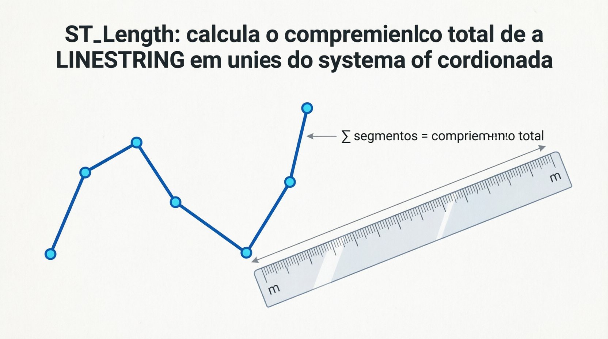
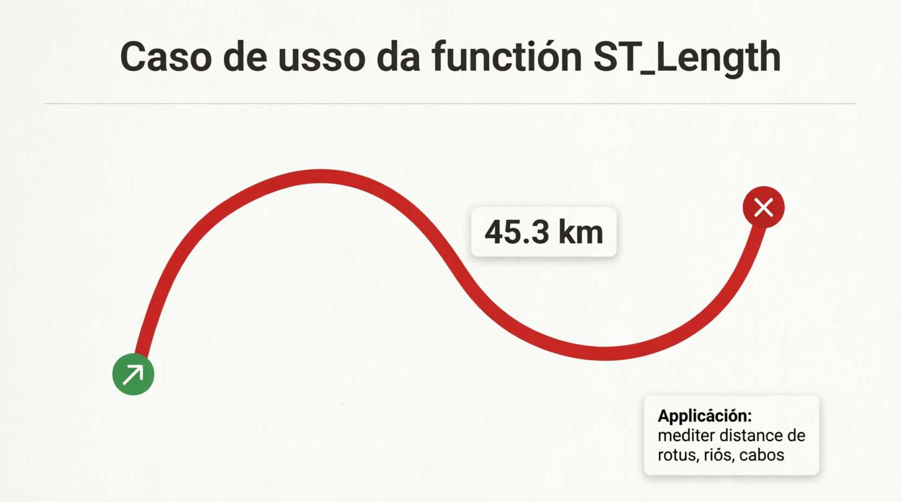

# ST_Length

A função `ST_LENGTH` (e seu sinônimo mais antigo `GLENGTH` ou `LENGTH` em alguns contextos) calcula o **comprimento total** de uma geometria linear (`LINESTRING` ou `MULTILINESTRING`).

Ela é a função equivalente a “medir o tamanho de uma linha ou conjunto de linhas”, sendo muito usada em:

- Cálculo de distâncias de rotas, estradas ou rios.
- Medição de perímetros de linhas (ex.: extensão de uma cerca, rede elétrica).
- Análises de rede (network analysis).
- Cálculo de distâncias percorridas.

**Diferença importante com ST_PERIMETER**:

- `ST_LENGTH` → para **linhas** (LineString / MultiLineString). Retorna 0 para polígonos.
- `ST_PERIMETER` → para **polígonos** (perímetro da borda). Retorna 0 para linhas.

## Sintaxe oficial (MariaDB)

```sql
ST_LENGTH(g)
```

- **Parâmetro**:
  - `g`: Geometria do tipo `LINESTRING`, `MULTILINESTRING`, ou que contenha elementos lineares ( GEOMETRYCOLLECTION).

- **Retorno**:
  - Um valor `DOUBLE` representando o comprimento.
  - Unidade: Depende do **SRID** da geometria.
    - SRID = 0 (padrão cartesiano): unidades das coordenadas (metros, graus, etc.).
    - SRID = 4326 (WGS84): o MariaDB/MySQL calcula a **distância geodésica** (considerando a curvatura da Terra) e retorna em **metros**.
  - Retorna `0` para geometrias não-lineares (POINT, POLYGON, etc.).
  - Retorna `NULL` se a entrada for `NULL` ou inválida.

## Comportamento por tipo de geometria

- **LINESTRING** → Comprimento total da linha (soma das distâncias entre pontos consecutivos).
- **MULTILINESTRING** → Soma do comprimento de todas as linhas.
- **GEOMETRYCOLLECTION** → Soma dos comprimentos dos elementos lineares (ignora pontos e polígonos).
- **POLYGON / MULTIPOLYGON** → Retorna `0` (use `ST_PERIMETER` ou `ST_LENGTH(ST_BOUNDARY(g))` para perímetro).
- **POINT** → Retorna `0`.

## Exemplos práticos

```sql
-- 1. Linha reta simples (SRID 0)
SET @linha = ST_GEOMFROMTEXT('LINESTRING(0 0, 3 4)');
SELECT ST_LENGTH(@linha);                    -- Retorna: 5.0  (distância euclidiana)

-- 2. Linha com várias segmentos
SET @caminho = ST_GEOMFROMTEXT('LINESTRING(0 0, 10 0, 10 10, 0 10)');
SELECT ST_LENGTH(@caminho);                  -- Retorna: 30.0

-- 3. MULTILINESTRING
SET @multi = ST_GEOMFROMTEXT('MULTILINESTRING((0 0, 5 0), (10 10, 15 15))');
SELECT ST_LENGTH(@multi);                    -- Soma dos comprimentos

-- 4. Exemplo geográfico (lat/long - SRID 4326)
SET @rota = ST_GEOMFROMTEXT('LINESTRING(-46.6333 -23.5505, -43.1729 -22.9068)', 4326);  -- SP → RJ aproximado
SELECT ST_LENGTH(@rota);                     -- Retorna comprimento em metros (geodésico)

-- 5. Perímetro de um polígono usando boundary
SET @pol = ST_GEOMFROMTEXT('POLYGON((0 0, 0 10, 10 10, 10 0, 0 0))');
SELECT ST_LENGTH(ST_BOUNDARY(@pol));         -- Equivalente ao perímetro
```

## Limitações e boas práticas no MariaDB

- **SRID 4326**: O cálculo é geodésico (mais preciso para distâncias reais na Terra). Para distâncias muito grandes, é melhor que o cálculo cartesiano simples.
- **Performance**: Muito rápida para linhas com poucos vértices. Linhas com milhares de pontos podem ser mais lentas.
- **Geometrias inválidas**: Podem gerar resultados incorretos → valide com `ST_ISVALID(g)`.
- **Dica para perímetro de polígono**: Use `ST_LENGTH(ST_BOUNDARY(g))` ou diretamente `ST_PERIMETER(g)`.
- **Alternativa para distância entre pontos**: Use `ST_DISTANCE(g1, g2)` (não `ST_LENGTH`).
- Não há parâmetro de unidade extra na versão atual do MariaDB (diferente de algumas implementações do MySQL 8+).

## Comparação rápida

| Função       | Aplicável em | Retorna para POLYGON | Unidade típica em SRID 4326 |
| ------------ | ------------ | -------------------- | --------------------------- |
| ST_LENGTH    | Linhas       | 0                    | Metros (geodésico)          |
| ST_PERIMETER | Polígonos    | Perímetro            | Metros (geodésico)          |
| ST_DISTANCE  | Qualquer par | Distância entre      | Metros (geodésico)          |

## Representações visuais

Aqui estão diagramas educativos que mostram o comportamento da função:




