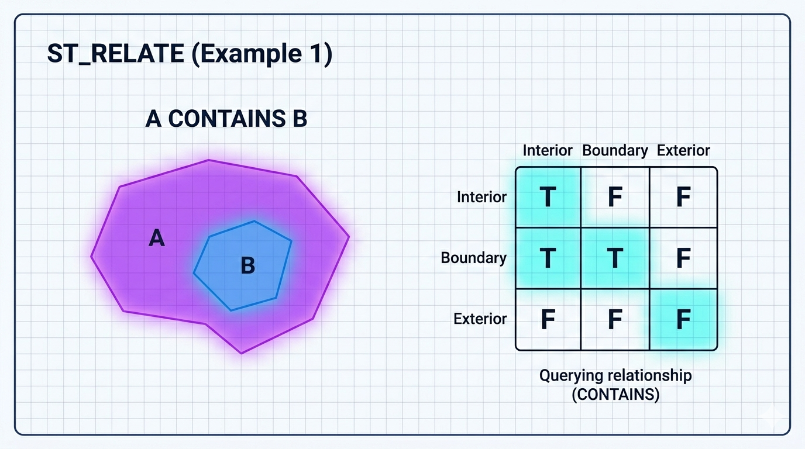
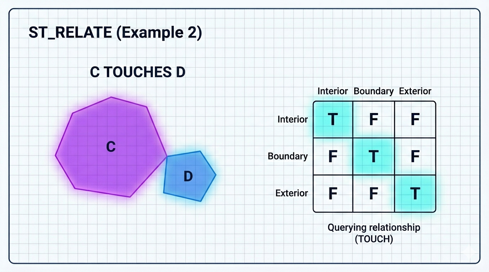

# ST_Relate

A função `ST_RELATE` é a função espacial **mais poderosa e flexível** para verificar relacionamentos topológicos entre duas geometrias. Ela é baseada no modelo **DE-9IM** (Dimensionally Extended 9-Intersection Model), um padrão OGC que descreve precisamente como os interiores (I), bordas (B) e exteriores (E) de duas geometrias se relacionam.

Enquanto funções como `ST_INTERSECTS`, `ST_WITHIN`, `ST_TOUCHES` etc. são atalhos para casos comuns, `ST_RELATE` permite definir **qualquer relação topológica possível**, inclusive relações complexas que não têm função dedicada.

```sql
ST_RELATE(g1, g2)                    -- Retorna a string DE-9IM (9 caracteres)
ST_RELATE(g1, g2, pattern)           -- Retorna 1 (TRUE) se o padrão for atendido, 0 caso contrário
```

- **Parâmetros**:
  - `g1`, `g2`: Duas geometrias válidas.
  - `pattern`: String de 9 caracteres (opcional) representando o padrão DE-9IM.

- **Retorno**:
  - Com 2 parâmetros: Uma string de 9 caracteres (ex.: `'FF2F11212'` ou `'T*****FF*'`).
  - Com 3 parâmetros: `1` (verdadeiro) ou `0` (falso).

## O que é o DE-9IM?

A matriz 3x3 considera as interseções entre:

|                    | Interior de g2 | Borda de g2 | Exterior de g2 |
| ------------------ | -------------- | ----------- | -------------- |
| **Interior de g1** | II             | IB          | IE             |
| **Borda de g1**    | BI             | BB          | BE             |
| **Exterior de g1** | EI             | EB          | EE             |

Cada célula pode conter:

- **F** = False (dimensão -1) → não intersectam
- **0** = Ponto (dimensão 0)
- **1** = Linha (dimensão 1)
- **2** = Área (dimensão 2)
- **T** = True (qualquer dimensão ≥ 0)
- ***** = Qualquer valor (curinga)

## Exemplos práticos

```sql
-- 1. Retornar a matriz DE-9IM completa
SET @p1 = ST_GEOMFROMTEXT('POLYGON((0 0, 0 10, 10 10, 10 0, 0 0))');
SET @p2 = ST_GEOMFROMTEXT('POLYGON((5 5, 5 15, 15 15, 15 5, 5 5))');
SELECT ST_RELATE(@p1, @p2);        -- Exemplo de saída: '212101212' ou similar

-- 2. Verificar se g1 toca g2 apenas na borda (equivalente a ST_TOUCHES)
SELECT ST_RELATE(@p1, @p2, 'FF*FF****');   -- Típico para TOUCHES

-- 3. Verificar relação específica (ex.: interiors não se sobrepõem, mas bordas tocam)
SELECT ST_RELATE(@p1, @p2, 'F**F*****');

-- 4. Exemplo comum: Polígono que contém outro (ST_CONTAINS)
SELECT ST_RELATE(@grande, @pequeno, 'T*****FF*');
```

## Padrões DE-9IM mais usados (correspondência com funções padrão)

- `ST_DISJOINT`      → `'FF*FF****'`
- `ST_INTERSECTS`    → `'T********'` ou `'T*****T**'`
- `ST_TOUCHES`       → `'FF*FF****'` ou `'F***F****'`
- `ST_CROSSES`       → `'T*T******'` (para linhas/polígonos)
- `ST_WITHIN`        → `'T*F**F***'`
- `ST_CONTAINS`      → `'T*****FF*'`
- `ST_OVERLAPS`      → `'T*T***T**'` (para áreas)
- `ST_EQUALS`        → `'T*F**FFF*'`

## Vantagens do ST_RELATE

- Permite relações que não existem em funções prontas (ex.: “o polígono toca a linha em exatamente dois pontos”).
- Mais preciso para casos complexos (linhas que cruzam polígonos de forma específica, multipolígonos, etc.).
- Útil em consultas avançadas de geoprocessamento.

## Limitações no MariaDB

- A função com 3 parâmetros retorna apenas booleano (não calcula a matriz). Para obter a matriz completa, use a versão com 2 parâmetros.
- O cálculo é planar (baseado no SRID). Em SRID 4326, não considera curvatura da Terra.
- Performance: Mais lenta que funções simples como `ST_INTERSECTS`. Use sempre que possível um filtro prévio com `ST_INTERSECTS` ou `MBRIntersects`.
- Geometrias inválidas podem gerar resultados inconsistentes.

## Representações visuais

Aqui estão diagramas educativos que explicam o conceito:




