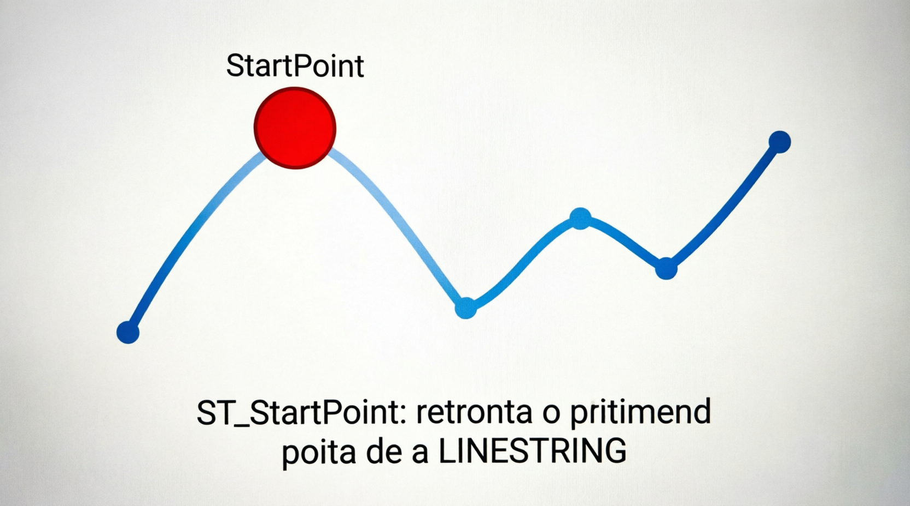

# ST_StartPoint

A função `ST_STARTPOINT` (sinônimo: `STARTPOINT`) retorna o **primeiro ponto** (ponto inicial) de uma `LINESTRING`.

É o complemento direto de `ST_ENDPOINT` e é muito usada para:

- Identificar a origem de uma rota ou trajeto.
- Processar redes viárias, rotas de entrega, linhas de transmissão, etc.
- Combinar com `ST_ENDPOINT` para obter início e fim de um caminho.

## Sintaxe oficial (MariaDB)

```sql
ST_STARTPOINT(ls)
STARTPOINT(ls)                 -- sinônimo
```

- **Parâmetro**:
  - `ls`: Uma geometria do tipo `LINESTRING`.

- **Retorno**:
  - Um `POINT` com as coordenadas do primeiro vértice da linha.
  - Retorna `NULL` se:
    - A geometria não for uma `LINESTRING` válida.
    - A linha estiver vazia.
    - A entrada for `NULL`.

## Exemplos práticos

```sql
-- 1. Exemplo básico
SET @linha = ST_GEOMFROMTEXT('LINESTRING(0 0, 10 5, 25 10, 40 0)');
SELECT ST_ASWKT(ST_STARTPOINT(@linha));
-- Resultado: POINT(0 0)

-- 2. Exemplo com rota real (São Paulo → Rio → Brasília)
SET @rota = ST_GEOMFROMTEXT('LINESTRING(-46.6333 -23.5505, -43.1729 -22.9068, -47.9292 -15.7801)', 4326);

SELECT 
  ST_ASWKT(ST_STARTPOINT(@rota))  AS origem,
  ST_ASWKT(ST_ENDPOINT(@rota))    AS destino;
-- Resultado: 
-- origem  = POINT(-46.6333 -23.5505)  → São Paulo
-- destino = POINT(-47.9292 -15.7801)  → Brasília

-- 3. Combinado com distância total
SELECT 
  ST_ASWKT(ST_STARTPOINT(@rota)) AS inicio,
  ST_ASWKT(ST_ENDPOINT(@rota))   AS fim,
  ST_DISTANCE_SPHERE(ST_STARTPOINT(@rota), ST_ENDPOINT(@rota)) / 1000 AS distancia_km;
```

## Comparação com funções relacionadas

| Função           | O que retorna              | Equivalente a                   | Uso principal            |
| ---------------- | -------------------------- | ------------------------------- | ------------------------ |
| ST_STARTPOINT    | Primeiro ponto da linha    | ST_POINTN(ls, 1)                | Origem da rota           |
| ST_ENDPOINT      | Último ponto da linha      | ST_POINTN(ls, ST_NumPoints(ls)) | Destino da rota          |
| ST_POINTN(ls, N) | Qualquer ponto N (1-based) | -                               | Acesso genérico          |
| ST_NumPoints(ls) | Quantidade total de pontos | -                               | Saber o tamanho da linha |

## Diferenças importantes

- `ST_STARTPOINT` só funciona corretamente com **LINESTRING** simples.
- Se você passar uma `MULTILINESTRING`, o resultado pode ser inesperado ou `NULL`. Para MULTILINESTRING, use `ST_GEOMETRYN` primeiro para extrair a LineString desejada.
- Linha com apenas **um ponto**: `ST_STARTPOINT` e `ST_ENDPOINT` retornam o mesmo ponto.

## Limitações e boas práticas no MariaDB

- Funciona **apenas** com `LINESTRING`. Outros tipos (POLYGON, POINT, MULTILINESTRING) geralmente retornam `NULL`.
- Performance: Extremamente rápida.
- Recomendação: Sempre combine com `ST_NumPoints()` ou verifique o tipo da geometria (`ST_GeometryType()`) para evitar surpresas.
- Para obter o ponto inicial de uma rota em coordenadas geográficas, use `ST_STARTPOINT` + `ST_DISTANCE_SPHERE` para cálculos de distância.

## Representações visuais

Aqui estão diagramas educativos que mostram claramente o funcionamento da função:




