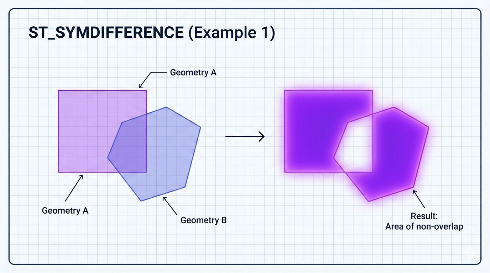
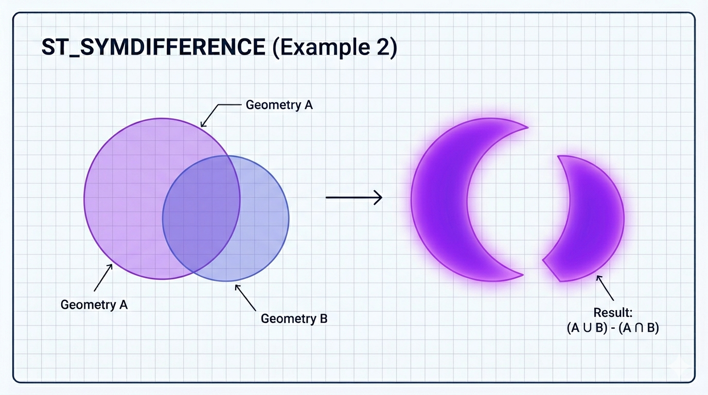

# ST_SymDifference

A função `ST_SYMDIFFERENCE` (também escrita como `ST_SYMDIFFERENCE` ou sinônimo em maiúsculas) é uma **função construtora de geometria** do padrão OGC. Ela calcula a **diferença simétrica** (symmetric difference ou XOR espacial) entre duas geometrias.

Em termos simples: retorna **tudo que está em uma geometria OU na outra, mas NÃO na interseção das duas**.  
É o equivalente geométrico da operação lógica **XOR**.

Matematicamente:

```sql
ST_SYMDIFFERENCE(g1, g2) = ST_Difference(ST_Union(g1, g2), ST_Intersection(g1, g2))
```

Ou seja: une as duas geometrias e remove a parte onde elas se sobrepõem.

## Sintaxe oficial (MariaDB)

```sql
ST_SYMDIFFERENCE(g1, g2)
```

- **Parâmetros**:
  - `g1` e `g2`: Duas geometrias válidas (POINT, LINESTRING, POLYGON, MULTI*, GEOMETRYCOLLECTION, etc.).

- **Retorno**:
  - Uma geometria (geralmente `MULTIPOLYGON`, `MULTILINESTRING`, `GEOMETRYCOLLECTION` ou geometria vazia).
  - Mantém o mesmo SRID das entradas.
  - Retorna `NULL` se alguma entrada for `NULL`.
  - Se não houver diferença simétrica (uma completamente contida na outra ou iguais), retorna geometria vazia.

## Comportamento por tipo de geometria

- **Dois POLYGON que se sobrepõem parcialmente** → `MULTIPOLYGON` com as duas “luas” ou partes exclusivas.
- **Um polígono completamente dentro do outro** → O polígono externo inteiro (a parte interna é removida como interseção).
- **Duas linhas que se cruzam** → `MULTILINESTRING` com os trechos que não se sobrepõem.
- **Pontos** → `MULTIPOINT` com os pontos que não coincidem.
- O resultado **não inclui** a região de sobreposição.

## Exemplos práticos

```sql
-- 1. Diferença simétrica entre dois polígonos sobrepostos
SET @p1 = ST_GEOMFROMTEXT('POLYGON((0 0, 0 10, 10 10, 10 0, 0 0))');
SET @p2 = ST_GEOMFROMTEXT('POLYGON((5 5, 5 15, 15 15, 15 5, 5 5))');

SELECT ST_ASWKT(ST_SYMDIFFERENCE(@p1, @p2));
-- Resultado: MULTIPOLYGON com as duas áreas que não se sobrepõem 
-- (parte esquerda de p1 + parte direita de p2)

-- 2. Um polígono completamente dentro do outro
SET @grande = ST_GEOMFROMTEXT('POLYGON((0 0, 0 20, 20 20, 20 0, 0 0))');
SET @pequeno = ST_GEOMFROMTEXT('POLYGON((5 5, 5 15, 15 15, 15 5, 5 5))');
SELECT ST_ASWKT(ST_SYMDIFFERENCE(@grande, @pequeno));
-- Resultado: O polígono grande inteiro (o pequeno foi removido como interseção)

-- 3. Duas linhas que se cruzam
SET @l1 = ST_GEOMFROMTEXT('LINESTRING(0 0, 10 10)');
SET @l2 = ST_GEOMFROMTEXT('LINESTRING(0 10, 10 0)');
SELECT ST_ASWKT(ST_SYMDIFFERENCE(@l1, @l2));
-- Resultado: MULTILINESTRING com os quatro "braços" saindo do ponto de cruzamento
```

## Comparação com outras funções de conjunto (tabela completa)

| Função           | Operação lógica | O que retorna                                   | Resultado típico                     |
| ---------------- | --------------- | ----------------------------------------------- | ------------------------------------ |
| ST_UNION         | OR              | Tudo que está em g1 ou g2 (inclui sobreposição) | Geometria combinada                  |
| ST_INTERSECTION  | AND             | Apenas a parte comum                            | Sobreposição                         |
| ST_SYMDIFFERENCE | XOR             | Em g1 ou g2, mas não em ambos                   | Partes exclusivas (sem sobreposição) |
| ST_DIFFERENCE    | g1 - g2         | Parte de g1 que não está em g2                  | g1 "menos" g2                        |

**Dica**: `ST_SYMDIFFERENCE` é simétrica: `ST_SYMDIFFERENCE(g1,g2) = ST_SYMDIFFERENCE(g2,g1)`.

## Limitações e boas práticas no MariaDB

- **Performance**: Mais cara que `ST_INTERSECTS` ou `ST_UNION` simples, pois internamente faz união + interseção + diferença. Use filtro prévio com `ST_INTERSECTS` quando possível.
- **Geometrias inválidas**: Podem gerar resultados inesperados ou `GEOMETRYCOLLECTION`. Valide com `ST_ISVALID(g1)` e `ST_ISVALID(g2)`.
- **SRID 4326 (lat/long)**: O cálculo é planar (não considera curvatura da Terra). Para precisão em grandes distâncias, reprojete para SRID métrico (ex.: UTM).
- **Resultado complexo**: Frequentemente retorna `MULTIPOLYGON` ou `GEOMETRYCOLLECTION`. Após a função, pode ser útil aplicar `ST_SIMPLIFY` ou `ST_CONVEXHULL`.
- Não há parâmetro de tolerância/grid size documentado no MariaDB (diferente de PostGIS).

## Representações visuais

Aqui estão diagramas que ilustram claramente o conceito de diferença simétrica:




