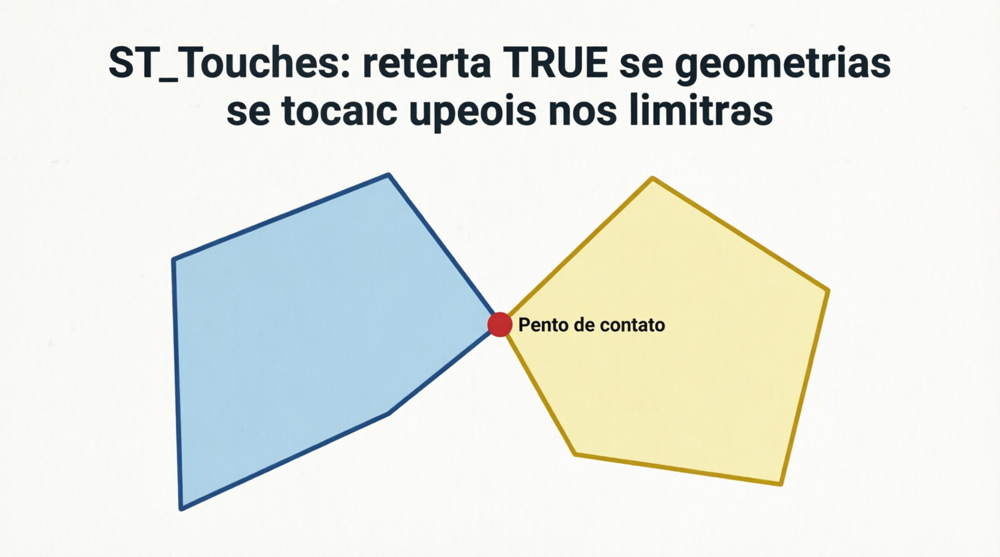
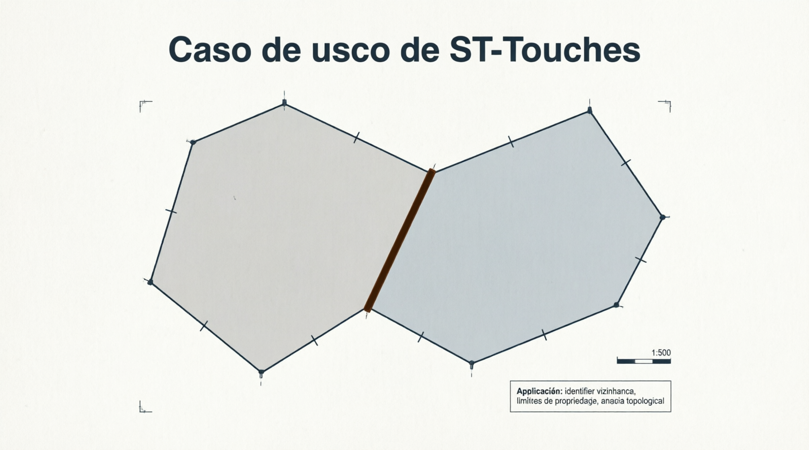

# ST_Touches

A função `ST_TOUCHES` é uma **função de relacionamento espacial** (spatial predicate) do padrão OGC. Ela verifica se duas geometrias **se tocam apenas na borda**, sem que seus interiores se sobreponham.

- Retorna **1 (TRUE)** se as geometrias compartilham **pelo menos um ponto na borda**, mas **nenhum ponto no interior**.
- Retorna **0 (FALSE)** se os interiores se sobrepõem, se uma está completamente dentro da outra, ou se não há nenhum contato.

É muito útil para detectar situações como:

- Dois polígonos que compartilham um lado ou um vértice (vizinhos).
- Uma linha que toca a borda de um polígono sem entrar nele.
- Dois polígonos adjacentes (ex.: estados ou terrenos que se tocam na fronteira).

## Sintaxe oficial (MariaDB)

```sql
ST_TOUCHES(g1, g2)
```

- `g1` e `g2`: Duas geometrias válidas.
- Retorno: `1` (TRUE), `0` (FALSE) ou `NULL`.

## Definição formal (DE-9IM)

`ST_TOUCHES` geralmente corresponde aos padrões:

- `'FF*FF****'` ou `'F***F****'`

Isso significa que:

- Os interiores **não** se intersectam (`F`).
- Existe interseção entre borda e borda, ou borda e interior (mas sem sobreposição de interiores).

## Exemplos práticos

```sql
-- 1. Dois polígonos que compartilham um lado
SET @pol1 = ST_GEOMFROMTEXT('POLYGON((0 0, 0 10, 10 10, 10 0, 0 0))');
SET @pol2 = ST_GEOMFROMTEXT('POLYGON((10 0, 10 5, 15 5, 15 0, 10 0))');  -- toca na borda direita

SELECT ST_TOUCHES(@pol1, @pol2);     -- 1 (TRUE)

-- 2. Linha tocando a borda de um polígono (sem entrar)
SET @pol = ST_GEOMFROMTEXT('POLYGON((0 0, 0 10, 10 10, 10 0, 0 0))');
SET @linha_toque = ST_GEOMFROMTEXT('LINESTRING(10 3, 15 3)');   -- toca na borda x=10
SELECT ST_TOUCHES(@pol, @linha_toque);   -- 1 (TRUE)

-- 3. Casos onde retorna FALSE
SET @linha_cruzando = ST_GEOMFROMTEXT('LINESTRING(5 5, 15 5)');  -- atravessa o interior
SELECT ST_TOUCHES(@pol, @linha_cruzando);   -- 0 (FALSE) → usa ST_CROSSES

SET @ponto_dentro = ST_GEOMFROMTEXT('POINT(5 5)');
SELECT ST_TOUCHES(@pol, @ponto_dentro);     -- 0 (FALSE) → usa ST_CONTAINS ou ST_WITHIN
```

## Comparação com outras funções de relacionamento

| Função        | Retorna 1 quando...                           | Interseção de interiores | Uso típico                              |
| ------------- | --------------------------------------------- | ------------------------ | --------------------------------------- |
| ST_TOUCHES    | Tocam apenas na borda (sem sobrepor interior) | Não                      | Polígonos vizinhos, linha tocando borda |
| ST_INTERSECTS | Qualquer tipo de contato                      | Pode                     | Qualquer contato                        |
| ST_CROSSES    | Cruzam propriamente (interseção interior)     | Sim                      | Linha atravessando polígono             |
| ST_CONTAINS   | Uma contém completamente a outra              | Sim                      | "Está dentro"                           |
| ST_DISJOINT   | Não têm nenhum ponto em comum                 | Não                      | Nada em comum                           |

**Regra prática**:

- Use `ST_TOUCHES` quando quiser detectar **contato de fronteira** sem sobreposição de áreas.

## Limitações e boas práticas no MariaDB

- Funciona melhor com combinações **POLYGON/POLYGON**, **LINESTRING/POLYGON** e **LINESTRING/LINESTRING**.
- Não é recomendado para dois pontos (use `ST_EQUALS` ou `ST_DISTANCE`).
- Performance: Use índice espacial (`SPATIAL INDEX`). É mais rápido que `ST_INTERSECTS` em alguns casos de borda.
- Geometrias inválidas podem retornar resultados inconsistentes → valide com `ST_ISVALID()`.
- SRID 4326: O teste é planar (não considera curvatura).
- Pontos na borda são considerados "toque" (verdadeiro).

## Representações visuais

Aqui estão diagramas educativos que mostram exatamente quando `ST_TOUCHES` retorna **1** ou **0**:




