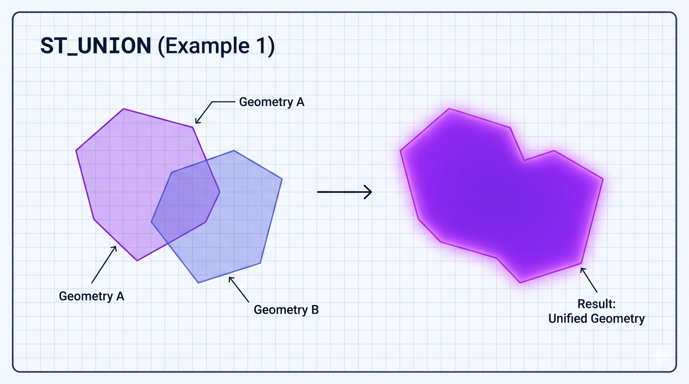
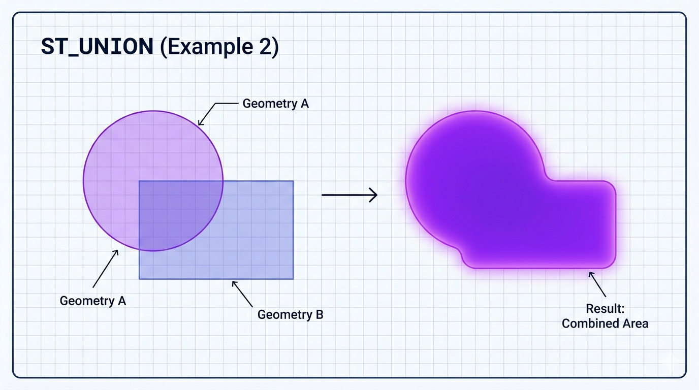

# ST_Union

A função `ST_UNION` é uma **função construtora de geometria** do padrão OGC. Ela retorna a **união** (fusão) de duas ou mais geometrias, ou seja, a geometria que representa **todos os pontos que pertencem a pelo menos uma** das geometrias de entrada.

É o complemento geométrico da função `ST_INTERSECTION`. Enquanto a interseção pega apenas a parte comum, a união pega **tudo** (sem duplicar as áreas sobrepostas).

## Sintaxe oficial (MariaDB)

```sql
ST_UNION(g1, g2)                    -- União de duas geometrias
ST_UNION(g1, g2, g3, ...)           -- MariaDB permite múltiplas (até certo limite)
```

- **Parâmetros**: Duas ou mais geometrias válidas.
- **Retorno**: Uma única geometria (geralmente `POLYGON`, `MULTIPOLYGON`, `MULTILINESTRING`, `GEOMETRYCOLLECTION` ou geometria vazia).
- Retorna `NULL` se alguma entrada for `NULL`.

**Importante**:

- `ST_UNION` **remove sobreposições** automaticamente (faz "dissolve").
- O resultado é uma geometria **válida** na maioria dos casos (mas não é garantido 100% se as entradas forem muito complexas).

## Comportamento por tipo de geometria

- **Dois POLYGON** que se sobrepõem → Um único `POLYGON` ou `MULTIPOLYGON` (áreas unidas, sobreposição removida).
- **Vários POLYGON** → `MULTIPOLYGON` com as partes fundidas.
- **LINESTRING** → `MULTILINESTRING` (linhas unidas onde se tocam).
- **Pontos** → `MULTIPOINT`.
- **Mistura de tipos** → `GEOMETRYCOLLECTION`.

## Exemplos práticos

```sql
-- 1. União de dois polígonos sobrepostos
SET @p1 = ST_GEOMFROMTEXT('POLYGON((0 0, 0 10, 10 10, 10 0, 0 0))');
SET @p2 = ST_GEOMFROMTEXT('POLYGON((5 5, 5 15, 15 15, 15 5, 5 5))');
SELECT ST_ASWKT(ST_UNION(@p1, @p2));
-- Resultado: Um único polígono (ou multipolígono) que cobre toda a área combinada

-- 2. União de três polígonos
SELECT ST_ASWKT(ST_UNION(@p1, @p2, @p3));

-- 3. União de linhas
SET @l1 = ST_GEOMFROMTEXT('LINESTRING(0 0, 10 0)');
SET @l2 = ST_GEOMFROMTEXT('LINESTRING(5 0, 15 5)');
SELECT ST_ASWKT(ST_UNION(@l1, @l2));
-- Resultado: MULTILINESTRING ou LINESTRING fundida se conectarem

-- 4. Verificar área total após união
SELECT ST_AREA(ST_UNION(@p1, @p2));   -- Área sem sobreposição duplicada
```

## Diferença importante: ST_UNION vs ST_UNION (agregada)

O MariaDB também suporta `ST_UNION` como **função agregada** (desde versões recentes):

```sql
SELECT ST_UNION(geom) 
FROM minha_tabela 
WHERE categoria = 'parques'
GROUP BY regiao;
```

Isso é extremamente útil para fundir centenas ou milhares de polígonos de uma só vez.

## Comparação com outras funções de conjunto

| Função           | O que faz                 | Resultado típico               | Remove sobreposição? |
| ---------------- | ------------------------- | ------------------------------ | -------------------- |
| ST_UNION         | União (OR lógico)         | Tudo que está em g1 ou g2      | Sim                  |
| ST_INTERSECTION  | Interseção (AND lógico)   | Apenas parte comum             | -                    |
| ST_SYMDIFFERENCE | Diferença simétrica (XOR) | Partes que estão em apenas um  | -                    |
| ST_DIFFERENCE    | Diferença (g1 - g2)       | Parte de g1 que não está em g2 | -                    |

## Limitações e boas práticas no MariaDB

- **Performance**: Para muitas geometrias, use a versão agregada `ST_UNION(geom)` com `GROUP BY`. É muito mais eficiente que fazer UNION repetido.
- **Geometrias inválidas**: Podem gerar resultados inválidos ou `GEOMETRYCOLLECTION` inesperada. Sempre valide com `ST_ISVALID` quando possível.
- **SRID**: O resultado mantém o SRID da primeira geometria não-nula.
- **SRID 4326**: Calcula planar (não geodésico). Para áreas grandes, considere reprojeção.
- **Limite prático**: Unir geometrias muito complexas (milhares de vértices cada) pode consumir muita memória e tempo.
- Dica: Após `ST_UNION`, muitas vezes é útil aplicar `ST_SIMPLIFY` ou `ST_CONVEXHULL` para limpar o resultado.

## Representações visuais

Aqui estão diagramas claros que mostram o comportamento da função:




