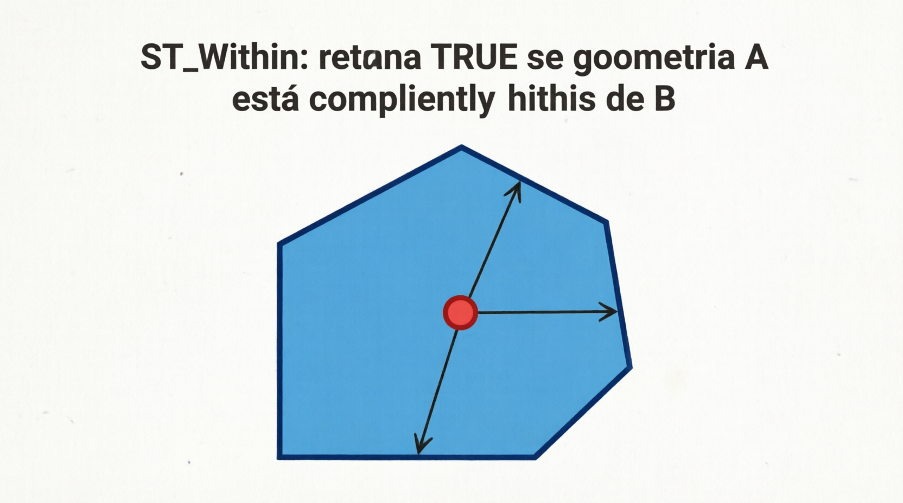
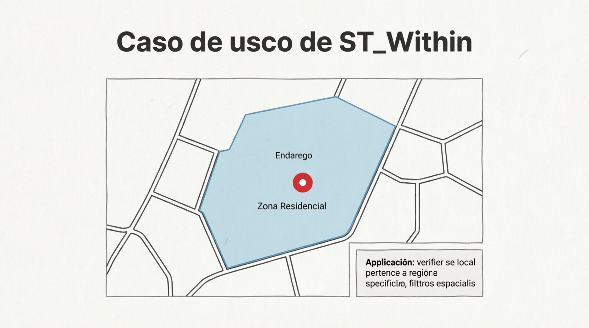

# ST_Within

A função `ST_WITHIN` é uma **função de relacionamento espacial** do padrão OGC. Ela verifica se a geometria `g1` está **completamente dentro** da geometria `g2`.

- Retorna **1 (TRUE)** se todos os pontos de `g1` estiverem dentro ou na borda de `g2`.
- Retorna **0 (FALSE)** caso contrário.

É o **inverso** da função `ST_CONTAINS`:

- `ST_WITHIN(g1, g2) = 1`  ⇔  `ST_CONTAINS(g2, g1) = 1`

## Sintaxe oficial (MariaDB)

```sql
ST_WITHIN(g1, g2)
```

- `g1`: Geometria que deve estar contida (ex.: um ponto, linha ou polígono menor).
- `g2`: Geometria que deve conter `g1` (geralmente um `POLYGON` ou `MULTIPOLYGON`).
- Retorno: `1`, `0` ou `NULL`.

## Definição formal (DE-9IM)

Corresponde ao padrão: **`T*F**F***`**

Isso significa que o interior de `g1` está completamente dentro do interior ou borda de `g2`, e não há nenhuma parte de `g1` no exterior de `g2`.

## Exemplos práticos

```sql
-- 1. Ponto dentro de um polígono
SET @pol = ST_GEOMFROMTEXT('POLYGON((0 0, 0 10, 10 10, 10 0, 0 0))');
SET @ponto_dentro = ST_GEOMFROMTEXT('POINT(5 5)');
SET @ponto_fora   = ST_GEOMFROMTEXT('POINT(15 5)');

SELECT ST_WITHIN(@ponto_dentro, @pol);   -- 1 (TRUE)
SELECT ST_WITHIN(@ponto_fora, @pol);     -- 0 (FALSE)

-- 2. Polígono menor dentro de polígono maior
SET @grande = ST_GEOMFROMTEXT('POLYGON((0 0, 0 20, 20 20, 20 0, 0 0))');
SET @pequeno = ST_GEOMFROMTEXT('POLYGON((5 5, 5 15, 15 15, 15 5, 5 5))');
SELECT ST_WITHIN(@pequeno, @grande);     -- 1 (TRUE)

-- 3. Linha completamente dentro do polígono
SET @linha_dentro = ST_GEOMFROMTEXT('LINESTRING(2 2, 8 8)');
SELECT ST_WITHIN(@linha_dentro, @pol);   -- 1 (TRUE)

-- 4. Consulta típica: "Quais pontos estão dentro desta cidade?"
SELECT nome, endereco
FROM pontos_interesse
WHERE ST_WITHIN(geom_ponto, geom_cidade);
```

## Comparação com outras funções

| Função              | Significado                                   | Ordem dos argumentos        | Uso típico                           |
| ------------------- | --------------------------------------------- | --------------------------- | ------------------------------------ |
| ST_WITHIN(g1, g2)   | g1 está completamente dentro de g2            | g1 = objeto, g2 = container | "Este ponto está dentro desta área?" |
| ST_CONTAINS(g1, g2) | g1 contém completamente g2                    | Inverso                     | "Qual área contém este ponto?"       |
| ST_INTERSECTS       | Qualquer tipo de contato                      | Não importa                 | "Existe algum contato?"              |
| ST_TOUCHES          | Tocam apenas na borda (sem sobrepor interior) | Não importa                 | "Apenas encostam na fronteira"       |
| ST_CROSSES          | Cruzam propriamente                           | Não importa                 | "Linha atravessa o polígono"         |

**Regra prática**:  
Use `ST_WITHIN` quando a pergunta for **"está dentro?"**  
Use `ST_CONTAINS` quando a pergunta for **"contém?"**

## Limitações e boas práticas no MariaDB

- **Pontos na borda**: São considerados "dentro" (retorna 1).
- **Polígonos com buracos**: O objeto deve estar na área válida (não pode estar dentro de um buraco).
- **Performance**: Use **SPATIAL INDEX** na coluna que representa a área maior (`g2`). O MariaDB usa o índice com `ST_WITHIN`.
- Geometrias inválidas podem dar resultados errados → valide com `ST_ISVALID()`.
- SRID 4326: O teste é planar. Para áreas muito grandes, pode haver pequenas imprecisões.
- Dica de performance em tabelas grandes:
  ```sql
  WHERE ST_WITHIN(geom_ponto, @area)
  AND MBRWithin(geom_ponto, ST_ENVELOPE(@area))   -- filtro rápido com bounding box
  ```

## Representações visuais

Aqui estão diagramas que mostram claramente quando `ST_WITHIN` retorna **1** ou **0**:




