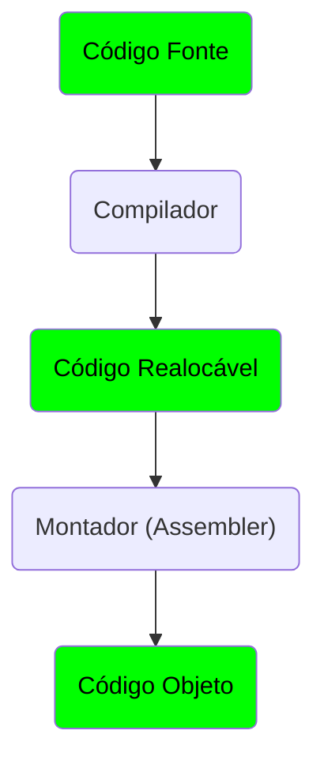

# Processo de Compilação

Um programa pode existir em 3 níveis:

- Fonte (simbólico)
- Realocável
- Objeto (executável)

## Compilador

Vai verificar a sintaxe dos comandos, buscar por erros, realizar a tradução do código simbólico em múltiplas instruções essenciais

## Montador

Ou Assembler realiza cáuculos de endereçamento e transforma as instruções realocáveis em linguegem de máquina

## Código Objeto

Linguagem de Máquina/Bytecode
