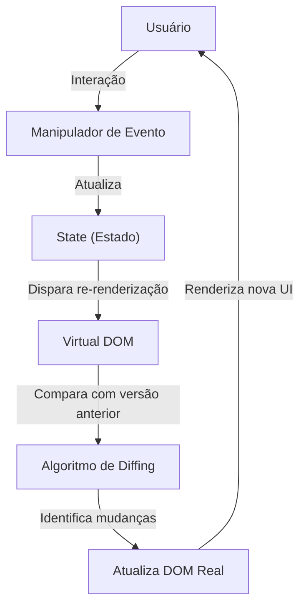

# React

O React é uma biblioteca JavaScript para construção de interfaces de usuário interativas e eficientes, baseada no conceito de **componentes reutilizáveis**. Ele utiliza um modelo de **árvore virtual (Virtual DOM)** para otimizar renderizações e melhorar a performance.

---

### 🔹 **Arquitetura do React**  
O React segue o conceito de **UI declarativa**, onde a interface é dividida em **componentes** reutilizáveis que representam diferentes partes da aplicação.  

1. **Componentes** → Blocos de construção da interface, podendo ser **funcionais** ou **baseados em classe**.  
2. **Props (Propriedades)** → Dados passados de um componente pai para um filho.  
3. **State (Estado)** → Gerenciado dentro do componente, define o comportamento dinâmico da UI.  
4. **Eventos e Hooks** → Gerenciam interações e estados dentro dos componentes (ex: `useState`, `useEffect`).  
5. **Virtual DOM** → Estrutura otimizada que reduz o número de atualizações reais na interface.  
6. **React Router** → Sistema de navegação para aplicações SPA (Single Page Applications).  
7. **Context API/Redux** → Gerenciamento de estado global para compartilhamento de dados entre componentes.  

---

### **Fluxo de Funcionamento do React**
1. O usuário interage com a UI.  
2. O **evento** dispara uma atualização no **estado (state)** do componente.  
3. O React compara o **Virtual DOM** com a versão anterior.  
4. Apenas os elementos modificados são atualizados no **DOM real**.  
5. A UI é re-renderizada de forma eficiente.  

---

### **Diagrama Mermaid da Arquitetura do React**

---

### 🔹 **Recursos do React**
✅ **Componentização** → Reutilização de código facilita manutenção.  
✅ **Virtual DOM** → Melhora performance ao evitar renderizações desnecessárias.  
✅ **Hooks** → Substituem classes e tornam a lógica mais concisa.  
✅ **SPA (Single Page Application)** → Navegação rápida sem recarregar a página.  
✅ **Ecossistema robusto** → Integra-se bem com Redux, Tailwind, Next.js e outras ferramentas.  

---

Essa é a estrutura principal do React! Precisa de mais detalhes sobre algum ponto? 🚀