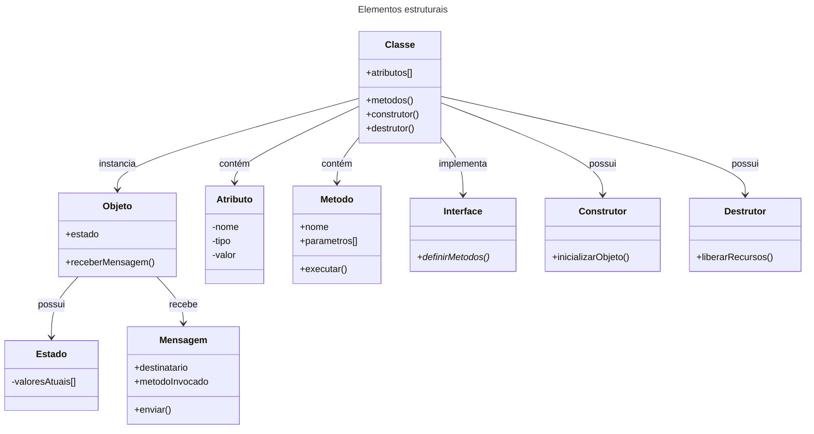
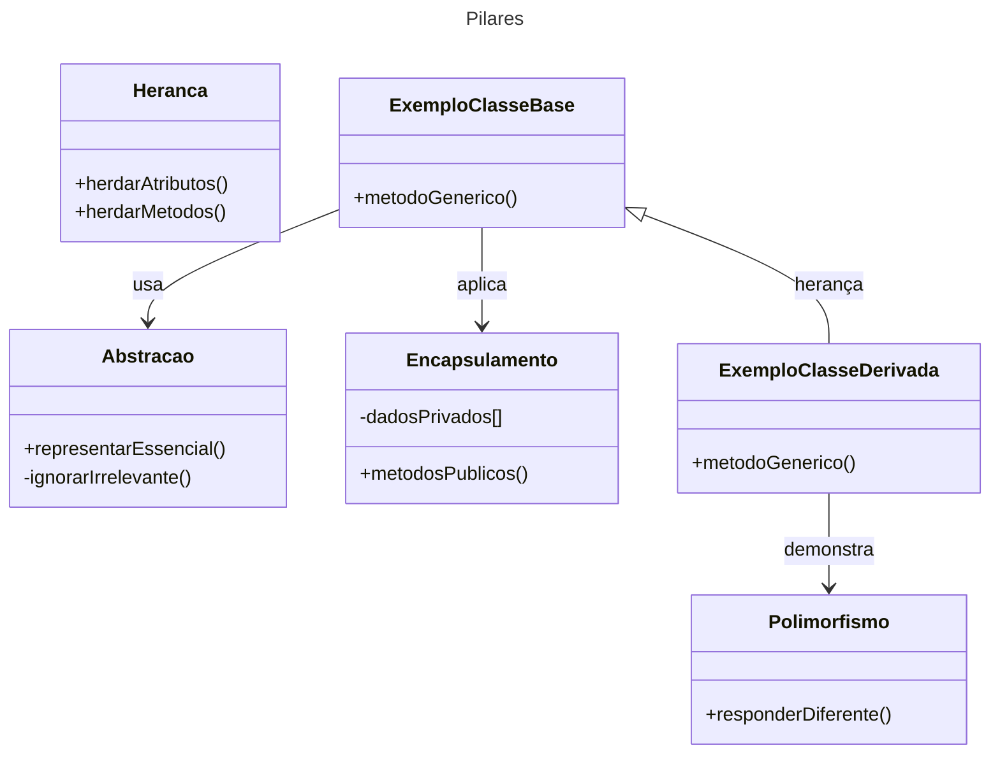
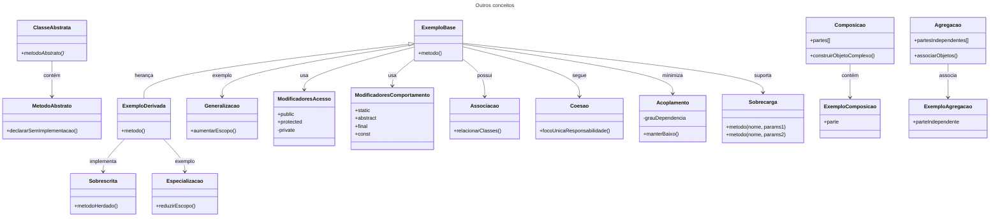

# OO - Orientação a Objetos

Na **orientação a objetos (OO)** existem alguns elementos fundamentais — alguns chamam de “pilares” ou “princípios básicos” — que definem como o paradigma funciona.

Se organizarmos do mais básico (estrutural) ao mais avançado (conceitual), temos:

## 1. Elementos estruturais

São as peças básicas para modelar qualquer sistema orientado a objetos:

- **Classe**: molde ou estrutura que define atributos (dados) e métodos (comportamentos) que representam a funcionalidade de um objeto (Ex: Funcionalidades de uma Cadeira)
- **Objeto**: instância concreta de uma classe (Cadeira).
- **Atributos**: variáveis que representam características/propriedades do objeto.
- **Métodos**: funções associadas à classe que definem ações do objeto.
- **Estado**: conjunto atual de valores dos atributos de um objeto.
- **Mensagem**: forma de comunicação entre objetos, invocando métodos.
- **Interface**: contrato que define métodos que uma classe deve implementar.
- **Construtor**: método especial para criar e inicializar objetos.
- **Destrutor**: método especial para liberar recursos antes do objeto ser removido.

## 2. Pilares

Os conceitos centrais que diferenciam OO de outros paradigmas:

1. **Abstração**: (interface/template) representar apenas os aspectos essenciais de algo, ignorando detalhes irrelevantes para o contexto.
2. **Encapsulamento**: esconder detalhes internos (atributos e implementação) e expor apenas o necessário via métodos públicos.
3. **Herança**: criar novas classes a partir de classes existentes, herdando atributos e métodos.
4. **Polimorfismo**: permitir que diferentes classes respondam de forma diferente a um mesmo método ou mensagem.

## 3. Outros conceitos importantes

Além dos pilares, existem práticas e padrões que fortalecem o design OO:

- **Composição**: formar objetos complexos a partir de outros objetos (preferir composição a herança em muitos casos).
- **Agregação**: tipo de composição mais fraca, onde objetos podem existir de forma independente.
- **Associação**: relação genérica entre classes.
- **Coesão**: manter cada classe focada em uma única responsabilidade.
- **Acoplamento**: grau de dependência entre classes (idealmente baixo).
- **Sobrecarga (Overloading)**: ter métodos com o mesmo nome, mas parâmetros diferentes.
- **Sobrescrita (Overriding)**: redefinir um método herdado para alterar seu comportamento.
- **Classes abstratas**: classes que não podem ser instanciadas diretamente, servem de base para outras.
- **Métodos abstratos**: métodos declarados sem implementação, forçando subclasses a implementá-los.
- **Especialização**: criar uma classe mais específica a partir de uma classe mais genérica, herdando seus atributos e métodos, e adicionando ou modificando comportamentos. Especialização **reduz o escopo** para criar algo mais específico.
- **Generalização**: processo inverso da especialização que é abstrair características comuns de várias classes e colocá-las em uma classe mais genérica. Generalização **aumenta o escopo** para representar algo mais genérico.
- **Modificadores**: palavras-chave que alteram o comportamento, escopo ou regras de uso de classes, métodos ou atributos.
  - **Modificadores de acesso**/**Visibilidade**: define **quem pode acessar** atributos e métodos.
    1. **public**: acessível de qualquer lugar.
    2. **protected**: acessível apenas pela própria classe e por classes que a herdam.
    3. **private**: acessível apenas pela própria classe.
  - **Modificadores de comportamento**: também chamados de modificadores não-acesso, alteram como algo funciona ou pode ser usado:
    1. **static**: pertence à classe e não à instância.
    2. **abstract**: declara algo que precisa ser implementado em subclasses.
    3. **final**: impede sobrescrita (método) ou herança (classe).
    4. **const**: valor constante.

