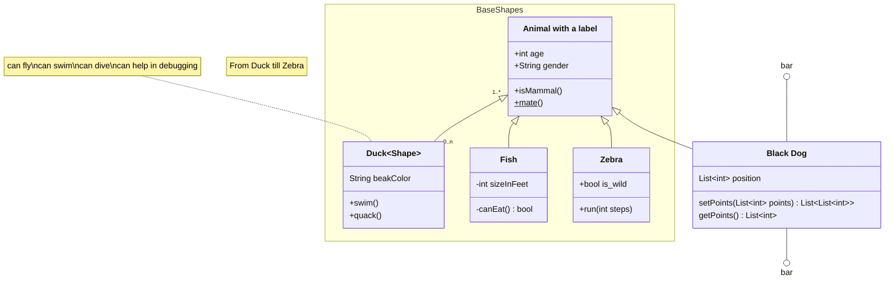

## OO - Diagrama de Classes

Um **Diagrama de Classes** é um dos principais diagramas da **UML (Unified Modeling Language)**, utilizado para representar a estrutura estática de um sistema orientado a objetos. Ele mostra as classes do sistema, seus atributos, métodos e os relacionamentos entre elas.

### **Elementos principais do Diagrama de Classes:**

1. **Classes**  
   Representam os conceitos ou entidades do sistema. Cada classe é representada por um retângulo dividido em três partes:
   - **Nome da classe** (parte superior)
   - **Atributos** (parte central)  
   - **Métodos/Operações** (parte inferior)  
   
   **Exemplo:**  
   ```mermaid
    classDiagram
        class Animal{
            +int age
            -String gender
            #String legs
            +isMammal() bool
            +mate() bool
        }
   ```

2. **Atributos**  
   Definem as características ou propriedades da classe. Seguem a notação:  
   `visibilidade nome: tipo`  
   - **Visibilidade:**  
     - **+** Public (público) ou sem sinal
     - **-** Private (privado)  
     - **#** Protected (protegido)  
     - **\~** Package/Internal(pacote/interno)  
   - **Classificadores:**
     - Abstract(abstrato) **\***  
     - Static(estático) **$**  

3. **Métodos/Operações**  
   Representam as ações ou comportamentos da classe. Seguem a notação:  
   `visibilidade nomeDoMetodo(parametros): retorno`  

4. **Relacionamentos**  
   Representam a forma como as classes interagem entre si. Existem vários tipos:
     ```mermaid
        classDiagram
            ClassA --|> ClassB : Inheritance
            ClassC --* ClassD : Composition
            ClassE --o ClassF : Aggregation
            ClassG --> ClassH : Association
            ClassI -- ClassJ : Link(Solid)
            ClassK ..> ClassL : Dependency
            ClassM ..|> ClassN : Realization
            ClassO .. ClassP : Link(Dashed)
            ClassR --() InterA : Lollipop  Interface
            InterA ()-- ClassS : Lollipop  Interface
     ```

   - **Herança/Generalização**: Representada por uma linha sólida com uma seta triangular, indica que uma classe herda de outra.
     ```mermaid
        classDiagram
            Veiculo <|-- Carro
            Veiculo <|-- Moto
     ```
   - **Composição**: Representada por um losango preenchido, indica uma relação mais forte de "parte de" (por exemplo, um carro "tem" um motor).
     ```mermaid
        classDiagram
            Carro *-- Motor : contém
     ```
   - **Agregação**: Representada por um losango vazio, indica uma relação “tem um” (por exemplo, uma sala "tem" várias cadeiras).
     ```mermaid
        classDiagram
            Biblioteca o-- Livro : possui
     ```
   - **Associação**: Representa uma conexão entre duas classes. Pode incluir multiplicidade (por exemplo, 1..*).
     ```mermaid
        classDiagram
            Pessoa --> Carro : possui
     ```
   - **Dependência**: Representada por uma linha tracejada, indica que uma classe usa temporariamente outra.
     ```mermaid
        classDiagram
            Pedido ..> Pagamento : usa
     ```
    - **Link**: 
     ```mermaid
        classDiagram
            class Pessoa {
                + nome: String
            }
            class Carro {
                + modelo: String
            }

            Pessoa -- Carro : pode possuir
     ```
5. **Tipos de Classes**
    - **Interface**: É uma entidade que define um contrato que classes devem implementar. Normalmente, uma interface é representada de forma semelhante a uma classe, mas com uma notação distinta, geralmente usando a palavra-chave <<interface>>.
     ```mermaid
        classDiagram
            class Dispositivo {
                <<Abstract>>
                +ligar()
                +desligar()
            }
            
            class Televisao {
                +ligar()
                +desligar()
            }
            
            class Radio {
                +ligar()
                +desligar()
            }
            
            class IControle {
                <<interface>>
                +ligar()
                +desligar()
            }
            
            IControle <|.. Dispositivo
            Dispositivo <|-- Televisao
            Dispositivo <|-- Radio
     ```
   - Abstract
     ```mermaid
        classDiagram
            class Dispositivo {
                <<Abstract>>
                +ligar()
                +desligar()
            }
     ```
   - Service
     ```mermaid
        classDiagram
            class Correio{
                <<Service>>
                +send(string message)
                +receive()
            }
     ```
   - Enumeration
     ```mermaid
        classDiagram
            class Color{
                <<enumeration>>
                RED
                BLUE
                GREEN
                WHITE
                BLACK
            }
     ```

### **Finalidade:**
- Visualizar a estrutura do sistema antes da implementação.
- Facilitar a comunicação entre membros da equipe.
- Servir como documentação para manutenção futura.

Esse diagrama é essencial no desenvolvimento de software orientado a objetos para planejar e entender a arquitetura do sistema.


