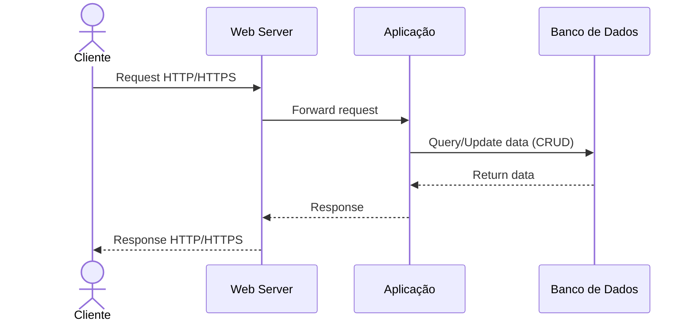
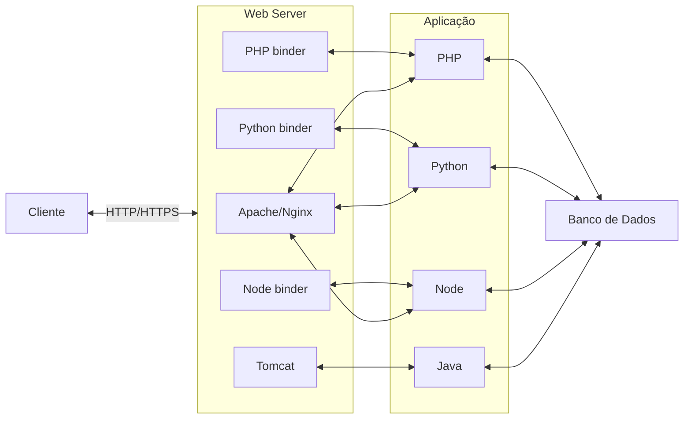
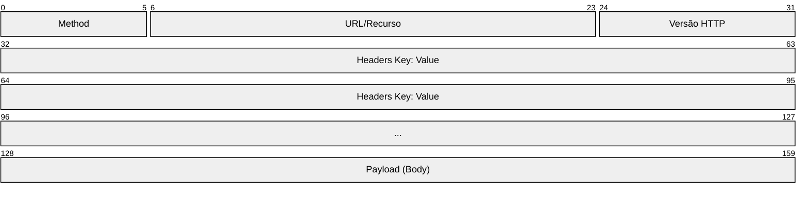

# Web Server

Um **Web Server (Servidor Web)** é um software/serviço (Apache, Nginx, IIS, Tomcat, Caddy, etc.) responsável por receber requisições de clientes (navegadores, aplicativos, APIs, curl, etc.), processá-las e devolver respostas através de protocolos como **HTTP** e **HTTPS**.

## Visão Geral da Comunicação





## Protocolos

### HTTP

É o protocolo de aplicação usado para a comunicação web.

Características:

- Baseado em Request/Response
  - Cliente → Requisição (Request)
  - Servidor → Resposta (Response)
- Stateless (sem estado): não mantém informações entre requisições pois cada requisição é independente. Porém, cookies e tokens podem ser usados para manter sessões.

Exemplo:

```http
GET /index.html HTTP/1.1
Host: www.exemplo.com
```

### HTTPS

É o HTTP sobre TLS/SSL.

**HTTPS**:
- HTTP
  - TLS/SSL
    - TCP
      - IP

Benefícios:

- Criptografia
- Integridade
- Autenticação do servidor

Porta padrão:

| Protocolo | Porta |
| --------- | ----- |
| HTTP      | 80    |
| HTTPS     | 443   |

## Estrutura de uma Requisição HTTP

Uma requisição possui:

```http
POST /api/clientes HTTP/1.1
Host: api.exemplo.com
Content-Type: application/json
Authorization: Bearer xxxxx

{
  "nome": "João",
  "idade": 30
}
```



Partes:

1. Método
2. URL/Recurso
3. Versão HTTP
4. Headers
5. Payload (Body)

## Métodos HTTP

### GET

Busca informações.

```http
GET /clientes/10
```

Não possui payload normalmente.

Exemplo:

```bash
curl https://api.exemplo.com/clientes/10
```

### POST

Cria recursos.

```http
POST /clientes
```

Payload:

```json
{
  "nome":"João"
}
```

### PUT

Atualiza completamente um recurso.

```http
PUT /clientes/10
```

```json
{
  "nome":"João Silva",
  "idade":35
}
```

### PATCH

Atualização parcial.

```http
PATCH /clientes/10
```

```json
{
  "idade":36
}
```

### DELETE

Remove um recurso.

```http
DELETE /clientes/10
```

### HEAD

Retorna apenas headers.

```http
HEAD /arquivo.zip
```

Muito usado para verificar:

- existência
- tamanho
- cache

### OPTIONS

Descobre métodos suportados.

```http
OPTIONS /api/clientes
```

Resposta:

```http
Allow: GET,POST,PUT,DELETE
```

Muito usado em CORS.

## Headers HTTP

Headers são metadados da requisição ou resposta.

### Requisição

#### Host

```http
Host: api.exemplo.com
```

Identifica o Virtual Host.

#### User-Agent

```http
User-Agent: Mozilla/5.0
```

Quem está fazendo a requisição.

#### Authorization

```http
Authorization: Bearer eyJ...
```

Autenticação.

#### Accept

```http
Accept: application/json
```

Formato esperado.

**Content-Type**:

```http
Content-Type: application/json
```

Formato enviado.

Outros exemplos:

```http
text/html
application/xml
multipart/form-data
```

#### Content-Length

```http
Content-Length: 245
```

Tamanho do payload.

#### Cookie

```http
Cookie: SESSION=123456
```

Sessão do usuário.

## Headers de Resposta

### Server

```http
Server: nginx
```

Servidor utilizado.

**Content-Type**:

```http
Content-Type: application/json
```

Tipo da resposta.

### Set-Cookie

```http
Set-Cookie: SESSION=ABC123
```

Criação de sessão.

### Cache-Control

```http
Cache-Control: no-cache
```

Controle de cache.

### Location

Usado em redirecionamentos.

```http
Location: /login
```

## Payload (Body)

É o conteúdo enviado.

### JSON

Muito usado em REST APIs.

```json
{
  "id":10,
  "nome":"Fulano"
}
```

### XML

Comum em SOAP.

```xml
<cliente>
    <id>10</id>
</cliente>
```

### Form URL Encoded

```http
Content-Type: application/x-www-form-urlencoded
```

```text
nome=joao&idade=30
```

### Multipart

Upload de arquivos.

```http
Content-Type: multipart/form-data
```

## Códigos de Resposta HTTP

### 2xx — Sucesso

| Código | Significado |
| ------ | ----------- |
| 200    | OK          |
| 201    | Created     |
| 204    | No Content  |

### 3xx — Redirecionamento

| Código | Significado        |
| ------ | ------------------ |
| 301    | Permanent Redirect |
| 302    | Temporary Redirect |
| 304    | Not Modified       |

### 4xx — Erro do Cliente

| Código | Significado  |
| ------ | ------------ |
| 400    | Bad Request  |
| 401    | Unauthorized |
| 403    | Forbidden    |
| 404    | Not Found    |

### 5xx — Erro do Servidor

| Código | Significado         |
| ------ | ------------------- |
| 500    | Internal Error      |
| 502    | Bad Gateway         |
| 503    | Service Unavailable |
| 504    | Gateway Timeout     |

## Fluxo Completo de uma API REST

Requisição:

```http
POST /api/v1/clientes HTTP/1.1
Host: api.tim.com.br
Authorization: Bearer TOKEN
Content-Type: application/json

{
  "nome":"Fulano",
  "email":"Fulano@empresa.com"
}
```

Processamento:

```text
Cliente
  ↓
Nginx/Apache
  ↓
PHP/Python/Node
  ↓
MariaDB/Oracle
  ↓
Resposta
```

Resposta:

```http
HTTP/1.1 201 Created
Content-Type: application/json

{
  "id":123,
  "status":"created"
}
```

## Onde entra o Apache/Nginx?

O Web Server pode atuar como:

### Servidor Web

```text
Browser → Apache → HTML/CSS/JS
```

### Reverse Proxy

```text
Cliente
   ↓
Nginx
   ↓
NodeJS
```

### Load Balancer

```text
          ┌─ App1
Cliente ──┤
          ├─ App2
          └─ App3
```

### API Gateway

```text
Cliente
  ↓
Nginx
  ├── /api → Node
  ├── /billing → Java
  └── /auth → Keycloak
```

---
Vou usar um mesmo cenário para facilitar:

```text
Cliente
id = 123
nome = Fulano
cidade = Belo Horizonte
```

## Enviando dados em requisições HTTP

### Send data by Query String

- Passando parâmetros na URL
- Método mais comum
- Limitado a 2048 caracteres
- Dados expostos na URL (não seguro para dados sensíveis)
- Pode ser usado nos métodos GET, POST, PUT, DELETE, etc.

**Request**:

```http
GET /api/clientes?id=123&nome=Fulano&cidade=Belo%20Horizonte HTTP/1.1
Host: api.exemplo.com
Accept: application/json
```

**cURL**:

```bash
curl -X GET \
'https://api.exemplo.com/api/clientes?id=123&nome=Fulano&cidade=Belo%20Horizonte'
```

### Send data by Headers

- Embora seja possível, normalmente é usado para filtros, token ou contexto.
- Limitado a 8KB (dependendo do servidor)
- Dados expostos no cabeçalho (não seguro para dados sensíveis)
- Pode ser usado nos métodos GET, POST, PUT, DELETE, etc.

**Request**:

```http
GET /api/clientes HTTP/1.1
Host: api.exemplo.com
X-Cliente-Id: 123
X-Nome: Fulano
X-Cidade: Belo Horizonte
```

**cURL**:

```bash
curl -X GET \
-H "X-Cliente-Id: 123" \
-H "X-Nome: Fulano" \
-H "X-Cidade: Belo Horizonte" \
https://api.exemplo.com/api/clientes
```

### Send data by Payload (Body)

- Tecnicamente possível em HTTP, mas não recomendado e muitos frameworks ignoram.
- Limitado a 8KB (dependendo do servidor)
- Para HTTPS é seguro, mas para HTTP, os dados expostos no corpo da requisição (não seguro para dados sensíveis)
- Pode ser usado nos métodos GET, POST, PUT, DELETE, etc.

**Request**:

```http
GET /api/clientes HTTP/1.1
Host: api.exemplo.com
Content-Type: application/json

{
    "id":123,
    "nome":"Fulano"
}
```

**cURL**:

```bash
curl -X GET \
-H "Content-Type: application/json" \
-d '{"id":123,"nome":"Fulano"}' \
https://api.exemplo.com/api/clientes
```

### Send data by Form URL Encoded

- Muito usado em formulários HTML.
- Pode ser usado nos métodos POST, PUT, DELETE

**Request**:

```http
POST /api/clientes HTTP/1.1
Host: api.exemplo.com
Content-Type: application/x-www-form-urlencoded

id=123&nome=Fulano&cidade=Belo+Horizonte
```

**cURL**:

```bash
curl -X POST \
-H "Content-Type: application/x-www-form-urlencoded" \
-d "id=123&nome=Fulano&cidade=Belo+Horizonte" \
https://api.exemplo.com/api/clientes
```

### Padrões

- GET → Query String
- POST → Form URL Encoded/Payload
- PUT → Payload
- PATCH → Payload
- DELETE → Query String ou Payload

## Resumo

- Os dados podem ser enviados por Query String (na URL) e/ou Headers e/ou Payload
- Para dados sensíveis é recomendado payload+HTTPS
- Payload depende do contente-type e content-length obrigatório para dados binários:
  - application/x-www-form-urlencoded: URI encoded
  - multipart/form-data: Form data (upload de arquivos)
  - application/json: JSON
  - application/xml: XML
  - text/plain: Texto simples
  - application/octet-stream: Binário
  - etc
