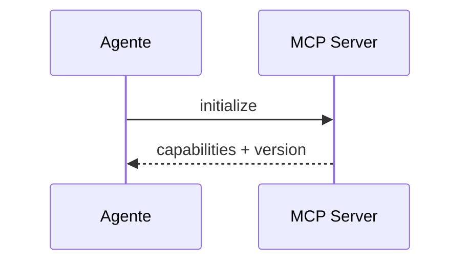
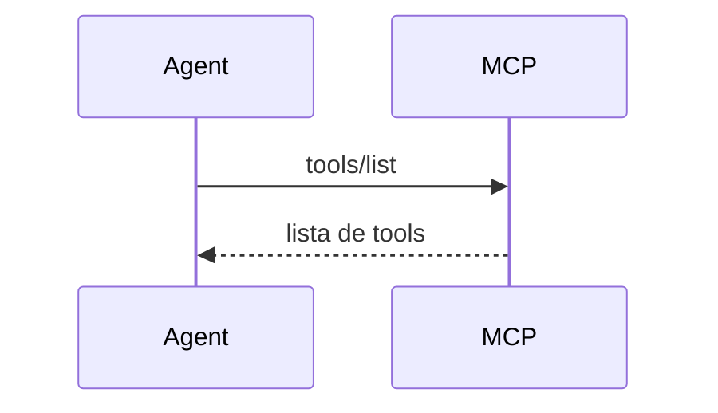
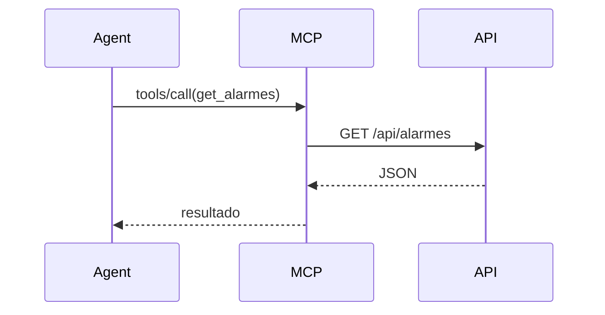
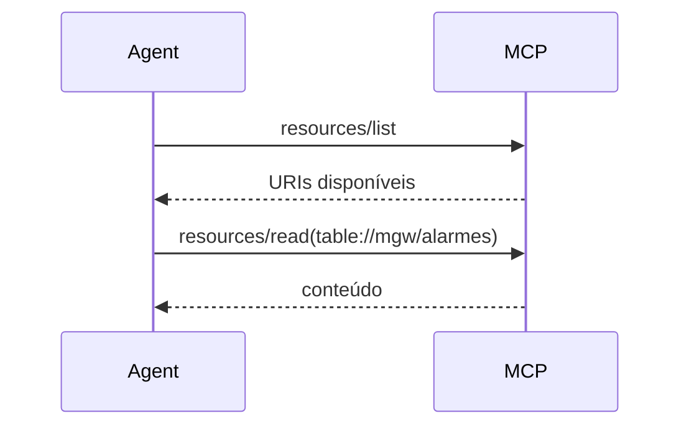
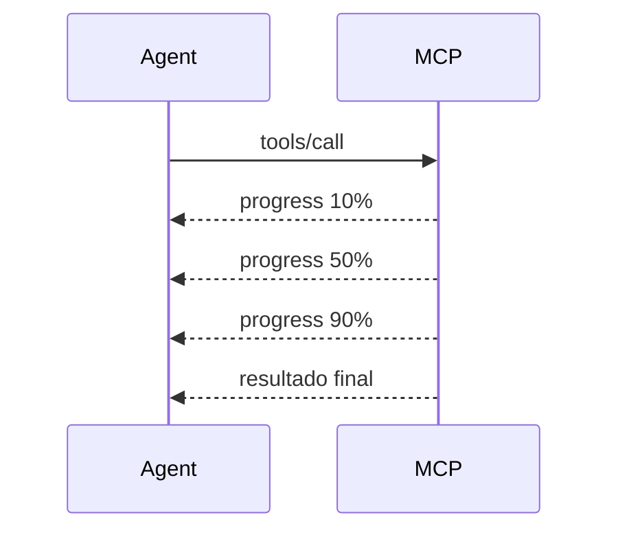
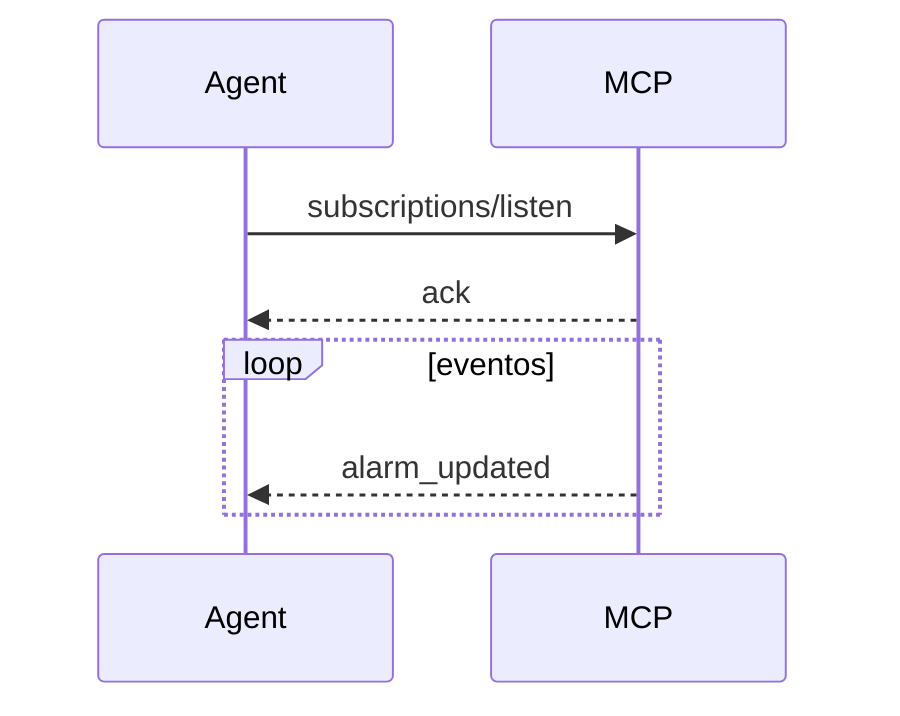
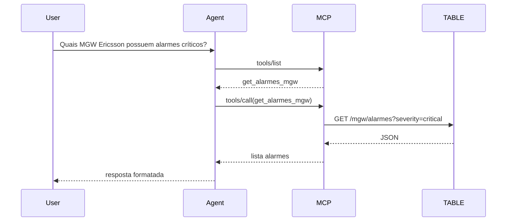

# MCP Server - Mensagens

Para expor um MCP Server APIs TABLE via HTTPS/REST, vale conhecer o protocolo em um nível mais baixo.
O MCP (Model Context Protocol) é baseado em JSON-RPC 2.0, e praticamente toda comunicação ocorre através de apenas três tipos fundamentais de mensagens: Request, Response e Notification.

## 1. Inicialização (Handshake)

Toda sessão MCP inicia com um initialize.



**Request**:
```json
{
  "jsonrpc": "2.0",
  "id": 1,
  "method": "initialize",
  "params": {
    "protocolVersion": "2026-07-28",
    "capabilities": {},
    "clientInfo": {
      "name": "Copilot",
      "version": "1.0"
    }
  }
}
```

**Response**:
```json
{
  "jsonrpc": "2.0",
  "id": 1,
  "result": {
    "protocolVersion": "2026-07-28",
    "capabilities": {
      "tools": {},
      "resources": {},
      "prompts": {},
      "logging": {},
      "elicitation": {},
      "sampling": {}
    },
    "serverInfo": {
      "name": "TABLE-MCP",
      "version": "1.0"
    }
  }
}
```

!!! info capabilities

    Na prática, os filhos de capabilities normalmente NÃO ficam vazios em um  MCP Server real.

    O exemplo mostrado com {} é apenas o mínimo para ilustrar o handshake.

    | Valor            | Significado                        |
    | ---------------- | ---------------------------------- |
    | ausente          | Não suporte notificação de mudança |
    | false            | Lista considerada fixa             |
    | true             | Lista pode mudar dinamicamente     |
    | tools não existe | O servidor não suporta tools       |

    Durante o initialize, o servidor informa ao cliente:

    "Estas são as funcionalidades MCP que eu implemento."

    É parecido com o Swagger/OpenAPI dizendo quais endpoints existem.

    Estrutura geral

    ```json
    {
    "result": {
       "protocolVersion": "2026-07-28",
       "capabilities": {
          "tools": {},
          "resources": {},
          "prompts": {},
          "logging": {},
          "elicitation": {},
          "sampling": {}
       }
    }
    }
    ```
    Nem todas precisam existir.

    ### tools

    Indica que o servidor possui ferramentas executáveis.

    Exemplo:

    ```json
    {
      "capabilities": {
         "tools": {
            "listChanged": true
         }
      }
    }
    ```

    Para que serve

    Permite:

    ```text
    tools/list
    tools/call
    ```

    Exemplo no seu caso:

    network.get_alarm
    inventory.search
    itsm.search_change

    Quando usar

    Sempre que o MCP for acionar algo.

    Por exemplo:

    ```text
    Consultar alarme
    Criar ticket
    Executar diagnóstico
    ```

    resources

    Indica que existem recursos consultáveis.

    Exemplo:

    ```json
    {
    "capabilities": {
       "resources": {
          "subscribe": true,
          "listChanged": true
       }
    }
    }
    ```

    Para que serve

    Permite:

    resources/list
    resources/read

    Exemplo:

    alarm://
    kpi://
    inventory://
    wiki://

    subscribe

    Indica que o cliente pode assinar eventos.

    resource atualizado
    novo KPI
    novo alarme

    listChanged

    O servidor consegue avisar:

    a lista de resources mudou

    Por exemplo:

    Nova documentação Ericsson adicionada

    prompts

    Indica prompts reutilizáveis.

    Exemplo:

    ```json
    {
    "capabilities": {
       "prompts": {
          "listChanged": true
       }
    }
    }
    ```

    Permite:

    prompts/list
    prompts/get

    Exemplo:

    analise_rede
    analise_mgw
    analise_ericsson

    logging

    Permite envio de mensagens operacionais.

    ```json
    {
    "capabilities": {
       "logging": {}
    }
    }
    ```

    Exemplo:

    Conectando API Ericsson
    Executando consulta KPI
    Timeout no banco

    Mensagem:
    ```json
    {
    "method": "notifications/message"
    }
    ```

    sampling

    Uma das capacidades mais interessantes.

    Ela permite que o servidor peça ao cliente para usar o LLM.

    Fluxo:

    Server
    ↓
    "Copilot, me ajude a resumir isso"
    ↓
    Cliente chama LLM
    ↓
    Devolve texto ao servidor

    Exemplo real

    Seu MCP consulta:

    500 alarmes

    O MCP não quer devolver tudo.

    Pode pedir:

    Resuma os alarmes
    Agrupe por severidade
    Explique os impactos

    para o LLM.

    Fluxo:

    sequenceDiagram

       participant Agent
       participant MCP
       participant LLM

       Agent->>MCP: tools/call

       MCP->>LLM: sampling

       LLM-->>MCP: resumo

       MCP-->>Agent: resultado

    elicitation

    Permite ao MCP solicitar informações adicionais ao usuário.

    Exemplo:

    Usuário fala:

    Abra um ticket

    O MCP precisa saber:

    Qual sistema?
    Qual severidade?

    Então:

    MCP -> Cliente
    Solicite mais dados ao usuário

    Fluxo

    ```mermaid
    sequenceDiagram

       User->>Agent: Abrir ticket

       Agent->>MCP: create_ticket

       MCP-->>Agent: preciso da severidade

       Agent->>User: Qual severidade?

       User->>Agent: Crítica

       Agent->>MCP: Crítica
    ```

    roots

    Muito útil para RAG.

    Permite que o cliente informe ao servidor quais fontes de documentos ele  pode acessar.

    Exemplo:

    ```json
    {
    "capabilities": {
       "roots": {
          "listChanged": true
       }
    }
    }
    ```

    Exemplo real

    O Copilot informa:

    SharePoint A
    OneDrive B
    Pasta X

    O MCP utiliza esses locais para buscar documentos.

    subscriptions

    Nas versões mais recentes aparece associado aos recursos.

    Serve para notificações assíncronas.

    Exemplo:

    Novo alarme
    KPI alterado
    Change criada

    completion

    Alguns clientes suportam autocompletar parâmetros.

    Exemplo:

    Usuário digita:

    Consultar device ERBS_

    O MCP sugere:

    ERBS001
    ERBS002
    ERBS003

    O que eu recomendaria para seu MCP TABLE

    Inicialmente anunciar apenas:
    ```json
    {
    "capabilities": {
       "tools": {},
       "resources": {},
       "logging": {}
    }
    }
    ```

    Porque você pretende expor APIs REST.

    Depois evoluir para:

    ```json

    {
    "capabilities": {
       "tools": {
          "listChanged": true
       },
       "resources": {
          "subscribe": true,
          "listChanged": true
       },
       "logging": {},
       "elicitation": {}
    }
    }
    ```json


    E somente numa terceira fase adicionar:

    ```json
    {
    "sampling": {},
    "roots": {}
    }
    ```

    Essas duas últimas normalmente fazem sentido quando o MCP deixa de ser  apenas um "adaptador REST" e passa a participar ativamente de fluxos de IA  e RAG.

    Para o seu cenário de API TABLE/eVoice, diria que 95% das implementações precisam apenas de tools, resources, logging e opcionalmente elicitation. sampling e roots costumam aparecer apenas em arquiteturas MCP mais sofisticadas.

## 2. Descoberta de Ferramentas

O agente pergunta quais ferramentas existem.

**Request**:
```json
{
  "jsonrpc": "2.0",
  "id": 2,
  "method": "tools/list"
}
```

**Response**:
```json
{
  "jsonrpc": "2.0",
  "id": 2,
  "result": {
    "tools": [
      {
        "name": "get_alarmes",
        "description": "Retorna alarmes Ericsson"
      }
    ]
  }
}
```



## 3. Execução de Tool

Provavelmente será seu principal fluxo.

**Request**:
```json
{
  "jsonrpc": "2.0",
  "id": 3,
  "method": "tools/call",
  "params": {
    "name": "get_alarmes",
    "arguments": {
      "vendor": "Ericsson"
    }
  }
}
```

Seu MCP então chama:

GET /api/alarmes?vendor=Ericsson

e retorna:

```json
{
  "jsonrpc": "2.0",
  "id": 3,
  "result": {
    "content": [
      {
        "type": "text",
        "text": "23 alarmes encontrados"
      }
    ]
  }
}
```



## 4. Recursos (Resources)

Quando você quer expor dados consultáveis e não ações.

Exemplos:

**Exemplos de recursos**:
```text
inventário
POPs
documentação
tabelas
KPI
```

Listar recursos

**Request (Listar recursos)**:
```json
{
  "method": "resources/list"
}
```

**Request (Ler recurso)**:
```json
{
  "method": "resources/read",
  "params": {
    "uri": "table://mgw/alarmes"
  }
}
```

Mermaid


## 5. Prompts

Você pode fornecer prompts prontos.

Exemplo:

```json
{
  "method": "prompts/list"
}
```

Resultado:

```json
{
  "prompts": [
    {
      "name": "analise_mgw"
    }
  ]
}
```

Uso:

```json
{
  "method": "prompts/get",
  "params": {
    "name": "analise_mgw"
  }
}
```

## 6. Notifications

**Request (Exemplo)**:

Não possuem ID.

Não geram resposta.

Exemplo:

```json
{
  "jsonrpc": "2.0",
  "method": "notifications/progress",
  "params": {
    "progress": 80
  }
}
```

Mermaid


## 7. Logging / Messages

O servidor pode enviar mensagens de status.

```json
{
  "jsonrpc": "2.0",
  "method": "notifications/message",
  "params": {
    "level": "info",
    "data": "Consultando API Ericsson"
  }
}
```

## 8. Subscription / Eventos

Fluxo para eventos em tempo real.

Exemplo:

```json
{
  "method": "subscriptions/listen"
}
```

Depois:

```json
{
  "method": "notifications/resource_updated"
}
```

Mermaid


## 9. Erros

Response com erro.
```json
{
  "jsonrpc": "2.0",
  "id": 4,
  "error": {
    "code": -32601,
    "message": "Tool not found"
  }
}
```

Exemplos comuns:

```text
Code    Significado
-32700    Parse Error
-32600    Invalid Request
-32601    Method Not Found
-32602    Invalid Params
-32603    Internal Error
```

## 10. Fluxo completo de uma consulta TABLE API

Imagine:

```text
"Quais MGW Ericsson estão com alarmes críticos?"
```



Para um MCP Server REST corporativo (TIM/eVoice/TANGO)

Eu recomendaria expor pelo menos estas tools:

```text
inventory.search
inventory.get_device

network.get_alarm
network.get_kpi
network.run_diagnostic

itsm.search_change
itsm.search_incident
itsm.create_ticket

documentation.search
documentation.get_document

topology.get_neighbors
topology.trace_path

user.get_permissions
```

e estes resources:

```text
inventory://
topology://
kpi://
alarm://
itsm://
wiki://
rag://
```

Isso permite que Copilot, Claude Desktop, VSCode Agent, OpenAI Agents e praticamente qualquer cliente MCP descubram automaticamente suas capacidades sem conhecer previamente sua API REST.

O próximo nível, que considero ideal para o seu cenário TABLE/eVoice/TANGO, é desenhar o mapa completo de métodos MCP (initialize, ping, tools/, resources/, prompts/, roots/, sampling/, elicitation/, subscriptions/*) e mostrar exatamente quais endpoints REST cada um deveria acionar no backend.
