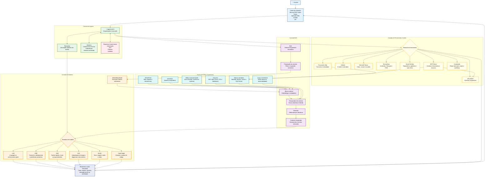

# Diagrama

```mermaid
flowchart TB
    %% =====================================================
    %% CAMADA DE INTERAÇÃO
    %% =====================================================
    USER["👤 Usuário"]
    CHANNELS["Canais de interação<br/>Microsoft 365 Copilot<br/>Teams<br/>Aplicação Web<br/>Chatbot<br/>API"]
    USER --> CHANNELS

    %% =====================================================
    %% CAMADA DO AGENTE
    %% =====================================================
    subgraph AGENT_LAYER["Camada de Agente"]
        AGENT["🤖 Agente de IA<br/>Orquestração e execução"]
        PLANNER["Planejador<br/>Decompõe objetivos em tarefas"]
        MEMORY["Memória<br/>Contexto da conversa<br/>Preferências<br/>Histórico autorizado"]
        GUARDRAILS["Segurança e governança<br/>Autorização<br/>DLP<br/>Políticas<br/>Auditoria"]

        AGENT --> PLANNER
        AGENT <--> MEMORY
        AGENT <--> GUARDRAILS
    end

    CHANNELS --> AGENT

    %% =====================================================
    %% CAMADA DE MODELOS
    %% =====================================================
    subgraph MODEL_LAYER["Camada de Modelos"]
        ROUTER{"Roteador de modelos"}
        LLM["LLM<br/>Linguagem e conhecimento geral"]
        LRM["LRM<br/>Raciocínio, planejamento<br/>e problemas complexos"]
        SLM["SLM<br/>Tarefas rápidas, locais<br/>ou especializadas"]
        VLM["VLM<br/>Interpretação de imagens<br/>diagramas e documentos"]
        MLLM["MLLM<br/>Texto, imagem, áudio<br/>e vídeo"]
        CODE["Code Model<br/>Geração e análise de código"]
        EMBEDDING["Embedding Model<br/>Texto para vetores semânticos"]

        ROUTER --> LLM
        ROUTER --> LRM
        ROUTER --> SLM
        ROUTER --> VLM
        ROUTER --> MLLM
        ROUTER --> CODE
    end

    PLANNER --> ROUTER

    %% =====================================================
    %% CAMADA RAG
    %% =====================================================
    subgraph RAG_LAYER["Camada RAG"]
        RAG["RAG<br/>Retrieval-Augmented Generation"]
        QUERY["Preparação da consulta<br/>Filtros e expansão semântica"]
        VECTOR_DB["(Banco vetorial<br/>Embeddings e metadados)"]
        RETRIEVER["Recuperador de contexto<br/>Busca semântica e híbrida"]
        RERANKER["Reranker<br/>Ordenação por relevância"]
        CONTEXT["Contexto recuperado<br/>Documentos e trechos relevantes"]

        RAG --> QUERY
        QUERY --> EMBEDDING
        EMBEDDING --> VECTOR_DB
        VECTOR_DB --> RETRIEVER
        RETRIEVER --> RERANKER
        RERANKER --> CONTEXT
    end

    AGENT --> RAG
    CONTEXT --> ROUTER

    %% =====================================================
    %% FONTES CORPORATIVAS
    %% =====================================================
    subgraph DATA_LAYER["Fontes de Dados Corporativas"]
        SHAREPOINT["(SharePoint<br/>Sites, páginas e documentos)"]
        ONEDRIVE["(OneDrive<br/>Arquivos autorizados)"]
        DATABASE["(Bancos de dados<br/>MariaDB, MySQL, Oracle e SQL Server)"]
        WIKI["(Wikis e documentação<br/>Azure DevOps, Confluence e portais)"]
        LOGS["(Logs e inventários<br/>Rede, telecom e observabilidade)"]
        FILES["(Arquivos<br/>PDF, Word, Excel, CSV e Markdown)"]
    end

    SHAREPOINT --> VECTOR_DB
    ONEDRIVE --> VECTOR_DB
    DATABASE --> RETRIEVER
    WIKI --> VECTOR_DB
    LOGS --> RETRIEVER
    FILES --> VECTOR_DB

    %% =====================================================
    %% FERRAMENTAS E AÇÕES
    %% =====================================================
    subgraph TOOL_LAYER["Camada de Ferramentas e Ações"]
        TOOL_ROUTER{"Roteador de ferramentas"}
        MCP["MCP Server<br/>Contexto, ferramentas e recursos"]
        API["APIs REST<br/>Sistemas corporativos"]
        OUTLOOK["Outlook<br/>E-mails e calendário"]
        TEAMS["Microsoft Teams<br/>Chats, canais e reuniões"]
        SERVICENOW["ServiceNow<br/>Incidentes, Changes e ITSM"]
        DEVOPS["Azure DevOps<br/>Repositórios, pipelines e work items"]
        SQL_TOOL["Ferramenta SQL<br/>Consultas e metadados"]
        AUTOMATION["Automação<br/>Power Automate, scripts e workflows"]

        TOOL_ROUTER --> MCP
        TOOL_ROUTER --> API
        TOOL_ROUTER --> OUTLOOK
        TOOL_ROUTER --> TEAMS
        TOOL_ROUTER --> SERVICENOW
        TOOL_ROUTER --> DEVOPS
        TOOL_ROUTER --> SQL_TOOL
        TOOL_ROUTER --> AUTOMATION
    end

    AGENT --> TOOL_ROUTER
    MCP --> API
    MCP --> DATABASE
    SQL_TOOL --> DATABASE

    %% =====================================================
    %% RESPOSTA
    %% =====================================================
    RESPONSE["Resposta ou ação executada<br/>Texto, arquivo, consulta,<br/>chamada de API ou automação"]

    LLM --> RESPONSE
    LRM --> RESPONSE
    SLM --> RESPONSE
    VLM --> RESPONSE
    MLLM --> RESPONSE
    CODE --> RESPONSE

    TOOL_ROUTER --> RESPONSE
    RESPONSE --> CHANNELS

    %% =====================================================
    %% ESTILOS
    %% =====================================================
    classDef user fill:#E3F2FD,stroke:#1565C0,stroke-width:2px,color:#000;
    classDef agent fill:#E8F5E9,stroke:#2E7D32,stroke-width:2px,color:#000;
    classDef model fill:#FFF3E0,stroke:#EF6C00,stroke-width:2px,color:#000;
    classDef rag fill:#F3E5F5,stroke:#7B1FA2,stroke-width:2px,color:#000;
    classDef data fill:#E0F7FA,stroke:#00838F,stroke-width:2px,color:#000;
    classDef tool fill:#FFFDE7,stroke:#F9A825,stroke-width:2px,color:#000;
    classDef security fill:#FFEBEE,stroke:#C62828,stroke-width:2px,color:#000;
    classDef response fill:#E8EAF6,stroke:#3949AB,stroke-width:2px,color:#000;

    class USER,CHANNELS user;
    class AGENT,PLANNER,MEMORY agent;
    class GUARDRAILS security;
    class ROUTER,LLM,LRM,SLM,VLM,MLLM,CODE,EMBEDDING model;
    class RAG,QUERY,VECTOR_DB,RETRIEVER,RERANKER,CONTEXT rag;
    class SHAREPOINT,ONEDRIVE,DATABASE,WIKI,LOGS,FILES data;
    class TOOL_ROUTER,MCP,API,OUTLOOK,TEAMS,SERVICENOW,DEVOPS,SQL_TOOL,AUTOMATION tool;
    class RESPONSE response;
```
