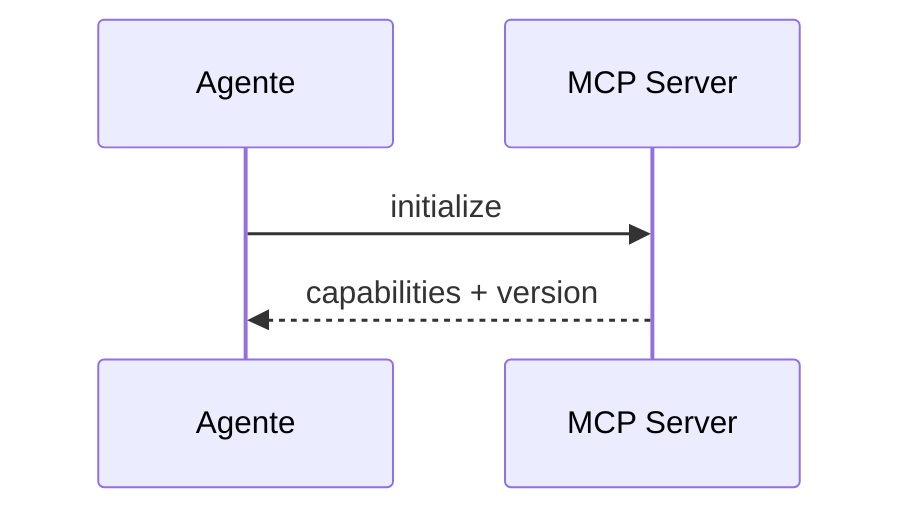
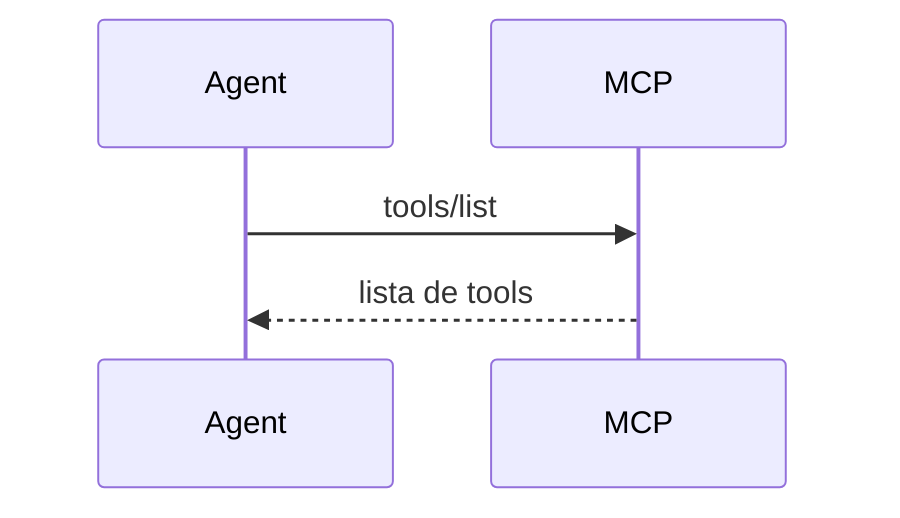
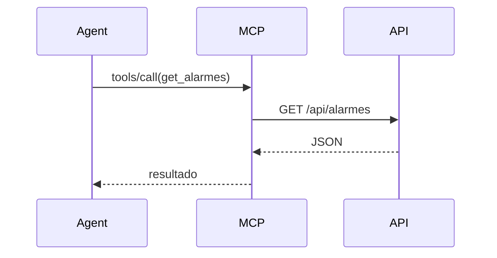
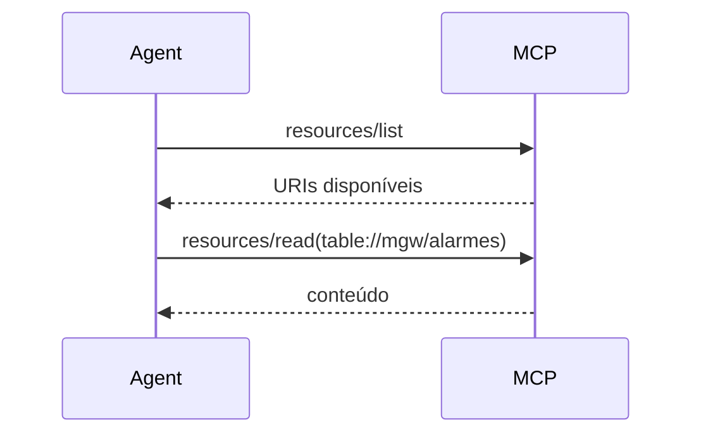
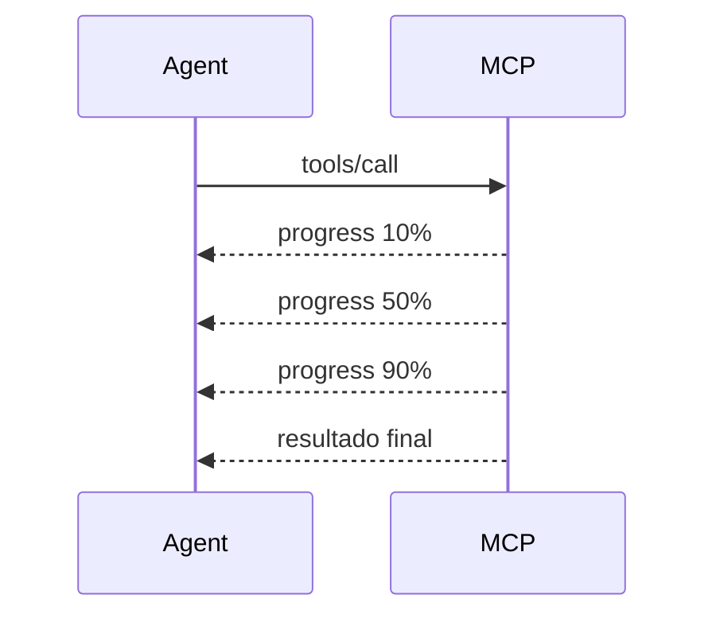
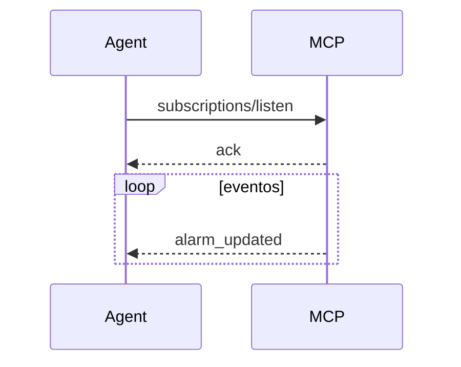
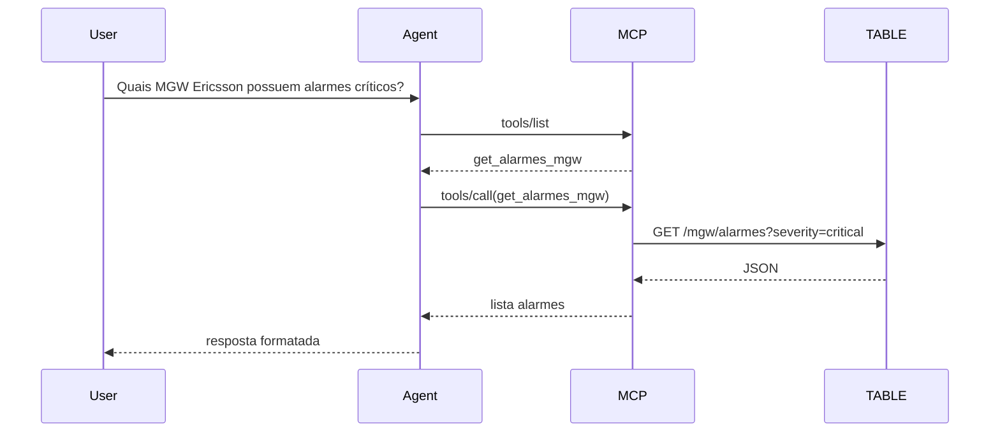

# MCP Server - Mensagens

Para expor um MCP Server APIs TABLE via HTTPS/REST, vale conhecer o protocolo em um nível mais baixo.
O MCP (Model Context Protocol) é baseado em JSON-RPC 2.0, e praticamente toda comunicação ocorre através de apenas três tipos fundamentais de mensagens: Request, Response e Notification.

## 1. Inicialização (Handshake)

Toda sessão MCP inicia com um initialize.



**Request**:
```json
   {
   "jsonrpc": "2.0",                // Versão do protocolo JSON-RPC utilizado pelo MCP
   "id": 1,                         // Identificador único da requisição para correlacionar request/response
   "method": "initialize",          // Método MCP chamado para iniciar a sessão e negociar capacidades
   "params": {
      "protocolVersion": "2026-07-28", // Versão do protocolo MCP suportada pelo cliente
      "capabilities": {},              // Capacidades MCP implementadas pelo cliente (o que ele sabe fazer)
      "clientInfo": {
         "name": "Copilot",             // Nome do cliente MCP que está conectando
         "version": "1.0"               // Versão do cliente MCP
      }
   }
   }
```

**Response**:
```json
   {
   "jsonrpc": "2.0",                // Versão do protocolo JSON-RPC utilizada na comunicação
   "id": 1,                         // Mesmo ID recebido na requisição para correlacionar request/response
   "result": {
      "protocolVersion": "2026-07-28", // Versão MCP aceita e negociada pelo servidor
      "capabilities": {
         "tools": {},                 // O servidor disponibiliza ferramentas executáveis (tools/list, tools/call)
         "resources": {},             // O servidor disponibiliza recursos consultáveis (resources/list, resources/read)
         "prompts": {},               // O servidor disponibiliza prompts reutilizáveis (prompts/list, prompts/get)
         "logging": {},               // O servidor pode enviar mensagens de log/status/notificações operacionais
         "elicitation": {},           // O servidor pode solicitar informações adicionais ao usuário através do cliente
         "sampling": {}               // O servidor pode solicitar ao cliente que utilize o LLM para gerar ou processar conteúdo
      },
      "serverInfo": {
         "name": "TABLE-MCP",         // Nome do MCP Server
         "version": "1.0"            // Versão do MCP Server
      }
   }
   }
```

```json
   {
   "jsonrpc": "2.0",
   "id": 1,
   "error": {
      "code": -32600,
      "message": "Unsupported JSON-RPC version. Expected 2.0."
   }
   }
```

Veja:

- [Erros](error.md)
- [capabilities](capabilities.md)

## 2. Descoberta de Ferramentas

O agente pergunta quais ferramentas existem.

**Request**:
```json
{
  "jsonrpc": "2.0",
  "id": 2,
  "method": "tools/list"
}
```

**Response**:
```json
{
  "jsonrpc": "2.0",
  "id": 2,
  "result": {
    "tools": [
      {
        "name": "get_alarmes",
        "description": "Retorna alarmes Ericsson"
      }
    ]
  }
}
```



## 3. Execução de Tool

Provavelmente será seu principal fluxo.

**Request**:
```json
{
  "jsonrpc": "2.0",
  "id": 3,
  "method": "tools/call",
  "params": {
    "name": "get_alarmes",
    "arguments": {
      "vendor": "Ericsson"
    }
  }
}
```

Seu MCP então chama:

GET /api/alarmes?vendor=Ericsson

e retorna:

```json
{
  "jsonrpc": "2.0",
  "id": 3,
  "result": {
    "content": [
      {
        "type": "text",
        "text": "23 alarmes encontrados"
      }
    ]
  }
}
```



## 4. Recursos (Resources)

Quando você quer expor dados consultáveis e não ações.

Exemplos:

**Exemplos de recursos**:
```text
inventário
POPs
documentação
tabelas
KPI
```

Listar recursos

**Request (Listar recursos)**:
```json
{
  "method": "resources/list"
}
```

**Request (Ler recurso)**:
```json
{
  "method": "resources/read",
  "params": {
    "uri": "table://mgw/alarmes"
  }
}
```

Mermaid


## 5. Prompts

Você pode fornecer prompts prontos.

Exemplo:

```json
{
  "method": "prompts/list"
}
```

Resultado:

```json
{
  "prompts": [
    {
      "name": "analise_mgw"
    }
  ]
}
```

Uso:

```json
{
  "method": "prompts/get",
  "params": {
    "name": "analise_mgw"
  }
}
```

## 6. Notifications

**Request (Exemplo)**:

Não possuem ID.

Não geram resposta.

Exemplo:

```json
{
  "jsonrpc": "2.0",
  "method": "notifications/progress",
  "params": {
    "progress": 80
  }
}
```

Mermaid


## 7. Logging / Messages

O servidor pode enviar mensagens de status.

```json
{
  "jsonrpc": "2.0",
  "method": "notifications/message",
  "params": {
    "level": "info",
    "data": "Consultando API Ericsson"
  }
}
```

## 8. Subscription / Eventos

Fluxo para eventos em tempo real.

Exemplo:

```json
{
  "method": "subscriptions/listen"
}
```

Depois:

```json
{
  "method": "notifications/resource_updated"
}
```

Mermaid


## 9. Erros

Response com erro.
```json
{
  "jsonrpc": "2.0",
  "id": 4,
  "error": {
    "code": -32601,
    "message": "Tool not found"
  }
}
```

Exemplos comuns:

```text
Code    Significado
-32700    Parse Error
-32600    Invalid Request
-32601    Method Not Found
-32602    Invalid Params
-32603    Internal Error
```

## 10. Fluxo completo de uma consulta TABLE API

Imagine:

```text
"Quais MGW Ericsson estão com alarmes críticos?"
```



Para um MCP Server REST corporativo

É recomendável expor pelo menos estas tools:

```text
inventory.search
inventory.get_device

network.get_alarm
network.get_kpi
network.run_diagnostic

itsm.search_change
itsm.search_incident
itsm.create_ticket

documentation.search
documentation.get_document

topology.get_neighbors
topology.trace_path

user.get_permissions
```

e estes resources:

```text
inventory://
topology://
kpi://
alarm://
itsm://
wiki://
rag://
```

Isso permite que Copilot, Claude Desktop, VSCode Agent, OpenAI Agents e praticamente qualquer cliente MCP descubram automaticamente suas capacidades sem conhecer previamente sua API REST.

O próximo nível, que considero ideal para o cenário API TABLE, é desenhar o mapa completo de métodos MCP (initialize, ping, tools/, resources/, prompts/, roots/, sampling/, elicitation/, subscriptions/*) e mostrar exatamente quais endpoints REST cada um deveria acionar no backend.
