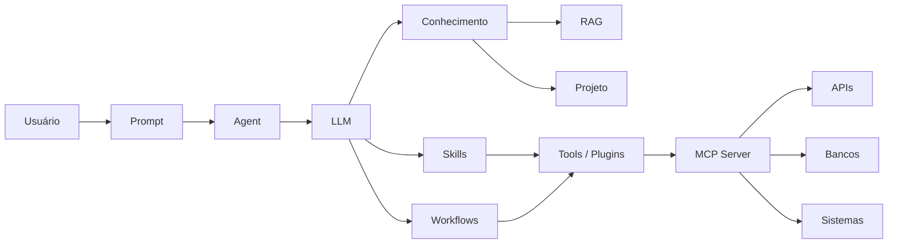

# Introdução

A forma mais simples de visualizar é:

Usuário
   |
 Prompt
   |
 Agente Principal
   |
 +-- Skill (como executar)
 |
 +-- Workflow (ordem das etapas)
 |
 +-- Subagente(s)
 |
 +-- Tool(s)
        |
        +-- MCP
                |
                +-- API Portal Telco
                +-- Zabbix
                +-- ITSM
                +-- Banco de Dados

- Prompt: instrução enviada para a IA
- Skill: como faz
- Project: agrupamento de recursos relacionados
- MCP: por onde acessa sistemas
- Agent: quem faz
- Subagent: agente especializado acionado por outro agente
- Plugin: extensão que adiciona funcionalidades
- Tool: com o que faz
- Workflow: quando e em qual ordem faz

## 1. Prompt

**O que é**: Instrução enviada para a IA.

**Quando usar**: Sempre que precisar dizer ao modelo o que fazer.

Exemplo:

Analise esta Change e gere:
- Motivo
- Impacto
- Plano de rollback

**Analogia**: Um pedido verbal para um colaborador.

## 2. Skills

**O que é**: Capacidades reutilizáveis contendo conhecimento procedural sobre como executar determinada tarefa. Frequentemente representam uma "receita" ou orquestração.

**Quando usar**: Quando uma tarefa possui vários passos repetitivos.

Exemplo:

Skill: Analisar Change

1. Ler Change
2. Identificar equipamento
3. Consultar documentação
4. Avaliar risco
5. Gerar parecer

**No seu contexto**: Uma skill "Validar Change xpto".

## 3. Projeto (Project)

**O que é**: Agrupamento de recursos relacionados.
**Pode conter**:
Pode conter:

Prompts
Agentes
MCPs
Documentação
Workflows
Conhecimento RAG

**Quando usar**: Quando a solução possui escopo definido.

Exemplo:

Projeto: Portal Telco AI

- Agente Portal Telco
- MCP Portal Telco
- APIs REST
- Documentações
- Workflows

## 4. MCP (Model Context Protocol)

**O que é**: Padrão aberto para permitir que agentes conversem com sistemas externos de forma padronizada.

**Quando usar**: Quando a IA precisa consultar ou executar algo fora dela.

Exemplo:

Copilot
   ↓
MCP
   ↓
Portal Telco
   ↓
MariaDB

ou

buscar_cep()
consultar_chg()
abrir_incidente()

Seu exemplo do MCP Portal Telco segue exatamente este modelo.

## 5. Agent (Agente)

**O que é**: Entidade de IA especializada em um domínio.

**Possui**:

Instruções
Conhecimento
Ferramentas
Memória (dependendo da plataforma)

**Quando usar**: Quando existe um papel claro.

Exemplo:

Agente de Redes Telecomunicações

Perguntas:

Qual o status deste Node?
Qual Change afeta esta ERB?

## 6. Subagente

**O que é**: Agente especializado acionado por outro agente.

**Quando usar**: Quando um único agente ficaria muito complexo.

Exemplo:

Agente Principal
    ├─ Subagente Redes
    ├─ Subagente ITSM
    └─ Subagente Segurança

Fluxo:

Usuário → Agente Principal

Pergunta sobre Network

→ encaminha para Subagente Redes
→ devolve resposta

Isso se alinha ao conceito de um agente chamar outro agente discutido no seu fórum AIOps.

## 7. Plugin

**O que é**: Extensão que adiciona funcionalidades.

Historicamente era o mecanismo utilizado por ChatGPT, Copilot e outras plataformas antes da popularização do MCP.

**Quando usar**:

Para conectar:

Jira
GitHub
ServiceNow
SAP
Salesforce

Exemplo:

Plugin Jira

Permite:

Criar tarefa
Consultar sprint
Atualizar ticket

## 8. Tool (Ferramenta)

**O que é**: Função executável que o agente pode chamar.

**Quando usar**: Sempre que uma ação específica precisar ser executada.

Exemplo:

{
  "name": "consultar_chg",
  "input": {
    "chg": "CHG12345"
  }
}

ou

{
  "name": "abrir_incidente"
}

No seu ambiente você já citou Tools ligadas a APIs e MCP Servers.

## 9. Workflow

**O que é**: Fluxo automatizado composto por etapas e decisões.

No Copilot Studio pode ser associado a agentes para executar processos.

**Quando usar**: Quando existe um processo de negócio.

Exemplo:

Change criada
      ↓
Validar
      ↓
Aprovar?
  Sim / Não
      ↓
Executar
      ↓
Notificar

ou

Alarme Zabbix
    ↓
Abrir ticket
    ↓
Executar diagnóstico
    ↓
Enviar e-mail

Comparação rápida
Item Objetivo ExemploPrompt Dizer o que fazer "Analise esta Change"
Skill Ensinar como fazer Processo de análise de Change
Projeto Agrupar recursos Projeto Portal Telco AI
MCP Conectar sistemas MCP → Portal Telco
Agent Especialista Agente de Redes
Subagente Especialista subordinado Agente ITSM
Plugin Extensão da plataforma Jira Plugin
Tool Ação executável consultar_chg()
Workflow Processo automatizado Aprovação de Change
Regra de bolso para sua arquitetura Portal Telco + Copilot
Projeto
 └─ Agente Principal
     ├─ Prompt
     ├─ Conhecimento (RAG)
     ├─ Skills
     ├─ Workflows
     ├─ MCP Portal Telco
     │    └─ Tools
     └─ Subagentes
          ├─ Rede
          ├─ ITSM
          └─ Segurança

Essa arquitetura é a que mais se aproxima do roadmap que você vem discutindo para Copilot Studio + MCP + RAG + APIs Portal Telco.

---

Item O que é Quando usar ExemploPrompt Instrução ou pedido enviado à IA Sempre que quiser executar uma tarefa específica "Analise esta Change e identifique riscos"
Agent (Agente) Assistente especializado com identidade, instruções e conhecimento Quando há um papel recorrente "Agente de Operações Core", "Agente de Gestão de Changes"
Subagente Agente especializado acionado por outro agente Quando uma tarefa pode ser dividida Agente Principal → chama Agente Zabbix → chama Agente ITSM
Skill Procedimento ou receita reutilizável que ensina um agente a executar uma atividade Quando vários agentes precisam seguir o mesmo método Skill "Análise de Impacto de Change" usada por vários agentes
Tool (Ferramenta) Função que executa uma ação real ou consulta dados Quando a IA precisa sair do texto e acessar algo externo Consultar API, SharePoint, Banco de Dados, ServiceNow, Zabbix
Plugin Forma antiga/clássica de adicionar funcionalidades a um assistente Principalmente em sistemas legados ou compatibilidade Plugin que consulta clima ou ERP
MCP (Model Context Protocol) Protocolo padrão para expor ferramentas, recursos e prompts para agentes Quando deseja integrar sistemas corporativos à IA Seu MCP Server Portal Telco expondo APIs, tabelas e comandos para o Copilot
Workflow Fluxo automatizado de etapas, aprovações e ações Quando existe processo de negócio Detecta falha → abre incidente → envia e-mail → gera relatório
Projeto (Project) Container que reúne agentes, prompts, skills, MCPs, workflows e documentação Quando precisa organizar uma solução completa Projeto "Automação de Changes Core"
Tools MCP Ferramentas disponibilizadas por um MCP Server Quando a IA precisa executar operações no sistema integrado getDevice(), createChange(), getAlarm()
Visualização rápida

No seu projeto Portal Telco
Projeto: Copilot Operações Core

Agente:
    Agente Operações Core

Skills:
    - Análise de Falha
    - Cadastro de Change
    - Análise de KPI

Tools:
    - Consultar Inventário
    - Consultar KPI
    - Abrir ITSM

MCP:
    - MCP Portal Telco

Subagentes:
    - Agente SBC
    - Agente Ericsson
    - Agente Zabbix

Workflow:
    Falha detectada
       -> Consulta inventário
       -> Consulta documentação
       -> Gera diagnóstico
       -> Abre incidente
       -> Envia e-mail

Em resumo:

Prompt = pedido
 Agent = especialista
 Skill = método de trabalho
 Tool = ação executável
 MCP = ponte/protocolo para sistemas
 Subagente = especialista auxiliar
 Workflow = orquestração do processo
 Projeto = agrupador de tudo isso.
