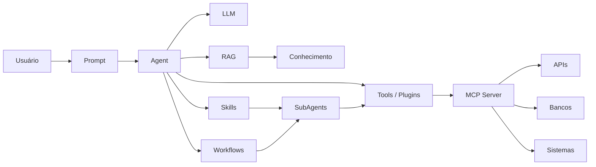
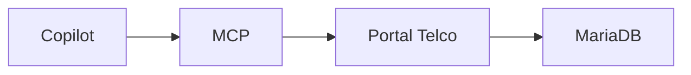
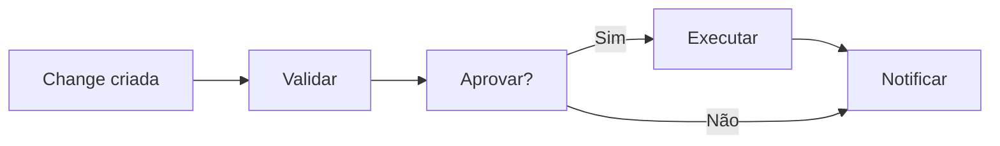
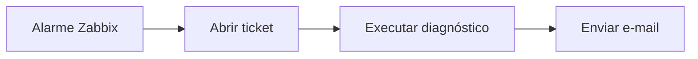

# Introdução

A forma mais simples de visualizar é:



- Prompt: instrução enviada para a IA
- Skill: como faz
- Project: agrupamento de recursos relacionados
- MCP: por onde acessa sistemas
- Agent: quem faz
- Subagent: agente especializado acionado por outro agente
- Plugin: extensão que adiciona funcionalidades
- Tool: com o que faz
- Workflow: quando e em qual ordem faz

## 1. Prompt

**O que é**: Instrução enviada para a IA.

**Quando usar**: Sempre que precisar dizer ao modelo o que fazer.

Exemplo:

Analise esta Change e gere:
- Motivo
- Impacto
- Plano de rollback

**Analogia**: Um pedido verbal para um colaborador.

## 2. Skills

**O que é**: Capacidades reutilizáveis contendo conhecimento procedural sobre como executar determinada tarefa. Frequentemente representam uma "receita" ou orquestração.

**Quando usar**: Quando uma tarefa possui vários passos repetitivos.

Exemplo:

Skill: Analisar Change

1. Ler Change
2. Identificar equipamento
3. Consultar documentação
4. Avaliar risco
5. Gerar parecer

**No seu contexto**: Uma skill "Validar Change xpto".

## 3. Projeto (Project)

**O que é**: Agrupamento de recursos relacionados.
**Pode conter**:
Pode conter:

- Prompts
- Agentes
- MCPs
- Documentação
- Workflows
- Conhecimento RAG

**Quando usar**: Quando a solução possui escopo definido.

Exemplo:

Projeto: Portal Telco AI

- Agente Portal Telco
- MCP Portal Telco
- APIs REST
- Documentações
- Workflows

## 4. MCP (Model Context Protocol)

**O que é**: Padrão aberto para permitir que agentes conversem com sistemas externos de forma padronizada.

**Quando usar**: Quando a IA precisa consultar ou executar algo fora dela.

Exemplo:



ou

```text
buscar_cep()
consultar_chg()
abrir_incidente()
```

Seu exemplo do MCP Portal Telco segue exatamente este modelo.

## 5. Agent (Agente)

**O que é**: Entidade de IA especializada em um domínio.

**Possui**:

- Instruções
- Conhecimento
- Ferramentas
- Memória (dependendo da plataforma)

**Quando usar**: Quando existe um papel claro.

**Exemplo**: Agente de Redes Telecomunicações

Perguntas:

```text
Qual o status deste Node?
Qual Change afeta esta ERB?
```

## 6. Subagente

**O que é**: Agente especializado acionado por outro agente.

**Quando usar**: Quando um único agente ficaria muito complexo.

Exemplo:

```text
Agente Principal
    ├─ Subagente Redes
    ├─ Subagente ITSM
    └─ Subagente Segurança
```

Fluxo:

```text
Usuário → Agente Principal

Pergunta sobre Network

→ encaminha para Subagente Redes
→ devolve resposta
```

Isso se alinha ao conceito de um agente chamar outro agente discutido no seu fórum AIOps.

## 7. Plugin

**O que é**: Extensão que adiciona funcionalidades.

Historicamente era o mecanismo utilizado por ChatGPT, Copilot e outras plataformas antes da popularização do MCP.

**Quando usar**:

Para conectar:

- Jira
- GitHub
- ServiceNow
- SAP
- Salesforce

**Exemplo**: Plugin Jira

**Permite**:

- Criar tarefa
- Consultar sprint
- Atualizar ticket

## 8. Tool (Ferramenta)

**O que é**: Função executável que o agente pode chamar.

**Quando usar**: Sempre que uma ação específica precisar ser executada.

Exemplo:

```json
{
  "name": "consultar_chg",
  "input": {
    "chg": "CHG12345"
  }
}
```

ou

```json
{
  "name": "abrir_incidente"
}
```

No seu ambiente você já citou Tools ligadas a APIs e MCP Servers.

## 9. Workflow

**O que é**: Fluxo automatizado composto por etapas e decisões.

No Copilot Studio pode ser associado a agentes para executar processos.

**Quando usar**: Quando existe um processo de negócio.

Exemplo:



ou



Comparação rápida:

| Item      | Objetivo                 | Exemplo                       |
| --------- | ------------------------ | ----------------------------- |
| Prompt    | Dizer o que fazer        | "Analise esta Change"         |
| Skill     | Ensinar como fazer       | Processo de análise de Change |
| Projeto   | Agrupar recursos         | Projeto Portal Telco AI       |
| MCP       | Conectar sistemas        | MCP → Portal Telco            |
| Agent     | Especialista             | Agente de Redes               |
| Subagente | Especialista subordinado | Agente ITSM                   |
| Plugin    | Extensão da plataforma   | Jira Plugin                   |
| Tool      | Ação executável          | consultar_chg()               |
| Workflow  | Processo automatizado    | Aprovação de Change           |

Regra de bolso para sua arquitetura: Portal Telco + Copilot

      Projeto
      └─ Agente Principal
         ├─ Prompt
         ├─ Conhecimento (RAG)
         ├─ Skills
         ├─ Workflows
         ├─ MCP Portal Telco
         │    └─ Tools
         └─ Subagentes
               ├─ Rede
               ├─ ITSM
               └─ Segurança

Essa arquitetura é a que mais se aproxima do roadmap que você vem discutindo para Copilot Studio + MCP + RAG + APIs Portal Telco.
